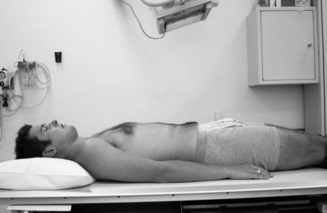
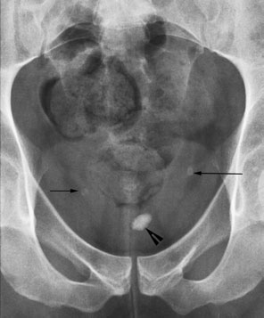
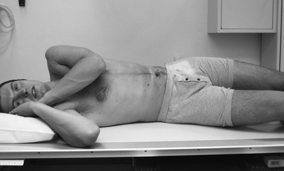
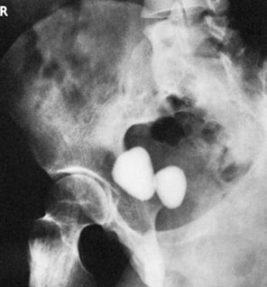

# Rx Vezică Urinară caudad

  📷 Radiografie Convențională (Rx)
  <strong>Actualizat:</strong> 2026-09-16
  <strong>Autor:</strong> Departamentul de Radiologie / Referință Clark (Ed. 12)

---

-   __1. Rezumat Clinic & Indicații__

    ---

    === "Indicații Clinice"

        - 347 11 Vezică Urinară litiază urinară / Litiază urinară / calculi radio-opaci radiopaci within Vezică Urinară poate move freely, particularly if bladder este full, whereas calcificări patologice și litiază urinară / Litiază urinară / calculi radio-opaci radiopaci outside bladder, e.g. prostatic litiază urinară / Litiază urinară / calculi radio-opaci radiopaci, sunt immobile. Antero-posterior (AP) și Oblică incidențe poate fie taken la show change în relative poziție de litiază urinară / Litiază urinară / calculi radio-opaci radiopaci și bladder. la examine bladder region, caudal angulation este required la allow pentru shape de bony Bazin (bazin (pelvis)) și la project simfiză below bladder. Antero-posterior (AP) 15 grade caudal

    === "Ghid Național IRIS"

        !!! info "Referință Primară: Ghidul Național IRIS (Ordinul MS 1342/2012)"
            - **Capitol Ghid IRIS:** *Ghidul Național IRIS*
            - **Grad de Recomandare:** **De verificat pe indicație; fără grad atribuit automat**
            - **Nivel de Iradiere Estimată:** `De verificat pentru examinarea și populația selectate`

            [:octicons-search-16: Deschide Ghidul IRIS](../../iris.md){ .md-button .md-button--primary } [:material-open-in-new: Aplicația Oficială PWA](https://radiologie-pediatrica.ro/iris/){ .md-button target="_blank" rel="noopener" }
-   __2. Poziționare & Centrare Fascicul__

    ---

    - **Poziție Pacient:** • de la Decubit dorsal poziție, one side este raised astfel încât plan mediosagital este rotit through 35 grade.
• la help stability, Genunchi în contact cu masa de examinare este flectat și raised side sprijinit using non-opaque pad.
• pacientul’s poziție este ajustat astfel încât midpoint între simfiză pubiană și spină iliacă antero-superioară (SIAS) pe raised side este over linia mediană mesei.
• A 30  24-cm casetă este plasat longitudinally în tray cu its upper margine la nivelul anterior superior iliac spines.
    - **Punct de Centrare Fascicul:** • raza centrală verticală centrală este orientat la point 2.5 cm above simfiză pubiană.
• Alternatively, caudal angulation de 15 grade poate fie used cu higher centring point și caseta displaced downwards la accommodate angulation.
    - **Distanță Focar-Film (DFF / SID):** 100 cm
    - **Comandă Respiratorie:** Apnee pe durata expunerii (apnee în inspir pentru torace; expir pentru Abdomen/bazin).

-   __3. Parametri Tehnici Expunere__

    ---

    | Parametru Tehnic | Valoare Configurare Generator / Tub |
    |:-----------------|:-------------------------------------|
    | **Tensiune Tub (kV)** | DE CONFIGURAT PE APARAT |
    | **Sarcină / Produs Curent-Timp (mAs)** | Conform AEC / grosime anatomică |
    | **Distanță Focar-Film (DFF / SID)** | 100 cm |
    | **Grilă Antidifuzoare (Bucky)** | Conform grosimii anatomice (> 10-12 cm cu grilă) |
    | **Dimensiune Focar** | Focar Mic (0.6 mm) |
    | **Camere de Ionizare AEC** | DE CONFIGURAT PE APARAT |
    | **Colimare Fascicul** | Colimare strictă adaptată pe receptor 18 x 24 cm |
    | **Filtrare Tub** | Totală ≥ 2.5 mm Al echivalent (conform Clark: 3.0 mm Al eq.) |

-   __4. Criterii de Calitate & Reușită Imagine__

    ---

    - Vizualizarea clară întregii arii anatomice (Vezică Urinară).
    - Absența artefactelor de mișcare; trabeculație osoasă și contururi nete.
    - Densitate optică și contrast adecvate pentru diferențierea țesuturilor moi de structurile osoase.

-   __5. Protecție Radiologică (ALARA)__

    ---

    - Ecranare gonadică cu șorț plumbat dacă gonadele sunt în apropierea fasciculului util (regula ALARA).
    - Colimare precisă la dimensiunea anatomică strict necesară pentru reducerea dozei și a radiației difuze.
    - Verificarea posibilității unei sarcini la pacientele de vârstă fertilă înainte de expunere.

!!! note "Observații Clinice & Tehnice"
    drept Oblică Posterioară, i.e. stâng side raised, will show drept vesico-ureteric junction, common place pentru small ureteric litiază urinară / Litiază urinară / calculi radio-opaci radiopaci la lodge.
Antero-posterior (AP) 15 grade caudal imagine de etajul abdominal inferior evidențiind bladder calculus (large arrowhead) și small pelvic phleboliths having lucent centres (arrows) drept Oblică Posterioară imagine de etajul abdominal inferior evidențiind large litiază urinară / Litiază urinară / calculi radio-opaci radiopaci în bladder

### 🖼️ Imagini

<figure class="protocol-image-card" markdown>

<figcaption><strong>if bladder este full, whereas calcificări patologice și litiază urinară / Litiază urinară / calculi radio-opaci radiopaci outside</strong> — Poziționare pacient și centrare fascicul conform Clark (Ed. 12)</figcaption>

</figure>

<figure class="protocol-image-card" markdown>

<figcaption><strong>Antero-posterior (AP) 15 grade caudal imagine de etajul abdominal inferior evidențiind a</strong> — Aspect radiografic / ghid de poziționare conform tratatului Clark (Ed. 12)</figcaption>

</figure>

<figure class="protocol-image-card" markdown>

<figcaption><strong>drept Oblică Posterioară imagine de etajul abdominal inferior evidențiind large</strong> — Aspect radiografic / ghid de poziționare conform tratatului Clark (Ed. 12)</figcaption>

</figure>

<figure class="protocol-image-card" markdown>

<figcaption><strong>Figura 4: Aspect radiografic / Poziționare (Clark Ed. 12)</strong> — Aspect radiografic / ghid de poziționare conform tratatului Clark (Ed. 12)</figcaption>

</figure>

=== "Ghid Rapid de Execuție"

    1. **Identificarea și verificarea pacientului:** verificare identitate, zonă de examinat, consimțământ conform procedurii și evaluarea posibilității unei sarcini, când este relevantă.
    2. **Pregătire:** îndepărtarea oricăror obiecte radiopace (bijuterii, agrafe, fermoare, proteze, pansamente dense).
    3. **Poziționare precisă:** alinierea receptorului de imagine și a tubului la distanța prescrisă (100 cm).
    4. **Colimare strictă:** adaptarea fasciculului strict la regiunea de diagnostic pentru scăderea iradierii și reducerea radiației difuze.
    5. **Radioprotecție:** verificarea [politicii RX](../radioprotectie.md), cu măsuri distincte pentru pacient, personal și însoțitor.

## Surse de documentare

- [Clark's Positioning in Radiography (Ed. 12), Pagina 362](../../assets/protocols/sources/Clark___Positioning_in_Radiography__12th_edition.pdf#page=362)
