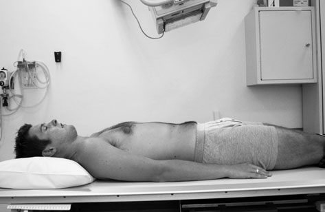
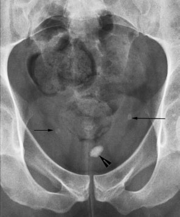
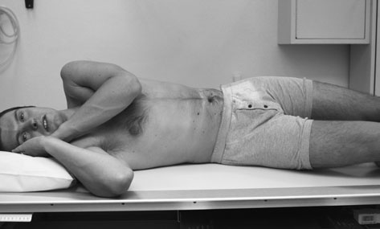
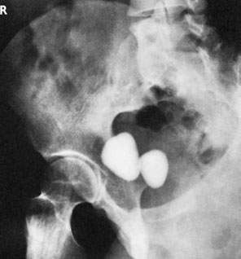

# Rx Vezică Urinară cu angulație caudală

  📷 Radiografie Convențională (Rx)
  <strong>Actualizat:</strong> 2026-09-16
  <strong>Autor:</strong> Departamentul de Radiologie / Referință Clark (Ed. 12)

---

-   __1. Rezumat Clinic & Indicații__

    ---

    === "Indicații Clinice"

        - 347 11 Vezică urinară Calculii radiopaci din vezica urinară se pot deplasa liber, mai ales dacă vezica este plină, în timp ce calcificările patologice și calculii radiopaci din afara vezicii, de exemplu calculii prostatici radiopaci, sunt imobili. Se pot realiza incidențe antero-posterioare (AP) și oblice pentru a evidenția modificarea poziției calculilor radiopaci în raport cu vezica. Pentru examinarea regiunii vezicale, este necesară o angulație caudală pentru a ține cont de forma bazinului osos (pelvisului) și pentru a proiecta simfiza sub vezică. Antero-posterioară (AP) cu angulație caudală de 15 grade

    === "Ghid Național IRIS"

        !!! info "Referință Primară: Ghidul Național IRIS (Ordinul MS 1342/2012)"
            - **Capitol Ghid IRIS:** *Ghidul Național IRIS*
            - **Grad de Recomandare:** **De verificat pe indicație; fără grad atribuit automat**
            - **Nivel de Iradiere Estimată:** `De verificat pentru examinarea și populația selectate`

            [:octicons-search-16: Deschide Ghidul IRIS](../../iris.md){ .md-button .md-button--primary } [:material-open-in-new: Aplicația Oficială PWA](https://radiologie-pediatrica.ro/iris/){ .md-button target="_blank" rel="noopener" }
-   __2. Poziționare & Centrare Fascicul__

    ---

    - **Poziție Pacient:** • Din poziția de decubit dorsal, se ridică o parte a corpului astfel încât planul mediosagital să fie rotit cu 35 grade.
• Pentru a asigura stabilitatea, genunchiul în contact cu masa de examinare este flectat, iar partea ridicată este sprijinită cu o pernă radiotransparentă.
• Poziția pacientului este ajustată astfel încât punctul de la jumătatea distanței dintre simfiza pubiană și spina iliacă antero-superioară (SIAS) de pe partea ridicată să se afle deasupra liniei mediane a mesei.
• O casetă de 30 × 24 cm este plasată longitudinal în tăviță, cu marginea superioară la nivelul spinelor iliace antero-superioare.
    - **Punct de Centrare Fascicul:** • Raza centrală verticală este orientată spre un punct situat la 2.5 cm deasupra simfizei pubiene.
• Alternativ, se poate utiliza o angulație caudală de 15 grade, cu un punct de centrare mai înalt și caseta deplasată în jos pentru a compensa angulația.
    - **Distanță Focar-Film (DFF / SID):** 100 cm
    - **Comandă Respiratorie:** Apnee pe durata expunerii (apnee în inspir pentru torace; expir pentru Abdomen/bazin).

-   __3. Parametri Tehnici Expunere__

    ---

    | Parametru Tehnic | Valoare Configurare Generator / Tub |
    |:-----------------|:-------------------------------------|
    | **Tensiune Tub (kV)** | DE CONFIGURAT PE APARAT |
    | **Sarcină / Produs Curent-Timp (mAs)** | Conform AEC / grosimii anatomice |
    | **Distanță Focar-Film (DFF / SID)** | 100 cm |
    | **Grilă Antidifuzoare (Bucky)** | Conform grosimii anatomice (> 10-12 cm cu grilă) |
    | **Dimensiune Focar** | Focar Mic (0.6 mm) |
    | **Camere de Ionizare AEC** | DE CONFIGURAT PE APARAT |
    | **Colimare Fascicul** | Colimare strictă adaptată pe receptor 18 x 24 cm |
    | **Filtrare Tub** | Totală ≥ 2.5 mm Al echivalent (conform Clark: 3.0 mm Al echivalent) |

-   __4. Criterii de Calitate & Reușită Imagine__

    ---

    - Vizualizarea clară a întregii arii anatomice (vezică urinară).
    - Absența artefactelor de mișcare; trabeculație osoasă și contururi nete.
    - Densitate optică și contrast adecvate pentru diferențierea țesuturilor moi de structurile osoase.

-   __5. Protecție Radiologică (ALARA)__

    ---

    - Ecranare gonadică cu șorț plumbat dacă gonadele sunt în apropierea fasciculului util (regula ALARA).
    - Colimare precisă la dimensiunea anatomică strict necesară pentru reducerea dozei și a radiației difuze.
    - Verificarea posibilității unei sarcini la pacientele de vârstă fertilă înainte de expunere.

!!! note "Observații Clinice & Tehnice"
    Incidența oblică posterioară dreaptă, adică având partea stângă ridicată, va evidenția joncțiunea vezico-ureterală dreaptă, un loc frecvent de blocare a calculilor ureterali radiopaci mici.
Imagine antero-posterioară (AP) cu angulație caudală de 15 grade a etajului abdominal inferior, evidențiind un calcul vezical (vârf de săgeată mare) și mici fleboliți pelvini cu centre radiotransparente (săgeți) Imagine în incidență oblică posterioară dreaptă a etajului abdominal inferior, evidențiind calculi radiopaci mari în vezică

### 🖼️ Imagini

<figure class="protocol-image-card" markdown>

<figcaption><strong>dacă vezica este plină, în timp ce calcificările patologice și calculii radiopaci din afara</strong> — Poziționarea pacientului și centrarea fasciculului conform Clark (Ed. 12)</figcaption>

</figure>

<figure class="protocol-image-card" markdown>

<figcaption><strong>Imagine antero-posterioară (AP) cu angulație caudală de 15 grade a etajului abdominal inferior, evidențiind</strong> — Aspect radiografic / ghid de poziționare conform tratatului Clark (Ed. 12)</figcaption>

</figure>

<figure class="protocol-image-card" markdown>

<figcaption><strong>Imagine în incidență oblică posterioară dreaptă a etajului abdominal inferior, evidențiind mari</strong> — Aspect radiografic / ghid de poziționare conform tratatului Clark (Ed. 12)</figcaption>

</figure>

<figure class="protocol-image-card" markdown>

<figcaption><strong>Figura 4: Aspect radiografic / Poziționare (Clark Ed. 12)</strong> — Aspect radiografic / ghid de poziționare conform tratatului Clark (Ed. 12)</figcaption>

</figure>

=== "Ghid Rapid de Execuție"

    1. **Identificarea și verificarea pacientului:** verificare identitate, zonă de examinat, consimțământ conform procedurii și evaluarea posibilității unei sarcini, când este relevantă.
    2. **Pregătire:** îndepărtarea oricăror obiecte radiopace (bijuterii, agrafe, fermoare, proteze, pansamente dense).
    3. **Poziționare precisă:** alinierea receptorului de imagine și a tubului la distanța prescrisă (100 cm).
    4. **Colimare strictă:** adaptarea fasciculului strict la regiunea de diagnostic pentru scăderea iradierii și reducerea radiației difuze.
    5. **Radioprotecție:** verificarea [politicii RX](../radioprotectie.md), cu măsuri distincte pentru pacient, personal și însoțitor.

## Surse de documentare

- [Clark's Positioning in Radiography (Ed. 12), Pagina 362](https://books.google.com/books/about/Clark_s_Positioning_in_Radiography.html?id=Xxu6MwEACAAJ)
