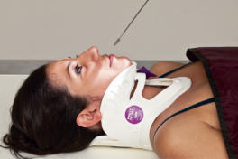
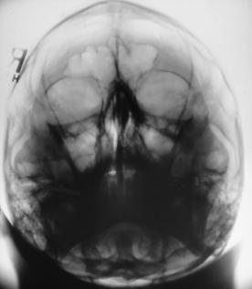
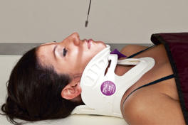
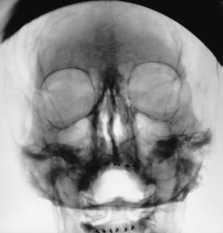

# Rx ACANTHIOPARIETAL (REVERSE Incidență Occipito-Mentonieră (Metoda Waters)) AND Masiv Facial (Oase ale Feței) (MODIFIED ACANTHIOPARIETAL (MODIFIED REVERSE WATERS))

  📷 Radiografie Convențională (Rx)
  <strong>Actualizat:</strong> 2026-09-15
  <strong>Autor:</strong> Departamentul de Radiologie / Referință Bontrager

---

-   __1. Rezumat Clinic & Indicații__

    ---

    === "Indicații Clinice"

        - suspiciune de fractură, penetrating injuries, and radiopaque foreign bodies

    === "Ghid Național IRIS"

        !!! info "Referință Primară: Ghidul Național IRIS (Ordinul MS 1342/2012)"
            - **Capitol Ghid IRIS:** *Ghidul Național IRIS*
            - **Grad de Recomandare:** **De verificat pe indicație; fără grad atribuit automat**
            - **Nivel de Iradiere Estimată:** `De verificat pentru examinarea și populația selectate`

            [:octicons-search-16: Deschide Ghidul IRIS](../../iris.md){ .md-button .md-button--primary } [:material-open-in-new: Aplicația Oficială PWA](https://radiologie-pediatrica.ro/iris/){ .md-button target="_blank" rel="noopener" }
-   __2. Poziționare & Centrare Fascicul__

    ---

    - **Poziție Pacient:** Pacient: Acanthioparietal (Reverse Incidență Occipito-Mentonieră (Metoda Waters)) Patient Decubit Dorsal; remove all metal, plastic, or other removable objects from head. Do not remove cervical collar unless approved by attending physician.; Regiune anatomică: Modified Acanthioparietal (Modified Reverse Incidență Occipito-Mentonieră (Metoda Waters)) (Fig. 15.83) Position MSP perpendicular to midline of grid or table (see previous WARNING).
    - **Punct de Centrare Fascicul:** Angle CR cephalad as needed to align CR parallel to LML.
    - **Distanță Focar-Film (DFF / SID):** 100 cm
    - **Comandă Respiratorie:** Suspend respiration during exposure. Masiv Facial (Oase ale Feței) traumatism acuttism / Regim Urgență Lateral, horizontal beam Acanthioparietal (reverse Incidență Occipito-Mentonieră (Metoda Waters)) AP (see previous pages) OPTIONAL Modified acanthioparietal (modified reverse Incidență Occipito-Mentonieră (Metoda Waters)) Fig. 15.81 Acanthioparietal (reverse Incidență Occipito-Mentonieră (Metoda Waters))—CR parallel to MML, centered to acanthion. Fig. 15.82 Acanthioparietal (reverse Incidență Occipito-Mentonieră (Metoda Waters)). Fig. 15.83 Modified acanthioparietal (modified reverse Incidență Occipito-Mentonieră (Metoda Waters))—CR parallel to LML, centered to acanthion. Fig. 15.84 Modified acanthioparietal (modified reverse Incidență Occipito-Mentonieră (Metoda Waters)).

-   __3. Parametri Tehnici Expunere__

    ---

    | Parametru Tehnic | Valoare Configurare Generator / Tub |
    |:-----------------|:-------------------------------------|
    | **Tensiune Tub (kV)** | 70-85 kV |
    | **Sarcină / Produs Curent-Timp (mAs)** | DE CONFIGURAT PE APARAT |
    | **Distanță Focar-Film (DFF / SID)** | 100 cm |
    | **Grilă Antidifuzoare (Bucky)** | Cu grilă antidifuzoare Bucky |
    | **Dimensiune Focar** | Focar Mic (0.6 mm) |
    | **Camere de Ionizare AEC** | Camerele laterale (sau camera centrală funcție de regiune) |
    | **Colimare Fascicul** | Strictă pe regiunea de interes anatomic |
    | **Filtrare Tub** | Totală ≥ 2.5 mm Al echivalent |

-   __4. Criterii de Calitate & Reușită Imagine__

    ---

    - Vizualizarea completă a regiunii anatomice explorate
    - Absența artefactelor de mișcare sau a suprapunerilor neadecvate
    - Contrast și penetrare optime pentru decelarea structurilor osoase și a părților moi

-   __5. Protecție Radiologică (ALARA)__

    ---

    - Ecranare gonadică și a organelor radiosensibile conform procedurilor locale de radioprotecție ALARA.
    - Colimare strictă la aria de interes pentru limitarea radiației difuze.
    - Verificarea posibilității unei sarcini la pacientele de vârstă fertilă înainte de expunere.

!!! note "Observații Clinice & Tehnice"
    This projection best demonstrates the floor of the Orbite and provides a view of the entire orbital rims. Petrous ridges are visualized in midmaxillary sinus region (Fig. 15.84). Center to acanthion; then center IR to projected CR. Radiation Safety Exposure factor selection should be optimized in accordance with the ALARA. Collimate on four sides to anatomy of interest.

### 🖼️ Imagini

<figure class="protocol-image-card" markdown>

<figcaption><strong>Fig. 15.81 Acanthioparietal (reverse Incidență Occipito-Mentonieră (Metoda Waters))—CR parallel to</strong> — Poziționare pacient conform Ghidului Bontrager (Fig. 15.81 Acanthioparietal (reverse Waters method)—CR parallel to)</figcaption>

</figure>

<figure class="protocol-image-card" markdown>

<figcaption><strong>Fig. 15.82 Acanthioparietal (reverse Incidență Occipito-Mentonieră (Metoda Waters)).</strong> — Aspect radiografic de referință conform Ghidului Bontrager (Fig. 15.82 Acanthioparietal (reverse Waters method).)</figcaption>

</figure>

<figure class="protocol-image-card" markdown>

<figcaption><strong>Fig. 15.83 Modified acanthioparietal (modified reverse Waters</strong> — Aspect radiografic de referință conform Ghidului Bontrager (Fig. 15.83 Modified acanthioparietal (modified reverse Waters)</figcaption>

</figure>

<figure class="protocol-image-card" markdown>

<figcaption><strong>Fig. 15.84 Modified acanthioparietal (modified reverse Waters</strong> — Aspect radiografic de referință conform Ghidului Bontrager (Fig. 15.84 Modified acanthioparietal (modified reverse Waters)</figcaption>

</figure>

=== "Ghid Rapid de Execuție"

    1. **Identificarea și verificarea pacientului:** verificare identitate, zonă de examinat, consimțământ conform procedurii și evaluarea posibilității unei sarcini, când este relevantă.
    2. **Pregătire:** îndepărtarea oricăror obiecte radiopace (bijuterii, agrafe, fermoare, proteze, pansamente dense).
    3. **Poziționare precisă:** alinierea receptorului de imagine și a tubului la distanța prescrisă (100 cm).
    4. **Colimare strictă:** adaptarea fasciculului strict la regiunea de diagnostic pentru scăderea iradierii și reducerea radiației difuze.
    5. **Radioprotecție:** verificarea [politicii RX](../radioprotectie.md), cu măsuri distincte pentru pacient, personal și însoțitor.

## Surse de documentare

- [Bontrager's Textbook of Radiographic Positioning (Ed. 9/10), Pagina 619](https://www.elsevier.com/books/textbook-of-radiographic-positioning-and-related-anatomy/lampignano/978-0-323-65367-1)
