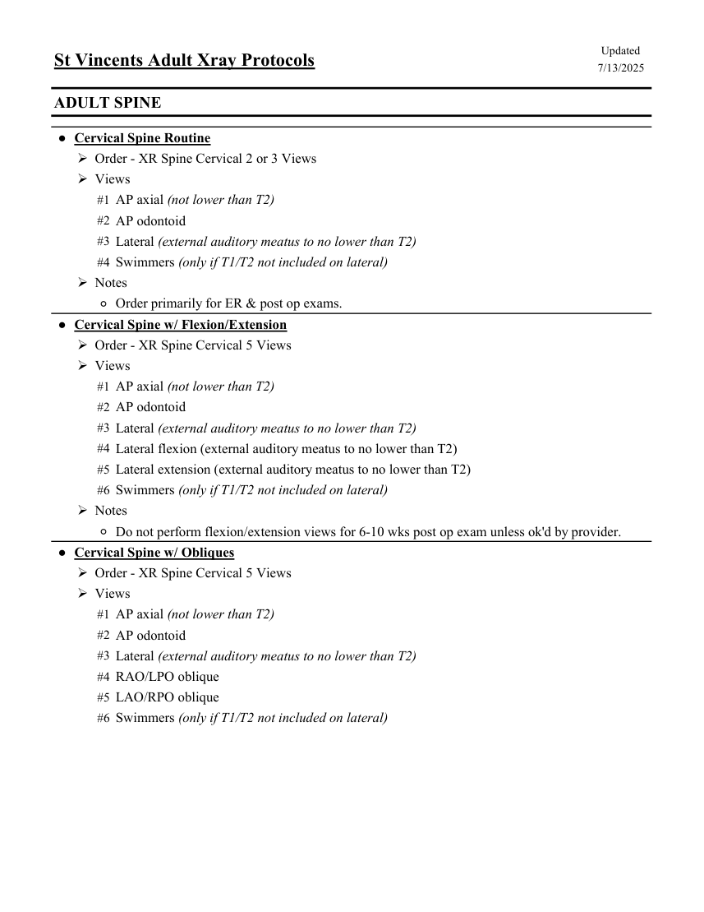
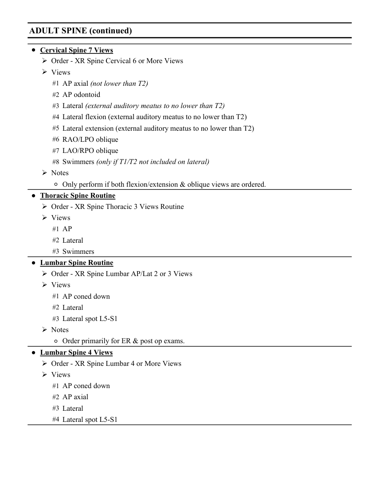
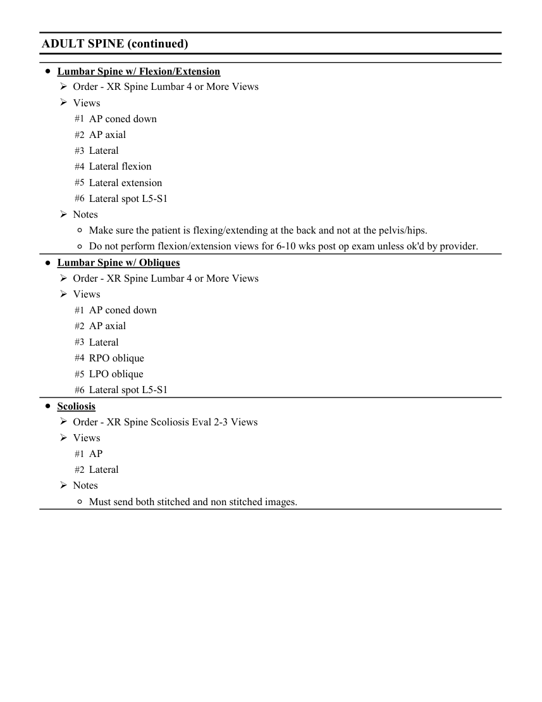

# RX — Adult: coloană vertebrală (MCB)

## Documentul original MCB — Adult: coloană vertebrală

**Colecție de protocoale · 3 pagini · consultat la 2026-09-27.**

[Descarcă PDF-ul integral](../../assets/mcb-modalities/rx-adult-coloana-vertebrala-mcb/document.pdf) · [Sursa MCB](https://ref.mcbradiology.com/Protocols,%20Policies,%20Worksheets%20&%20Forms/Xray/Adult%20Protocols/7%20Adult%20Spine.pdf) · [Catalogul MCB pentru această modalitate](../mcb/index.md)

Instrucțiunile, valorile și ilustrațiile din documentul original sunt păstrate în **engleză**. Titlul și navigarea sunt în română.

### Pagina 1

{ loading=lazy }

### Pagina 2

{ loading=lazy }

### Pagina 3

{ loading=lazy }

## Textul documentului original

??? abstract "Pagina 1 — text în engleză"

    
Updated
    St Vincents Adult Xray Protocols
    7/13/2025
    ADULT SPINE
    ●Cervical Spine Routine
    Order - XR Spine Cervical 2 or 3 Views
    Views
    #1 AP axial (not lower than T2)
    #2 AP odontoid
    #3 Lateral (external auditory meatus to no lower than T2)
    #4 Swimmers (only if T1/T2 not included on lateral)
    Notes
    ◦Order primarily for ER &amp; post op exams.
    ●Cervical Spine w/ Flexion/Extension
    Order - XR Spine Cervical 5 Views
    Views
    #1 AP axial (not lower than T2)
    #2 AP odontoid
    #3 Lateral (external auditory meatus to no lower than T2)
    #4 Lateral flexion (external auditory meatus to no lower than T2)
    #5 Lateral extension (external auditory meatus to no lower than T2)
    #6 Swimmers (only if T1/T2 not included on lateral)
    Notes
    ◦Do not perform flexion/extension views for 6-10 wks post op exam unless ok&#x27;d by provider. 
    ●Cervical Spine w/ Obliques
    Order - XR Spine Cervical 5 Views
    Views
    #1 AP axial (not lower than T2)
    #2 AP odontoid
    #3 Lateral (external auditory meatus to no lower than T2)
    #4 RAO/LPO oblique
    #5 LAO/RPO oblique
    #6 Swimmers (only if T1/T2 not included on lateral)
    

??? abstract "Pagina 2 — text în engleză"

    
ADULT SPINE (continued)
    ●Cervical Spine 7 Views
    Order - XR Spine Cervical 6 or More Views
    Views
    #1 AP axial (not lower than T2)
    #2 AP odontoid
    #3 Lateral (external auditory meatus to no lower than T2)
    #4 Lateral flexion (external auditory meatus to no lower than T2)
    #5 Lateral extension (external auditory meatus to no lower than T2)
    #6 RAO/LPO oblique
    #7 LAO/RPO oblique
    #8 Swimmers (only if T1/T2 not included on lateral)
    Notes
    ◦Only perform if both flexion/extension &amp; oblique views are ordered.
    ●Thoracic Spine Routine
    Order - XR Spine Thoracic 3 Views Routine
    Views
    #1 AP
    #2 Lateral
    #3 Swimmers
    ●Lumbar Spine Routine
    Order - XR Spine Lumbar AP/Lat 2 or 3 Views
    Views
    #1 AP coned down
    #2 Lateral 
    #3 Lateral spot L5-S1
    Notes
    ◦Order primarily for ER &amp; post op exams.
    ●Lumbar Spine 4 Views
    Order - XR Spine Lumbar 4 or More Views
    Views
    #1 AP coned down
    #2 AP axial
    #3 Lateral
    #4 Lateral spot L5-S1
    

??? abstract "Pagina 3 — text în engleză"

    
ADULT SPINE (continued)
    ●Lumbar Spine w/ Flexion/Extension
    Order - XR Spine Lumbar 4 or More Views
    Views
    #1 AP coned down
    #2 AP axial
    #3 Lateral
    #4 Lateral flexion
    #5 Lateral extension
    #6 Lateral spot L5-S1
    Notes
    ◦Make sure the patient is flexing/extending at the back and not at the pelvis/hips.
    ◦Do not perform flexion/extension views for 6-10 wks post op exam unless ok&#x27;d by provider. 
    ●Lumbar Spine w/ Obliques
    Order - XR Spine Lumbar 4 or More Views
    Views
    #1 AP coned down
    #2 AP axial
    #3 Lateral
    #4 RPO oblique
    #5 LPO oblique
    #6 Lateral spot L5-S1
    ●Scoliosis
    Order - XR Spine Scoliosis Eval 2-3 Views
    Views
    #1 AP
    #2 Lateral
    Notes
    ◦Must send both stitched and non stitched images.
    

