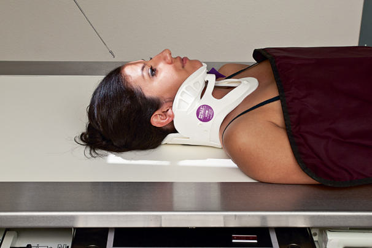

# Rx AP 30 Craniu (DEGREE AXIAL (Incidență AP Axială (Metoda Towne)))

  📷 Radiografie Convențională (Rx)
  <strong>Actualizat:</strong> 2026-09-15
  <strong>Autor:</strong> Departamentul de Radiologie / Referință Bontrager

---

-   __1. Rezumat Clinic & Indicații__

    ---

    === "Indicații Clinice"

        - Calvarial suspiciune de fractură, penetrating injuries, și radiopaque Corp străin / corpuri străine radio-opace

    === "Ghid Național IRIS"

        !!! info "Referință Primară: Ghidul Național IRIS (Ordinul MS 1342/2012)"
            - **Capitol Ghid IRIS:** *Ghidul Național IRIS*
            - **Grad de Recomandare:** **De verificat pe indicație; fără grad atribuit automat**
            - **Nivel de Iradiere Estimată:** `De verificat pentru examinarea și populația selectate`

            [:octicons-search-16: Deschide Ghidul IRIS](../../iris.md){ .md-button .md-button--primary } [:material-open-in-new: Aplicația Oficială PWA](https://radiologie-pediatrica.ro/iris/){ .md-button target="_blank" rel="noopener" }
-   __2. Poziționare & Centrare Fascicul__

    ---

    - **Poziție Pacient:** Pacient: pacient Decubit dorsal; remove toate metal, plastic, și other removable objects de la cap. Do nu remove cervical collar unless approved prin attending physician.; Regiune anatomică: AP axial (Incidență AP Axială (Metoda Towne)) incidență Align MSP perpendicular la midline de grilă sau table (see previous WARNING). Se centrează receptorul de imagine pe raza centrală.
    - **Punct de Centrare Fascicul:** AP axial (Incidență AP Axială (Metoda Towne)) incidență (Fig. 15.79) Angle raza centrală 30 grade caudal la linie orbitomeatală (LOM), sau 37 grade caudal la linie infraorbitomeatală (LIOM). (Once again, note that pacient în cervical collar cu gâtul extins will have OMLs și IOMLs that vary de la conventional paralel și perpendicular relationships formed through routine positioning; see NOTE). Center raza centrală la pass midway între EAMs și exiting gaură occipitală mare (foramen magnum). This centers raza centrală la plan mediosagital 2¼ inches (6 cm) above superciliary arch; then Se centrează receptorul de imagine pe proiecția razei centrale.
    - **Distanță Focar-Film (DFF / SID):** 100 cm
    - **Comandă Respiratorie:** Apnee pe durata expunerii. Craniu traumatism acuttism / Regim Urgență lateral, orizontal fascicul AP AP axial Fig. 15.79 AP axial Towne—raza centrală 30 grade caudal la linie orbitomeatală (LOM), centrat pe midpoint între EAMs.

-   __3. Parametri Tehnici Expunere__

    ---

    | Parametru Tehnic | Valoare Configurare Generator / Tub |
    |:-----------------|:-------------------------------------|
    | **Tensiune Tub (kV)** | 75-90 kV |
    | **Sarcină / Produs Curent-Timp (mAs)** | DE CONFIGURAT PE APARAT |
    | **Distanță Focar-Film (DFF / SID)** | 100 cm |
    | **Grilă Antidifuzoare (Bucky)** | Cu grilă antidifuzoare Bucky |
    | **Dimensiune Focar** | Focar Mare (1.0 - 1.2 mm) |
    | **Camere de Ionizare AEC** | Camerele laterale (sau camera centrală funcție de regiune) |
    | **Colimare Fascicul** | Colimare strictă pe regiunea anatomică de interes diagnostic anatomic |
    | **Filtrare Tub** | Totală ≥ 2.5 mm Al echivalent |

-   __4. Criterii de Calitate & Reușită Imagine__

    ---

    - Vizualizarea completă regiunii anatomice explorate
    - Absența artefactelor de mișcare sau suprapunerilor neadecvate
    - Contrast și penetrare optime pentru decelarea structurilor osoase și părților moi

-   __5. Protecție Radiologică (ALARA)__

    ---

    - Ecranare gonadică și a organelor radiosensibile conform procedurilor locale de radioprotecție ALARA.
    - Colimare strictă la aria de interes pentru limitarea radiației difuze.
    - Verificarea posibilității unei sarcini la pacientele de vârstă fertilă înainte de expunere.

!!! note "Observații Clinice & Tehnice"
    raza centrală pentru AP axial trebuie să nu exceed 45 grade, sau excessive distortion will hinder visualization de essential anatomy. If raza centrală cannot fie înclinat 30 grade la linie orbitomeatală (LOM) (before maximum angle de 45 grade este reached), dorsum sellae și posterior clinoid processes will fie visualized superior la gaură occipitală mare (foramen magnum). Radiation Safety expunere factor selection trebuie să fie optimized în accordance cu ALARA. Collimate pe four sides la anatomy de interest. Follow local regulations, department policy, și protocol în use de shielding.

### 🖼️ Imagini

<figure class="protocol-image-card" markdown>

<figcaption><strong>Fig. 15.79 AP axial Towne—raza centrală 30 grade caudal la linie orbitomeatală (LOM), centrat</strong> — Poziționare pacient conform Ghidului Bontrager (Fig. 15.79 AP axial Towne—raza centrală 30 grade caudal la linie orbitomeatală (LOM), centrat)</figcaption>

</figure>

=== "Ghid Rapid de Execuție"

    1. **Identificarea și verificarea pacientului:** verificare identitate, zonă de examinat, consimțământ conform procedurii și evaluarea posibilității unei sarcini, când este relevantă.
    2. **Pregătire:** îndepărtarea oricăror obiecte radiopace (bijuterii, agrafe, fermoare, proteze, pansamente dense).
    3. **Poziționare precisă:** alinierea receptorului de imagine și a tubului la distanța prescrisă (100 cm).
    4. **Colimare strictă:** adaptarea fasciculului strict la regiunea de diagnostic pentru scăderea iradierii și reducerea radiației difuze.
    5. **Radioprotecție:** verificarea [politicii RX](../radioprotectie.md), cu măsuri distincte pentru pacient, personal și însoțitor.

## Surse de documentare

- [Bontrager's Textbook of Radiographic Positioning (Ed. 9/10), Pagina 617](https://www.elsevier.com/books/textbook-of-radiographic-positioning-and-related-anatomy/lampignano/978-0-323-65367-1)
