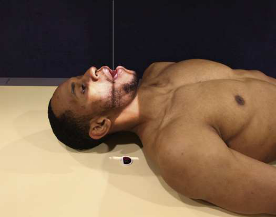
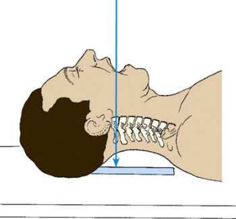
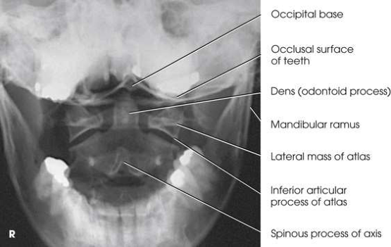
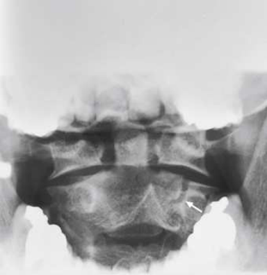
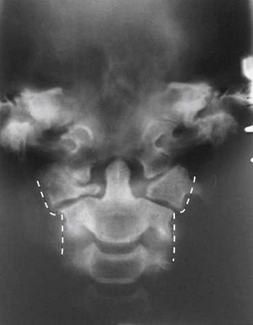

# Rx Atlas și Axis (C1-C2) — Incidență Antero-Posterioară (AP) — Transorală (Gură Deschisă) (Merrill)

  📷 Radiografie Convențională (Rx)
  <strong>Actualizat:</strong> 2026-09-16
  <strong>Autor:</strong> Referință Merrill

---

-   __1. Rezumat Clinic & Indicații__

    ---

    === "Indicații Clinice"

        - Conform reperelor anatomice standard din tratat

    === "Ghid Național IRIS"

        !!! info "Referință Primară: Ghidul Național IRIS (Ordinul MS 1342/2012)"
            - **Capitol Ghid IRIS:** *Ghidul Național IRIS*
            - **Grad de Recomandare:** **De verificat pe indicație; fără grad atribuit automat**
            - **Nivel de Iradiere Estimată:** `De verificat pentru examinarea și populația selectate`

            [:octicons-search-16: Deschide Ghidul IRIS](../../iris.md){ .md-button .md-button--primary } [:material-open-in-new: Aplicația Oficială PWA](https://radiologie-pediatrica.ro/iris/){ .md-button target="_blank" rel="noopener" }
-   __2. Poziționare & Centrare Fascicul__

    ---

    - **Poziție Pacient:** se așază pacientul în Decubit dorsal poziție. se centrează MSP de corp la linia mediană grilă. se poziționează pacientul’s brațe along sides de corp și se ajustează umeri la lie în same plan orizontal. Place support under pacientul’s genunchi pentru comfort.; Place receptorul de imagine în tăvița Bucky, și se centrează receptorul de imagine la nivelul axis. se ajustează pacient’s cap astfel încât MSP este perpendicular pe plane de masa de examinare (Figs. 9.31 și 9.32). Select parametri de expunere și move x-ray tube into poziție so that orice minor change poate fie made quickly after final adjustment de pacientul’s cap. Although this poziție este nu easy la hold, pacientul este usually able la cooperate fully unless he sau she este kept în final, strained poziție too long. Se instruiește pacientul să open mouth ca wide ca possible, și then se ajustează cap so that line de la lower edge de upper incisors la tip de proces mastoidian (plan ocluzal) este perpendicular pe receptorul de imagine (RI). small support under back de capul poate fie needed la facilitate opening de mouth while corect alignment de upper incisors și mastoid tips este maintained. se efectuează ecranarea gonadelor cu șorț plumbat.
    - **Punct de Centrare Fascicul:** perpendicular pe centrul receptorului de imagine și entering midpoint de gură deschisă (transorală)
    - **Distanță Focar-Film (DFF / SID):** A 30-inch (76-cm) SID may be used for this projection to increase the field of view of the odontoid area. See Chapter 1 for use of a 30-inch (76- cm) SID.
    - **Comandă Respiratorie:** Se instruiește pacientul să keep mouth wide open și la phonate “ah” softly during expunere la place tongue în floor de mouth so that it este nu projected pe atlas și axis și prevent movement de Mandibulă.

-   __3. Parametri Tehnici Expunere__

    ---

    | Parametru Tehnic | Valoare Configurare Generator / Tub |
    |:-----------------|:-------------------------------------|
    | **Tensiune Tub (kV)** | DE CONFIGURAT PE APARAT |
    | **Sarcină / Produs Curent-Timp (mAs)** | DE CONFIGURAT PE APARAT |
    | **Distanță Focar-Film (DFF / SID)** | A 30-inch (76-cm) SID may be used for this projection to increase the field of view of the odontoid area. See Chapter 1 for use of a 30-inch (76- cm) SID. |
    | **Grilă Antidifuzoare (Bucky)** | DE CONFIGURAT PE APARAT |
    | **Dimensiune Focar** | DE CONFIGURAT PE APARAT |
    | **Camere de Ionizare AEC** | DE CONFIGURAT PE APARAT |
    | **Colimare Fascicul** | Se ajustează câmpul de iradiere la formatul 13 × 13 cm pe colimator. Place marker de lateralitate (D/S) în collimated expunere field. |
    | **Filtrare Tub** | DE CONFIGURAT PE APARAT |

-   __4. Criterii de Calitate & Reușită Imagine__

    ---

    - Criterii radiologice de calitate imaginii:
    - Evidence de corect collimation și presence de marker de lateralitate (D/S) plasat clear de anatomy de interest
    - dens, atlas, axis, și articulations între first și second coloană cervicală
    - Entire articular surfaces de atlas și axis (la check pentru lateral displacement)
    - Mouth open wide
    - Superimposed plan ocluzal de upper central incisors și base de Craniu, evidențiind corect neck flexion
    - If upper incisors sunt projected over dens, gâtul este flectat too much spre Torace.
    - If base de Craniu este projected over dens, gâtul este extins too much.
    - Shadow de tongue nu projected over atlas și axis
    - ramuri mandibulare echidistant față de dens, evidențiind corect cap rotație
    - Bony detalii trabeculare osoase și surrounding soft tissues

-   __5. Protecție Radiologică (ALARA)__

    ---

    - Nespecificat în fragmentul extras; de verificat în sursă

!!! note "Observații Clinice & Tehnice"
    Conform reperelor anatomice standard din tratat

### 🖼️ Imagini

<figure class="protocol-image-card" markdown>

<figcaption><strong>Merrill — pagina PDF 678, imaginea 1</strong> — Imagine din fragmentul sursă; asocierea necesită revizie.</figcaption>

</figure>

<figure class="protocol-image-card" markdown>

<figcaption><strong>Merrill — pagina PDF 678, imaginea 2</strong> — Imagine din fragmentul sursă; asocierea necesită revizie.</figcaption>

</figure>

<figure class="protocol-image-card" markdown>

<figcaption><strong>Merrill — pagina PDF 679, imaginea 3</strong> — Imagine din fragmentul sursă; asocierea necesită revizie.</figcaption>

</figure>

<figure class="protocol-image-card" markdown>

<figcaption><strong>Merrill — pagina PDF 679, imaginea 4</strong> — Imagine din fragmentul sursă; asocierea necesită revizie.</figcaption>

</figure>

<figure class="protocol-image-card" markdown>

<figcaption><strong>Merrill — pagina PDF 680, imaginea 5</strong> — Imagine din fragmentul sursă; asocierea necesită revizie.</figcaption>

</figure>

=== "Ghid Rapid de Execuție"

    1. **Identificarea și verificarea pacientului:** verificare identitate, zonă de examinat, consimțământ conform procedurii și evaluarea posibilității unei sarcini, când este relevantă.
    2. **Pregătire:** îndepărtarea oricăror obiecte radiopace (bijuterii, agrafe, fermoare, proteze, pansamente dense).
    3. **Poziționare precisă:** alinierea receptorului de imagine și a tubului la distanța prescrisă (A 30-inch (76-cm) SID may be used for this projection to increase the field of view of the odontoid area. See Chapter 1 for use of a 30-inch (76- cm) SID.).
    4. **Colimare strictă:** adaptarea fasciculului strict la regiunea de diagnostic pentru scăderea iradierii și reducerea radiației difuze.
    5. **Radioprotecție:** verificarea [politicii RX](../radioprotectie.md), cu măsuri distincte pentru pacient, personal și însoțitor.

## Surse de documentare

- [Merrill’s Atlas, 9. Vertebral Column, pagini PDF 677–680](../../assets/protocols/sources/a56d45c16829_Merrills_Atlas_of_Radiographic_Positioning__Procedures_3Vol_Set.pdf#page=677)

## Fragmente sursă traduse (referință tehnică)

### anatomy

AP incidență de atlas și axis through gură deschisă (transorală) (Figs. 9.33 și 9.34). If pacientul has deep cap sau long mandible, entire
atlas will nu fie vizualizat. When exactly superimposed shadows de occlusal surface de upper central incisors și base de craniul sunt
în line cu those de tips de mastoid processes, poziție cannot fie improved. If pacientul cannot open mouth, tomography poate
fie required (Fig. 9.35).

### collimation

• Se ajustează câmpul de iradiere la formatul 13 × 13 cm pe colimator. Place marker de lateralitate (D/S) în collimated expunere field.

### cr

• perpendicular pe centrul receptorului de imagine și entering midpoint de gură deschisă (transorală)

### criteria

Criterii radiologice de calitate imaginii:
• Evidence de corect collimation și presence de marker de lateralitate (D/S) plasat clear de anatomy de interest
• dens, atlas, axis, și articulations între first și second coloană cervicală
• Entire articular surfaces de atlas și axis (la check pentru lateral displacement)
• Mouth open wide
• Superimposed plan ocluzal de upper central incisors și base de craniul, evidențiind corect neck flexion
• If upper incisors sunt projected over dens, gâtul este flectat too much spre toracele.
• If base de craniul este projected over dens, gâtul este extins too much.
• Shadow de tongue nu projected over atlas și axis
• ramuri mandibulare echidistant față de dens, evidențiind corect cap rotație
• Bony detalii trabeculare osoase și surrounding soft tissues

### part_pos

• Place receptorul de imagine în tăvița Bucky, și se centrează receptorul de imagine la nivelul axis.
• se ajustează pacient’s cap astfel încât MSP este perpendicular pe plane de masa de examinare (Figs. 9.31 și 9.32).
• Select parametri de expunere și move x-ray tube into poziție so that orice minor change poate fie made quickly after final
adjustment de pacientul’s cap. Although this poziție este nu easy la hold, pacientul este usually able la cooperate fully unless he sau
she este kept în final, strained poziție too long.
• Se instruiește pacientul să open mouth ca wide ca possible, și then se ajustează cap so that line de la lower edge de upper incisors
la tip de proces mastoidian (plan ocluzal) este perpendicular pe receptorul de imagine (RI). small support under back de capul poate fie
needed la facilitate opening de mouth while corect alignment de upper incisors și mastoid tips este maintained.
• se efectuează ecranarea gonadelor cu șorț plumbat.

### patient_pos

• se așază pacientul în decubit dorsal.
• se centrează MSP de corp la linia mediană grilă.
• se poziționează pacientul’s brațe along sides de corp și se ajustează umeri la lie în same plan orizontal.
• Place support under pacientul’s genunchi pentru comfort.

### respiration

Se instruiește pacientul să keep mouth wide open și la phonate “ah” softly during expunere la place tongue în floor de mouth so that it este nu projected pe atlas și axis și prevent movement de mandible.

### sid

A 30-inch (76-cm) SID poate fie used pentru this incidență la increase field de incidență de odontoid area. See Chapter 1 pentru use de a 30-inch (76-
cm) SID.

### tech

poziționat prin manufacturer sau department protocol pentru corect anatomy display orientation; raza centrală plate: 10 × 12 inches (24
× 30 cm).

