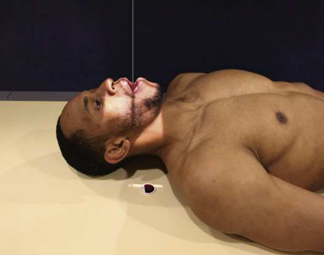
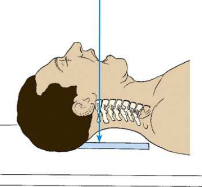
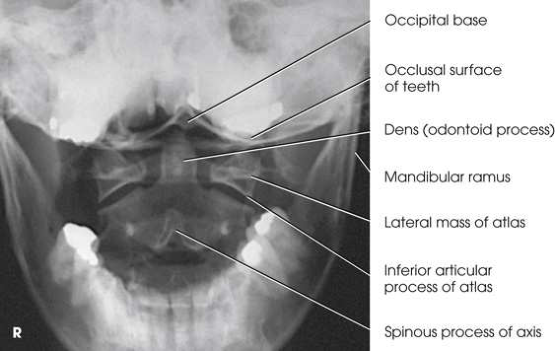
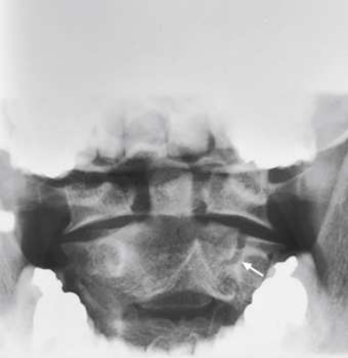
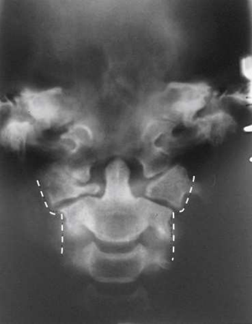

# Rx Atlas și Axis (C1-C2) — Incidență Antero-Posterioară (AP) — Transorală (Gură Deschisă) (Merrill)

  📷 Radiografie Convențională (Rx)
  <strong>Actualizat:</strong> 2026-09-16
  <strong>Autor:</strong> Referință Merrill

---

-   __1. Rezumat Clinic & Indicații__

    ---

    === "Indicații Clinice"

        - Conform reperelor anatomice standard din tratat

    === "Ghid Național IRIS"

        !!! info "Referință Primară: Ghidul Național IRIS (Ordinul MS 1342/2012)"
            - **Capitol Ghid IRIS:** *Coloană vertebrală & Traumatisme*
            - **Grad de Recomandare:** **Grad A**
            - **Nivel de Iradiere Estimată:** `Clasa 1 (Minimă < 0.2 mSv)`

            [:octicons-search-16: Deschide Ghidul IRIS](../../iris.md){ .md-button .md-button--primary } [:material-open-in-new: Aplicația Oficială PWA](https://radiologie-pediatrica.ro/iris/){ .md-button target="_blank" rel="noopener" }

-   __2. Poziționare & Centrare Fascicul__

    ---

    - **Poziție Pacient:** Se așază pacientul în decubit dorsal. Se centrează MSP al corpului pe linia mediană a grilei. Se poziționează brațele pacientului de-a lungul corpului și se ajustează umerii astfel încât să se afle în același plan orizontal. Se așază un suport sub genunchii pacientului pentru confort.; Se așază receptorul de imagine în tăvița Bucky și se centrează la nivelul axisului. Se ajustează poziția capului pacientului astfel încât MSP să fie perpendicular pe planul mesei de examinare (Fig. 9.31 și 9.32). Se selectează parametrii de expunere și se aduce tubul de raze X în poziție, astfel încât orice modificare minoră să poată fi efectuată rapid după ajustarea finală a poziției capului pacientului. Deși această poziție nu este ușor de menținut, pacientul poate de obicei să coopereze pe deplin, cu condiția să nu fie menținut prea mult timp în poziția finală, solicitantă. Se instruiește pacientul să deschidă gura cât mai larg posibil, apoi se ajustează poziția capului astfel încât linia de la marginea inferioară a incisivilor superiori până la vârful procesului mastoidian (planul ocluzal) să fie perpendiculară pe receptorul de imagine (RI). Poate fi necesar un suport mic sub partea posterioară a capului pentru a facilita deschiderea gurii, menținând alinierea corectă a incisivilor superiori și a vârfurilor proceselor mastoidiene. Se efectuează ecranarea gonadelor cu șorț plumbat.
    - **Punct de Centrare Fascicul:** perpendicular pe centrul receptorului de imagine, pătrunzând prin mijlocul gurii deschise (transoral)
    - **Distanță Focar-Film (DFF / SID):** Pentru această incidență se poate utiliza o SID de 30 inci (76 cm), pentru a mări câmpul de vizualizare al regiunii odontoide. Consultați capitolul 1 pentru utilizarea unei SID de 30 inci (76 cm).
    - **Comandă Respiratorie:** Se instruiește pacientul să țină gura larg deschisă și să pronunțe încet „ah” în timpul expunerii, pentru a menține limba pe planșeul bucal, astfel încât aceasta să nu se proiecteze peste atlas și axis, și pentru a preveni mișcarea mandibulei.

-   __3. Parametri Tehnici Expunere__

    ---

    | Parametru Tehnic | Valoare Configurare Generator / Tub |
    |:-----------------|:-------------------------------------|
    | **Tensiune Tub (kV)** | DE CONFIGURAT PE APARAT |
    | **Sarcină / Produs Curent-Timp (mAs)** | DE CONFIGURAT PE APARAT |
    | **Distanță Focar-Film (DFF / SID)** | Pentru această incidență se poate utiliza o SID de 30 inci (76 cm), pentru a mări câmpul de vizualizare al regiunii odontoide. Consultați capitolul 1 pentru utilizarea unei SID de 30 inci (76 cm). |
    | **Grilă Antidifuzoare (Bucky)** | DE CONFIGURAT PE APARAT |
    | **Dimensiune Focar** | DE CONFIGURAT PE APARAT |
    | **Camere de Ionizare AEC** | DE CONFIGURAT PE APARAT |
    | **Colimare Fascicul** | Se ajustează câmpul de iradiere la formatul 13 × 13 cm pe colimator. Se plasează markerul de lateralitate (D/S) în câmpul de expunere colimat. |
    | **Filtrare Tub** | DE CONFIGURAT PE APARAT |

-   __4. Criterii de Calitate & Reușită Imagine__

    ---

    - Criterii radiologice de calitate a imaginii:
    - Evidențierea colimării corecte și prezența markerului de lateralitate (D/S), plasat fără a se suprapune peste anatomia de interes
    - Procesul odontoid, atlasul, axisul și articulațiile dintre prima și a doua vertebră cervicală
    - Suprafețele articulare ale atlasului și axisului în întregime (pentru a verifica deplasarea laterală)
    - Gura larg deschisă
    - Suprapunerea planului ocluzal al incisivilor centrali superiori și a bazei craniului, evidențiind flexia corectă a gâtului
    - Dacă incisivii superiori se proiectează peste procesul odontoid, gâtul este flectat prea mult spre torace.
    - Dacă baza craniului se proiectează peste procesul odontoid, gâtul este extins prea mult.
    - Umbra limbii nu se proiectează peste atlas și axis
    - Ramurile mandibulare sunt echidistante față de procesul odontoid, evidențiind rotația corectă a capului
    - Detalii trabeculare osoase și țesuturile moi înconjurătoare

-   __5. Protecție Radiologică (ALARA)__

    ---

    - Nespecificat în fragmentul extras; de verificat în sursă

!!! note "Observații Clinice & Tehnice"
    Conform reperelor anatomice standard din tratat

### 🖼️ Imagini

<figure class="protocol-image-card" markdown>

<figcaption><strong>Merrill — pagina 678, imaginea 1</strong> — Imagine din fragmentul sursă; asocierea necesită revizie.</figcaption>

</figure>

<figure class="protocol-image-card" markdown>

<figcaption><strong>Merrill — pagina 678, imaginea 2</strong> — Imagine din fragmentul sursă; asocierea necesită revizie.</figcaption>

</figure>

<figure class="protocol-image-card" markdown>

<figcaption><strong>Merrill — pagina 679, imaginea 3</strong> — Imagine din fragmentul sursă; asocierea necesită revizie.</figcaption>

</figure>

<figure class="protocol-image-card" markdown>

<figcaption><strong>Merrill — pagina 679, imaginea 4</strong> — Imagine din fragmentul sursă; asocierea necesită revizie.</figcaption>

</figure>

<figure class="protocol-image-card" markdown>

<figcaption><strong>Merrill — pagina 680, imaginea 5</strong> — Imagine din fragmentul sursă; asocierea necesită revizie.</figcaption>

</figure>

=== "Ghid Rapid de Execuție"

    1. **Identificarea și verificarea pacientului:** verificare identitate, zonă de examinat, consimțământ conform procedurii și evaluarea posibilității unei sarcini, când este relevantă.
    2. **Pregătire:** îndepărtarea oricăror obiecte radiopace (bijuterii, agrafe, fermoare, proteze, pansamente dense).
    3. **Poziționare precisă:** alinierea receptorului de imagine și a tubului la distanța prescrisă (Pentru această incidență se poate utiliza o SID de 30 inci (76 cm), pentru a mări câmpul de vizualizare al regiunii odontoide. Consultați capitolul 1 pentru utilizarea unei SID de 30 inci (76 cm).).
    4. **Colimare strictă:** adaptarea fasciculului strict la regiunea de diagnostic pentru scăderea iradierii și reducerea radiației difuze.
    5. **Radioprotecție:** verificarea [politicii RX](../radioprotectie.md), cu măsuri distincte pentru pacient, personal și însoțitor.

## Surse de documentare

- [Merrill’s Atlas, 9. Vertebral Column, pagini 677–680](https://books.google.com/books/about/Merrill_s_Atlas_of_Radiographic_Position.html?id=BM0lEQAAQBAJ)
