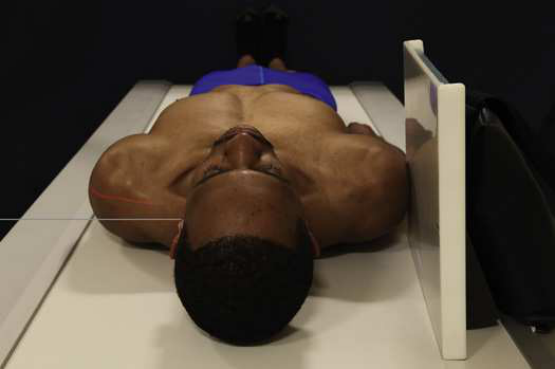

# Rx Atlas și Axis (C1-C2) — Incidență de Profil (Lateral) — Profil (Drept sau Stâng) (Merrill)

  📷 Radiografie Convențională (Rx)
  <strong>Actualizat:</strong> 2026-09-16
  <strong>Autor:</strong> Referință Merrill

---

-   __1. Rezumat Clinic & Indicații__

    ---

    === "Indicații Clinice"

        - Conform reperelor anatomice standard din tratat

    === "Ghid Național IRIS"

        !!! info "Referință Primară: Ghidul Național IRIS (Ordinul MS 1342/2012)"
            - **Capitol Ghid IRIS:** *Ghidul Național IRIS*
            - **Grad de Recomandare:** **De verificat pe indicație; fără grad atribuit automat**
            - **Nivel de Iradiere Estimată:** `De verificat pentru examinarea și populația selectate`

            [:octicons-search-16: Deschide Ghidul IRIS](../../iris.md){ .md-button .md-button--primary } [:material-open-in-new: Aplicația Oficială PWA](https://radiologie-pediatrica.ro/iris/){ .md-button target="_blank" rel="noopener" }
-   __2. Poziționare & Centrare Fascicul__

    ---

    - **Poziție Pacient:** se așază pacientul în Decubit dorsal poziție. Place brațele along sides de corp și se ajustează umeri la lie în same plan orizontal. Place sponge sau pad under pacientul’s cap unless traumatic injury has been sustained, în which case gâtul trebuie să nu fie moved.; cu receptorul de imagine în vertical poziție și în contact cu upper neck, center it la nivelul atlantoaxial articulation (1 inch [2.5 cm] distal la tip de proces mastoidian). se ajustează receptorul de imagine so that it este paralel cu MSP de gâtul, și then support receptorul de imagine în poziție (Figs. 9.36 și 9.37). se extinde neck slightly astfel încât shadow de ramuri mandibulare does nu overlap that de coloană vertebrală. se ajustează cap astfel încât MSP este perpendicular pe table. se efectuează ecranarea gonadelor cu șorț plumbat.
    - **Punct de Centrare Fascicul:** perpendicular la point 1 inch (2.5 cm) distal la adjacent mastoid tip
    - **Distanță Focar-Film (DFF / SID):** Nespecificat în fragmentul extras; de verificat în sursă
    - **Comandă Respiratorie:** apnee (oprirea respirației).

-   __3. Parametri Tehnici Expunere__

    ---

    | Parametru Tehnic | Valoare Configurare Generator / Tub |
    |:-----------------|:-------------------------------------|
    | **Tensiune Tub (kV)** | DE CONFIGURAT PE APARAT |
    | **Sarcină / Produs Curent-Timp (mAs)** | DE CONFIGURAT PE APARAT |
    | **Distanță Focar-Film (DFF / SID)** | Nespecificat în fragmentul extras; de verificat în sursă |
    | **Grilă Antidifuzoare (Bucky)** | DE CONFIGURAT PE APARAT |
    | **Dimensiune Focar** | DE CONFIGURAT PE APARAT |
    | **Camere de Ionizare AEC** | DE CONFIGURAT PE APARAT |
    | **Colimare Fascicul** | Se ajustează câmpul de iradiere la formatul 13 × 13 cm pe colimator. Place marker de lateralitate (D/S) în collimated expunere field. |
    | **Filtrare Tub** | DE CONFIGURAT PE APARAT |

-   __4. Criterii de Calitate & Reușită Imagine__

    ---

    - Criterii radiologice de calitate imaginii:
    - Evidence de corect collimation și presence de marker de lateralitate (D/S) plasat clear de anatomy de interest
    - Upper coloană cervicală
    - MSP de cap și neck paralel la plane de receptorul de imagine, fără tilt sau rotație
    - Superimposed laminae de axis și superimposed posterior arches de atlas
    - Nearly superimposed rami de Mandibulă
    - Neck extins astfel încât ramuri mandibulare does nu overlap axis sau atlas
    - Bony detalii trabeculare osoase și surrounding soft tissues

-   __5. Protecție Radiologică (ALARA)__

    ---

    - Nespecificat în fragmentul extras; de verificat în sursă

!!! note "Observații Clinice & Tehnice"
    Conform reperelor anatomice standard din tratat

### 🖼️ Imagini

<figure class="protocol-image-card" markdown>

<figcaption><strong>Merrill — pagina PDF 681, imaginea 1</strong> — Imagine din fragmentul sursă; asocierea necesită revizie.</figcaption>

</figure>

=== "Ghid Rapid de Execuție"

    1. **Identificarea și verificarea pacientului:** verificare identitate, zonă de examinat, consimțământ conform procedurii și evaluarea posibilității unei sarcini, când este relevantă.
    2. **Pregătire:** îndepărtarea oricăror obiecte radiopace (bijuterii, agrafe, fermoare, proteze, pansamente dense).
    3. **Poziționare precisă:** alinierea receptorului de imagine și a tubului la distanța prescrisă (Nespecificat în fragmentul extras; de verificat în sursă).
    4. **Colimare strictă:** adaptarea fasciculului strict la regiunea de diagnostic pentru scăderea iradierii și reducerea radiației difuze.
    5. **Radioprotecție:** verificarea [politicii RX](../radioprotectie.md), cu măsuri distincte pentru pacient, personal și însoțitor.

## Surse de documentare

- [Merrill’s Atlas, 9. Vertebral Column, pagini PDF 680–681](../../assets/protocols/sources/a56d45c16829_Merrills_Atlas_of_Radiographic_Positioning__Procedures_3Vol_Set.pdf#page=680)

## Fragmente sursă traduse (referință tehnică)

### anatomy

lateral incidență de atlas și axis. atlantooccipital articulations sunt also vizualizat (Fig. 9.38).

### collimation

• Se ajustează câmpul de iradiere la formatul 13 × 13 cm pe colimator. Place marker de lateralitate (D/S) în collimated expunere field.

### cr

• perpendicular la point 1 inch (2.5 cm) distal la adjacent mastoid tip

### criteria

Criterii radiologice de calitate imaginii:
• Evidence de corect collimation și presence de marker de lateralitate (D/S) plasat clear de anatomy de interest
• Upper coloană cervicală
• MSP de cap și neck paralel la plane de receptorul de imagine, fără tilt sau rotație
• Superimposed laminae de axis și superimposed posterior arches de atlas
• Nearly superimposed rami de mandible
• Neck extins astfel încât ramuri mandibulare does nu overlap axis sau atlas
• Bony detalii trabeculare osoase și surrounding soft tissues

### part_pos

• cu receptorul de imagine în vertical poziție și în contact cu upper neck, center it la nivelul atlantoaxial articulation (1 inch [2.5
cm] distal la tip de proces mastoidian).
• se ajustează receptorul de imagine so that it este paralel cu MSP de gâtul, și then support receptorul de imagine în poziție (Figs. 9.36 și 9.37).
• se extinde neck slightly astfel încât shadow de ramuri mandibulare does nu overlap that de coloană vertebrală.
• se ajustează cap astfel încât MSP este perpendicular pe table.
• se efectuează ecranarea gonadelor cu șorț plumbat.

### patient_pos

• se așază pacientul în decubit dorsal.
• Place brațele along sides de corp și se ajustează umeri la lie în same plan orizontal.
• Place sponge sau pad under pacientul’s cap unless traumatic injury has been sustained, în which case gâtul trebuie să nu fie moved.

### respiration

apnee (oprirea respirației).

### tech

poziționat prin manufacturer sau department protocol pentru corect anatomy display orientation; raza centrală plate: 10 × 12 inches (24 ×
30 cm).

