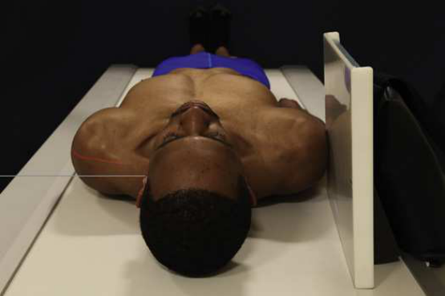

# Rx Atlas și Axis (C1-C2) — Incidență de Profil (Lateral) — Profil (Drept sau Stâng) (Merrill)

  📷 Radiografie Convențională (Rx)
  <strong>Actualizat:</strong> 2026-09-16
  <strong>Autor:</strong> Referință Merrill

---

-   __1. Rezumat Clinic & Indicații__

    ---

    === "Indicații Clinice"

        - Conform reperelor anatomice standard din tratat

    === "Ghid Național IRIS"

        !!! info "Referință Primară: Ghidul Național IRIS (Ordinul MS 1342/2012)"
            - **Capitol Ghid IRIS:** *Coloană vertebrală & Traumatisme*
            - **Grad de Recomandare:** **Grad A**
            - **Nivel de Iradiere Estimată:** `Clasa 1 (Minimă < 0.2 mSv)`

            [:octicons-search-16: Deschide Ghidul IRIS](../../iris.md){ .md-button .md-button--primary } [:material-open-in-new: Aplicația Oficială PWA](https://radiologie-pediatrica.ro/iris/){ .md-button target="_blank" rel="noopener" }

-   __2. Poziționare & Centrare Fascicul__

    ---

    - **Poziție Pacient:** se așază pacientul în decubit dorsal. Se așază brațele de-a lungul corpului și se ajustează umerii astfel încât să fie în același plan orizontal. Se așază un burete sau o pernă sub capul pacientului, cu excepția cazului în care acesta a suferit un traumatism, situație în care gâtul nu trebuie mișcat.; cu receptorul de imagine în poziție verticală și în contact cu partea superioară a gâtului, se centrează acesta la nivelul articulației atlantoaxiale (1 țol [2.5 cm] distal de vârful procesului mastoidian). se ajustează receptorul de imagine astfel încât să fie paralel cu MSP al gâtului, apoi se fixează receptorul de imagine în poziție (Fig. 9.36 și 9.37). se extinde ușor gâtul astfel încât umbra ramurilor mandibulare să nu se suprapună peste cea a coloanei vertebrale. se ajustează capul astfel încât MSP să fie perpendicular pe masă. se efectuează ecranarea gonadelor cu șorț plumbat.
    - **Punct de Centrare Fascicul:** perpendiculară pe un punct situat la 1 țol (2.5 cm) distal de vârful mastoidian adiacent
    - **Distanță Focar-Film (DFF / SID):** Nespecificat în fragmentul extras; de verificat în sursă
    - **Comandă Respiratorie:** apnee (oprirea respirației).

-   __3. Parametri Tehnici Expunere__

    ---

    | Parametru Tehnic | Valoare Configurare Generator / Tub |
    |:-----------------|:-------------------------------------|
    | **Tensiune Tub (kV)** | DE CONFIGURAT PE APARAT |
    | **Sarcină / Produs Curent-Timp (mAs)** | DE CONFIGURAT PE APARAT |
    | **Distanță Focar-Film (DFF / SID)** | Nespecificat în fragmentul extras; de verificat în sursă |
    | **Grilă Antidifuzoare (Bucky)** | DE CONFIGURAT PE APARAT |
    | **Dimensiune Focar** | DE CONFIGURAT PE APARAT |
    | **Camere de Ionizare AEC** | DE CONFIGURAT PE APARAT |
    | **Colimare Fascicul** | Se ajustează câmpul de iradiere la formatul 13 × 13 cm pe colimator. Se plasează markerul de lateralitate (D/S) în câmpul de expunere colimat. |
    | **Filtrare Tub** | DE CONFIGURAT PE APARAT |

-   __4. Criterii de Calitate & Reușită Imagine__

    ---

    - Criterii radiologice de calitate a imaginii:
    - Evidențierea colimării corecte și prezența markerului de lateralitate (D/S), plasat fără a se suprapune peste anatomia de interes
    - Porțiunea superioară a coloanei cervicale
    - MSP al capului și gâtului paralel cu planul receptorului de imagine, fără înclinare sau rotație
    - Lamele axisului suprapuse și arcurile posterioare ale atlasului suprapuse
    - Ramurile mandibulei aproape suprapuse
    - Gâtul extins astfel încât ramurile mandibulare să nu se suprapună peste axis sau atlas
    - Detalii trabeculare osoase și țesuturile moi înconjurătoare

-   __5. Protecție Radiologică (ALARA)__

    ---

    - Nespecificat în fragmentul extras; de verificat în sursă

!!! note "Observații Clinice & Tehnice"
    Conform reperelor anatomice standard din tratat

### 🖼️ Imagini

<figure class="protocol-image-card" markdown>

<figcaption><strong>Merrill — pagina 681, imaginea 1</strong> — Imagine din fragmentul sursă; asocierea necesită revizie.</figcaption>

</figure>

=== "Ghid Rapid de Execuție"

    1. **Identificarea și verificarea pacientului:** verificare identitate, zonă de examinat, consimțământ conform procedurii și evaluarea posibilității unei sarcini, când este relevantă.
    2. **Pregătire:** îndepărtarea oricăror obiecte radiopace (bijuterii, agrafe, fermoare, proteze, pansamente dense).
    3. **Poziționare precisă:** alinierea receptorului de imagine și a tubului la distanța prescrisă (Nespecificat în fragmentul extras; de verificat în sursă).
    4. **Colimare strictă:** adaptarea fasciculului strict la regiunea de diagnostic pentru scăderea iradierii și reducerea radiației difuze.
    5. **Radioprotecție:** verificarea [politicii RX](../radioprotectie.md), cu măsuri distincte pentru pacient, personal și însoțitor.

## Surse de documentare

- [Merrill’s Atlas, 9. Vertebral Column, pagini 680–681](https://books.google.com/books/about/Merrill_s_Atlas_of_Radiographic_Position.html?id=BM0lEQAAQBAJ)
