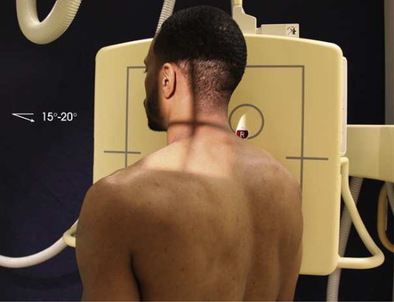
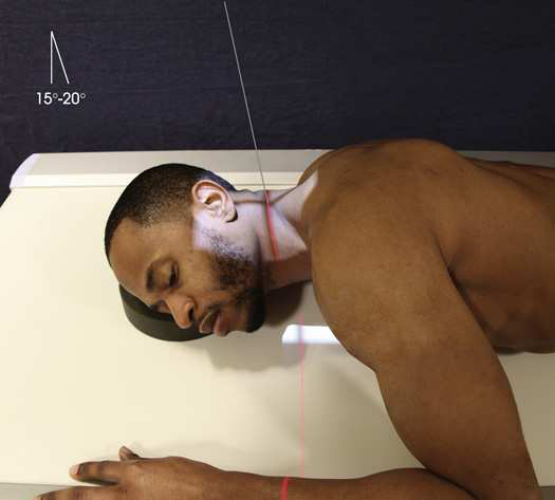

# Rx Găuri de Conjugare Cervicale (Foramene) — Oblică Axială PA — RAO and Oblică Anterioară Stângă (OAS / LAO)s (Merrill)

  📷 Radiografie Convențională (Rx)
  <strong>Actualizat:</strong> 2026-09-16
  <strong>Autor:</strong> Referință Merrill

---

-   __1. Rezumat Clinic & Indicații__

    ---

    === "Indicații Clinice"

        - Conform reperelor anatomice standard din tratat

    === "Ghid Național IRIS"

        !!! info "Referință Primară: Ghidul Național IRIS (Ordinul MS 1342/2012)"
            - **Capitol Ghid IRIS:** *Ghidul Național IRIS*
            - **Grad de Recomandare:** **De verificat pe indicație; fără grad atribuit automat**
            - **Nivel de Iradiere Estimată:** `De verificat pentru examinarea și populația selectate`

            [:octicons-search-16: Deschide Ghidul IRIS](../../iris.md){ .md-button .md-button--primary } [:material-open-in-new: Aplicația Oficială PWA](https://radiologie-pediatrica.ro/iris/){ .md-button target="_blank" rel="noopener" }
-   __2. Poziționare & Centrare Fascicul__

    ---

    - **Poziție Pacient:** se poziționează pacientul Decubit ventral sau în ortostatism cu back spre x-ray tube. pentru pacientul’s comfort și precis adjustment de part, în ortostatism sau Poziție Șezândă-ortostatism este preferred.; în ortostatism anterior Incidență Oblică: Se instruiește pacientul să sit sau stand straight cu brațele prin side și rest Umăr pe / sprijinit de grilă device. se rotește pacient’s entire corp la a 45-grade angle. se centrează Coloană Cervicală la linia mediană grilă device (Fig. 9.52). Decubit anterior Incidență Oblică: se poziționează pacientul’s corp la un unghi de 45 grade și Coloană Cervicală centrat pe linia mediană grilă. Se instruiește pacientul să use Antebraț și flectat Genunchi de ridicat side la support corp și maintain poziție (Figs. 9.53 și 9.54). Place suitable support under pacientul’s cap la poziție axa longitudinală de cervical column paralel cu receptorul de imagine. la allow pentru caudal angulation de raza centrală, se centrează receptorul de imagine la nivelul C5 (1 inch [2.5 cm] caudal la most prominent point de cartilaj tiroid (mărul lui Adam)). se ajustează poziție de pacientul’s cap astfel încât MSP este aliniat cu plane de coloană vertebrală. Elevate și protrude pacientul’s chin just enough la prevent superimposition de Mandibulă cu upper coloană cervicală. Turning bărbia la side causes rotație de superior vertebre și trebuie să fie avoided. (bărbia has la fie turned slightly pentru Decubit anterior Incidență Oblică.) se efectuează ecranarea gonadelor cu șorț plumbat.
    - **Punct de Centrare Fascicul:** orientat la C4 la un unghi de 15 la 20 grade caudal so that it coincides cu orientation de foramina.
    - **Distanță Focar-Film (DFF / SID):** A 60- to 72-inch (152- to 183-cm) SID is recommended to compensate for the increased OID.
    - **Comandă Respiratorie:** apnee (oprirea respirației).

-   __3. Parametri Tehnici Expunere__

    ---

    | Parametru Tehnic | Valoare Configurare Generator / Tub |
    |:-----------------|:-------------------------------------|
    | **Tensiune Tub (kV)** | DE CONFIGURAT PE APARAT |
    | **Sarcină / Produs Curent-Timp (mAs)** | DE CONFIGURAT PE APARAT |
    | **Distanță Focar-Film (DFF / SID)** | A 60- to 72-inch (152- to 183-cm) SID is recommended to compensate for the increased OID. |
    | **Grilă Antidifuzoare (Bucky)** | DE CONFIGURAT PE APARAT |
    | **Dimensiune Focar** | DE CONFIGURAT PE APARAT |
    | **Camere de Ionizare AEC** | DE CONFIGURAT PE APARAT |
    | **Colimare Fascicul** | Adjust câmp de iradiere la 10 × 12 inches (24 × 30 cm) în collimator. Place marker de lateralitate (D/S) în collimated expunere field. |
    | **Filtrare Tub** | DE CONFIGURAT PE APARAT |

-   __4. Criterii de Calitate & Reușită Imagine__

    ---

    - Criterii radiologice de calitate imaginii:
    - Evidence de corect collimation și presence de marker de lateralitate (D/S) plasat clear de anatomy de interest
    - toate seven cervical și first coloană toracală
    - Appropriate 45-grade rotație de corp și neck
    - Open intervertebral foramina cel mai apropiat de receptorul de imagine, de la C2–C3 la C7–T1
    - Uniform size și contour de foramina
    - Appropriately ridicat chin
    - Mandibulă nu overlapping atlas și axis
    - Occipital bone nu overlapping atlas și axis
    - Open intervertebral disk spaces
    - Bony detalii trabeculare osoase și surrounding soft tissues

-   __5. Protecție Radiologică (ALARA)__

    ---

    - Nespecificat în fragmentul extras; de verificat în sursă

!!! note "Observații Clinice & Tehnice"
    Conform reperelor anatomice standard din tratat

### 🖼️ Imagini

<figure class="protocol-image-card" markdown>

<figcaption><strong>Merrill — pagina PDF 696, imaginea 1</strong> — Imagine din fragmentul sursă; asocierea necesită revizie.</figcaption>

</figure>

<figure class="protocol-image-card" markdown>

<figcaption><strong>Merrill — pagina PDF 697, imaginea 2</strong> — Imagine din fragmentul sursă; asocierea necesită revizie.</figcaption>

</figure>

=== "Ghid Rapid de Execuție"

    1. **Identificarea și verificarea pacientului:** verificare identitate, zonă de examinat, consimțământ conform procedurii și evaluarea posibilității unei sarcini, când este relevantă.
    2. **Pregătire:** îndepărtarea oricăror obiecte radiopace (bijuterii, agrafe, fermoare, proteze, pansamente dense).
    3. **Poziționare precisă:** alinierea receptorului de imagine și a tubului la distanța prescrisă (A 60- to 72-inch (152- to 183-cm) SID is recommended to compensate for the increased OID.).
    4. **Colimare strictă:** adaptarea fasciculului strict la regiunea de diagnostic pentru scăderea iradierii și reducerea radiației difuze.
    5. **Radioprotecție:** verificarea [politicii RX](../radioprotectie.md), cu măsuri distincte pentru pacient, personal și însoțitor.

## Surse de documentare

- [Merrill’s Atlas, 9. Vertebral Column, pagini PDF 695–697](../../assets/protocols/sources/a56d45c16829_Merrills_Atlas_of_Radiographic_Positioning__Procedures_3Vol_Set.pdf#page=695)

## Fragmente sursă traduse (referință tehnică)

### anatomy

intervertebral foramina și pedicles cel mai apropiat de receptorul de imagine și oblic incidență de corpuri și other parts de cervical column (Fig.
9.55). (See Summary de oblic incidențe, p. 440.)

### collimation

• Adjust câmp de iradiere la 10 × 12 inches (24 × 30 cm) în collimator. Place marker de lateralitate (D/S) în collimated expunere field.

### cr

• orientat la C4 la un unghi de 15 la 20 grade caudal so that it coincides cu orientation de foramina.

### criteria

Criterii radiologice de calitate imaginii:
• Evidence de corect collimation și presence de marker de lateralitate (D/S) plasat clear de anatomy de interest
• toate seven cervical și first coloană toracală
• Appropriate 45-grade rotație de corp și neck
• Open intervertebral foramina cel mai apropiat de receptorul de imagine, de la C2–C3 la C7–T1
• Uniform size și contour de foramina
• Appropriately ridicat chin
• Mandible nu overlapping atlas și axis
• Occipital bone nu overlapping atlas și axis
• Open intervertebral disk spaces
• Bony detalii trabeculare osoase și surrounding soft tissues

### part_pos

• în ortostatism anterior oblic poziție: Se instruiește pacientul să sit sau stand straight cu brațele prin side și rest umăr pe / sprijinit de grilă
device. se rotește pacient’s entire corp la a 45-grade angle. se centrează cervical coloană vertebrală la linia mediană grilă device (Fig. 9.52).
• Recumbent anterior oblic poziție: se poziționează pacientul’s corp la un unghi de 45 grade și cervical coloană vertebrală centrat pe linia mediană grilă. Se instruiește pacientul să use forearm și flectat genunchi de ridicat side la support corp și maintain poziție (Figs. 9.53
și 9.54). Place suitable support under pacientul’s cap la poziție axa longitudinală de cervical column paralel cu receptorul de imagine.
• la allow pentru caudal angulation de raza centrală, se centrează receptorul de imagine la nivelul C5 (1 inch [2.5 cm] caudal la most prominent
point de cartilaj tiroid (mărul lui Adam)).
• se ajustează poziție de pacientul’s cap astfel încât MSP este aliniat cu plane de coloană vertebrală.
• Elevate și protrude pacientul’s chin just enough la prevent superimposition de mandible cu upper coloană cervicală.
Turning bărbia la side causes rotație de superior vertebre și trebuie să fie avoided. (bărbia has la fie turned slightly pentru
recumbent anterior oblic poziție.)
• se efectuează ecranarea gonadelor cu șorț plumbat.

### patient_pos

• se poziționează pacientul în decubit ventral sau în ortostatism cu back spre x-ray tube. pentru pacientul’s comfort și precis adjustment de part,
în ortostatism sau așezat pe scaun-ortostatism este preferred.

### respiration

apnee (oprirea respirației).

### sid

A 60- la 72-inch (152- la 183-cm) SID este recommended la compensate pentru increased OID.

### tech

poziționat prin manufacturer sau department protocol pentru corect anatomy display orientation; raza centrală plate: 10 × 12 inches (24 ×
30 cm) longitudinal.

