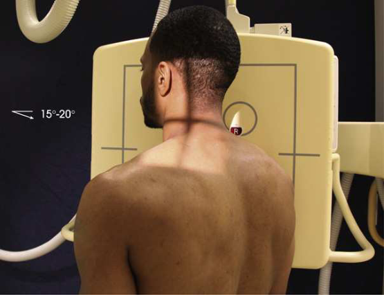
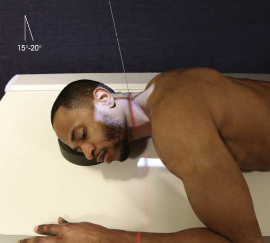

# Rx Găuri de Conjugare Cervicale (Foramene) — Oblică Axială PA — RAO și Oblică Anterioară Stângă (OAS / LAO) (Merrill)

  📷 Radiografie Convențională (Rx)
  <strong>Actualizat:</strong> 2026-09-16
  <strong>Autor:</strong> Referință Merrill

---

-   __1. Rezumat Clinic & Indicații__

    ---

    === "Indicații Clinice"

        - Conform reperelor anatomice standard din tratat

    === "Ghid Național IRIS"

        !!! info "Referință Primară: Ghidul Național IRIS (Ordinul MS 1342/2012)"
            - **Capitol Ghid IRIS:** *Ghidul Național IRIS*
            - **Grad de Recomandare:** **De verificat pe indicație; fără grad atribuit automat**
            - **Nivel de Iradiere Estimată:** `De verificat pentru examinarea și populația selectate`

            [:octicons-search-16: Deschide Ghidul IRIS](../../iris.md){ .md-button .md-button--primary } [:material-open-in-new: Aplicația Oficială PWA](https://radiologie-pediatrica.ro/iris/){ .md-button target="_blank" rel="noopener" }
-   __2. Poziționare & Centrare Fascicul__

    ---

    - **Poziție Pacient:** se poziționează pacientul în decubit ventral sau în ortostatism, cu spatele spre tubul de raze X. Pentru confortul pacientului și ajustarea precisă a regiunii, se preferă poziția în ortostatism sau șezândă cu trunchiul vertical.; Poziție oblică anterioară cu trunchiul vertical: Se instruiește pacientul să stea așezat sau în picioare, drept, cu brațele de-a lungul corpului și cu umărul sprijinit de dispozitivul cu grilă. se rotește întregul corp al pacientului la un unghi de 45 grade. se centrează coloana cervicală pe linia mediană a dispozitivului cu grilă (Fig. 9.52). Poziție oblică anterioară în decubit: se poziționează corpul pacientului la un unghi de 45 grade, cu coloana cervicală centrată pe linia mediană a grilei. Se instruiește pacientul să folosească antebrațul și genunchiul flectat de pe partea ridicată pentru a sprijini corpul și a menține poziția (Fig. 9.53 și 9.54). Se așază un suport adecvat sub capul pacientului pentru a poziționa axa longitudinală a coloanei cervicale paralel cu receptorul de imagine. Pentru a ține cont de angularea caudală a razei centrale, se centrează receptorul de imagine la nivelul C5 (1 țol [2.5 cm] caudal de punctul cel mai proeminent al cartilajului tiroid (mărul lui Adam)). se ajustează poziția capului pacientului astfel încât MSP să fie aliniat cu planul coloanei vertebrale. Se ridică și se proiectează anterior bărbia pacientului doar atât cât este necesar pentru a preveni suprapunerea mandibulei peste porțiunea superioară a coloanei cervicale. Întoarcerea bărbiei într-o parte determină rotația vertebrelor superioare și trebuie evitată. (Bărbia trebuie întoarsă ușor pentru poziția oblică anterioară în decubit.) se efectuează ecranarea gonadelor cu șorț plumbat.
    - **Punct de Centrare Fascicul:** orientată spre C4 la un unghi de 15 la 20 grade caudal, astfel încât să coincidă cu orientarea foramenelor.
    - **Distanță Focar-Film (DFF / SID):** Se recomandă o SID de 60 până la 72 inci (152 până la 183 cm), pentru a compensa OID crescută.
    - **Comandă Respiratorie:** apnee (oprirea respirației).

-   __3. Parametri Tehnici Expunere__

    ---

    | Parametru Tehnic | Valoare Configurare Generator / Tub |
    |:-----------------|:-------------------------------------|
    | **Tensiune Tub (kV)** | DE CONFIGURAT PE APARAT |
    | **Sarcină / Produs Curent-Timp (mAs)** | DE CONFIGURAT PE APARAT |
    | **Distanță Focar-Film (DFF / SID)** | Se recomandă o SID de 60 până la 72 inci (152 până la 183 cm), pentru a compensa OID crescută. |
    | **Grilă Antidifuzoare (Bucky)** | DE CONFIGURAT PE APARAT |
    | **Dimensiune Focar** | DE CONFIGURAT PE APARAT |
    | **Camere de Ionizare AEC** | DE CONFIGURAT PE APARAT |
    | **Colimare Fascicul** | Se ajustează câmpul de iradiere la 10 × 12 țoli (24 × 30 cm) la nivelul colimatorului. Se plasează markerul de lateralitate (D/S) în câmpul de expunere colimat. |
    | **Filtrare Tub** | DE CONFIGURAT PE APARAT |

-   __4. Criterii de Calitate & Reușită Imagine__

    ---

    - Criterii radiologice de calitate a imaginii:
    - Evidențierea colimării corecte și prezența markerului de lateralitate (D/S), plasat fără a se suprapune peste anatomia de interes
    - Toate cele șapte vertebre cervicale și prima vertebră toracală
    - Rotație corespunzătoare de 45 grade a corpului și gâtului
    - Foramenele intervertebrale cele mai apropiate de receptorul de imagine, deschise, de la C2–C3 la C7–T1
    - Dimensiuni și contur uniforme ale foramenelor
    - Bărbia ridicată corespunzător
    - Mandibula nu se suprapune peste atlas și axis
    - Osul occipital nu se suprapune peste atlas și axis
    - Spații discale intervertebrale deschise
    - Detalii trabeculare osoase și țesuturile moi înconjurătoare

-   __5. Protecție Radiologică (ALARA)__

    ---

    - Nespecificat în fragmentul extras; de verificat în sursă

!!! note "Observații Clinice & Tehnice"
    Conform reperelor anatomice standard din tratat

### 🖼️ Imagini

<figure class="protocol-image-card" markdown>

<figcaption><strong>Merrill — pagina 696, imaginea 1</strong> — Imagine din fragmentul sursă; asocierea necesită revizie.</figcaption>

</figure>

<figure class="protocol-image-card" markdown>

<figcaption><strong>Merrill — pagina 697, imaginea 2</strong> — Imagine din fragmentul sursă; asocierea necesită revizie.</figcaption>

</figure>

=== "Ghid Rapid de Execuție"

    1. **Identificarea și verificarea pacientului:** verificare identitate, zonă de examinat, consimțământ conform procedurii și evaluarea posibilității unei sarcini, când este relevantă.
    2. **Pregătire:** îndepărtarea oricăror obiecte radiopace (bijuterii, agrafe, fermoare, proteze, pansamente dense).
    3. **Poziționare precisă:** alinierea receptorului de imagine și a tubului la distanța prescrisă (Se recomandă o SID de 60 până la 72 inci (152 până la 183 cm), pentru a compensa OID crescută.).
    4. **Colimare strictă:** adaptarea fasciculului strict la regiunea de diagnostic pentru scăderea iradierii și reducerea radiației difuze.
    5. **Radioprotecție:** verificarea [politicii RX](../radioprotectie.md), cu măsuri distincte pentru pacient, personal și însoțitor.

## Surse de documentare

- [Merrill’s Atlas, 9. Vertebral Column, pagini 695–697](https://books.google.com/books/about/Merrill_s_Atlas_of_Radiographic_Position.html?id=BM0lEQAAQBAJ)

## Fragmente sursă traduse (referință tehnică)

### anatomie

foramenele intervertebrale și pediculii cei mai apropiați de receptorul de imagine și imaginea în incidență oblică a corpurilor vertebrale și a celorlalte părți ale coloanei cervicale (Fig.
9.55). (Consultați Sinteza incidențelor oblice, p. 440.)

### colimare

• Se ajustează câmpul de iradiere la 10 × 12 țoli (24 × 30 cm) la nivelul colimatorului. Se plasează markerul de lateralitate (D/S) în câmpul de expunere colimat.

### raza centrală

• orientată spre C4 la un unghi de 15 la 20 grade caudal, astfel încât să coincidă cu orientarea foramenelor.

### criterii

Criterii radiologice de calitate a imaginii:
• Colimare corectă și prezența markerului de lateralitate (D/S), plasat în afara anatomiei de interes
• Toate cele șapte vertebre cervicale și prima vertebră toracală
• Rotație corespunzătoare de 45 grade a corpului și gâtului
• Foramenele intervertebrale cele mai apropiate de receptorul de imagine, deschise, de la C2–C3 la C7–T1
• Dimensiuni și contur uniforme ale foramenelor
• Bărbia ridicată corespunzător
• Mandibula nu se suprapune peste atlas și axis
• Osul occipital nu se suprapune peste atlas și axis
• Spații discale intervertebrale deschise
• Detalii trabeculare osoase și țesuturile moi înconjurătoare

### part_pos

• Poziție oblică anterioară cu trunchiul vertical: Se instruiește pacientul să stea așezat sau în picioare, drept, cu brațele de-a lungul corpului și cu umărul sprijinit de dispozitivul
cu grilă. se rotește întregul corp al pacientului la un unghi de 45 grade. se centrează coloana cervicală pe linia mediană a dispozitivului cu grilă (Fig. 9.52).
• Poziție oblică anterioară în decubit: se poziționează corpul pacientului la un unghi de 45 grade, cu coloana cervicală centrată pe linia mediană a grilei. Se instruiește pacientul să folosească antebrațul și genunchiul flectat de pe partea ridicată pentru a sprijini corpul și a menține poziția (Fig. 9.53
și 9.54). Se așază un suport adecvat sub capul pacientului pentru a poziționa axa longitudinală a coloanei cervicale paralel cu receptorul de imagine.
• Pentru a ține cont de angularea caudală a razei centrale, se centrează receptorul de imagine la nivelul C5 (1 țol [2.5 cm] caudal de punctul cel mai
proeminent al cartilajului tiroid (mărul lui Adam)).
• se ajustează poziția capului pacientului astfel încât MSP să fie aliniat cu planul coloanei vertebrale.
• Se ridică și se proiectează anterior bărbia pacientului doar atât cât este necesar pentru a preveni suprapunerea mandibulei peste porțiunea superioară a coloanei cervicale.
Întoarcerea bărbiei într-o parte determină rotația vertebrelor superioare și trebuie evitată. (Bărbia trebuie întoarsă ușor pentru
poziția oblică anterioară în decubit.)
• se efectuează ecranarea gonadelor cu șorț plumbat.

### patient_pos

• se poziționează pacientul în decubit ventral sau în ortostatism, cu spatele spre tubul de raze X. Pentru confortul pacientului și ajustarea precisă a regiunii,
se preferă poziția în ortostatism sau așezat pe scaun cu trunchiul vertical.

### respirație

apnee (oprirea respirației).

### sid

Se recomandă un SID de 60 la 72 țoli (152 la 183 cm) pentru a compensa OID crescută.

### tehnică

Poziționat conform indicațiilor producătorului sau protocolului departamentului pentru orientarea corectă a afișării structurilor anatomice; placă pentru raza centrală: 10 × 12 țoli (24 ×
30 cm), longitudinal.

