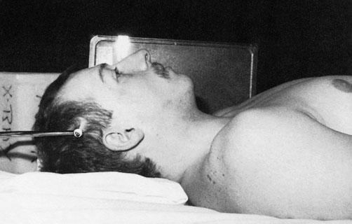
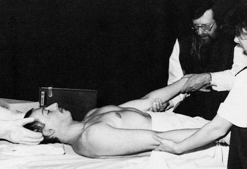
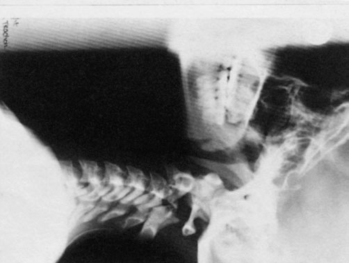
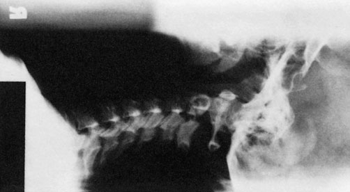

# Rx Coloană cervicală, incidență de profil, decubit dorsal

  📷 Radiografie Convențională (Rx)
  <strong>Actualizat:</strong> 2026-09-16
  <strong>Autor:</strong> Departamentul de Radiologie / Referință Clark (Ed. 12)

---

-   __1. Rezumat Clinic & Indicații__

    ---

    === "Indicații Clinice"

        - 361 12 Coloana cervicală. Pacientul cu suspiciune de fractură-luxație a coloanei vertebrale este îngrijit de obicei cu tracțiune craniană cu greutăți. Aceasta se aplică prin intermediul unei pense de tracțiune craniană fixate de tăblia externă a regiunilor parietale ale craniului. Greutățile necesare în etapele inițiale ale tracțiunii pot fi mai mari decât cele necesare pentru menținerea realinierii vertebrelor. Tracțiunea se continuă până la consolidare. Radiografiile în incidență de profil ale coloanei cervicale, efectuate pe parcursul mai multor săptămâni, sunt necesare pentru evaluarea eficacității tracțiunii și evidențiază alinierea vertebrelor în raport cu măduva spinării. Fiecare radiografie este marcată cu greutatea utilizată pentru tracțiunea aplicată. Incidență de profil în decubit dorsal

    === "Ghid Național IRIS"

        !!! info "Referință Primară: Ghidul Național IRIS (Ordinul MS 1342/2012)"
            - **Capitol Ghid IRIS:** *Coloană vertebrală & Traumatisme*
            - **Grad de Recomandare:** **Grad A**
            - **Nivel de Iradiere Estimată:** `Clasa 1 (Minimă < 0.2 mSv)`

            [:octicons-search-16: Deschide Ghidul IRIS](../../iris.md){ .md-button .md-button--primary } [:material-open-in-new: Aplicația Oficială PWA](https://radiologie-pediatrica.ro/iris/){ .md-button target="_blank" rel="noopener" }

-   __2. Poziționare & Centrare Fascicul__

    ---

    - **Poziție Pacient:**
        - aparatul mobil este poziționat astfel încât să permită radiografia cu fascicul orizontal.
        - cu pacientul în decubit dorsal, o casetă de 24 × 30 sau 18 × 24 cm este sprijinită vertical de oricare dintre umeri, paralel cu coloana cervicală și centrată la nivelul proeminenței cartilajului tiroid (mărul lui Adam).
        - caseta este fixată în poziție folosind un suport sau săculeți cu nisip.
        - umerii pacientului trebuie coborâți de către medicul care supraveghează, prin prinderea încheieturilor mâinilor pacientului și tragerea brațelor în sens caudal.
    - **Punct de Centrare Fascicul:** • raza centrală orizontală este orientată spre un punct situat vertical sub proeminența cartilajului tiroid (mărul lui Adam), la nivelul procesului mastoidian, traversând a patra vertebră cervicală.
    - **Distanță Focar-Film (DFF / SID):** 100 cm
    - **Comandă Respiratorie:** Apnee pe durata expunerii (apnee în inspir pentru torace; expir pentru Abdomen/bazin).

-   __3. Parametri Tehnici Expunere__

    ---

    | Parametru Tehnic | Valoare Configurare Generator / Tub |
    |:-----------------|:-------------------------------------|
    | **Tensiune Tub (kV)** | DE CONFIGURAT PE APARAT |
    | **Sarcină / Produs Curent-Timp (mAs)** | Conform AEC / grosimii anatomice |
    | **Distanță Focar-Film (DFF / SID)** | 100 cm |
    | **Grilă Antidifuzoare (Bucky)** | Conform grosimii anatomice (> 10-12 cm cu grilă) |
    | **Dimensiune Focar** | Focar Mic (0.6 mm) |
    | **Camere de Ionizare AEC** | DE CONFIGURAT PE APARAT |
    | **Colimare Fascicul** | Colimare strictă adaptată pe receptor 18 x 24 cm |
    | **Filtrare Tub** | Totală ≥ 2.5 mm Al echivalent (conform Clark: 3.0 mm Al echivalent) |

-   __4. Criterii de Calitate & Reușită Imagine__

    ---

    - Vizualizarea clară a întregii arii anatomice (coloana vertebrală cervicală).
    - Absența artefactelor de mișcare; trabeculație osoasă și contururi nete.
    - Densitate optică și contrast adecvate pentru diferențierea țesuturilor moi de structurile osoase.

-   __5. Protecție Radiologică (ALARA)__

    ---

    - Un paravan mobil de radioprotecție trebuie poziționat în spatele casetei pentru a limita câmpul radiației primare.
    - Persoana care aplică tracțiunea trebuie să fie supravegheată medical și să poarte un șorț și mănuși din cauciuc plumbat pentru protecție împotriva radiațiilor. 1 zi sub tracțiune 30 zile sub tracțiune
    - Ecranare gonadică cu șorț plumbat dacă gonadele sunt în apropierea fasciculului util (regula ALARA).
    - Colimare precisă la dimensiunea anatomică strict necesară pentru reducerea dozei și a radiației difuze.
    - Verificarea posibilității unei sarcini la pacientele de vârstă fertilă înainte de expunere.

!!! note "Observații Clinice & Tehnice"
    În radiografiile alăturate, o parte a craniului a fost inclusă pe filmul radiologic pentru a arăta locul în care pensa de tracțiune craniană este fixată de regiunile parietale.

### 🖼️ Imagini

<figure class="protocol-image-card" markdown>

<figcaption><strong>Pacientul cu suspiciune de fractură-luxație a coloanei vertebrale este de obicei îngrijit</strong> — Poziționarea pacientului și centrarea fasciculului conform Clark (Ed. 12)</figcaption>

</figure>

<figure class="protocol-image-card" markdown>

<figcaption><strong>Fiecare radiografie este marcată cu greutatea utilizată pentru tracțiunea aplicată.</strong> — Aspect radiografic / ghid de poziționare conform tratatului Clark (Ed. 12)</figcaption>

</figure>

<figure class="protocol-image-card" markdown>

<figcaption><strong>În radiografiile alăturate a fost inclusă o parte a craniului</strong> — Aspect radiografic / ghid de poziționare conform tratatului Clark (Ed. 12)</figcaption>

</figure>

<figure class="protocol-image-card" markdown>

<figcaption><strong>Figura 4: Aspect radiografic / Poziționare (Clark Ed. 12)</strong> — Aspect radiografic / ghid de poziționare conform tratatului Clark (Ed. 12)</figcaption>

</figure>

=== "Ghid Rapid de Execuție"

    1. **Identificarea și verificarea pacientului:** verificare identitate, zonă de examinat, consimțământ conform procedurii și evaluarea posibilității unei sarcini, când este relevantă.
    2. **Pregătire:** îndepărtarea oricăror obiecte radiopace (bijuterii, agrafe, fermoare, proteze, pansamente dense).
    3. **Poziționare precisă:** alinierea receptorului de imagine și a tubului la distanța prescrisă (100 cm).
    4. **Colimare strictă:** adaptarea fasciculului strict la regiunea de diagnostic pentru scăderea iradierii și reducerea radiației difuze.
    5. **Radioprotecție:** verificarea [politicii RX](../radioprotectie.md), cu măsuri distincte pentru pacient, personal și însoțitor.

## Surse de documentare

- [Clark's Positioning in Radiography (Ed. 12), Pagina 376](https://books.google.com/books/about/Clark_s_Positioning_in_Radiography.html?id=Xxu6MwEACAAJ)
