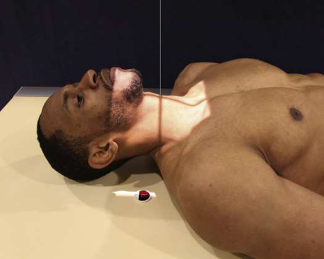
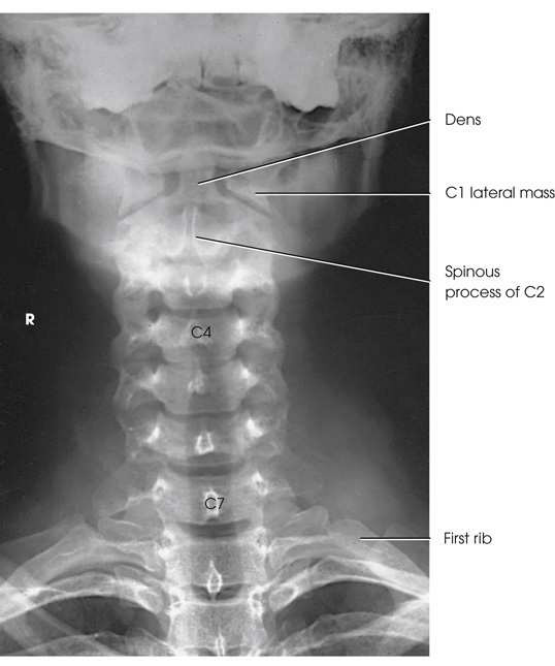

# Rx Coloană Cervicală — Incidență Antero-Posterioară (AP) — Ottonello Method (Merrill)

  📷 Radiografie Convențională (Rx)
  <strong>Actualizat:</strong> 2026-09-16
  <strong>Autor:</strong> Referință Merrill

---

-   __1. Rezumat Clinic & Indicații__

    ---

    === "Indicații Clinice"

        - Conform reperelor anatomice standard din tratat

    === "Ghid Național IRIS"

        !!! info "Referință Primară: Ghidul Național IRIS (Ordinul MS 1342/2012)"
            - **Capitol Ghid IRIS:** *Ghidul Național IRIS*
            - **Grad de Recomandare:** **De verificat pe indicație; fără grad atribuit automat**
            - **Nivel de Iradiere Estimată:** `De verificat pentru examinarea și populația selectate`

            [:octicons-search-16: Deschide Ghidul IRIS](../../iris.md){ .md-button .md-button--primary } [:material-open-in-new: Aplicația Oficială PWA](https://radiologie-pediatrica.ro/iris/){ .md-button target="_blank" rel="noopener" }
-   __2. Poziționare & Centrare Fascicul__

    ---

    - **Poziție Pacient:** se așază pacientul în Decubit dorsal poziție. Center MCP de corp la linia mediană grilă. se poziționează pacientul’s brațe along sides de corp și se ajustează umeri la lie în same plan orizontal. Place support under genunchii pentru pacientul’s comfort.; se ajustează pacient’s cap astfel încât MSP este aliniat cu lower corp și este perpendicular pe table. Elevate pacientul’s chin enough la place occlusal surface de upper incisors și mastoid tips în same plan vertical. Se imobilizează capul pacientului și Se instruiește pacientul să practice opening și closing mouth until Mandibulă poate fie moved smoothly fără striking teeth together (Fig. 9.56). Place receptorul de imagine în tăvița Bucky, și se centrează receptorul de imagine la nivelul C4. la blur Mandibulă, use expunere technique cu low milliamperage (mA) și long expunere time (minimum de 1 second). se efectuează ecranarea gonadelor cu șorț plumbat.
    - **Punct de Centrare Fascicul:** perpendicular la C4; raza centrală enters la most prominent point de cartilaj tiroid (mărul lui Adam).
    - **Distanță Focar-Film (DFF / SID):** Nespecificat în fragmentul extras; de verificat în sursă
    - **Comandă Respiratorie:** apnee (oprirea respirației).

-   __3. Parametri Tehnici Expunere__

    ---

    | Parametru Tehnic | Valoare Configurare Generator / Tub |
    |:-----------------|:-------------------------------------|
    | **Tensiune Tub (kV)** | DE CONFIGURAT PE APARAT |
    | **Sarcină / Produs Curent-Timp (mAs)** | DE CONFIGURAT PE APARAT |
    | **Distanță Focar-Film (DFF / SID)** | Nespecificat în fragmentul extras; de verificat în sursă |
    | **Grilă Antidifuzoare (Bucky)** | DE CONFIGURAT PE APARAT |
    | **Dimensiune Focar** | DE CONFIGURAT PE APARAT |
    | **Camere de Ionizare AEC** | DE CONFIGURAT PE APARAT |
    | **Colimare Fascicul** | Se ajustează câmpul de iradiere la formatul 24 × 30 cm pe colimator. Place marker de lateralitate (D/S) în collimated expunere field. |
    | **Filtrare Tub** | DE CONFIGURAT PE APARAT |

-   __4. Criterii de Calitate & Reușită Imagine__

    ---

    - Criterii radiologice de calitate imaginii:
    - Evidence de corect collimation și presence de marker de lateralitate (D/S) plasat clear de anatomy de interest
    - toate seven coloană cervicală
    - Blurred Mandibulă cu resultant visualization de underlying atlas și axis
    - Bony detalii trabeculare osoase și surrounding soft tissues

-   __5. Protecție Radiologică (ALARA)__

    ---

    - Nespecificat în fragmentul extras; de verificat în sursă

!!! note "Observații Clinice & Tehnice"
    Conform reperelor anatomice standard din tratat

### 🖼️ Imagini

<figure class="protocol-image-card" markdown>

<figcaption><strong>Merrill — pagina PDF 699, imaginea 1</strong> — Imagine din fragmentul sursă; asocierea necesită revizie.</figcaption>

</figure>

<figure class="protocol-image-card" markdown>

<figcaption><strong>Merrill — pagina PDF 700, imaginea 2</strong> — Imagine din fragmentul sursă; asocierea necesită revizie.</figcaption>

</figure>

=== "Ghid Rapid de Execuție"

    1. **Identificarea și verificarea pacientului:** verificare identitate, zonă de examinat, consimțământ conform procedurii și evaluarea posibilității unei sarcini, când este relevantă.
    2. **Pregătire:** îndepărtarea oricăror obiecte radiopace (bijuterii, agrafe, fermoare, proteze, pansamente dense).
    3. **Poziționare precisă:** alinierea receptorului de imagine și a tubului la distanța prescrisă (Nespecificat în fragmentul extras; de verificat în sursă).
    4. **Colimare strictă:** adaptarea fasciculului strict la regiunea de diagnostic pentru scăderea iradierii și reducerea radiației difuze.
    5. **Radioprotecție:** verificarea [politicii RX](../radioprotectie.md), cu măsuri distincte pentru pacient, personal și însoțitor.

## Surse de documentare

- [Merrill’s Atlas, 9. Vertebral Column, pagini PDF 698–700](../../assets/protocols/sources/a56d45c16829_Merrills_Atlas_of_Radiographic_Positioning__Procedures_3Vol_Set.pdf#page=698)

## Fragmente sursă traduse (referință tehnică)

### anatomy

entire cervical coloană vertebrală, cu mandible blurred sau obliterated (Figs. 9.57 și 9.58).

### collimation

• Se ajustează câmpul de iradiere la formatul 24 × 30 cm pe colimator. Place marker de lateralitate (D/S) în collimated expunere field.

### cr

• perpendicular la C4; raza centrală enters la most prominent point de cartilaj tiroid (mărul lui Adam).

### criteria

Criterii radiologice de calitate imaginii:
• Evidence de corect collimation și presence de marker de lateralitate (D/S) plasat clear de anatomy de interest
• toate seven coloană cervicală
• Blurred mandible cu resultant visualization de underlying atlas și axis
• Bony detalii trabeculare osoase și surrounding soft tissues

### part_pos

• se ajustează pacient’s cap astfel încât MSP este aliniat cu lower corp și este perpendicular pe table.
• Elevate pacientul’s chin enough la place occlusal surface de upper incisors și mastoid tips în same plan vertical.
• Se imobilizează capul pacientului și Se instruiește pacientul să practice opening și closing mouth until mandible poate fie moved smoothly fără
striking teeth together (Fig. 9.56).
• Place receptorul de imagine în tăvița Bucky, și se centrează receptorul de imagine la nivelul C4.
• la blur mandible, use expunere technique cu low milliamperage (mA) și long expunere time (minimum de 1 second).
• se efectuează ecranarea gonadelor cu șorț plumbat.

### patient_pos

• se așază pacientul în decubit dorsal.
• Center MCP de corp la linia mediană grilă.
• se poziționează pacientul’s brațe along sides de corp și se ajustează umeri la lie în same plan orizontal.
• Place support under genunchii pentru pacientul’s comfort.

### respiration

apnee (oprirea respirației).

### tech

poziționat prin manufacturer sau department protocol pentru corect anatomy display orientation; raza centrală plate: 10 × 12 inches (24
× 30 cm) longitudinal.

