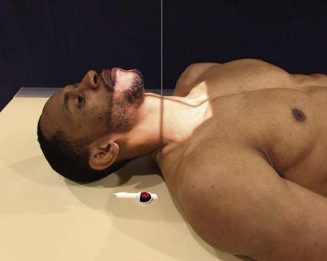
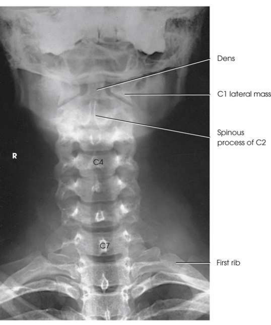

# Rx Coloană Cervicală — Incidență Antero-Posterioară (AP) — Metoda Ottonello (Merrill)

  📷 Radiografie Convențională (Rx)
  <strong>Actualizat:</strong> 2026-09-16
  <strong>Autor:</strong> Referință Merrill

---

-   __1. Rezumat Clinic & Indicații__

    ---

    === "Indicații Clinice"

        - Conform reperelor anatomice standard din tratat

    === "Ghid Național IRIS"

        !!! info "Referință Primară: Ghidul Național IRIS (Ordinul MS 1342/2012)"
            - **Capitol Ghid IRIS:** *Ghidul Național IRIS*
            - **Grad de Recomandare:** **De verificat pe indicație; fără grad atribuit automat**
            - **Nivel de Iradiere Estimată:** `De verificat pentru examinarea și populația selectate`

            [:octicons-search-16: Deschide Ghidul IRIS](../../iris.md){ .md-button .md-button--primary } [:material-open-in-new: Aplicația Oficială PWA](https://radiologie-pediatrica.ro/iris/){ .md-button target="_blank" rel="noopener" }
-   __2. Poziționare & Centrare Fascicul__

    ---

    - **Poziție Pacient:** Se așază pacientul în decubit dorsal. Se centrează MCP al corpului pe linia mediană a grilei. Se poziționează brațele pacientului de-a lungul corpului și se ajustează umerii astfel încât să se afle în același plan orizontal. Se așază un suport sub genunchi pentru confortul pacientului.; Se ajustează capul pacientului astfel încât MSP să fie aliniat cu partea inferioară a corpului și să fie perpendicular pe masă. Se ridică bărbia pacientului suficient pentru a aduce suprafața ocluzală a incisivilor superiori și vârfurile mastoidelor în același plan vertical. Se imobilizează capul pacientului și se instruiește pacientul să exerseze deschiderea și închiderea gurii până când mandibula poate fi mișcată lin, fără ca dinții să se lovească între ei (Fig. 9.56). Se așază receptorul de imagine în tăvița Bucky și se centrează la nivelul C4. Pentru a estompa imaginea mandibulei, se utilizează o tehnică de expunere cu intensitate mică a curentului (mA) și timp lung de expunere (minimum 1 secundă). Se efectuează ecranarea gonadelor cu șorț plumbat.
    - **Punct de Centrare Fascicul:** Perpendiculară la nivelul C4; raza centrală pătrunde la nivelul punctului cel mai proeminent al cartilajului tiroid (mărul lui Adam).
    - **Distanță Focar-Film (DFF / SID):** Nespecificat în fragmentul extras; de verificat în sursă
    - **Comandă Respiratorie:** apnee (oprirea respirației).

-   __3. Parametri Tehnici Expunere__

    ---

    | Parametru Tehnic | Valoare Configurare Generator / Tub |
    |:-----------------|:-------------------------------------|
    | **Tensiune Tub (kV)** | DE CONFIGURAT PE APARAT |
    | **Sarcină / Produs Curent-Timp (mAs)** | DE CONFIGURAT PE APARAT |
    | **Distanță Focar-Film (DFF / SID)** | Nespecificat în fragmentul extras; de verificat în sursă |
    | **Grilă Antidifuzoare (Bucky)** | DE CONFIGURAT PE APARAT |
    | **Dimensiune Focar** | DE CONFIGURAT PE APARAT |
    | **Camere de Ionizare AEC** | DE CONFIGURAT PE APARAT |
    | **Colimare Fascicul** | Se ajustează câmpul de iradiere la formatul 24 × 30 cm pe colimator. Se plasează markerul de lateralitate (D/S) în câmpul de expunere colimat. |
    | **Filtrare Tub** | DE CONFIGURAT PE APARAT |

-   __4. Criterii de Calitate & Reușită Imagine__

    ---

    - Criterii radiologice de calitate a imaginii:
    - Evidențierea colimării corecte și prezența markerului de lateralitate (D/S), plasat fără a se suprapune peste anatomia de interes
    - Toate cele șapte vertebre cervicale
    - Imaginea estompată a mandibulei, care permite vizualizarea atlasului și axisului subiacente
    - Detalii trabeculare osoase și țesuturile moi înconjurătoare

-   __5. Protecție Radiologică (ALARA)__

    ---

    - Nespecificat în fragmentul extras; de verificat în sursă

!!! note "Observații Clinice & Tehnice"
    Conform reperelor anatomice standard din tratat

### 🖼️ Imagini

<figure class="protocol-image-card" markdown>

<figcaption><strong>Merrill — pagina 699, imaginea 1</strong> — Imagine din fragmentul sursă; asocierea necesită revizie.</figcaption>

</figure>

<figure class="protocol-image-card" markdown>

<figcaption><strong>Merrill — pagina 700, imaginea 2</strong> — Imagine din fragmentul sursă; asocierea necesită revizie.</figcaption>

</figure>

=== "Ghid Rapid de Execuție"

    1. **Identificarea și verificarea pacientului:** verificare identitate, zonă de examinat, consimțământ conform procedurii și evaluarea posibilității unei sarcini, când este relevantă.
    2. **Pregătire:** îndepărtarea oricăror obiecte radiopace (bijuterii, agrafe, fermoare, proteze, pansamente dense).
    3. **Poziționare precisă:** alinierea receptorului de imagine și a tubului la distanța prescrisă (Nespecificat în fragmentul extras; de verificat în sursă).
    4. **Colimare strictă:** adaptarea fasciculului strict la regiunea de diagnostic pentru scăderea iradierii și reducerea radiației difuze.
    5. **Radioprotecție:** verificarea [politicii RX](../radioprotectie.md), cu măsuri distincte pentru pacient, personal și însoțitor.

## Surse de documentare

- [Merrill’s Atlas, 9. Vertebral Column, pagini 698–700](https://books.google.com/books/about/Merrill_s_Atlas_of_Radiographic_Position.html?id=BM0lEQAAQBAJ)

## Fragmente sursă traduse (referință tehnică)

### anatomie

Întreaga coloană vertebrală cervicală, cu imaginea mandibulei estompată sau ștearsă (Fig. 9.57 și 9.58).

### colimare

• Se ajustează câmpul de iradiere la formatul 24 × 30 cm pe colimator. Se plasează markerul de lateralitate (D/S) în câmpul de expunere colimat.

### raza centrală

• Perpendiculară la nivelul C4; raza centrală pătrunde la nivelul punctului cel mai proeminent al cartilajului tiroid (mărul lui Adam).

### criterii

Criterii radiologice de calitate a imaginii:
• Colimare corectă și prezența markerului de lateralitate (D/S), plasat fără a se suprapune peste anatomia de interes
• Toate cele șapte vertebre cervicale
• Imaginea estompată a mandibulei, care permite vizualizarea atlasului și axisului subiacente
• Detalii trabeculare osoase și țesuturile moi înconjurătoare

### part_pos

• Se ajustează capul pacientului astfel încât MSP să fie aliniat cu partea inferioară a corpului și să fie perpendicular pe masă.
• Se ridică bărbia pacientului suficient pentru a aduce suprafața ocluzală a incisivilor superiori și vârfurile mastoidelor în același plan vertical.
• Se imobilizează capul pacientului și se instruiește pacientul să exerseze deschiderea și închiderea gurii până când mandibula poate fi mișcată lin, fără
ca dinții să se lovească între ei (Fig. 9.56).
• Se așază receptorul de imagine în tăvița Bucky și se centrează la nivelul C4.
• Pentru a estompa imaginea mandibulei, se utilizează o tehnică de expunere cu intensitate mică a curentului (mA) și timp lung de expunere (minimum 1 secundă).
• Se efectuează ecranarea gonadelor cu șorț plumbat.

### patient_pos

• se așază pacientul în decubit dorsal.
• Se centrează MCP al corpului pe linia mediană a grilei.
• Se poziționează brațele pacientului de-a lungul corpului și se ajustează umerii astfel încât să se afle în același plan orizontal.
• Se așază un suport sub genunchi pentru confortul pacientului.

### respirație

apnee (oprirea respirației).

### tehnică

poziționat conform indicațiilor producătorului sau protocolului departamentului pentru orientarea corectă a afișării anatomiei; placa razei centrale: 10 × 12 țoli (24
× 30 cm), longitudinal.

