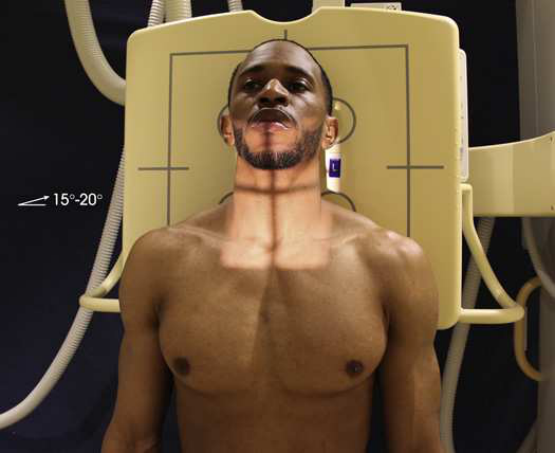
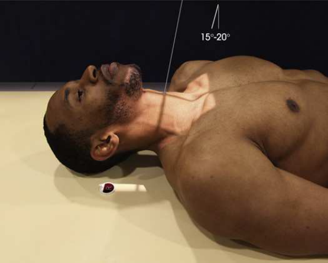
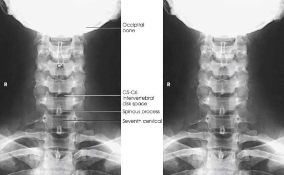

# Rx Coloană Cervicală — Incidență AP Axială (Merrill)

  📷 Radiografie Convențională (Rx)
  <strong>Actualizat:</strong> 2026-09-16
  <strong>Autor:</strong> Referință Merrill

---

-   __1. Rezumat Clinic & Indicații__

    ---

    === "Indicații Clinice"

        - Conform reperelor anatomice standard din tratat

    === "Ghid Național IRIS"

        !!! info "Referință Primară: Ghidul Național IRIS (Ordinul MS 1342/2012)"
            - **Capitol Ghid IRIS:** *Ghidul Național IRIS*
            - **Grad de Recomandare:** **De verificat pe indicație; fără grad atribuit automat**
            - **Nivel de Iradiere Estimată:** `De verificat pentru examinarea și populația selectate`

            [:octicons-search-16: Deschide Ghidul IRIS](../../iris.md){ .md-button .md-button--primary } [:material-open-in-new: Aplicația Oficială PWA](https://radiologie-pediatrica.ro/iris/){ .md-button target="_blank" rel="noopener" }
-   __2. Poziționare & Centrare Fascicul__

    ---

    - **Poziție Pacient:** se așază pacientul în Decubit dorsal sau ortostatism cu back pe / sprijinit de receptorul de imagine holder. se ajustează pacient’s umeri la lie în same plan orizontal la prevent rotație.; se centrează MSP de pacientul’s corp la linia mediană mesei sau stativ vertical Bucky. se extinde chin enough astfel încât plan ocluzal este perpendicular pe tabletop. This prevents superimposition de Mandibulă și midcervical vertebre (Figs. 9.39 și 9.40). se centrează receptorul de imagine la nivelul C4. se ajustează cap astfel încât MSP este în straight alignment și perpendicular pe receptorul de imagine (RI). Provide support pentru capul de orice pacient who has pronounced lordotic curvature. This support helps compensate pentru curvature și reduces imagine distortion. se efectuează ecranarea gonadelor cu șorț plumbat.
    - **Punct de Centrare Fascicul:** orientat through C4 la un unghi de 15 la 20 grade cranial. raza centrală enters la sau slightly inferior la most prominent point de cartilaj tiroid (mărul lui Adam), commonly called “Adam’s apple.”
    - **Distanță Focar-Film (DFF / SID):** Nespecificat în fragmentul extras; de verificat în sursă
    - **Comandă Respiratorie:** apnee (oprirea respirației).

-   __3. Parametri Tehnici Expunere__

    ---

    | Parametru Tehnic | Valoare Configurare Generator / Tub |
    |:-----------------|:-------------------------------------|
    | **Tensiune Tub (kV)** | DE CONFIGURAT PE APARAT |
    | **Sarcină / Produs Curent-Timp (mAs)** | DE CONFIGURAT PE APARAT |
    | **Distanță Focar-Film (DFF / SID)** | Nespecificat în fragmentul extras; de verificat în sursă |
    | **Grilă Antidifuzoare (Bucky)** | DE CONFIGURAT PE APARAT |
    | **Dimensiune Focar** | DE CONFIGURAT PE APARAT |
    | **Camere de Ionizare AEC** | DE CONFIGURAT PE APARAT |
    | **Colimare Fascicul** | Adjust câmp de iradiere la 10 inches (25 cm) longitudinal și 1 inch (2.5 cm) beyond skin shadow pe sides. Place marker de lateralitate (D/S) în collimated expunere field. |
    | **Filtrare Tub** | DE CONFIGURAT PE APARAT |

-   __4. Criterii de Calitate & Reușită Imagine__

    ---

    - Criterii radiologice de calitate imaginii:
    - Evidence de corect collimation și presence de marker de lateralitate (D/S) plasat clear de anatomy de interest
    - Area de la superior portion de C3 la T2 și surrounding părți moi
    - Shadows de Mandibulă și occiput superimposed over atlas și most de axis
    - Open intervertebral disk spaces
    - MSP de capul și neck perpendicular pe plane de receptorul de imagine, fără tilt sau rotație
    - procese spinoase echidistant față de pedicles și aliniat cu linia mediană cervical corpuri
    - Mandibular angles și mastoid processes echidistant față de vertebre
    - Bony detalii trabeculare osoase și surrounding soft tissues

-   __5. Protecție Radiologică (ALARA)__

    ---

    - Nespecificat în fragmentul extras; de verificat în sursă

!!! note "Observații Clinice & Tehnice"
    Conform reperelor anatomice standard din tratat

### 🖼️ Imagini

<figure class="protocol-image-card" markdown>

<figcaption><strong>Merrill — pagina PDF 683, imaginea 1</strong> — Imagine din fragmentul sursă; asocierea necesită revizie.</figcaption>

</figure>

<figure class="protocol-image-card" markdown>

<figcaption><strong>Merrill — pagina PDF 684, imaginea 2</strong> — Imagine din fragmentul sursă; asocierea necesită revizie.</figcaption>

</figure>

<figure class="protocol-image-card" markdown>

<figcaption><strong>Merrill — pagina PDF 685, imaginea 3</strong> — Imagine din fragmentul sursă; asocierea necesită revizie.</figcaption>

</figure>

=== "Ghid Rapid de Execuție"

    1. **Identificarea și verificarea pacientului:** verificare identitate, zonă de examinat, consimțământ conform procedurii și evaluarea posibilității unei sarcini, când este relevantă.
    2. **Pregătire:** îndepărtarea oricăror obiecte radiopace (bijuterii, agrafe, fermoare, proteze, pansamente dense).
    3. **Poziționare precisă:** alinierea receptorului de imagine și a tubului la distanța prescrisă (Nespecificat în fragmentul extras; de verificat în sursă).
    4. **Colimare strictă:** adaptarea fasciculului strict la regiunea de diagnostic pentru scăderea iradierii și reducerea radiației difuze.
    5. **Radioprotecție:** verificarea [politicii RX](../radioprotectie.md), cu măsuri distincte pentru pacient, personal și însoțitor.

## Surse de documentare

- [Merrill’s Atlas, 9. Vertebral Column, pagini PDF 682–685](../../assets/protocols/sources/a56d45c16829_Merrills_Atlas_of_Radiographic_Positioning__Procedures_3Vol_Set.pdf#page=682)

## Fragmente sursă traduse (referință tehnică)

### anatomy

lower five cervical corpuri și upper two sau three thoracic corpuri, interpediculate spaces, superimposed transverse și articular
processes, și intervertebral disk spaces (Fig. 9.41). This incidență este also used la show presence sau absence de cervical coaste.

### collimation

• Adjust câmp de iradiere la 10 inches (25 cm) longitudinal și 1 inch (2.5 cm) beyond skin shadow pe sides. Place marker de lateralitate (D/S) în
collimated expunere field.

### cr

• orientat through C4 la un unghi de 15 la 20 grade cranial. raza centrală enters la sau slightly inferior la most prominent point
de cartilaj tiroid (mărul lui Adam), commonly called “Adam’s apple.”

### criteria

Criterii radiologice de calitate imaginii:
• Evidence de corect collimation și presence de marker de lateralitate (D/S) plasat clear de anatomy de interest
• Area de la superior portion de C3 la T2 și surrounding părți moi
• Shadows de mandible și occiput superimposed over atlas și most de axis
• Open intervertebral disk spaces
• MSP de capul și neck perpendicular pe plane de receptorul de imagine, fără tilt sau rotație
• procese spinoase echidistant față de pedicles și aliniat cu linia mediană cervical corpuri
• Mandibular angles și mastoid processes echidistant față de vertebre
• Bony detalii trabeculare osoase și surrounding soft tissues

### part_pos

• se centrează MSP de pacientul’s corp la linia mediană mesei sau stativ vertical Bucky.
• se extinde chin enough astfel încât plan ocluzal este perpendicular pe tabletop. This prevents superimposition de mandible și
midcervical vertebre (Figs. 9.39 și 9.40).
• se centrează receptorul de imagine la nivelul C4.
• se ajustează cap astfel încât MSP este în straight alignment și perpendicular pe receptorul de imagine (RI).
• Provide support pentru capul de orice pacient who has pronounced lordotic curvature. This support helps compensate pentru curvature
și reduces imagine distortion.
• se efectuează ecranarea gonadelor cu șorț plumbat.

### patient_pos

• se așază pacientul în decubit dorsal sau ortostatism cu back pe / sprijinit de receptorul de imagine holder.
• se ajustează pacient’s umeri la lie în same plan orizontal la prevent rotație.

### respiration

apnee (oprirea respirației).

### tech

poziționat prin manufacturer sau department protocol pentru corect anatomy display orientation; raza centrală plate: 10 × 12 inches (24 ×
30 cm) longitudinal.

