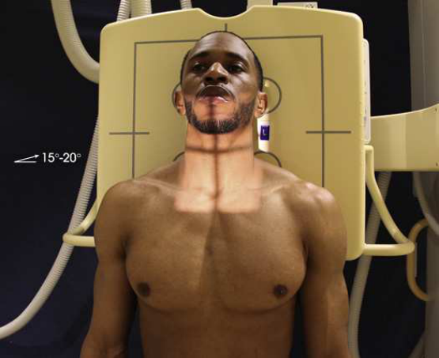
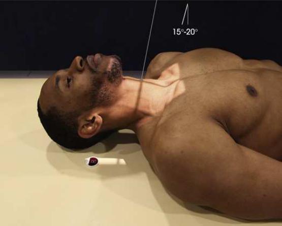
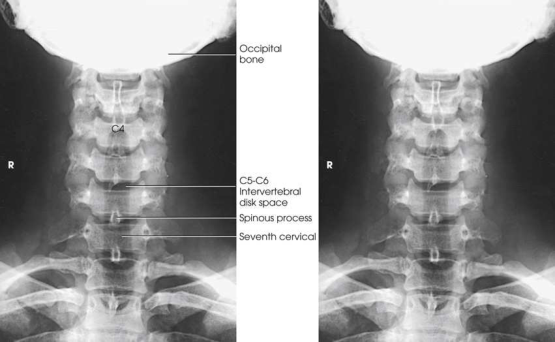

# Rx Coloană Cervicală — Incidență AP Axială (Merrill)

  📷 Radiografie Convențională (Rx)
  <strong>Actualizat:</strong> 2026-09-16
  <strong>Autor:</strong> Referință Merrill

---

-   __1. Rezumat Clinic & Indicații__

    ---

    === "Indicații Clinice"

        - Conform reperelor anatomice standard din tratat

    === "Ghid Național IRIS"

        !!! info "Referință Primară: Ghidul Național IRIS (Ordinul MS 1342/2012)"
            - **Capitol Ghid IRIS:** *Coloană vertebrală & Traumatisme*
            - **Grad de Recomandare:** **Grad A**
            - **Nivel de Iradiere Estimată:** `Clasa 1 (Minimă < 0.2 mSv)`

            [:octicons-search-16: Deschide Ghidul IRIS](../../iris.md){ .md-button .md-button--primary } [:material-open-in-new: Aplicația Oficială PWA](https://radiologie-pediatrica.ro/iris/){ .md-button target="_blank" rel="noopener" }

-   __2. Poziționare & Centrare Fascicul__

    ---

    - **Poziție Pacient:** Se așază pacientul în decubit dorsal sau în ortostatism, cu spatele pe / sprijinit de suportul receptorului de imagine. Se ajustează umerii pacientului astfel încât să se afle în același plan orizontal pentru a preveni rotația.; Se centrează MSP al corpului pacientului pe linia mediană a mesei sau a stativului vertical Bucky. Se ridică bărbia suficient astfel încât planul ocluzal să fie perpendicular pe blatul mesei. Aceasta previne suprapunerea mandibulei peste vertebrele cervicale mijlocii (Fig. 9.39 și 9.40). Se centrează receptorul de imagine la nivelul C4. Se ajustează capul astfel încât MSP să fie aliniat drept și perpendicular pe receptorul de imagine (RI). Se asigură un suport pentru capul oricărui pacient care prezintă o curbură lordotică pronunțată. Acest suport ajută la compensarea curburii și reduce distorsiunea imaginii. Se efectuează ecranarea gonadelor cu șorț plumbat.
    - **Punct de Centrare Fascicul:** Orientată prin C4 la un unghi de 15 la 20 grade cranial. Raza centrală pătrunde la nivelul sau ușor inferior de punctul cel mai proeminent al cartilajului tiroid (mărul lui Adam), numit în mod obișnuit „mărul lui Adam”.
    - **Distanță Focar-Film (DFF / SID):** Nespecificat în fragmentul extras; de verificat în sursă
    - **Comandă Respiratorie:** apnee (oprirea respirației).

-   __3. Parametri Tehnici Expunere__

    ---

    | Parametru Tehnic | Valoare Configurare Generator / Tub |
    |:-----------------|:-------------------------------------|
    | **Tensiune Tub (kV)** | DE CONFIGURAT PE APARAT |
    | **Sarcină / Produs Curent-Timp (mAs)** | DE CONFIGURAT PE APARAT |
    | **Distanță Focar-Film (DFF / SID)** | Nespecificat în fragmentul extras; de verificat în sursă |
    | **Grilă Antidifuzoare (Bucky)** | DE CONFIGURAT PE APARAT |
    | **Dimensiune Focar** | DE CONFIGURAT PE APARAT |
    | **Camere de Ionizare AEC** | DE CONFIGURAT PE APARAT |
    | **Colimare Fascicul** | Se ajustează câmpul de iradiere la 10 țoli (25 cm) longitudinal și la 1 țol (2.5 cm) dincolo de conturul cutanat pe laturi. Se plasează markerul de lateralitate (D/S) în câmpul de expunere colimat. |
    | **Filtrare Tub** | DE CONFIGURAT PE APARAT |

-   __4. Criterii de Calitate & Reușită Imagine__

    ---

    - Criterii radiologice de calitate a imaginii:
    - Evidențierea colimării corecte și prezența markerului de lateralitate (D/S), plasat fără a se suprapune peste anatomia de interes
    - Regiunea de la porțiunea superioară a C3 până la T2 și părțile moi înconjurătoare
    - Umbrele mandibulei și occiputului suprapuse peste atlas și cea mai mare parte a axisului
    - Spații discale intervertebrale deschise
    - MSP al capului și gâtului perpendicular pe planul receptorului de imagine, fără înclinare sau rotație
    - Procesele spinoase echidistante față de pediculi și aliniate cu linia mediană a corpurilor vertebrale cervicale
    - Unghiurile mandibulare și procesele mastoide echidistante față de vertebre
    - Detalii trabeculare osoase și țesuturile moi înconjurătoare

-   __5. Protecție Radiologică (ALARA)__

    ---

    - Nespecificat în fragmentul extras; de verificat în sursă

!!! note "Observații Clinice & Tehnice"
    Conform reperelor anatomice standard din tratat

### 🖼️ Imagini

<figure class="protocol-image-card" markdown>

<figcaption><strong>Merrill — pagina 683, imaginea 1</strong> — Imagine din fragmentul sursă; asocierea necesită revizie.</figcaption>

</figure>

<figure class="protocol-image-card" markdown>

<figcaption><strong>Merrill — pagina 684, imaginea 2</strong> — Imagine din fragmentul sursă; asocierea necesită revizie.</figcaption>

</figure>

<figure class="protocol-image-card" markdown>

<figcaption><strong>Merrill — pagina 685, imaginea 3</strong> — Imagine din fragmentul sursă; asocierea necesită revizie.</figcaption>

</figure>

=== "Ghid Rapid de Execuție"

    1. **Identificarea și verificarea pacientului:** verificare identitate, zonă de examinat, consimțământ conform procedurii și evaluarea posibilității unei sarcini, când este relevantă.
    2. **Pregătire:** îndepărtarea oricăror obiecte radiopace (bijuterii, agrafe, fermoare, proteze, pansamente dense).
    3. **Poziționare precisă:** alinierea receptorului de imagine și a tubului la distanța prescrisă (Nespecificat în fragmentul extras; de verificat în sursă).
    4. **Colimare strictă:** adaptarea fasciculului strict la regiunea de diagnostic pentru scăderea iradierii și reducerea radiației difuze.
    5. **Radioprotecție:** verificarea [politicii RX](../radioprotectie.md), cu măsuri distincte pentru pacient, personal și însoțitor.

## Surse de documentare

- [Merrill’s Atlas, 9. Vertebral Column, pagini 682–685](https://books.google.com/books/about/Merrill_s_Atlas_of_Radiographic_Position.html?id=BM0lEQAAQBAJ)
