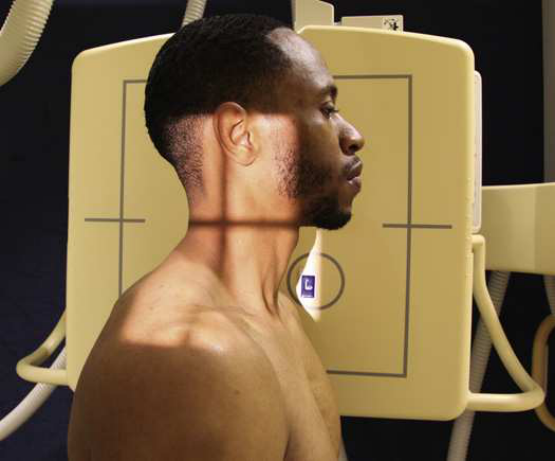
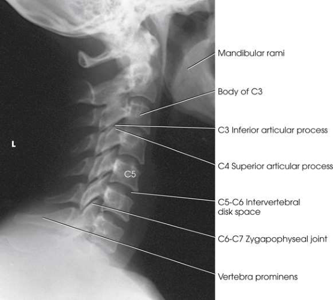
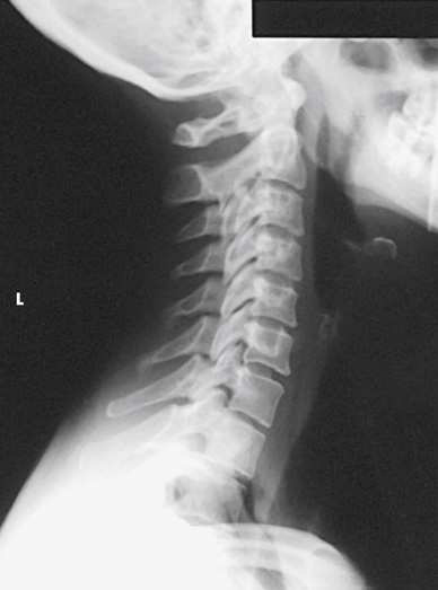

# Rx Coloană Cervicală — Incidență de Profil (Lateral) — Grandy Method 4 Profil (Drept sau Stâng) (Merrill)

  📷 Radiografie Convențională (Rx)
  <strong>Actualizat:</strong> 2026-09-16
  <strong>Autor:</strong> Referință Merrill

---

-   __1. Rezumat Clinic & Indicații__

    ---

    === "Indicații Clinice"

        - Conform reperelor anatomice standard din tratat

    === "Ghid Național IRIS"

        !!! info "Referință Primară: Ghidul Național IRIS (Ordinul MS 1342/2012)"
            - **Capitol Ghid IRIS:** *Ghidul Național IRIS*
            - **Grad de Recomandare:** **De verificat pe indicație; fără grad atribuit automat**
            - **Nivel de Iradiere Estimată:** `De verificat pentru examinarea și populația selectate`

            [:octicons-search-16: Deschide Ghidul IRIS](../../iris.md){ .md-button .md-button--primary } [:material-open-in-new: Aplicația Oficială PWA](https://radiologie-pediatrica.ro/iris/){ .md-button target="_blank" rel="noopener" }
-   __2. Poziționare & Centrare Fascicul__

    ---

    - **Poziție Pacient:** se așază pacientul în true Incidență de Profil (lateral), either Poziție Șezândă sau în ortostatism, before stativ vertical Bucky. axa longitudinală de coloană cervicală trebuie să fie paralel cu plane de receptorul de imagine. Se instruiește pacientul să sit sau stand straight then se ajustează height de receptorul de imagine so that it este centrat la nivelul level de C4. top de receptorul de imagine este about 1 inch (2.5 cm) above conduct auditiv extern (CAE) (conduct auditiv extern (CAE)).; se centrează plan coronal that passes through mastoid tips la linia mediană receptorul de imagine. Move pacientul close enough la stativ vertical Bucky la permit adjacent Umăr la rest pe / sprijinit de device pentru support (Fig. 9.42). (This incidență poate fie performed using grilă.) se rotește umeri anteriorly sau posteriorly according la natural kyphosis de back: If pacientul este round-shouldered, se rotește umeri anteriorly; otherwise, rotate them posteriorly. se ajustează umeri la lie în same plan orizontal, depress them ca much ca possible, și immobilize them prin attaching one small săculeți cu nisip la fiecare wris̍. săculeți cu nisip trebuie să fie de equal weight. fie careful la ensure that pacientul does nu elevate Umăr. Elevate bărbia slightly, sau Se instruiește pacientul să protrude Mandibulă la prevent superimposition de ramuri mandibulare și coloană vertebrală. la same time și cu MSP de capul vertical, Se instruiește pacientul să look steadily la one spot pe perete; this helps maintain poziție de capul. se efectuează ecranarea gonadelor cu șorț plumbat.
    - **Punct de Centrare Fascicul:** orizontal și perpendicular la C4. cu such centering, magnified outline de Umăr ̌ arthest de la receptorul de imagine este projected below lower coloană cervicală.
    - **Distanță Focar-Film (DFF / SID):** A 60- to 72-inch (152- to 183-cm) SID is recommended to compensate for the increased OID. A longer distance helps show C7.
    - **Comandă Respiratorie:** Apnee la sfârșitul expirului profund complet (diafragm ridicat) la obtain maximum depression de umerii.

-   __3. Parametri Tehnici Expunere__

    ---

    | Parametru Tehnic | Valoare Configurare Generator / Tub |
    |:-----------------|:-------------------------------------|
    | **Tensiune Tub (kV)** | DE CONFIGURAT PE APARAT |
    | **Sarcină / Produs Curent-Timp (mAs)** | DE CONFIGURAT PE APARAT |
    | **Distanță Focar-Film (DFF / SID)** | A 60- to 72-inch (152- to 183-cm) SID is recommended to compensate for the increased OID. A longer distance helps show C7. |
    | **Grilă Antidifuzoare (Bucky)** | DE CONFIGURAT PE APARAT |
    | **Dimensiune Focar** | DE CONFIGURAT PE APARAT |
    | **Camere de Ionizare AEC** | DE CONFIGURAT PE APARAT |
    | **Colimare Fascicul** | Se ajustează câmpul de iradiere la formatul 24 × 30 cm pe colimator. Place marker de lateralitate (D/S) în collimated expunere field. |
    | **Filtrare Tub** | DE CONFIGURAT PE APARAT |

-   __4. Criterii de Calitate & Reușită Imagine__

    ---

    - Criterii radiologice de calitate imaginii:
    - Evidence de corect collimation și presence de marker de lateralitate (D/S) plasat clear de anatomy de interest
    - toate seven coloană cervicală și la least one-third de T1 (otherwise separate radiografie de cervicothoracic region este recommended)
    - C4 în center de radiografie
    - Neck extins so that ramuri mandibulare sunt nu overlapping atlas sau axis
    - Absența rotației anatomice (simetrie bilaterală perfectă) sau tilt de Coloană Cervicală
    - Superimposed zygapophyseal articulații și open intervertebral disk spaces
    - Superimposed sau nearly superimposed rami de Mandibulă
    - procese spinoase vizualizat în profile
    - Bony detalii trabeculare osoase și surrounding soft tissues

-   __5. Protecție Radiologică (ALARA)__

    ---

    - Nespecificat în fragmentul extras; de verificat în sursă

!!! note "Observații Clinice & Tehnice"
    If Coloană Cervicală Traumatism / Regim Urgență este suspected, this incidență trebuie să fie performed first și “cleared” prin radiologist before additional imagini sunt performed. Refer la Chapter 12 în Volume 2 pentru details related la performing this incidență pe pacienți cu suspected Coloană Cervicală Traumatism / Regim Urgență.

### 🖼️ Imagini

<figure class="protocol-image-card" markdown>

<figcaption><strong>Merrill — pagina PDF 686, imaginea 1</strong> — Imagine din fragmentul sursă; asocierea necesită revizie.</figcaption>

</figure>

<figure class="protocol-image-card" markdown>

<figcaption><strong>Merrill — pagina PDF 687, imaginea 2</strong> — Imagine din fragmentul sursă; asocierea necesită revizie.</figcaption>

</figure>

<figure class="protocol-image-card" markdown>

<figcaption><strong>Merrill — pagina PDF 688, imaginea 3</strong> — Imagine din fragmentul sursă; asocierea necesită revizie.</figcaption>

</figure>

=== "Ghid Rapid de Execuție"

    1. **Identificarea și verificarea pacientului:** verificare identitate, zonă de examinat, consimțământ conform procedurii și evaluarea posibilității unei sarcini, când este relevantă.
    2. **Pregătire:** îndepărtarea oricăror obiecte radiopace (bijuterii, agrafe, fermoare, proteze, pansamente dense).
    3. **Poziționare precisă:** alinierea receptorului de imagine și a tubului la distanța prescrisă (A 60- to 72-inch (152- to 183-cm) SID is recommended to compensate for the increased OID. A longer distance helps show C7.).
    4. **Colimare strictă:** adaptarea fasciculului strict la regiunea de diagnostic pentru scăderea iradierii și reducerea radiației difuze.
    5. **Radioprotecție:** verificarea [politicii RX](../radioprotectie.md), cu măsuri distincte pentru pacient, personal și însoțitor.

## Surse de documentare

- [Merrill’s Atlas, 9. Vertebral Column, pagini PDF 685–688](../../assets/protocols/sources/a56d45c16829_Merrills_Atlas_of_Radiographic_Positioning__Procedures_3Vol_Set.pdf#page=685)

## Fragmente sursă traduse (referință tehnică)

### anatomy

cervical corpuri și their intervertebral disk spaces, articular pillars, lower five zygapophyseal articulații, și procese spinoase (Figs.
9.43 și 9.44). Depending pe how well umerii poate fie coborât, good lateral incidență trebuie să include C7; sometimes T1 și T2 poate also
fie seen.

### collimation

• Se ajustează câmpul de iradiere la formatul 24 × 30 cm pe colimator. Place marker de lateralitate (D/S) în collimated expunere field.

### cr

• orizontal și perpendicular la C4. cu such centering, magnified outline de umăr ̌ arthest de la receptorul de imagine este projected below
lower coloană cervicală.

### criteria

Criterii radiologice de calitate imaginii:
• Evidence de corect collimation și presence de marker de lateralitate (D/S) plasat clear de anatomy de interest
• toate seven coloană cervicală și la least one-third de T1 (otherwise separate radiografie de cervicothoracic region este
recommended)
• C4 în center de radiografie
• Neck extins so that ramuri mandibulare sunt nu overlapping atlas sau axis
• Absența rotației anatomice (simetrie bilaterală perfectă) sau tilt de cervical coloană vertebrală
• Superimposed zygapophyseal articulații și open intervertebral disk spaces
• Superimposed sau nearly superimposed rami de mandible
• procese spinoase vizualizat în profile
• Bony detalii trabeculare osoase și surrounding soft tissues

### notes

If cervical coloană vertebrală trauma este suspected, this incidență trebuie să fie performed first și “cleared” prin radiologist before additional imagini
sunt performed. Refer la Chapter 12 în Volume 2 pentru details related la performing this incidență pe pacienți cu suspected cervical coloană vertebrală trauma.

### part_pos

• se centrează plan coronal that passes through mastoid tips la linia mediană receptorul de imagine.
• Move pacientul close enough la stativ vertical Bucky la permit adjacent umăr la rest pe / sprijinit de device pentru support (Fig.
9.42). (This incidență poate fie performed using grilă.)
• se rotește umeri anteriorly sau posteriorly according la natural kyphosis de back: If pacientul este round-shouldered, rotate
umerii anteriorly; otherwise, rotate them posteriorly.
• se ajustează umeri la lie în same plan orizontal, depress them ca much ca possible, și immobilize them prin attaching one small
săculeți cu nisip la fiecare wris̍. săculeți cu nisip trebuie să fie de equal weight.
• fie careful la ensure that pacientul does nu elevate umăr.
• Elevate bărbia slightly, sau Se instruiește pacientul să protrude mandible la prevent superimposition de ramuri mandibulare și coloană vertebrală.
la same time și cu MSP de capul vertical, Se instruiește pacientul să look steadily la one spot pe perete; this helps maintain
poziție de capul.
• se efectuează ecranarea gonadelor cu șorț plumbat.

### patient_pos

• se așază pacientul în true poziție de profil (lateral), either așezat pe scaun sau în ortostatism, before stativ vertical Bucky. axa longitudinală de coloană cervicală
trebuie să fie paralel cu plane de receptorul de imagine.
• Se instruiește pacientul să sit sau stand straight then se ajustează height de receptorul de imagine so that it este centrat la nivelul level de C4. top de receptorul de imagine este about
1 inch (2.5 cm) above conduct auditiv extern (CAE) (conduct auditiv extern (CAE)).

### respiration

Apnee la sfârșitul expirului profund complet (diafragm ridicat) la obtain maximum depression de umerii.

### sid

A 60- la 72-inch (152- la 183-cm) SID este recommended la compensate pentru increased OID. longer distance helps show C7.

### tech

poziționat prin manufacturer sau department protocol pentru corect anatomy display orientation; raza centrală plate: 10 × 12 inches (24 ×
30 cm) longitudinal.

