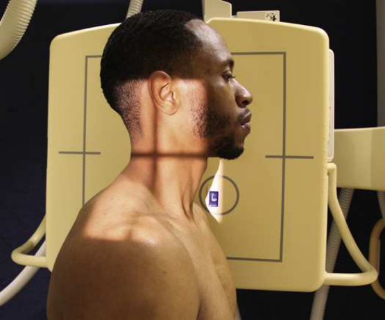
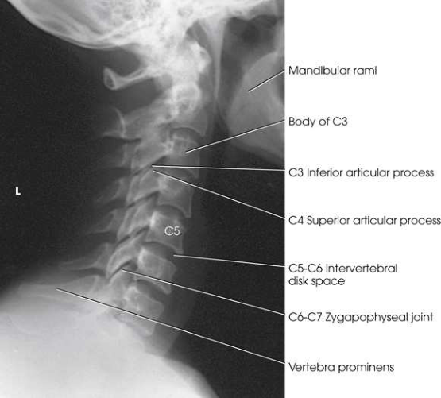
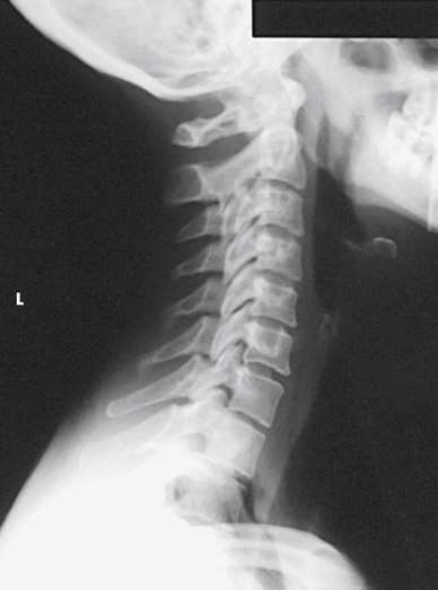

# Rx Coloană Cervicală — Incidență de Profil (Lateral) — Metoda Grandy 4 Profil (Drept sau Stâng) (Merrill)

  📷 Radiografie Convențională (Rx)
  <strong>Actualizat:</strong> 2026-09-16
  <strong>Autor:</strong> Referință Merrill

---

-   __1. Rezumat Clinic & Indicații__

    ---

    === "Indicații Clinice"

        - Conform reperelor anatomice standard din tratat

    === "Ghid Național IRIS"

        !!! info "Referință Primară: Ghidul Național IRIS (Ordinul MS 1342/2012)"
            - **Capitol Ghid IRIS:** *Ghidul Național IRIS*
            - **Grad de Recomandare:** **De verificat pe indicație; fără grad atribuit automat**
            - **Nivel de Iradiere Estimată:** `De verificat pentru examinarea și populația selectate`

            [:octicons-search-16: Deschide Ghidul IRIS](../../iris.md){ .md-button .md-button--primary } [:material-open-in-new: Aplicația Oficială PWA](https://radiologie-pediatrica.ro/iris/){ .md-button target="_blank" rel="noopener" }
-   __2. Poziționare & Centrare Fascicul__

    ---

    - **Poziție Pacient:** Se așază pacientul în poziție de profil strict, fie șezând, fie în ortostatism, în fața stativului vertical Bucky. Axa longitudinală a coloanei cervicale trebuie să fie paralelă cu planul receptorului de imagine. Se instruiește pacientul să stea drept, șezând sau în picioare, apoi se ajustează înălțimea receptorului de imagine astfel încât acesta să fie centrat la nivelul C4. Marginea superioară a receptorului de imagine se află la aproximativ 1 țol (2.5 cm) deasupra conductului auditiv extern (CAE).; Se centrează planul coronal care trece prin vârfurile mastoidelor pe linia mediană a receptorului de imagine. Se apropie pacientul suficient de stativul vertical Bucky pentru a permite umărului adiacent să se sprijine pe dispozitiv (Fig. 9.42). (Această incidență poate fi efectuată utilizând o grilă.) Se rotesc umerii anterior sau posterior în funcție de cifoza naturală a spatelui: dacă pacientul are umerii aduși înainte, se rotesc umerii anterior; în caz contrar, se rotesc posterior. Se ajustează umerii astfel încât să se afle în același plan orizontal, se coboară cât mai mult posibil și se imobilizează prin atașarea unui săculeț mic cu nisip la fiecare încheietură a mâinii. Săculeții cu nisip trebuie să aibă greutăți egale. Se verifică atent ca pacientul să nu ridice umărul. Se ridică ușor bărbia sau se instruiește pacientul să protruzioneze mandibula pentru a preveni suprapunerea ramurilor mandibulare peste coloana vertebrală. În același timp, cu MSP al capului vertical, se instruiește pacientul să privească fix un punct de pe perete; aceasta ajută la menținerea poziției capului. Se efectuează ecranarea gonadelor cu șorț plumbat.
    - **Punct de Centrare Fascicul:** Orizontală și perpendiculară la nivelul C4. Prin această centrare, conturul mărit al umărului cel mai îndepărtat de receptorul de imagine se proiectează sub porțiunea inferioară a coloanei cervicale.
    - **Distanță Focar-Film (DFF / SID):** Se recomandă o SID de 60 până la 72 inci (152 până la 183 cm), pentru a compensa OID crescută. O distanță mai mare facilitează vizualizarea vertebrei C7.
    - **Comandă Respiratorie:** Apnee la sfârșitul expirului profund complet (diafragm ridicat) pentru a obține coborârea maximă a umerilor.

-   __3. Parametri Tehnici Expunere__

    ---

    | Parametru Tehnic | Valoare Configurare Generator / Tub |
    |:-----------------|:-------------------------------------|
    | **Tensiune Tub (kV)** | DE CONFIGURAT PE APARAT |
    | **Sarcină / Produs Curent-Timp (mAs)** | DE CONFIGURAT PE APARAT |
    | **Distanță Focar-Film (DFF / SID)** | Se recomandă o SID de 60 până la 72 inci (152 până la 183 cm), pentru a compensa OID crescută. O distanță mai mare facilitează vizualizarea vertebrei C7. |
    | **Grilă Antidifuzoare (Bucky)** | DE CONFIGURAT PE APARAT |
    | **Dimensiune Focar** | DE CONFIGURAT PE APARAT |
    | **Camere de Ionizare AEC** | DE CONFIGURAT PE APARAT |
    | **Colimare Fascicul** | Se ajustează câmpul de iradiere la formatul 24 × 30 cm pe colimator. Se plasează markerul de lateralitate (D/S) în câmpul de expunere colimat. |
    | **Filtrare Tub** | DE CONFIGURAT PE APARAT |

-   __4. Criterii de Calitate & Reușită Imagine__

    ---

    - Criterii radiologice de calitate a imaginii:
    - Evidențierea colimării corecte și prezența markerului de lateralitate (D/S), plasat fără a se suprapune peste anatomia de interes
    - Toate cele șapte vertebre cervicale și cel puțin o treime din T1 (în caz contrar, se recomandă o radiografie separată a regiunii cervicotoracice)
    - C4 în centrul radiografiei
    - Gâtul în extensie, astfel încât ramurile mandibulare să nu se suprapună peste atlas sau axis
    - Absența rotației anatomice (simetrie bilaterală perfectă) sau a înclinării coloanei cervicale
    - Articulații zigapofizare suprapuse și spații discale intervertebrale deschise
    - Ramurile mandibulei suprapuse sau aproape suprapuse
    - Procesele spinoase vizualizate din profil
    - Detalii trabeculare osoase și țesuturile moi înconjurătoare

-   __5. Protecție Radiologică (ALARA)__

    ---

    - Nespecificat în fragmentul extras; de verificat în sursă

!!! note "Observații Clinice & Tehnice"
    Dacă se suspectează un traumatism al coloanei cervicale / o situație de urgență, această incidență trebuie efectuată prima și validată de medicul radiolog înainte de realizarea unor imagini suplimentare. Consultați Capitolul 12 din Volumul 2 pentru detalii privind realizarea acestei incidențe la pacienții cu suspiciune de traumatism al coloanei cervicale / în regim de urgență.

### 🖼️ Imagini

<figure class="protocol-image-card" markdown>

<figcaption><strong>Merrill — pagina 686, imaginea 1</strong> — Imagine din fragmentul sursă; asocierea necesită revizie.</figcaption>

</figure>

<figure class="protocol-image-card" markdown>

<figcaption><strong>Merrill — pagina 687, imaginea 2</strong> — Imagine din fragmentul sursă; asocierea necesită revizie.</figcaption>

</figure>

<figure class="protocol-image-card" markdown>

<figcaption><strong>Merrill — pagina 688, imaginea 3</strong> — Imagine din fragmentul sursă; asocierea necesită revizie.</figcaption>

</figure>

=== "Ghid Rapid de Execuție"

    1. **Identificarea și verificarea pacientului:** verificare identitate, zonă de examinat, consimțământ conform procedurii și evaluarea posibilității unei sarcini, când este relevantă.
    2. **Pregătire:** îndepărtarea oricăror obiecte radiopace (bijuterii, agrafe, fermoare, proteze, pansamente dense).
    3. **Poziționare precisă:** alinierea receptorului de imagine și a tubului la distanța prescrisă (Se recomandă o SID de 60 până la 72 inci (152 până la 183 cm), pentru a compensa OID crescută. O distanță mai mare facilitează vizualizarea vertebrei C7.).
    4. **Colimare strictă:** adaptarea fasciculului strict la regiunea de diagnostic pentru scăderea iradierii și reducerea radiației difuze.
    5. **Radioprotecție:** verificarea [politicii RX](../radioprotectie.md), cu măsuri distincte pentru pacient, personal și însoțitor.

## Surse de documentare

- [Merrill’s Atlas, 9. Vertebral Column, pagini 685–688](https://books.google.com/books/about/Merrill_s_Atlas_of_Radiographic_Position.html?id=BM0lEQAAQBAJ)

## Fragmente sursă traduse (referință tehnică)

### anatomie

Corpurile vertebrale cervicale și spațiile lor discale intervertebrale, pilierii articulari, cele cinci articulații zigapofizare inferioare și procesele spinoase (Fig.
9.43 și 9.44). În funcție de cât de mult pot fi coborâți umerii, o incidență de profil de bună calitate trebuie să includă C7; uneori pot fi vizualizate și T1 și T2.

### colimare

• Se ajustează câmpul de iradiere la formatul 24 × 30 cm pe colimator. Se plasează markerul de lateralitate (D/S) în câmpul de expunere colimat.

### raza centrală

• Orizontală și perpendiculară la nivelul C4. Prin această centrare, conturul mărit al umărului cel mai îndepărtat de receptorul de imagine se proiectează sub
porțiunea inferioară a coloanei cervicale.

### criterii

Criterii radiologice de calitate a imaginii:
• Colimare corectă și prezența markerului de lateralitate (D/S), plasat fără a se suprapune peste anatomia de interes
• Toate cele șapte vertebre cervicale și cel puțin o treime din T1 (în caz contrar, se recomandă o radiografie separată a regiunii cervicotoracice)
• C4 în centrul radiografiei
• Gâtul în extensie, astfel încât ramurile mandibulare să nu se suprapună peste atlas sau axis
• Absența rotației anatomice (simetrie bilaterală perfectă) sau a înclinării coloanei vertebrale cervicale
• Articulații zigapofizare suprapuse și spații discale intervertebrale deschise
• Ramurile mandibulei suprapuse sau aproape suprapuse
• Procesele spinoase vizualizate din profil
• Detalii trabeculare osoase și țesuturile moi înconjurătoare

### note

Dacă se suspectează un traumatism al coloanei vertebrale cervicale, această incidență trebuie efectuată prima și validată de medicul radiolog înainte de realizarea unor imagini
suplimentare. Consultați Capitolul 12 din Volumul 2 pentru detalii privind realizarea acestei incidențe la pacienții cu suspiciune de traumatism al coloanei vertebrale cervicale.

### part_pos

• Se centrează planul coronal care trece prin vârfurile mastoidelor pe linia mediană a receptorului de imagine.
• Se apropie pacientul suficient de stativul vertical Bucky pentru a permite sprijinirea umărului adiacent de dispozitiv (Fig.
9.42). (Această incidență poate fi realizată folosind grila.)
• Se rotesc umerii anterior sau posterior, în funcție de cifoza naturală a spatelui: dacă pacientul are umerii aduși înainte, se rotesc
umerii anterior; în caz contrar, se rotesc posterior.
• Se poziționează umerii în același plan orizontal, se coboară cât mai mult posibil și se imobilizează prin atașarea unui săculeț mic
cu nisip la fiecare încheietură a mâinii. Săculeții cu nisip trebuie să aibă aceeași greutate.
• Se acordă atenție pentru a se asigura că pacientul nu ridică umărul.
• Se ridică ușor bărbia sau se instruiește pacientul să protruzioneze mandibula pentru a preveni suprapunerea ramurilor mandibulare peste coloana vertebrală.
În același timp, cu MSP al capului vertical, se instruiește pacientul să privească fix un punct de pe perete; acest lucru ajută la menținerea
poziției capului.
• se efectuează ecranarea gonadelor cu șorț plumbat.

### patient_pos

• Se așază pacientul în poziție de profil strict, fie așezat pe scaun, fie în ortostatism, în fața stativului vertical Bucky. Axa longitudinală a coloanei cervicale
trebuie să fie paralelă cu planul receptorului de imagine.
• Se instruiește pacientul să stea drept, așezat sau în picioare, apoi se ajustează înălțimea receptorului de imagine astfel încât acesta să fie centrat la nivelul C4. Marginea superioară a receptorului de imagine se află la aproximativ
1 inch (2.5 cm) deasupra conductului auditiv extern (CAE).

### respirație

Apnee la sfârșitul expirului profund complet (diafragm ridicat) pentru a obține coborârea maximă a umerilor.

### sid

Se recomandă o SID de 60–72 inch (152–183 cm) pentru a compensa OID crescută. Distanța mai mare ajută la vizualizarea C7.

### tehnică

Poziționat conform indicațiilor producătorului sau protocolului departamentului pentru orientarea corectă a afișării structurilor anatomice; placă pentru raza centrală: 10 × 12 țoli (24 ×
30 cm), longitudinal.

