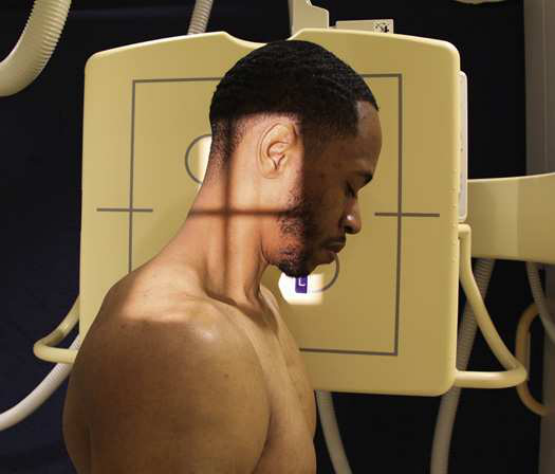
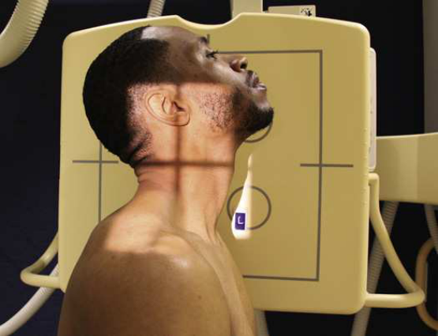
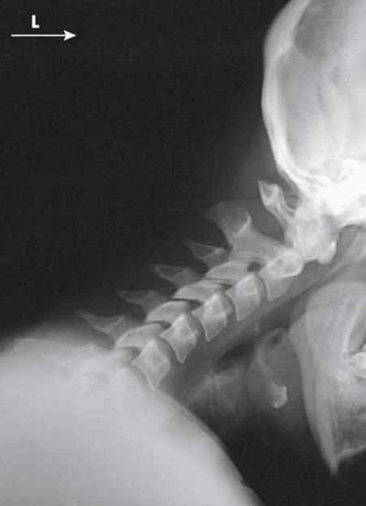

# Rx Coloană Cervicală — Incidență de Profil (Lateral) — Profil (Drept sau Stâng) Flexion and extension (Merrill)

  📷 Radiografie Convențională (Rx)
  <strong>Actualizat:</strong> 2026-09-16
  <strong>Autor:</strong> Referință Merrill

---

-   __1. Rezumat Clinic & Indicații__

    ---

    === "Indicații Clinice"

        - Conform reperelor anatomice standard din tratat

    === "Ghid Național IRIS"

        !!! info "Referință Primară: Ghidul Național IRIS (Ordinul MS 1342/2012)"
            - **Capitol Ghid IRIS:** *Ghidul Național IRIS*
            - **Grad de Recomandare:** **De verificat pe indicație; fără grad atribuit automat**
            - **Nivel de Iradiere Estimată:** `De verificat pentru examinarea și populația selectate`

            [:octicons-search-16: Deschide Ghidul IRIS](../../iris.md){ .md-button .md-button--primary } [:material-open-in-new: Aplicația Oficială PWA](https://radiologie-pediatrica.ro/iris/){ .md-button target="_blank" rel="noopener" }
-   __2. Poziționare & Centrare Fascicul__

    ---

    - **Poziție Pacient:** se așază pacientul în true Incidență de Profil (lateral), either Poziție Șezândă sau în ortostatism, before stativ vertical Bucky. Se instruiește pacientul să sit sau stand straight, then se ajustează height de receptorul de imagine so that it este centrat la nivelul level de C4. top de receptorul de imagine este about 2 inches (5 cm) above conduct auditiv extern (CAE).; Move pacientul close enough la stativ vertical Bucky la permit adjacent Umăr la rest pe / sprijinit de grilă pentru support. Keep MSP de pacientul’s cap și neck paralel cu plane de receptorul de imagine. Alternatively, perform incidență fără using grilă. Flexion Se instruiește pacientul să drop capul forward și then draw bărbia ca close ca possible la Torace, astfel încât coloană cervicală sunt plasat în poziție de maximum flexion pentru first expunere (Fig. 9.45). Extension Se instruiește pacientul să elevate bărbia ca much ca possible, astfel încât coloană cervicală sunt plasat în poziție de maximum extension pentru second expunere (Fig. 9.46). se efectuează ecranarea gonadelor cu șorț plumbat.
    - **Punct de Centrare Fascicul:** orizontal și perpendicular la C4
    - **Distanță Focar-Film (DFF / SID):** A 60- to 72-inch (152- to 183-cm) SID is recommended to compensate for the increased OID. A longer distance helps show C7.
    - **Comandă Respiratorie:** apnee (oprirea respirației).

-   __3. Parametri Tehnici Expunere__

    ---

    | Parametru Tehnic | Valoare Configurare Generator / Tub |
    |:-----------------|:-------------------------------------|
    | **Tensiune Tub (kV)** | DE CONFIGURAT PE APARAT |
    | **Sarcină / Produs Curent-Timp (mAs)** | DE CONFIGURAT PE APARAT |
    | **Distanță Focar-Film (DFF / SID)** | A 60- to 72-inch (152- to 183-cm) SID is recommended to compensate for the increased OID. A longer distance helps show C7. |
    | **Grilă Antidifuzoare (Bucky)** | DE CONFIGURAT PE APARAT |
    | **Dimensiune Focar** | DE CONFIGURAT PE APARAT |
    | **Camere de Ionizare AEC** | DE CONFIGURAT PE APARAT |
    | **Colimare Fascicul** | Se ajustează câmpul de iradiere la formatul 24 × 30 cm pe colimator. pentru flexion, light trebuie să extend de la EAC anteriorly la C7 spinous process posteriorly. pentru extension, light trebuie să extend de la midmandible anteriorly la C7 spinous process posteriorly. Place marker de lateralitate (D/S) în collimated expunere field. |
    | **Filtrare Tub** | DE CONFIGURAT PE APARAT |

-   __4. Criterii de Calitate & Reușită Imagine__

    ---

    - Criterii radiologice de calitate imaginii:
    - Evidence de corect collimation și presence de marker de lateralitate (D/S) plasat clear de anatomy de interest
    - toate seven coloană cervicală în true Incidență de Profil (lateral)
    - Absența rotației anatomice (simetrie bilaterală perfectă) sau tilt de Coloană Cervicală
    - Superimposed zygapophyseal articulații și open intervertebral disk spaces
    - Superimposed sau nearly superimposed rami de Mandibulă
    - procese spinoase vizualizat în profile
    - Bony detalii trabeculare osoase și surrounding soft tissues Flexion
    - corp de Mandibulă almost vertical în normal pacient
    - toate seven procese spinoase în profile, ridicat și widely separated Extension
    - corp de Mandibulă almost orizontal în normal pacient
    - toate seven procese spinoase în profile, coborât și closely spaced

-   __5. Protecție Radiologică (ALARA)__

    ---

    - Nespecificat în fragmentul extras; de verificat în sursă

!!! note "Observații Clinice & Tehnice"
    This procedure trebuie să nu fie attempted until Coloană Cervicală pathology sau suspiciune de fractură has been ruled out. Functional studies de coloană cervicală în Incidență de Profil (lateral) sunt performed la show normal intersegmental movement sau changes în intersegmental alignment resulting de la Traumatism / Regim Urgență sau disease. procese spinoase sunt ridicat și widely separated în flexion poziție și sunt coborât în close approximation în extension poziție. radiologist evaluates posterior aspect de vertebral corpuri pentru intersegmental alignment.

### 🖼️ Imagini

<figure class="protocol-image-card" markdown>

<figcaption><strong>Merrill — pagina PDF 689, imaginea 1</strong> — Imagine din fragmentul sursă; asocierea necesită revizie.</figcaption>

</figure>

<figure class="protocol-image-card" markdown>

<figcaption><strong>Merrill — pagina PDF 690, imaginea 2</strong> — Imagine din fragmentul sursă; asocierea necesită revizie.</figcaption>

</figure>

<figure class="protocol-image-card" markdown>

<figcaption><strong>Merrill — pagina PDF 691, imaginea 3</strong> — Imagine din fragmentul sursă; asocierea necesită revizie.</figcaption>

</figure>

=== "Ghid Rapid de Execuție"

    1. **Identificarea și verificarea pacientului:** verificare identitate, zonă de examinat, consimțământ conform procedurii și evaluarea posibilității unei sarcini, când este relevantă.
    2. **Pregătire:** îndepărtarea oricăror obiecte radiopace (bijuterii, agrafe, fermoare, proteze, pansamente dense).
    3. **Poziționare precisă:** alinierea receptorului de imagine și a tubului la distanța prescrisă (A 60- to 72-inch (152- to 183-cm) SID is recommended to compensate for the increased OID. A longer distance helps show C7.).
    4. **Colimare strictă:** adaptarea fasciculului strict la regiunea de diagnostic pentru scăderea iradierii și reducerea radiației difuze.
    5. **Radioprotecție:** verificarea [politicii RX](../radioprotectie.md), cu măsuri distincte pentru pacient, personal și însoțitor.

## Surse de documentare

- [Merrill’s Atlas, 9. Vertebral Column, pagini PDF 688–691](../../assets/protocols/sources/a56d45c16829_Merrills_Atlas_of_Radiographic_Positioning__Procedures_3Vol_Set.pdf#page=688)

## Fragmente sursă traduse (referință tehnică)

### anatomy

Intersegmental alignment de cervical coloană vertebrală when flectat (Fig. 9.47) și extins (Fig. 9.48). intervertebral disks și zygapophyseal
articulații sunt also vizualizat.

### collimation

• Se ajustează câmpul de iradiere la formatul 24 × 30 cm pe colimator. pentru flexion, light trebuie să extend de la EAC anteriorly la C7
spinous process posteriorly. pentru extension, light trebuie să extend de la midmandible anteriorly la C7 spinous process posteriorly. Place
marker de lateralitate (D/S) în collimated expunere field.

### cr

• orizontal și perpendicular la C4

### criteria

Criterii radiologice de calitate imaginii:
• Evidence de corect collimation și presence de marker de lateralitate (D/S) plasat clear de anatomy de interest
• toate seven coloană cervicală în true poziție de profil (lateral)
• Absența rotației anatomice (simetrie bilaterală perfectă) sau tilt de cervical coloană vertebrală
• Superimposed zygapophyseal articulații și open intervertebral disk spaces
• Superimposed sau nearly superimposed rami de mandible
• procese spinoase vizualizat în profile
• Bony detalii trabeculare osoase și surrounding soft tissues
Flexion
• corp de mandible almost vertical în normal pacient
• toate seven procese spinoase în profile, ridicat și widely separated
Extension
• corp de mandible almost orizontal în normal pacient
• toate seven procese spinoase în profile, coborât și closely spaced

### notes

This procedure trebuie să nu fie attempted until cervical coloană vertebrală pathology sau suspiciune de fractură has been ruled out.
Functional studies de coloană cervicală în poziție de profil (lateral) sunt performed la show normal intersegmental movement sau changes în
intersegmental alignment resulting de la trauma sau disease. procese spinoase sunt ridicat și widely separated în flexion poziție și
sunt coborât în close approximation în extension poziție.
radiologist evaluates posterior aspect de vertebral corpuri pentru intersegmental alignment.

### part_pos

• Move pacientul close enough la stativ vertical Bucky la permit adjacent umăr la rest pe / sprijinit de grilă pentru support.
• Keep MSP de pacientul’s cap și neck paralel cu plane de receptorul de imagine.
• Alternatively, perform incidență fără using grilă.
Flexion
• Se instruiește pacientul să drop capul forward și then draw bărbia ca close ca possible la toracele, astfel încât coloană cervicală sunt
plasat în poziție de maximum flexion pentru first expunere (Fig. 9.45).
Extension
• Se instruiește pacientul să elevate bărbia ca much ca possible, astfel încât coloană cervicală sunt plasat în poziție de maximum extension pentru
second expunere (Fig. 9.46).
• se efectuează ecranarea gonadelor cu șorț plumbat.

### patient_pos

• se așază pacientul în true poziție de profil (lateral), either așezat pe scaun sau în ortostatism, before stativ vertical Bucky.
• Se instruiește pacientul să sit sau stand straight, then se ajustează height de receptorul de imagine so that it este centrat la nivelul level de C4. top de receptorul de imagine este about
2 inches (5 cm) above conduct auditiv extern (CAE).

### respiration

apnee (oprirea respirației).

### sid

A 60- la 72-inch (152- la 183-cm) SID este recommended la compensate pentru increased OID. longer distance helps show C7.

### tech

poziționat prin manufacturer sau department protocol pentru corect anatomy display orientation; raza centrală plate: 10 × 12 inches (24
× 30 cm) longitudinal.

