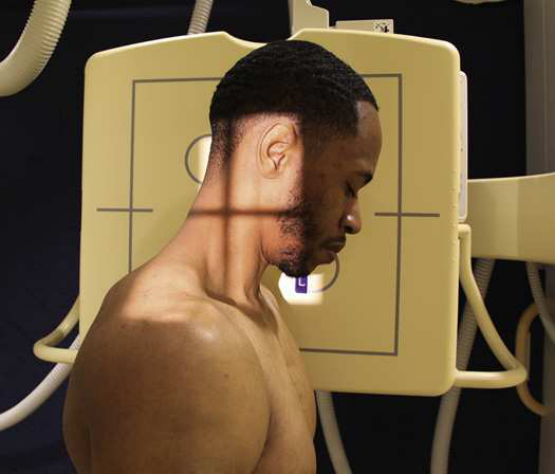
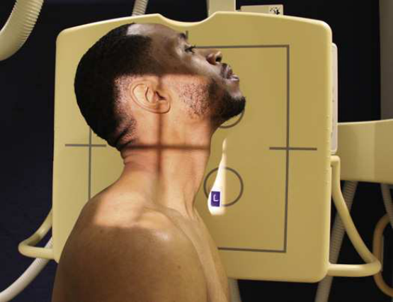
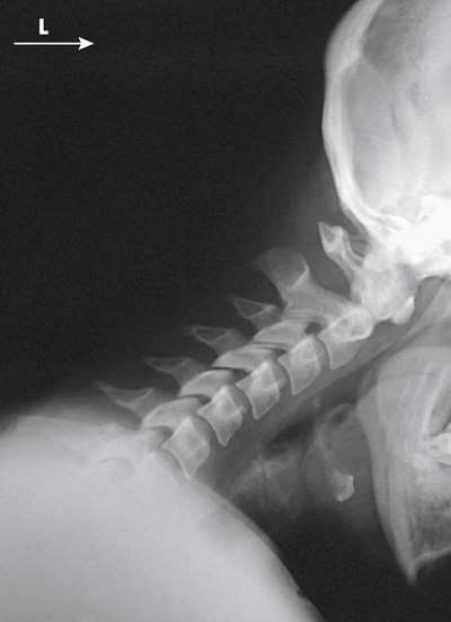

# Rx Coloană Cervicală — Incidență de Profil (Lateral) — Profil (Drept sau Stâng) Flexie și extensie (Merrill)

  📷 Radiografie Convențională (Rx)
  <strong>Actualizat:</strong> 2026-09-16
  <strong>Autor:</strong> Referință Merrill

---

-   __1. Rezumat Clinic & Indicații__

    ---

    === "Indicații Clinice"

        - Conform reperelor anatomice standard din tratat

    === "Ghid Național IRIS"

        !!! info "Referință Primară: Ghidul Național IRIS (Ordinul MS 1342/2012)"
            - **Capitol Ghid IRIS:** *Coloană vertebrală & Traumatisme*
            - **Grad de Recomandare:** **Grad A**
            - **Nivel de Iradiere Estimată:** `Clasa 1 (Minimă < 0.2 mSv)`

            [:octicons-search-16: Deschide Ghidul IRIS](../../iris.md){ .md-button .md-button--primary } [:material-open-in-new: Aplicația Oficială PWA](https://radiologie-pediatrica.ro/iris/){ .md-button target="_blank" rel="noopener" }

-   __2. Poziționare & Centrare Fascicul__

    ---

    - **Poziție Pacient:** Se așază pacientul în poziție de profil strict, fie în poziție șezândă, fie în ortostatism, în fața stativului vertical Bucky. Se instruiește pacientul să stea drept, așezat sau în picioare, apoi se ajustează înălțimea receptorului de imagine astfel încât acesta să fie centrat la nivelul C4. Marginea superioară a receptorului de imagine se află la aproximativ 2 țol (5 cm) deasupra conductului auditiv extern (CAE).; Se apropie pacientul suficient de stativul vertical Bucky pentru a permite sprijinirea umărului adiacent de grilă. Se menține MSP al capului și gâtului pacientului paralel cu planul receptorului de imagine. Alternativ, se realizează incidența fără utilizarea grilei. Flexie Se instruiește pacientul să aplece capul înainte și apoi să apropie bărbia cât mai mult posibil de torace, astfel încât coloana cervicală să fie în poziție de flexie maximă pentru prima expunere (Fig. 9.45). Extensie Se instruiește pacientul să ridice bărbia cât mai mult posibil, astfel încât coloana cervicală să fie în poziție de extensie maximă pentru a doua expunere (Fig. 9.46). se efectuează ecranarea gonadelor cu șorț plumbat.
    - **Punct de Centrare Fascicul:** Orizontal și perpendicular la nivelul C4
    - **Distanță Focar-Film (DFF / SID):** Se recomandă o SID de 60 până la 72 inci (152 până la 183 cm), pentru a compensa OID crescută. O distanță mai mare facilitează vizualizarea vertebrei C7.
    - **Comandă Respiratorie:** apnee (oprirea respirației).

-   __3. Parametri Tehnici Expunere__

    ---

    | Parametru Tehnic | Valoare Configurare Generator / Tub |
    |:-----------------|:-------------------------------------|
    | **Tensiune Tub (kV)** | DE CONFIGURAT PE APARAT |
    | **Sarcină / Produs Curent-Timp (mAs)** | DE CONFIGURAT PE APARAT |
    | **Distanță Focar-Film (DFF / SID)** | Se recomandă o SID de 60 până la 72 inci (152 până la 183 cm), pentru a compensa OID crescută. O distanță mai mare facilitează vizualizarea vertebrei C7. |
    | **Grilă Antidifuzoare (Bucky)** | DE CONFIGURAT PE APARAT |
    | **Dimensiune Focar** | DE CONFIGURAT PE APARAT |
    | **Camere de Ionizare AEC** | DE CONFIGURAT PE APARAT |
    | **Colimare Fascicul** | Se ajustează câmpul de iradiere la formatul 24 × 30 cm pe colimator. Pentru flexie, câmpul luminos trebuie să se întindă de la EAC anterior până la procesul spinos C7 posterior. Pentru extensie, câmpul luminos trebuie să se întindă de la mijlocul mandibulei anterior până la procesul spinos C7 posterior. Se plasează markerul de lateralitate (D/S) în câmpul de expunere colimat. |
    | **Filtrare Tub** | DE CONFIGURAT PE APARAT |

-   __4. Criterii de Calitate & Reușită Imagine__

    ---

    - Criterii radiologice de calitate a imaginii:
    - Evidențierea colimării corecte și prezența markerului de lateralitate (D/S), plasat fără a se suprapune peste anatomia de interes
    - Toate cele șapte vertebre cervicale în incidență de profil strict
    - Absența rotației anatomice (simetrie bilaterală perfectă) sau a înclinării coloanei cervicale
    - Articulații zigapofizare suprapuse și spații discale intervertebrale deschise
    - Ramurile mandibulei suprapuse sau aproape suprapuse
    - Procesele spinoase vizualizate din profil
    - Detalii trabeculare osoase și țesuturile moi înconjurătoare Flexie
    - Corpul mandibulei aproape vertical la pacientul normal
    - Toate cele șapte procese spinoase de profil, ridicate și mult distanțate Extensie
    - Corpul mandibulei aproape orizontal la pacientul normal
    - Toate cele șapte procese spinoase de profil, coborâte și apropiate

-   __5. Protecție Radiologică (ALARA)__

    ---

    - Nespecificat în fragmentul extras; de verificat în sursă

!!! note "Observații Clinice & Tehnice"
    Această procedură nu trebuie încercată până când patologia coloanei cervicale sau suspiciunea de fractură nu a fost exclusă. Studiile funcționale ale coloanei cervicale în incidență de profil se efectuează pentru a evidenția mișcarea intersegmentară normală sau modificările alinierii intersegmentare rezultate în urma unui traumatism / în regim de urgență sau a unei boli. Procesele spinoase sunt ridicate și mult distanțate în poziția de flexie și sunt coborâte și foarte apropiate în poziția de extensie. Radiologul evaluează aspectul posterior al corpurilor vertebrale pentru aprecierea alinierii intersegmentare.

### 🖼️ Imagini

<figure class="protocol-image-card" markdown>

<figcaption><strong>Merrill — pagina 689, imaginea 1</strong> — Imagine din fragmentul sursă; asocierea necesită revizie.</figcaption>

</figure>

<figure class="protocol-image-card" markdown>

<figcaption><strong>Merrill — pagina 690, imaginea 2</strong> — Imagine din fragmentul sursă; asocierea necesită revizie.</figcaption>

</figure>

<figure class="protocol-image-card" markdown>

<figcaption><strong>Merrill — pagina 691, imaginea 3</strong> — Imagine din fragmentul sursă; asocierea necesită revizie.</figcaption>

</figure>

=== "Ghid Rapid de Execuție"

    1. **Identificarea și verificarea pacientului:** verificare identitate, zonă de examinat, consimțământ conform procedurii și evaluarea posibilității unei sarcini, când este relevantă.
    2. **Pregătire:** îndepărtarea oricăror obiecte radiopace (bijuterii, agrafe, fermoare, proteze, pansamente dense).
    3. **Poziționare precisă:** alinierea receptorului de imagine și a tubului la distanța prescrisă (Se recomandă o SID de 60 până la 72 inci (152 până la 183 cm), pentru a compensa OID crescută. O distanță mai mare facilitează vizualizarea vertebrei C7.).
    4. **Colimare strictă:** adaptarea fasciculului strict la regiunea de diagnostic pentru scăderea iradierii și reducerea radiației difuze.
    5. **Radioprotecție:** verificarea [politicii RX](../radioprotectie.md), cu măsuri distincte pentru pacient, personal și însoțitor.

## Surse de documentare

- [Merrill’s Atlas, 9. Vertebral Column, pagini 688–691](https://books.google.com/books/about/Merrill_s_Atlas_of_Radiographic_Position.html?id=BM0lEQAAQBAJ)
