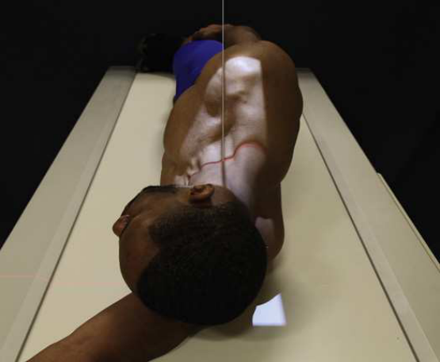
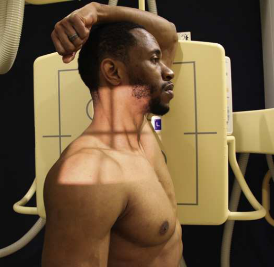

# Rx Cervicothoracic Region — Incidență de Profil (Lateral) — Swimmer’s Technique Profil (Drept sau Stâng) (Merrill)

  📷 Radiografie Convențională (Rx)
  <strong>Actualizat:</strong> 2026-09-16
  <strong>Autor:</strong> Referință Merrill

---

-   __1. Rezumat Clinic & Indicații__

    ---

    === "Indicații Clinice"

        - Conform reperelor anatomice standard din tratat

    === "Ghid Național IRIS"

        !!! info "Referință Primară: Ghidul Național IRIS (Ordinul MS 1342/2012)"
            - **Capitol Ghid IRIS:** *Ghidul Național IRIS*
            - **Grad de Recomandare:** **De verificat pe indicație; fără grad atribuit automat**
            - **Nivel de Iradiere Estimată:** `De verificat pentru examinarea și populația selectate`

            [:octicons-search-16: Deschide Ghidul IRIS](../../iris.md){ .md-button .md-button--primary } [:material-open-in-new: Aplicația Oficială PWA](https://radiologie-pediatrica.ro/iris/){ .md-button target="_blank" rel="noopener" }
-   __2. Poziționare & Centrare Fascicul__

    ---

    - **Poziție Pacient:** Decubit: se așază pacientul în lateral Decubit poziție cu capul ridicat pe pacientul’s braț sau other firm support (Fig. 9.64). în ortostatism: se așază pacientul în Incidență de Profil (lateral), either Poziție Șezândă sau în ortostatism, against stativ vertical Bucky (Fig. 9.65).; Center MCP de corp la linia mediană grilă. se extinde braț cel mai apropiat de receptorul de imagine above capul. If pacientul este în ortostatism, se flectează Cot și rest Antebraț pe pacientul’s cap (see poziție braț away de la receptorul de imagine down along pacientul’s side și depress Umăr ca much ca possible. 11 în addition, cap humeral poate fie moved în opposite direction la that de other Umăr 12, 13 (posterior recommended). se ajustează cap și corp în true Incidență de Profil (lateral), cu MSP paralel cu plane de receptorul de imagine. If pacientul este Decubit, support poate fie plasat under lower thorax. se centrează receptorul de imagine la nivelul C7–T1 intervertebral disk space, which este located 2 inches (5 cm) above incizură jugulară (furculiță sternală). se efectuează ecranarea gonadelor cu șorț plumbat.
    - **Punct de Centrare Fascicul:** orientat la C7–T1 intervertebral disk space: perpendicular 12 if Umăr away de la receptorul de imagine este well coborât sau la caudal angle de 3 la 5 grade 14 when Umăr este immobile și cannot fie coborât suficiently. Monda 15 recommended angling 5 la 15 grade cranial la show better intervertebral disk spaces when coloană vertebrală este tilted because de broad umeri sau nonelevated lower coloană vertebrală. corect angle results în raza centrală perpendicular pe axa longitudinală de tilted coloană vertebrală.
    - **Distanță Focar-Film (DFF / SID):** Nespecificat în fragmentul extras; de verificat în sursă
    - **Comandă Respiratorie:** apnee (oprirea respirației); sau if pacient poate cooperate și poate fie imobilizat, Tehnică de estompare prin respirație superficială (respirație technique) poate fie used la blur lung anatomy.

-   __3. Parametri Tehnici Expunere__

    ---

    | Parametru Tehnic | Valoare Configurare Generator / Tub |
    |:-----------------|:-------------------------------------|
    | **Tensiune Tub (kV)** | DE CONFIGURAT PE APARAT |
    | **Sarcină / Produs Curent-Timp (mAs)** | DE CONFIGURAT PE APARAT |
    | **Distanță Focar-Film (DFF / SID)** | Nespecificat în fragmentul extras; de verificat în sursă |
    | **Grilă Antidifuzoare (Bucky)** | DE CONFIGURAT PE APARAT |
    | **Dimensiune Focar** | DE CONFIGURAT PE APARAT |
    | **Camere de Ionizare AEC** | DE CONFIGURAT PE APARAT |
    | **Colimare Fascicul** | Se ajustează câmpul de iradiere la formatul 24 × 30 cm pe colimator. Place marker de lateralitate (D/S) în collimated expunere field. Compensating Filter This incidență poate benefit de la use de compensating filter because de extreme diference între thin lower neck și very thick upper thoracic region. cu use de specially designed filter, C7–T1 area poate fie vizualizat pe one imagine. |
    | **Filtrare Tub** | DE CONFIGURAT PE APARAT |

-   __4. Criterii de Calitate & Reușită Imagine__

    ---

    - Criterii radiologice de calitate imaginii:
    - Evidence de corect collimation și presence de marker de lateralitate (D/S) plasat clear de anatomy de interest
    - adecvat x-ray penetration through Umăr region evidențiind lower cervical și upper thoracic vertebra, nu appreciably

-   __5. Protecție Radiologică (ALARA)__

    ---

    - Nespecificat în fragmentul extras; de verificat în sursă

!!! note "Observații Clinice & Tehnice"
    See Chapter 12 în Volume 2 pentru description de positioning used pentru pacienți cu suspected Coloană Cervicală Traumatism / Regim Urgență.

### 🖼️ Imagini

<figure class="protocol-image-card" markdown>

<figcaption><strong>Merrill — pagina PDF 706, imaginea 1</strong> — Imagine din fragmentul sursă; asocierea necesită revizie.</figcaption>

</figure>

<figure class="protocol-image-card" markdown>

<figcaption><strong>Merrill — pagina PDF 707, imaginea 2</strong> — Imagine din fragmentul sursă; asocierea necesită revizie.</figcaption>

</figure>

=== "Ghid Rapid de Execuție"

    1. **Identificarea și verificarea pacientului:** verificare identitate, zonă de examinat, consimțământ conform procedurii și evaluarea posibilității unei sarcini, când este relevantă.
    2. **Pregătire:** îndepărtarea oricăror obiecte radiopace (bijuterii, agrafe, fermoare, proteze, pansamente dense).
    3. **Poziționare precisă:** alinierea receptorului de imagine și a tubului la distanța prescrisă (Nespecificat în fragmentul extras; de verificat în sursă).
    4. **Colimare strictă:** adaptarea fasciculului strict la regiunea de diagnostic pentru scăderea iradierii și reducerea radiației difuze.
    5. **Radioprotecție:** verificarea [politicii RX](../radioprotectie.md), cu măsuri distincte pentru pacient, personal și însoțitor.

## Surse de documentare

- [Merrill’s Atlas, 9. Vertebral Column, pagini PDF 705–707](../../assets/protocols/sources/a56d45c16829_Merrills_Atlas_of_Radiographic_Positioning__Procedures_3Vol_Set.pdf#page=705)

## Fragmente sursă traduse (referință tehnică)

### anatomy

cervicothoracic vertebre între umeri (Figs. 9.66 și 9.67).

### collimation

• Se ajustează câmpul de iradiere la formatul 24 × 30 cm pe colimator. Place marker de lateralitate (D/S) în collimated expunere field.
Compensating Filter
This incidență poate benefit de la use de compensating filter because de extreme diference între thin lower neck și very
thick upper thoracic region. cu use de specially designed filter, C7–T1 area poate fie vizualizat pe one imagine.

### cr

• orientat la C7–T1 intervertebral disk space: perpendicular 12 if umăr away de la receptorul de imagine este well coborât sau la caudal angle
de 3 la 5 grade 14 when umăr este immobile și cannot fie coborât suficiently.
• Monda 15 recommended angling 5 la 15 grade cranial la show better intervertebral disk spaces when coloană vertebrală este tilted because
de broad umeri sau nonelevated lower coloană vertebrală. corect angle results în raza centrală perpendicular pe axa longitudinală de tilted
coloană vertebrală.

### criteria

Criterii radiologice de calitate imaginii:
• Evidence de corect collimation și presence de marker de lateralitate (D/S) plasat clear de anatomy de interest
• adecvat x-ray penetration through umăr region evidențiind lower cervical și upper thoracic vertebra, nu appreciably

### notes

See Chapter 12 în Volume 2 pentru description de positioning used pentru pacienți cu suspected cervical coloană vertebrală trauma.

### part_pos

• Center MCP de corp la linia mediană grilă.
• se extinde braț cel mai apropiat de receptorul de imagine above capul. If pacientul este în ortostatism, se flectează cot și rest forearm pe pacientul’s cap (see
• poziție braț away de la receptorul de imagine down along pacientul’s side și depress umăr ca much ca possible. 11 în addition, cap humeral poate fie moved în opposite direction la that de other umăr 12, 13 (posterior recommended).
• se ajustează cap și corp în true poziție de profil (lateral), cu MSP paralel cu plane de receptorul de imagine. If pacientul este recumbent, support
poate fie plasat under lower thorax.
• se centrează receptorul de imagine la nivelul C7–T1 intervertebral disk space, which este located 2 inches (5 cm) above incizură jugulară (furculiță sternală).
• se efectuează ecranarea gonadelor cu șorț plumbat.

### patient_pos

• Recumbent: se așază pacientul în lateral recumbent poziție cu capul ridicat pe pacientul’s braț sau other firm support (Fig.
9.64).
• în ortostatism: se așază pacientul în poziție de profil (lateral), either așezat pe scaun sau în ortostatism, against stativ vertical Bucky (Fig. 9.65).

### respiration

apnee (oprirea respirației); sau if pacient poate cooperate și poate fie imobilizat, Tehnică de estompare prin respirație superficială (respirație technique) poate fie used la blur lung anatomy.

### tech

poziționat prin manufacturer sau department protocol pentru corect anatomy display orientation; raza centrală plate: 10 × 12 inches (24
× 30 cm) longitudinal.

