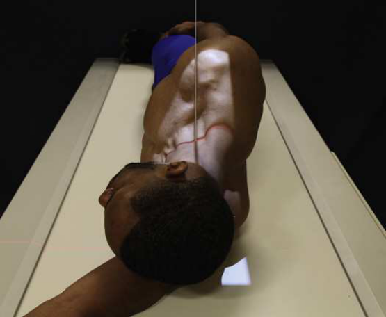
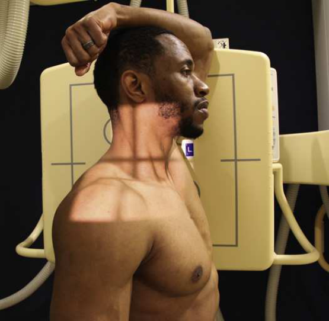

# Rx Regiune Cervicotoracică — Incidență de Profil — Tehnica Înotătorului, Profil Drept sau Stâng (Merrill)

  📷 Radiografie Convențională (Rx)
  <strong>Actualizat:</strong> 2026-09-16
  <strong>Autor:</strong> Referință Merrill

---

-   __1. Rezumat Clinic & Indicații__

    ---

    === "Indicații Clinice"

        - Conform reperelor anatomice standard din tratat

    === "Ghid Național IRIS"

        !!! info "Referință Primară: Ghidul Național IRIS (Ordinul MS 1342/2012)"
            - **Capitol Ghid IRIS:** *Ghidul Național IRIS*
            - **Grad de Recomandare:** **De verificat pe indicație; fără grad atribuit automat**
            - **Nivel de Iradiere Estimată:** `De verificat pentru examinarea și populația selectate`

            [:octicons-search-16: Deschide Ghidul IRIS](../../iris.md){ .md-button .md-button--primary } [:material-open-in-new: Aplicația Oficială PWA](https://radiologie-pediatrica.ro/iris/){ .md-button target="_blank" rel="noopener" }
-   __2. Poziționare & Centrare Fascicul__

    ---

    - **Poziție Pacient:** Decubit: se așază pacientul în decubit lateral, cu capul ridicat pe brațul pacientului sau pe un alt suport ferm (Fig. 9.64). În ortostatism: se așază pacientul în poziție de profil, fie în poziție șezândă, fie în ortostatism, sprijinit de stativul vertical Bucky (Fig. 9.65).; Se centrează MCP al corpului pe linia mediană a grilei. Se extinde brațul cel mai apropiat de receptorul de imagine deasupra capului. Dacă pacientul este în ortostatism, se flectează cotul și se sprijină antebrațul pe capul pacientului (vezi
Se poziționează brațul îndepărtat de receptorul de imagine în jos, de-a lungul corpului pacientului, și se coboară umărul cât mai mult posibil. 11 În plus, capul humeral poate fi deplasat în direcția opusă celei a celuilalt umăr 12, 13 (se recomandă posterior). Se poziționează capul și corpul în profil strict, cu MSP paralel cu planul receptorului de imagine. Dacă pacientul este în decubit, se poate plasa un suport sub porțiunea inferioară a toracelui. Se centrează receptorul de imagine la nivelul spațiului discal intervertebral C7–T1, situat la 2 inch (5 cm) deasupra incizurii jugulare (furculița sternală). se efectuează ecranarea gonadelor cu șorț plumbat.
    - **Punct de Centrare Fascicul:** Orientat spre spațiul discal intervertebral C7–T1: perpendicular 12 dacă umărul îndepărtat de receptorul de imagine este bine coborât sau la un unghi caudal de 3 la 5 grade 14 când umărul este imobil și nu poate fi coborât suficient. Monda 15 a recomandat o angulare cranială de 5 la 15 grade pentru a evidenția mai bine spațiile discale intervertebrale când coloana vertebrală este înclinată din cauza umerilor lați sau a porțiunii inferioare a coloanei vertebrale care nu este ridicată. Unghiul corect face ca raza centrală să fie perpendiculară pe axa longitudinală a coloanei vertebrale înclinate.
    - **Distanță Focar-Film (DFF / SID):** Nespecificat în fragmentul extras; de verificat în sursă
    - **Comandă Respiratorie:** apnee (oprirea respirației); sau, dacă pacientul poate coopera și poate fi imobilizat, tehnica de estompare prin respirație superficială (tehnică respiratorie) poate fi utilizată pentru a estompa anatomia pulmonară.

-   __3. Parametri Tehnici Expunere__

    ---

    | Parametru Tehnic | Valoare Configurare Generator / Tub |
    |:-----------------|:-------------------------------------|
    | **Tensiune Tub (kV)** | DE CONFIGURAT PE APARAT |
    | **Sarcină / Produs Curent-Timp (mAs)** | DE CONFIGURAT PE APARAT |
    | **Distanță Focar-Film (DFF / SID)** | Nespecificat în fragmentul extras; de verificat în sursă |
    | **Grilă Antidifuzoare (Bucky)** | DE CONFIGURAT PE APARAT |
    | **Dimensiune Focar** | DE CONFIGURAT PE APARAT |
    | **Camere de Ionizare AEC** | DE CONFIGURAT PE APARAT |
    | **Colimare Fascicul** | Se ajustează câmpul de iradiere la formatul 24 × 30 cm pe colimator. Se plasează markerul de lateralitate (D/S) în câmpul de expunere colimat. Filtru compensator Această incidență poate beneficia de utilizarea unui filtru compensator datorită diferenței extreme dintre partea inferioară subțire a gâtului și regiunea toracică superioară foarte groasă. Prin utilizarea unui filtru special conceput, zona C7–T1 poate fi vizualizată pe o singură imagine. |
    | **Filtrare Tub** | DE CONFIGURAT PE APARAT |

-   __4. Criterii de Calitate & Reușită Imagine__

    ---

    - Criterii radiologice de calitate a imaginii:
    - Evidențierea colimării corecte și prezența markerului de lateralitate (D/S), plasat fără a se suprapune peste anatomia de interes
    - Penetrare adecvată a razelor X prin regiunea umărului, evidențiind vertebrele cervicale inferioare și toracice superioare, nu în mod apreciabil

-   __5. Protecție Radiologică (ALARA)__

    ---

    - Nespecificat în fragmentul extras; de verificat în sursă

!!! note "Observații Clinice & Tehnice"
    Consultați Capitolul 12 din Volumul 2 pentru descrierea poziționării utilizate la pacienții cu suspiciune de traumatism al coloanei cervicale / în regim de urgență.

### 🖼️ Imagini

<figure class="protocol-image-card" markdown>

<figcaption><strong>Merrill — pagina 706, imaginea 1</strong> — Imagine din fragmentul sursă; asocierea necesită revizie.</figcaption>

</figure>

<figure class="protocol-image-card" markdown>

<figcaption><strong>Merrill — pagina 707, imaginea 2</strong> — Imagine din fragmentul sursă; asocierea necesită revizie.</figcaption>

</figure>

=== "Ghid Rapid de Execuție"

    1. **Identificarea și verificarea pacientului:** verificare identitate, zonă de examinat, consimțământ conform procedurii și evaluarea posibilității unei sarcini, când este relevantă.
    2. **Pregătire:** îndepărtarea oricăror obiecte radiopace (bijuterii, agrafe, fermoare, proteze, pansamente dense).
    3. **Poziționare precisă:** alinierea receptorului de imagine și a tubului la distanța prescrisă (Nespecificat în fragmentul extras; de verificat în sursă).
    4. **Colimare strictă:** adaptarea fasciculului strict la regiunea de diagnostic pentru scăderea iradierii și reducerea radiației difuze.
    5. **Radioprotecție:** verificarea [politicii RX](../radioprotectie.md), cu măsuri distincte pentru pacient, personal și însoțitor.

## Surse de documentare

- [Merrill’s Atlas, 9. Vertebral Column, pagini 705–707](https://books.google.com/books/about/Merrill_s_Atlas_of_Radiographic_Position.html?id=BM0lEQAAQBAJ)

## Fragmente sursă traduse (referință tehnică)

### anatomie

Vertebrele cervicotoracice între umeri (Fig. 9.66 și 9.67).

### colimare

• Se ajustează câmpul de iradiere la formatul 24 × 30 cm pe colimator. Se plasează markerul de lateralitate (D/S) în câmpul de expunere colimat.
Filtru compensator
Această incidență poate beneficia de utilizarea unui filtru compensator datorită diferenței extreme dintre porțiunea inferioară subțire a gâtului și regiunea toracică superioară
foarte groasă. Prin utilizarea unui filtru special conceput, zona C7–T1 poate fi vizualizată pe o singură imagine.

### raza centrală

• Orientat spre spațiul discal intervertebral C7–T1: perpendicular 12 dacă umărul îndepărtat de receptorul de imagine este bine coborât sau la un unghi caudal
de 3 la 5 grade 14 când umărul este imobil și nu poate fi coborât suficient.
• Monda 15 a recomandat o angulare cranială de 5 la 15 grade pentru a evidenția mai bine spațiile discale intervertebrale când coloana vertebrală este înclinată din cauza
umerilor lați sau a porțiunii inferioare a coloanei vertebrale care nu este ridicată. Unghiul corect face ca raza centrală să fie perpendiculară pe axa longitudinală a coloanei
vertebrale înclinate.

### criterii

Criterii radiologice de calitate a imaginii:
• Colimare corectă și prezența markerului de lateralitate (D/S), plasat fără a se suprapune peste anatomia de interes
• Penetrare adecvată a razelor X prin regiunea umărului, evidențiind vertebrele cervicale inferioare și toracice superioare, nu în mod apreciabil

### note

Consultați Capitolul 12 din Volumul 2 pentru descrierea poziționării utilizate la pacienții cu suspiciune de traumatism al coloanei cervicale.

### part_pos

• Se centrează MCP al corpului pe linia mediană a grilei.
• Se extinde brațul cel mai apropiat de receptorul de imagine deasupra capului. Dacă pacientul este în ortostatism, se flectează cotul și se sprijină antebrațul pe capul pacientului (vezi
• Se poziționează brațul îndepărtat de receptorul de imagine în jos, de-a lungul corpului pacientului, și se coboară umărul cât mai mult posibil. 11 În plus, capul humeral poate fi deplasat în direcția opusă celei a celuilalt umăr 12, 13 (se recomandă posterior).
• Se poziționează capul și corpul în profil strict, cu MSP paralel cu planul receptorului de imagine. Dacă pacientul este în decubit, se poate plasa un suport
sub porțiunea inferioară a toracelui.
• Se centrează receptorul de imagine la nivelul spațiului discal intervertebral C7–T1, situat la 2 inch (5 cm) deasupra incizurii jugulare (furculița sternală).
• se efectuează ecranarea gonadelor cu șorț plumbat.

### patient_pos

• În decubit: se așază pacientul în decubit lateral, cu capul ridicat pe brațul pacientului sau pe un alt suport ferm (Fig.
9.64).
• În ortostatism: se așază pacientul în poziție de profil, fie așezat pe scaun, fie în ortostatism, sprijinit de stativul vertical Bucky (Fig. 9.65).

### respirație

apnee (oprirea respirației); sau, dacă pacientul poate coopera și poate fi imobilizat, tehnica de estompare prin respirație superficială (tehnică respiratorie) poate fi utilizată pentru a estompa anatomia pulmonară.

### tehnică

poziționat conform indicațiilor producătorului sau protocolului departamentului pentru orientarea corectă a afișării anatomiei; placa razei centrale: 10 × 12 țoli (24
× 30 cm), longitudinal.

