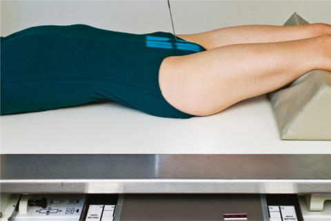
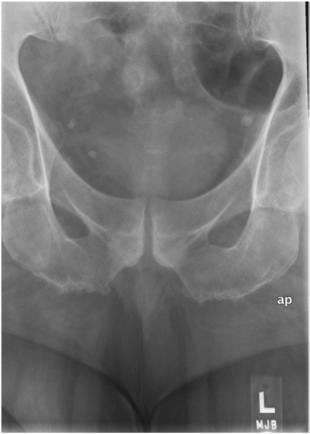

# Rx Coccis AP Axială

  📷 Radiografie Convențională (Rx)
  <strong>Actualizat:</strong> 2026-09-15
  <strong>Autor:</strong> Departamentul de Radiologie / Referință Bontrager

---

-   __1. Rezumat Clinic & Indicații__

    ---

    === "Indicații Clinice"

        - Patologia coccisului, inclusiv suspiciunea de fractură

    === "Ghid Național IRIS"

        !!! info "Referință Primară: Ghidul Național IRIS (Ordinul MS 1342/2012)"
            - **Capitol Ghid IRIS:** *Coloană vertebrală*
            - **Grad de Recomandare:** **Grad A**
            - **Nivel de Iradiere Estimată:** `Clasa 2 (Foarte mică ~ 1.0 - 1.5 mSv)`

            [:octicons-search-16: Deschide Ghidul IRIS](../../iris.md){ .md-button .md-button--primary } [:material-open-in-new: Aplicația Oficială PWA](https://radiologie-pediatrica.ro/iris/){ .md-button target="_blank" rel="noopener" }

-   __2. Poziționare & Centrare Fascicul__

    ---

    - **Poziție Pacient:** Pacient: Decubit dorsal. Se poziționează pacientul în decubit dorsal, cu brațele pe lângă corp, capul pe pernă și membrele inferioare întinse, cu un suport sub genunchi pentru confort.; Regiune anatomică: Se aliniază planul mediosagital cu linia mediană a mesei și/sau a receptorului de imagine (Fig. 9.67). Se verifică absența rotației: claviculele sunt riguros echidistante față de linia proceselor spinoase. Bazin (pelvis) există.
    - **Punct de Centrare Fascicul:** Raza centrală se înclină 10° caudal (spre picioare). Se orientează raza centrală la 2 țoli (5 cm) superior de simfiza pubiană. Se centrează receptorul de imagine pe raza centrală.
    - **Distanță Focar-Film (DFF / SID):** 100 cm
    - **Comandă Respiratorie:** Apnee pe durata expunerii pentru prevenirea artefactelor de mișcare ale pacientului.

-   __3. Parametri Tehnici Expunere__

    ---

    | Parametru Tehnic | Valoare Configurare Generator / Tub |
    |:-----------------|:-------------------------------------|
    | **Tensiune Tub (kV)** | 75-85 kV |
    | **Sarcină / Produs Curent-Timp (mAs)** | DE CONFIGURAT PE APARAT |
    | **Distanță Focar-Film (DFF / SID)** | 100 cm |
    | **Grilă Antidifuzoare (Bucky)** | Cu grilă antidifuzoare Bucky |
    | **Dimensiune Focar** | Focar Mic (0.6 mm) |
    | **Camere de Ionizare AEC** | Camerele laterale (sau camera centrală, în funcție de regiune) |
    | **Colimare Fascicul** | Dimensiunea câmpului Colimați pe cele patru laturi la regiunea anatomică de interes. |
    | **Filtrare Tub** | Totală ≥ 2.5 mm Al echivalent |

-   __4. Criterii de Calitate & Reușită Imagine__

    ---

    - Coccis (Fig. 9.68) Poziție
    - Alinierea corectă a coccisului și a razei centrale evidențiază coccisul fără suprapuneri, proiectat superior de pubis.
    - Spațiile dintre segmentele coccigiene trebuie să apară deschise. În caz contrar, segmentele pot fi fuzionate sau poate fi necesară mărirea unghiului razei centrale (o curbură mai accentuată a coccisului necesită un unghi mai mare al razei centrale).
    - Coccisul trebuie să apară echidistant față de pereții laterali ai deschiderii pelvine, indicând absența rotației pacientului.
    - Colimarea câmpului la dimensiunea ariei de interes diagnostic. Expunere
    - Expunere optimă a receptorului de imagine și contrast optim. Evidențiere clară a contururilor osoase și a trabeculației osoase a coccisului.
    - Fără mișcare. 18 24 R Fig. 9.68 Coccis AP axial—10° caudal. Fig. 9.67 Coccis AP axial—10° caudal.

-   __5. Protecție Radiologică (ALARA)__

    ---

    - Ecranare gonadică și a organelor radiosensibile conform procedurilor locale de radioprotecție ALARA.
    - Colimare strictă la aria de interes pentru limitarea radiației difuze.
    - Verificarea posibilității unei sarcini la pacientele de vârstă fertilă înainte de expunere.

!!! note "Observații Clinice & Tehnice"
    S: Tehnicianul poate fi nevoit să mărească unghiul razei centrale la 15° caudal în cazul unei curburi anterioare mai accentuate a coccisului, dacă aceasta este evidentă la palpare sau pe incidența de profil. Această incidență poate fi realizată și în decubit ventral (unghi de 10° cranial), dacă starea pacientului o impune, cu raza centrală centrată pe coccis, care poate fi localizat folosind marele trohanter. Sacru și coccis EXAMINARE DE RUTINĂ Sacru AP axial Coccis AP axial Incidență de profil

### 🖼️ Imagini

<figure class="protocol-image-card" markdown>

<figcaption><strong>Fig. 9.68 Coccis AP axial—10° caudal.</strong> — Poziționarea pacientului conform Ghidului Bontrager (Fig. 9.68 Coccis AP axial—10° caudal.)</figcaption>

</figure>

<figure class="protocol-image-card" markdown>

<figcaption><strong>Fig. 9.67 Coccis AP axial—10° caudal.</strong> — Aspect radiografic de referință conform Ghidului Bontrager (Fig. 9.67 Coccis AP axial—10° caudal.)</figcaption>

</figure>

=== "Ghid Rapid de Execuție"

    1. **Identificarea și verificarea pacientului:** verificare identitate, zonă de examinat, consimțământ conform procedurii și evaluarea posibilității unei sarcini, când este relevantă.
    2. **Pregătire:** îndepărtarea oricăror obiecte radiopace (bijuterii, agrafe, fermoare, proteze, pansamente dense).
    3. **Poziționare precisă:** alinierea receptorului de imagine și a tubului la distanța prescrisă (100 cm).
    4. **Colimare strictă:** adaptarea fasciculului strict la regiunea de diagnostic pentru scăderea iradierii și reducerea radiației difuze.
    5. **Radioprotecție:** verificarea [politicii RX](../radioprotectie.md), cu măsuri distincte pentru pacient, personal și însoțitor.

## Surse de documentare

- [Bontrager's Textbook of Radiographic Positioning (Ed. 9/10), Pagina 373](https://www.elsevier.com/books/textbook-of-radiographic-positioning-and-related-anatomy/lampignano/978-0-323-65367-1)
