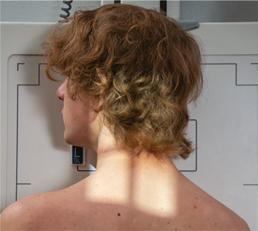
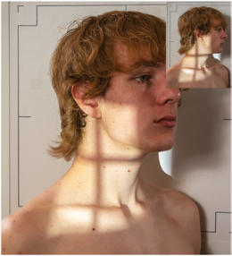
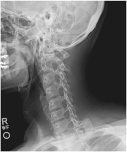
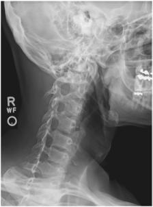

# Rx Coloană Cervicală ANTERIOR AND POSTERIOR OBLIQUE POSITIONS

  📷 Radiografie Convențională (Rx)
  <strong>Actualizat:</strong> 2026-09-15
  <strong>Autor:</strong> Departamentul de Radiologie / Referință Bontrager

---

-   __1. Rezumat Clinic & Indicații__

    ---

    === "Indicații Clinice"

        - Pathology involving the Coloană Cervicală and adjacent soft tissue structures, including stenosis involving the intervertebral foramen
        - Both right and left oblique projections should be taken for comparison purposes. Anterior oblique positions—RAO, LAO—are preferred because of reduced thyroid doses.

    === "Ghid Național IRIS"

        !!! info "Referință Primară: Ghidul Național IRIS (Ordinul MS 1342/2012)"
            - **Capitol Ghid IRIS:** *Ghidul Național IRIS*
            - **Grad de Recomandare:** **De verificat pe indicație; fără grad atribuit automat**
            - **Nivel de Iradiere Estimată:** `De verificat pentru examinarea și populația selectate`

            [:octicons-search-16: Deschide Ghidul IRIS](../../iris.md){ .md-button .md-button--primary } [:material-open-in-new: Aplicația Oficială PWA](https://radiologie-pediatrica.ro/iris/){ .md-button target="_blank" rel="noopener" }
-   __2. Poziționare & Centrare Fascicul__

    ---

    - **Poziție Pacient:** Pacient: Ortostatism or Decubit Position The Ortostatism position preferred (sitting or standing), but Decubit is possible if the patient’s condition requires.; Regiune anatomică: Align midsagittal plane to CR and midline of table and/or IR. Place patient’s arms at side; if patient is Decubit, place arms as needed to help maintain position. Rotate body and head into 45° Incidență Oblică. Use protractor or other angle gauge as needed to ensure 45° angle (see NOTE) (Figs. 8.52 and 8.53). Protract chin to prevent Mandibulă from superimposing vertebrae. Elevate chin to place acanthiomeatal line (AML) parallel with floor (insert). Excessive Craniu and neck extension will superimpose base of Craniu over posterior arch of C1.
    - **Punct de Centrare Fascicul:** Anterior oblique (RAO, LAO) Direct CR 15° to 20° caudad to C4 (level of upper margin of thyroid cartilage). Posterior oblique (RPO, LPO) Direct CR 15° to 20° cephalad to C4. Center IR to CR.
    - **Distanță Focar-Film (DFF / SID):** 180 cm
    - **Comandă Respiratorie:** Suspend respiration.

-   __3. Parametri Tehnici Expunere__

    ---

    | Parametru Tehnic | Valoare Configurare Generator / Tub |
    |:-----------------|:-------------------------------------|
    | **Tensiune Tub (kV)** | 70-85 kV |
    | **Sarcină / Produs Curent-Timp (mAs)** | DE CONFIGURAT PE APARAT |
    | **Distanță Focar-Film (DFF / SID)** | 180 cm |
    | **Grilă Antidifuzoare (Bucky)** | Cu grilă antidifuzoare Bucky |
    | **Dimensiune Focar** | Focar Mare (1.0 - 1.2 mm) |
    | **Camere de Ionizare AEC** | Camerele laterale (sau camera centrală funcție de regiune) |
    | **Colimare Fascicul** | Collimate on four sides to anatomy of interest. |
    | **Filtrare Tub** | Totală ≥ 2.5 mm Al echivalent |

-   __4. Criterii de Calitate & Reușită Imagine__

    ---

    - Anterior: Oblique (RAO and LAO): intervertebral foramina and pedicles on the side of the patient closest to the iR (right and left pedicles respectively).
    - posterior: Oblique (RPO and LPO): intervertebral foramina and pedicles on the side of the patient farthest from the iR (left and right pedicles, respectively) (Figs. 8.54 and 8.55). POSITION
    - Intervertebral disk spaces and intervertebral foramina of interest (C2 through C7) should be open and uniform in size and shape. The pedicles of interest should be demonstrated in full profile and the opposite, onend pedicles should be aligned along the anterior cervical body.
    - Onend pedicles aligned at the midline of the cervical body and visualization of zygapophyseal joints indicate overrotation.
    - Obscured intervertebral foramina and pedicles indicate underrotation.
    - The mandibular rami should not superimpose the upper cervical vertebrae, and the base of the Craniu should not superimpose C1.
    - Collimation to area of interest. EXPOSURE
    - Optimal image receptor exposure and contrast. Clear demonstration of soft tissue margins and of bony margins and trabecular markings of cervical vertebrae.
    - no motion. Coloană Cervicală ROUTINE
    - AP open mouth (C1 and C2)
    - AP axial
    - Oblique
    - Lateral Fig. 8.54 Right posterior oblique.

-   __5. Protecție Radiologică (ALARA)__

    ---

    - Ecranare gonadică și a organelor radiosensibile conform procedurilor locale de radioprotecție ALARA.
    - Colimare strictă la aria de interes pentru limitarea radiației difuze.
    - Verificarea posibilității unei sarcini la pacientele de vârstă fertilă înainte de expunere.

!!! note "Observații Clinice & Tehnice"
    Head may be turned to a near Incidență de Profil (Lateral).

### 🖼️ Imagini

<figure class="protocol-image-card" markdown>

<figcaption><strong>Fig. 8.52 Ortostatism RAO position—CR</strong> — Poziționare pacient conform Ghidului Bontrager (Fig. 8.52 Erect RAO position—CR)</figcaption>

</figure>

<figure class="protocol-image-card" markdown>

<figcaption><strong>Fig. 8.53 Optional AP oblique,</strong> — Aspect radiografic de referință conform Ghidului Bontrager (Fig. 8.53 Optional AP oblique,)</figcaption>

</figure>

<figure class="protocol-image-card" markdown>

<figcaption><strong>Fig. 8.54 Right posterior oblique.</strong> — Aspect radiografic de referință conform Ghidului Bontrager (Fig. 8.54 Right posterior oblique.)</figcaption>

</figure>

<figure class="protocol-image-card" markdown>

<figcaption><strong>Fig. 8.55 Left posterior oblique.</strong> — Aspect radiografic de referință conform Ghidului Bontrager (Fig. 8.55 Left posterior oblique.)</figcaption>

</figure>

=== "Ghid Rapid de Execuție"

    1. **Identificarea și verificarea pacientului:** verificare identitate, zonă de examinat, consimțământ conform procedurii și evaluarea posibilității unei sarcini, când este relevantă.
    2. **Pregătire:** îndepărtarea oricăror obiecte radiopace (bijuterii, agrafe, fermoare, proteze, pansamente dense).
    3. **Poziționare precisă:** alinierea receptorului de imagine și a tubului la distanța prescrisă (180 cm).
    4. **Colimare strictă:** adaptarea fasciculului strict la regiunea de diagnostic pentru scăderea iradierii și reducerea radiației difuze.
    5. **Radioprotecție:** verificarea [politicii RX](../radioprotectie.md), cu măsuri distincte pentru pacient, personal și însoțitor.

## Surse de documentare

- [Bontrager's Textbook of Radiographic Positioning (Ed. 9/10), Pagina 334](https://www.elsevier.com/books/textbook-of-radiographic-positioning-and-related-anatomy/lampignano/978-0-323-65367-1)
