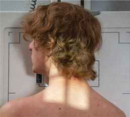
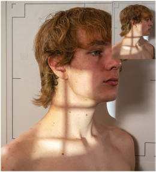
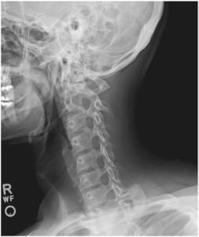
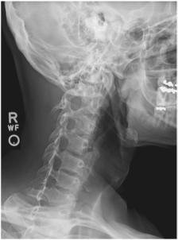

# Rx Coloană Cervicală Poziționare Oblică Anterioară și Posterioară

  📷 Radiografie Convențională (Rx)
  <strong>Actualizat:</strong> 2026-09-15
  <strong>Autor:</strong> Departamentul de Radiologie / Referință Bontrager

---

-   __1. Rezumat Clinic & Indicații__

    ---

    === "Indicații Clinice"

        - Patologia coloanei cervicale și a structurilor adiacente ale părților moi, inclusiv stenoza foramenului intervertebral
        - Trebuie realizate ambele incidențe oblice, dreaptă și stângă, pentru comparație. Pozițiile oblice anterioare—RAO, LAO—sunt preferate datorită dozelor reduse la nivelul tiroidei.

    === "Ghid Național IRIS"

        !!! info "Referință Primară: Ghidul Național IRIS (Ordinul MS 1342/2012)"
            - **Capitol Ghid IRIS:** *Ghidul Național IRIS*
            - **Grad de Recomandare:** **De verificat pe indicație; fără grad atribuit automat**
            - **Nivel de Iradiere Estimată:** `De verificat pentru examinarea și populația selectate`

            [:octicons-search-16: Deschide Ghidul IRIS](../../iris.md){ .md-button .md-button--primary } [:material-open-in-new: Aplicația Oficială PWA](https://radiologie-pediatrica.ro/iris/){ .md-button target="_blank" rel="noopener" }
-   __2. Poziționare & Centrare Fascicul__

    ---

    - **Poziție Pacient:** Pacient: Poziție verticală sau decubit. Este preferată poziția verticală (așezat sau în ortostatism), dar este posibil și decubitul dacă starea pacientului o impune.; Regiune anatomică: Se aliniază planul mediosagital cu raza centrală și cu linia mediană a mesei și/sau a receptorului de imagine. Se așază brațele pacientului pe lângă corp; dacă pacientul este în decubit, se așază brațele după necesitate pentru a ajuta la menținerea poziției. Se rotesc corpul și capul într-o poziție oblică de 45°. Se utilizează un raportor sau un alt dispozitiv de măsurare a unghiurilor, după necesitate, pentru a asigura un unghi de 45° (vezi NOTA) (Fig. 8.52 și 8.53). Se proiectează bărbia înainte pentru a preveni suprapunerea mandibulei peste vertebre. Se ridică bărbia pentru a poziționa linia acantiomeatală (LAM) paralel cu podeaua (imaginea inserată). Extensia excesivă a craniului și a gâtului va determina suprapunerea bazei craniului peste arcul posterior al C1.
    - **Punct de Centrare Fascicul:** Oblică anterioară (RAO, LAO) Se orientează raza centrală cu 15° până la 20° caudal spre C4 (la nivelul marginii superioare a cartilajului tiroid (mărul lui Adam)). Oblică posterioară (RPO, LPO) Se orientează raza centrală cu 15° până la 20° cranial spre C4. Se centrează receptorul de imagine pe raza centrală.
    - **Distanță Focar-Film (DFF / SID):** 180 cm
    - **Comandă Respiratorie:** Apnee pe durata expunerii.

-   __3. Parametri Tehnici Expunere__

    ---

    | Parametru Tehnic | Valoare Configurare Generator / Tub |
    |:-----------------|:-------------------------------------|
    | **Tensiune Tub (kV)** | 70-85 kV |
    | **Sarcină / Produs Curent-Timp (mAs)** | DE CONFIGURAT PE APARAT |
    | **Distanță Focar-Film (DFF / SID)** | 180 cm |
    | **Grilă Antidifuzoare (Bucky)** | Cu grilă antidifuzoare Bucky |
    | **Dimensiune Focar** | Focar Mare (1.0 - 1.2 mm) |
    | **Camere de Ionizare AEC** | Camerele laterale (sau camera centrală, în funcție de regiune) |
    | **Colimare Fascicul** | Colimați pe cele patru laturi la anatomia de interes. |
    | **Filtrare Tub** | Totală ≥ 2.5 mm Al echivalent |

-   __4. Criterii de Calitate & Reușită Imagine__

    ---

    - Oblică anterioară (RAO și LAO): foramenele intervertebrale și pediculii de pe partea pacientului cea mai apropiată de receptorul de imagine (pediculii drepți, respectiv stângi).
    - Oblică posterioară (RPO și LPO): foramenele intervertebrale și pediculii de pe partea pacientului cea mai îndepărtată de receptorul de imagine (pediculii stângi, respectiv drepți) (Fig. 8.54 și 8.55). Poziție
    - Spațiile discale intervertebrale și foramenele intervertebrale de interes (C2 până la C7) trebuie să fie deschise și uniforme ca dimensiune și formă. Pediculii de interes trebuie să fie evidențiați complet din profil, iar pediculii opuși, văzuți din capăt, trebuie să fie aliniați de-a lungul părții anterioare a corpurilor vertebrale cervicale.
    - Alinierea pediculilor văzuți din capăt pe linia mediană a corpurilor vertebrale cervicale și vizualizarea articulațiilor zigapofizare indică o rotație excesivă.
    - Foramenele intervertebrale și pediculii mascați indică o rotație insuficientă.
    - Ramurile mandibulare nu trebuie să se suprapună peste coloana cervicală superioară, iar baza craniului nu trebuie să se suprapună peste C1.
    - Colimare la aria de interes diagnostic. Expunere
    - Expunere optimă a receptorului de imagine și contrast optim. Evidențiere clară a contururilor părților moi, a contururilor osoase și a trabeculației osoase a coloanei cervicale.
    - Fără mișcare. Coloană cervicală EXAMINARE DE RUTINĂ
    - AP cu gura deschisă (transorală) (C1 și C2)
    - AP axial
    - oblic
    - Incidență de profil Fig. 8.54 Oblică posterioară dreaptă.

-   __5. Protecție Radiologică (ALARA)__

    ---

    - Ecranare gonadică și a organelor radiosensibile conform procedurilor locale de radioprotecție ALARA.
    - Colimare strictă la aria de interes pentru limitarea radiației difuze.
    - Verificarea posibilității unei sarcini la pacientele de vârstă fertilă înainte de expunere.

!!! note "Observații Clinice & Tehnice"
    Capul poate fi rotit până aproape de poziția de profil.

### 🖼️ Imagini

<figure class="protocol-image-card" markdown>

<figcaption><strong>Fig. 8.52 Poziție oblică anterioară dreaptă (OAD / RAO) în ortostatism—raza centrală</strong> — Poziționarea pacientului conform Ghidului Bontrager (Fig. 8.52 Poziție oblică anterioară dreaptă (OAD / RAO) în ortostatism—raza centrală)</figcaption>

</figure>

<figure class="protocol-image-card" markdown>

<figcaption><strong>Fig. 8.53 Incidență AP oblică opțională,</strong> — Aspect radiografic de referință conform Ghidului Bontrager (Fig. 8.53 Incidență AP oblică opțională,)</figcaption>

</figure>

<figure class="protocol-image-card" markdown>

<figcaption><strong>Fig. 8.54 Oblică posterioară dreaptă.</strong> — Aspect radiografic de referință conform Ghidului Bontrager (Fig. 8.54 Oblică posterioară dreaptă.)</figcaption>

</figure>

<figure class="protocol-image-card" markdown>

<figcaption><strong>Fig. 8.55 Oblică posterioară stângă.</strong> — Aspect radiografic de referință conform Ghidului Bontrager (Fig. 8.55 Oblică posterioară stângă.)</figcaption>

</figure>

=== "Ghid Rapid de Execuție"

    1. **Identificarea și verificarea pacientului:** verificare identitate, zonă de examinat, consimțământ conform procedurii și evaluarea posibilității unei sarcini, când este relevantă.
    2. **Pregătire:** îndepărtarea oricăror obiecte radiopace (bijuterii, agrafe, fermoare, proteze, pansamente dense).
    3. **Poziționare precisă:** alinierea receptorului de imagine și a tubului la distanța prescrisă (180 cm).
    4. **Colimare strictă:** adaptarea fasciculului strict la regiunea de diagnostic pentru scăderea iradierii și reducerea radiației difuze.
    5. **Radioprotecție:** verificarea [politicii RX](../radioprotectie.md), cu măsuri distincte pentru pacient, personal și însoțitor.

## Surse de documentare

- [Bontrager's Textbook of Radiographic Positioning (Ed. 9/10), Pagina 334](https://www.elsevier.com/books/textbook-of-radiographic-positioning-and-related-anatomy/lampignano/978-0-323-65367-1)
