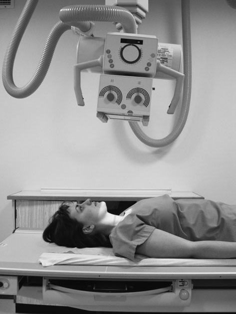
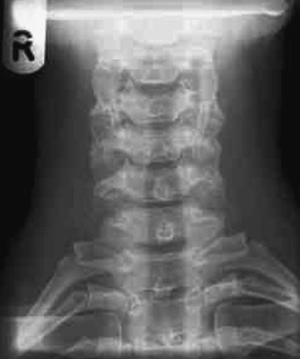
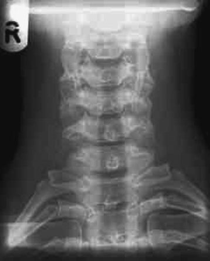
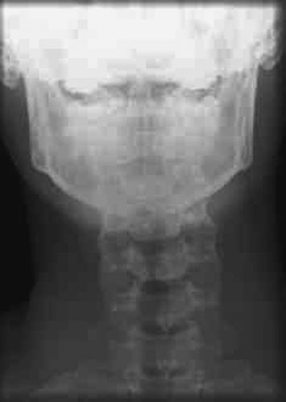
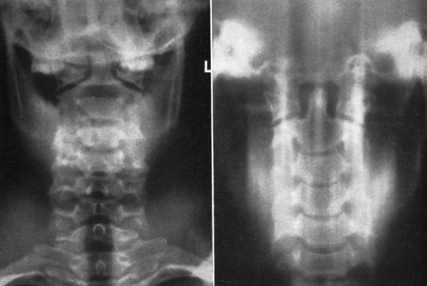

# Rx Coloană Cervicală Antero-Posterior (AP) - first and

  📷 Radiografie Convențională (Rx)
  <strong>Actualizat:</strong> 2026-09-16
  <strong>Autor:</strong> Departamentul de Radiologie / Referință Clark (Ed. 12)

---

-   __1. Rezumat Clinic & Indicații__

    ---

    === "Indicații Clinice"

        - unifacet luxație articulară poate fie diagnosed prin loss de continuity de line de procese spinoase (sau line bisecting bifid processes). This este made more difficult if pacientul este rotit sau imagine este underexposed.

    === "Ghid Național IRIS"

        !!! info "Referință Primară: Ghidul Național IRIS (Ordinul MS 1342/2012)"
            - **Capitol Ghid IRIS:** *Ghidul Național IRIS*
            - **Grad de Recomandare:** **De verificat pe indicație; fără grad atribuit automat**
            - **Nivel de Iradiere Estimată:** `De verificat pentru examinarea și populația selectate`

            [:octicons-search-16: Deschide Ghidul IRIS](../../iris.md){ .md-button .md-button--primary } [:material-open-in-new: Aplicația Oficială PWA](https://radiologie-pediatrica.ro/iris/){ .md-button target="_blank" rel="noopener" }
-   __2. Poziționare & Centrare Fascicul__

    ---

    - **Poziție Pacient:** • pacientul este culcat Decubit dorsal pe masa radiologică sau, if Ortostatism positioning este preferred, sits sau stands cu posterior aspect de capul și umeri pe / sprijinit de stativ vertical Bucky.
• planul mediosagital este ajustat la fie la drept-angles la caseta și la coincide cu linia mediană mesei sau Bucky.
• gâtul este extins (if pacientul’s condition will allow) astfel încât lower part de jaw este cleared de la upper cervical vertebra.
• caseta este poziționat în Bucky la coincide cu raza centrală centrală. tăvița Bucky will require some cranial displacement if tubul este înclinat.
    - **Punct de Centrare Fascicul:** • A 5–15-grade cranial angulation este employed, astfel încât inferior margine de simfiză menti este superimposed over occipital bone.
• fascicul este centred în linia mediană spre point just below prominence de cartilaj tiroid (mărul lui Adam) through fifth cervical vertebra.
172
    - **Distanță Focar-Film (DFF / SID):** 100 cm
    - **Comandă Respiratorie:** Apnee pe durata expunerii (apnee în inspir pentru torace; expir pentru Abdomen/bazin).

-   __3. Parametri Tehnici Expunere__

    ---

    | Parametru Tehnic | Valoare Configurare Generator / Tub |
    |:-----------------|:-------------------------------------|
    | **Tensiune Tub (kV)** | DE CONFIGURAT PE APARAT |
    | **Sarcină / Produs Curent-Timp (mAs)** | Conform AEC / grosime anatomică |
    | **Distanță Focar-Film (DFF / SID)** | 100 cm |
    | **Grilă Antidifuzoare (Bucky)** | Cu grilă antidifuzoare Bucky |
    | **Dimensiune Focar** | Focar Mic (0.6 mm) |
    | **Camere de Ionizare AEC** | Camerele laterale (sau camera centrală funcție de regiune) |
    | **Colimare Fascicul** | Colimare strictă la aria anatomică de interes diagnostic |
    | **Filtrare Tub** | Totală ≥ 2.5 mm Al echivalent (conform Clark: 3.0 mm Al eq.) |

-   __4. Criterii de Calitate & Reușită Imagine__

    ---

    - Erori de evitat / remedii: Failure la evidențiază upper vertebra: increase în tubul angle sau raising bărbia trebuie să provide solution.

-   __5. Protecție Radiologică (ALARA)__

    ---

    - Local protocols may state that this projection is not routinely used for degenerative disease. Antero-Posterior (AP) third to seventh vertebrae
    - Ecranare gonadică cu șorț plumbat dacă gonadele sunt în apropierea fasciculului util (regula ALARA).
    - Colimare precisă la dimensiunea anatomică strict necesară pentru reducerea dozei și a radiației difuze.
    - Verificarea posibilității unei sarcini la pacientele de vârstă fertilă înainte de expunere.

!!! note "Observații Clinice & Tehnice"
    decrease în pacient dose poate fie obtained prin nu using grilă.
This will produce imagine de lower contrast due la increased scatter incident pe film radiologic, but it trebuie să still fie de diagnostic quality. choice de whether la use grilă will vary according la local needs și preferences.

• Work este currently being undertaken la investigate advantages de performing this incidență postero-anteriorly. positioning este similar la Antero-posterior (AP) incidență, except that pacientul faces caseta și a 15-grade caudal angulation este applied la tubul. Indications suggest that this incidență has advantage de evidențiind disc spaces more clearly și substantially reducing dose la thyroid.
• moving jaw technique uses auto-Tomografie Liniară Convențională la diffuse imagine de Mandibulă, thus evidențiind upper vertebra more clearly. pacientul’s cap trebuie să fie imobilizat well, și expunere time that este long enough la allow jaw la open și close several times trebuie să fie used.
• Linear Tomografie Liniară Convențională has also been used la evidențiază cervical vertebra obscured prin Mandibulă și Masiv Facial (Oase ale Feței).
C3 C4 C5 C6 C7 Tv1 Spinous process de C7 1st rib Superimposed articular processes Air-filled trachea Occipital bone Poor quality imagine cu Mandibulă obscuring upper cervical coloană vertebrală Moving jaw technique Tomogram

### 🖼️ Imagini

<figure class="protocol-image-card" markdown>

<figcaption><strong>Figura 1: Aspect radiografic / Poziționare (Clark Ed. 12)</strong> — Poziționare pacient și centrare fascicul conform Clark (Ed. 12)</figcaption>

</figure>

<figure class="protocol-image-card" markdown>

<figcaption><strong>Figura 2: Aspect radiografic / Poziționare (Clark Ed. 12)</strong> — Aspect radiografic / ghid de poziționare conform tratatului Clark (Ed. 12)</figcaption>

</figure>

<figure class="protocol-image-card" markdown>

<figcaption><strong>incidență has advantage de evidențiind disc spaces more</strong> — Aspect radiografic / ghid de poziționare conform tratatului Clark (Ed. 12)</figcaption>

</figure>

<figure class="protocol-image-card" markdown>

<figcaption><strong>Figura 4: Aspect radiografic / Poziționare (Clark Ed. 12)</strong> — Aspect radiografic / ghid de poziționare conform tratatului Clark (Ed. 12)</figcaption>

</figure>

<figure class="protocol-image-card" markdown>

<figcaption><strong>Figura 5: Aspect radiografic / Poziționare (Clark Ed. 12)</strong> — Aspect radiografic / ghid de poziționare conform tratatului Clark (Ed. 12)</figcaption>

</figure>

=== "Ghid Rapid de Execuție"

    1. **Identificarea și verificarea pacientului:** verificare identitate, zonă de examinat, consimțământ conform procedurii și evaluarea posibilității unei sarcini, când este relevantă.
    2. **Pregătire:** îndepărtarea oricăror obiecte radiopace (bijuterii, agrafe, fermoare, proteze, pansamente dense).
    3. **Poziționare precisă:** alinierea receptorului de imagine și a tubului la distanța prescrisă (100 cm).
    4. **Colimare strictă:** adaptarea fasciculului strict la regiunea de diagnostic pentru scăderea iradierii și reducerea radiației difuze.
    5. **Radioprotecție:** verificarea [politicii RX](../radioprotectie.md), cu măsuri distincte pentru pacient, personal și însoțitor.

## Surse de documentare

- [Clark's Positioning in Radiography (Ed. 12), Pagina 187](../../assets/protocols/sources/Clark___Positioning_in_Radiography__12th_edition.pdf#page=187)
