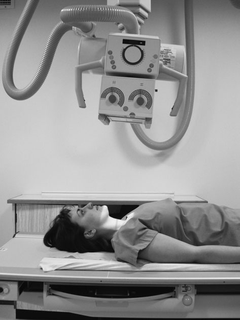
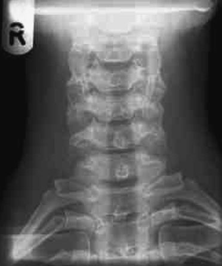
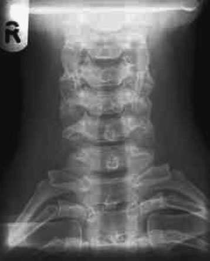
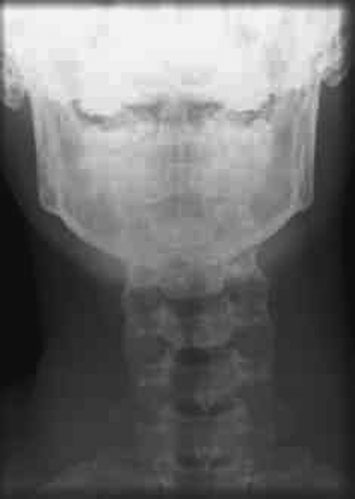
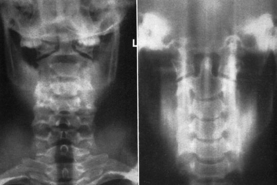

# Rx Coloană Cervicală Antero-Posterior (AP) - prima și

  📷 Radiografie Convențională (Rx)
  <strong>Actualizat:</strong> 2026-09-16
  <strong>Autor:</strong> Departamentul de Radiologie / Referință Clark (Ed. 12)

---

-   __1. Rezumat Clinic & Indicații__

    ---

    === "Indicații Clinice"

        - Luxația articulară unifațetară poate fi diagnosticată prin pierderea continuității liniei proceselor spinoase (sau a liniei care împarte în două procesele bifide). Acest lucru este mai dificil dacă pacientul este rotit sau imaginea este subexpusă.

    === "Ghid Național IRIS"

        !!! info "Referință Primară: Ghidul Național IRIS (Ordinul MS 1342/2012)"
            - **Capitol Ghid IRIS:** *Ghidul Național IRIS*
            - **Grad de Recomandare:** **De verificat pe indicație; fără grad atribuit automat**
            - **Nivel de Iradiere Estimată:** `De verificat pentru examinarea și populația selectate`

            [:octicons-search-16: Deschide Ghidul IRIS](../../iris.md){ .md-button .md-button--primary } [:material-open-in-new: Aplicația Oficială PWA](https://radiologie-pediatrica.ro/iris/){ .md-button target="_blank" rel="noopener" }
-   __2. Poziționare & Centrare Fascicul__

    ---

    - **Poziție Pacient:** • Pacientul este culcat în decubit dorsal pe masa radiologică sau, dacă se preferă poziționarea verticală, stă așezat ori în ortostatism, cu partea posterioară a capului și a umerilor sprijinită de stativul vertical Bucky.
• Planul mediosagital este ajustat astfel încât să fie în unghi drept față de casetă și să coincidă cu linia mediană a mesei sau a sistemului Bucky.
• Gâtul este extins (dacă starea pacientului permite), astfel încât partea inferioară a mandibulei să nu se mai suprapună peste vertebra cervicală superioară.
• Caseta este poziționată în sistemul Bucky pentru a coincide cu raza centrală. Tăvița Bucky va necesita o anumită deplasare cranială dacă tubul este înclinat.
    - **Punct de Centrare Fascicul:** • Se utilizează o angulație cranială de 5–15 grade, astfel încât marginea inferioară a simfizei mentoniere să se suprapună peste osul occipital.
• Fasciculul este centrat pe linia mediană spre un punct situat imediat sub proeminența cartilajului tiroid (mărul lui Adam), trecând prin a cincea vertebră cervicală.
172
    - **Distanță Focar-Film (DFF / SID):** 100 cm
    - **Comandă Respiratorie:** Apnee pe durata expunerii (apnee în inspir pentru torace; expir pentru Abdomen/bazin).

-   __3. Parametri Tehnici Expunere__

    ---

    | Parametru Tehnic | Valoare Configurare Generator / Tub |
    |:-----------------|:-------------------------------------|
    | **Tensiune Tub (kV)** | DE CONFIGURAT PE APARAT |
    | **Sarcină / Produs Curent-Timp (mAs)** | Conform AEC / grosimii anatomice |
    | **Distanță Focar-Film (DFF / SID)** | 100 cm |
    | **Grilă Antidifuzoare (Bucky)** | Cu grilă antidifuzoare Bucky |
    | **Dimensiune Focar** | Focar Mic (0.6 mm) |
    | **Camere de Ionizare AEC** | Camerele laterale (sau camera centrală, în funcție de regiune) |
    | **Colimare Fascicul** | Colimare strictă la aria anatomică de interes diagnostic |
    | **Filtrare Tub** | Totală ≥ 2.5 mm Al echivalent (conform Clark: 3.0 mm Al echivalent) |

-   __4. Criterii de Calitate & Reușită Imagine__

    ---

    - Erori de evitat / remedii: Neevidențierea vertebrei superioare: mărirea unghiului tubului sau ridicarea bărbiei ar trebui să rezolve problema.

-   __5. Protecție Radiologică (ALARA)__

    ---

    - Protocoalele locale pot preciza că această incidență nu este utilizată de rutină pentru boala degenerativă. Antero-posterior (AP), vertebrele de la a treia până la a șaptea
    - Ecranare gonadică cu șorț plumbat dacă gonadele sunt în apropierea fasciculului util (regula ALARA).
    - Colimare precisă la dimensiunea anatomică strict necesară pentru reducerea dozei și a radiației difuze.
    - Verificarea posibilității unei sarcini la pacientele de vârstă fertilă înainte de expunere.

!!! note "Observații Clinice & Tehnice"
    Se poate obține o reducere a dozei administrate pacientului prin neutilizarea grilei.
Aceasta va produce o imagine cu un contrast mai scăzut, din cauza cantității crescute de radiație împrăștiată incidentă pe filmul radiologic, dar imaginea trebuie să aibă în continuare o calitate diagnostică. Alegerea de a utiliza sau nu grila va varia în funcție de necesitățile și preferințele locale.

• În prezent se desfășoară cercetări pentru investigarea avantajelor realizării acestei incidențe în sens postero-anterior. Poziționarea este similară celei pentru incidența antero-posterioară (AP), cu excepția faptului că pacientul stă cu fața spre casetă, iar tubului i se aplică o angulație caudală de 15 grade. Datele sugerează că această incidență are avantajul de a evidenția mai clar spațiile discale și de a reduce substanțial doza la nivelul tiroidei.
• Tehnica mandibulei în mișcare utilizează autotomografia liniară convențională pentru a estompa imaginea mandibulei, evidențiind astfel mai clar vertebra superioară. Capul pacientului trebuie să fie bine imobilizat și trebuie utilizat un timp de expunere suficient de lung pentru a permite deschiderea și închiderea mandibulei de mai multe ori.
• Tomografia liniară convențională a fost utilizată și pentru evidențierea vertebrei cervicale mascate de mandibulă și de masivul facial (oasele feței).
C3 C4 C5 C6 C7 Tv1 Procesul spinos al C7 Coasta 1 Procese articulare suprapuse Trahee plină cu aer Os occipital Imagine de calitate slabă, cu mandibula mascând coloana cervicală superioară Tehnica mandibulei în mișcare Tomogramă

### 🖼️ Imagini

<figure class="protocol-image-card" markdown>

<figcaption><strong>Figura 1: Aspect radiografic / Poziționare (Clark Ed. 12)</strong> — Poziționarea pacientului și centrarea fasciculului conform Clark (Ed. 12)</figcaption>

</figure>

<figure class="protocol-image-card" markdown>

<figcaption><strong>Figura 2: Aspect radiografic / Poziționare (Clark Ed. 12)</strong> — Aspect radiografic / ghid de poziționare conform tratatului Clark (Ed. 12)</figcaption>

</figure>

<figure class="protocol-image-card" markdown>

<figcaption><strong>incidență are avantajul de a evidenția mai bine spațiile discale</strong> — Aspect radiografic / ghid de poziționare conform tratatului Clark (Ed. 12)</figcaption>

</figure>

<figure class="protocol-image-card" markdown>

<figcaption><strong>Figura 4: Aspect radiografic / Poziționare (Clark Ed. 12)</strong> — Aspect radiografic / ghid de poziționare conform tratatului Clark (Ed. 12)</figcaption>

</figure>

<figure class="protocol-image-card" markdown>

<figcaption><strong>Figura 5: Aspect radiografic / Poziționare (Clark Ed. 12)</strong> — Aspect radiografic / ghid de poziționare conform tratatului Clark (Ed. 12)</figcaption>

</figure>

=== "Ghid Rapid de Execuție"

    1. **Identificarea și verificarea pacientului:** verificare identitate, zonă de examinat, consimțământ conform procedurii și evaluarea posibilității unei sarcini, când este relevantă.
    2. **Pregătire:** îndepărtarea oricăror obiecte radiopace (bijuterii, agrafe, fermoare, proteze, pansamente dense).
    3. **Poziționare precisă:** alinierea receptorului de imagine și a tubului la distanța prescrisă (100 cm).
    4. **Colimare strictă:** adaptarea fasciculului strict la regiunea de diagnostic pentru scăderea iradierii și reducerea radiației difuze.
    5. **Radioprotecție:** verificarea [politicii RX](../radioprotectie.md), cu măsuri distincte pentru pacient, personal și însoțitor.

## Surse de documentare

- [Clark's Positioning in Radiography (Ed. 12), Pagina 187](https://books.google.com/books/about/Clark_s_Positioning_in_Radiography.html?id=Xxu6MwEACAAJ)
