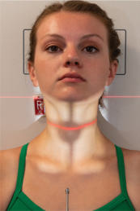
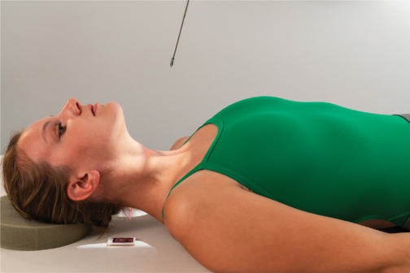
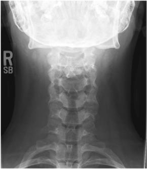
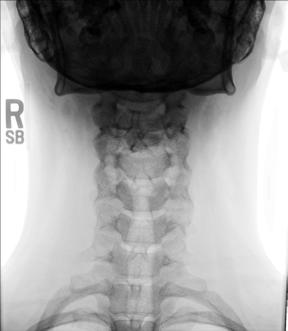

# Rx Coloană Cervicală AP Axială

  📷 Radiografie Convențională (Rx)
  <strong>Actualizat:</strong> 2026-09-15
  <strong>Autor:</strong> Departamentul de Radiologie / Referință Bontrager

---

-   __1. Rezumat Clinic & Indicații__

    ---

    === "Indicații Clinice"

        - Pathology involving mid și lower Coloană Cervicală (C3 la C7)
        - evidențiază clay shoveler’s suspiciune de fractură, compression suspiciune de fractură, HNP, și degenerative disease

    === "Ghid Național IRIS"

        !!! info "Referință Primară: Ghidul Național IRIS (Ordinul MS 1342/2012)"
            - **Capitol Ghid IRIS:** *Ghidul Național IRIS*
            - **Grad de Recomandare:** **De verificat pe indicație; fără grad atribuit automat**
            - **Nivel de Iradiere Estimată:** `De verificat pentru examinarea și populația selectate`

            [:octicons-search-16: Deschide Ghidul IRIS](../../iris.md){ .md-button .md-button--primary } [:material-open-in-new: Aplicația Oficială PWA](https://radiologie-pediatrica.ro/iris/){ .md-button target="_blank" rel="noopener" }
-   __2. Poziționare & Centrare Fascicul__

    ---

    - **Poziție Pacient:** Pacient: Decubit dorsal sau Ortostatism poziție pacient în Decubit dorsal sau Ortostatism poziție, cu brațele pe lângă corp.; Regiune anatomică: Align plan mediosagital la raza centrală și linia mediană mesei și/sau receptorul de imagine. Adjust cap so that line de la lower margin de upper incisors la base de Craniu (mastoid processes) este perpendicular la table și/sau receptorul de imagine. Line de la tip de Mandibulă la base de Craniu trebuie să fie paralel la înclinat raza centrală (Fig. 8.49). Ensure Absența rotației anatomice: clavicule echidistante față de linia apofizelor spinoase de capul sau thorax exists.
    - **Punct de Centrare Fascicul:** Raza centrală se înclină 15°–20° cranial (spre cap) (see NOTE). Raza centrală se orientează spre marginea superioară cartilajului tiroid pentru trece prin vertebra C4. Se centrează receptorul de imagine pe raza centrală.
    - **Distanță Focar-Film (DFF / SID):** 100 cm
    - **Comandă Respiratorie:** Apnee pe durata expunerii. Pacientul este instruit să nu înghită în timpul expunerii.

-   __3. Parametri Tehnici Expunere__

    ---

    | Parametru Tehnic | Valoare Configurare Generator / Tub |
    |:-----------------|:-------------------------------------|
    | **Tensiune Tub (kV)** | 70-85 kV |
    | **Sarcină / Produs Curent-Timp (mAs)** | DE CONFIGURAT PE APARAT |
    | **Distanță Focar-Film (DFF / SID)** | 100 cm |
    | **Grilă Antidifuzoare (Bucky)** | Cu grilă antidifuzoare Bucky |
    | **Dimensiune Focar** | Focar Mic (0.6 mm) |
    | **Camere de Ionizare AEC** | Camerele laterale (sau camera centrală funcție de regiune) |
    | **Colimare Fascicul** | Collimate pe four sides la anatomy de interest. |
    | **Filtrare Tub** | Totală ≥ 2.5 mm Al echivalent |

-   __4. Criterii de Calitate & Reușită Imagine__

    ---

    - C3 la T2 vertebral corpuri; space între pedicles și intervertebral disk spaces clar vizibil(e) (Figs. 8.50 și 8.51). poziție
    - Absența rotației anatomice: clavicule echidistante față de linia apofizelor spinoase indicated prin procese spinoase și articulații sternoclaviculare (if vizibil) echidistant față de spinal column lateral margini.
    - Mandibulă și base de Craniu trebuie să superimpose first two coloană cervicală.
    - Collimation la aria de interes diagnostic. expunere
    - optim receptorul de imagine expunere și contrast. Clear demonstration de părți moi margins și de bony margins și trabecular markings de coloană cervicală.
    - fără mișcare. Pedicle (C7) Intervertebral disk space (C6-7) Spinous process (C5) corp (C4) corp (C3) Fig. 8.51 AP axial, 15° cranial angle.

-   __5. Protecție Radiologică (ALARA)__

    ---

    - Ecranare gonadică și a organelor radiosensibile conform procedurilor locale de radioprotecție ALARA.
    - Colimare strictă la aria de interes pentru limitarea radiației difuze.
    - Verificarea posibilității unei sarcini la pacientele de vârstă fertilă înainte de expunere.

!!! note "Observații Clinice & Tehnice"
    Cephalic angulation directs fascicul între overlapping cervical vertebral corpuri la evidențiază intervertebral disk spaces better. Angle raza centrală 15° when pacientul este Decubit dorsal sau if there este less lordotic curvature. Angle raza centrală 20° when pacientul este Ortostatism, sau when more lordotic curvature este evident. kyphotic (exaggerated curvature de Coloană Toracală) pacient will require angle de more than 20°. Coloană Cervicală ROUTINE AP gură deschisă (transorală) (C1 și C2) AP axial oblic lateral Fig. 8.50 AP axial, 15° cranial angle. Fig. 8.49 AP axial, 15° cranial angle. Inset, 20° raza centrală, paralel la plane de intervertebral disk spaces, centrat pe C4.

### 🖼️ Imagini

<figure class="protocol-image-card" markdown>

<figcaption><strong>Fig. 8.50 AP axial, 15° cranial angle.</strong> — Poziționare pacient conform Ghidului Bontrager (Fig. 8.50 AP axial, 15° cranial angle.)</figcaption>

</figure>

<figure class="protocol-image-card" markdown>

<figcaption><strong>Fig. 8.49 AP axial, 15° cranial angle. Inset, 20° raza centrală, paralel la plane</strong> — Aspect radiografic de referință conform Ghidului Bontrager (Fig. 8.49 AP axial, 15° cranial angle. Inset, 20° raza centrală, paralel la plane)</figcaption>

</figure>

<figure class="protocol-image-card" markdown>

<figcaption><strong>Fig. 8.51 AP axial, 15° cranial angle.</strong> — Aspect radiografic de referință conform Ghidului Bontrager (Fig. 8.51 AP axial, 15° cranial angle.)</figcaption>

</figure>

<figure class="protocol-image-card" markdown>

<figcaption><strong>Figura 4</strong> — Aspect radiografic de referință conform Ghidului Bontrager (Figura 4)</figcaption>

</figure>

=== "Ghid Rapid de Execuție"

    1. **Identificarea și verificarea pacientului:** verificare identitate, zonă de examinat, consimțământ conform procedurii și evaluarea posibilității unei sarcini, când este relevantă.
    2. **Pregătire:** îndepărtarea oricăror obiecte radiopace (bijuterii, agrafe, fermoare, proteze, pansamente dense).
    3. **Poziționare precisă:** alinierea receptorului de imagine și a tubului la distanța prescrisă (100 cm).
    4. **Colimare strictă:** adaptarea fasciculului strict la regiunea de diagnostic pentru scăderea iradierii și reducerea radiației difuze.
    5. **Radioprotecție:** verificarea [politicii RX](../radioprotectie.md), cu măsuri distincte pentru pacient, personal și însoțitor.

## Surse de documentare

- [Bontrager's Textbook of Radiographic Positioning (Ed. 9/10), Pagina 333](https://www.elsevier.com/books/textbook-of-radiographic-positioning-and-related-anatomy/lampignano/978-0-323-65367-1)
