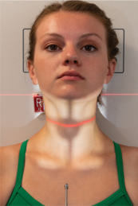
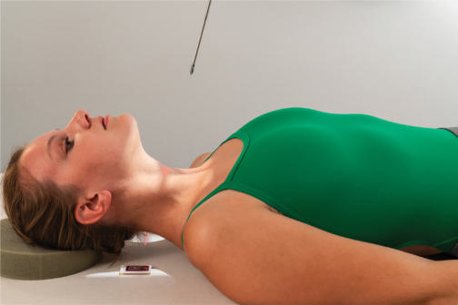
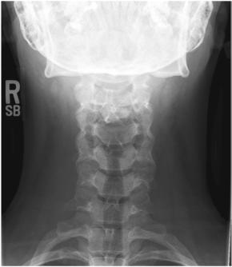
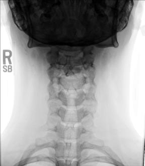

# Rx Coloană Cervicală AP Axială

  📷 Radiografie Convențională (Rx)
  <strong>Actualizat:</strong> 2026-09-15
  <strong>Autor:</strong> Departamentul de Radiologie / Referință Bontrager

---

-   __1. Rezumat Clinic & Indicații__

    ---

    === "Indicații Clinice"

        - Patologie care implică porțiunile medie și inferioară ale Coloanei Cervicale (C3 până la C7)
        - evidențiază suspiciunea de fractură a spărgătorului de piatră, suspiciunea de fractură prin compresie, HNP și boala degenerativă

    === "Ghid Național IRIS"

        !!! info "Referință Primară: Ghidul Național IRIS (Ordinul MS 1342/2012)"
            - **Capitol Ghid IRIS:** *Ghidul Național IRIS*
            - **Grad de Recomandare:** **De verificat pe indicație; fără grad atribuit automat**
            - **Nivel de Iradiere Estimată:** `De verificat pentru examinarea și populația selectate`

            [:octicons-search-16: Deschide Ghidul IRIS](../../iris.md){ .md-button .md-button--primary } [:material-open-in-new: Aplicația Oficială PWA](https://radiologie-pediatrica.ro/iris/){ .md-button target="_blank" rel="noopener" }
-   __2. Poziționare & Centrare Fascicul__

    ---

    - **Poziție Pacient:** Pacient: Decubit dorsal sau ortostatism, cu brațele pe lângă corp; Regiune anatomică: Aliniați planul mediosagital cu raza centrală și cu linia mediană a mesei și/sau a receptorului de imagine. Ajustați capul astfel încât linia de la marginea inferioară a incisivilor superiori la baza craniului (procesele mastoide) să fie perpendiculară pe masă și/sau pe receptorul de imagine. Linia de la vârful mandibulei la baza craniului trebuie să fie paralelă cu raza centrală înclinată (Fig. 8.49). Asigurați absența rotației anatomice: claviculele sunt echidistante față de linia proceselor spinoase [fragment deteriorat în sursă referitor la cap sau torace].
    - **Punct de Centrare Fascicul:** Raza centrală se înclină 15°–20° cranial (spre cap) (vezi NOTA). Raza centrală se orientează spre marginea superioară a cartilajului tiroid pentru a trece prin vertebra C4. Se centrează receptorul de imagine pe raza centrală.
    - **Distanță Focar-Film (DFF / SID):** 100 cm
    - **Comandă Respiratorie:** Apnee pe durata expunerii. Pacientul este instruit să nu înghită în timpul expunerii.

-   __3. Parametri Tehnici Expunere__

    ---

    | Parametru Tehnic | Valoare Configurare Generator / Tub |
    |:-----------------|:-------------------------------------|
    | **Tensiune Tub (kV)** | 70-85 kV |
    | **Sarcină / Produs Curent-Timp (mAs)** | DE CONFIGURAT PE APARAT |
    | **Distanță Focar-Film (DFF / SID)** | 100 cm |
    | **Grilă Antidifuzoare (Bucky)** | Cu grilă antidifuzoare Bucky |
    | **Dimensiune Focar** | Focar Mic (0.6 mm) |
    | **Camere de Ionizare AEC** | Camerele laterale (sau camera centrală, în funcție de regiune) |
    | **Colimare Fascicul** | Colimați pe cele patru laturi la anatomia de interes. |
    | **Filtrare Tub** | Totală ≥ 2.5 mm Al echivalent |

-   __4. Criterii de Calitate & Reușită Imagine__

    ---

    - Corpurile vertebrale de la C3 la T2; spațiul dintre pediculi și spațiile discale intervertebrale sunt clar vizibile (Fig. 8.50 și 8.51). poziție
    - Absența rotației anatomice: claviculele sunt echidistante față de linia proceselor spinoase, indicată de procesele spinoase, iar articulațiile sternoclaviculare (dacă sunt vizibile) sunt echidistante față de marginile laterale ale coloanei vertebrale.
    - Mandibula și baza craniului trebuie să se suprapună peste primele două vertebre cervicale.
    - Colimare la aria de interes diagnostic. Expunere
    - Expunere optimă a receptorului de imagine și contrast optim. Evidențiere clară a contururilor părților moi, a contururilor osoase și a trabeculației osoase a coloanei cervicale.
    - fără mișcare. Pedicul (C7) Spațiu discal intervertebral (C6-7) Proces spinos (C5) Corp (C4) Corp (C3) Fig. 8.51 AP axială, unghi cranial de 15°.

-   __5. Protecție Radiologică (ALARA)__

    ---

    - Ecranare gonadică și a organelor radiosensibile conform procedurilor locale de radioprotecție ALARA.
    - Colimare strictă la aria de interes pentru limitarea radiației difuze.
    - Verificarea posibilității unei sarcini la pacientele de vârstă fertilă înainte de expunere.

!!! note "Observații Clinice & Tehnice"
    Angulația cefalică direcționează fasciculul între corpurile vertebrale cervicale suprapuse pentru a evidenția mai bine spațiile discale intervertebrale. Se înclină raza centrală la 15° când pacientul este în decubit dorsal sau dacă există o curbură lordotică mai redusă. Se înclină raza centrală la 20° când pacientul este în ortostatism sau când este evidentă o curbură lordotică mai accentuată. Pacientul cifotic (cu o curbură exagerată a Coloanei Toracale) va necesita o înclinare mai mare de 20°. Coloană Cervicală RUTINĂ AP gură deschisă (transorală) (C1 și C2) AP axială oblică laterală Fig. 8.50 AP axială, unghi cranial de 15°. Fig. 8.49 AP axială, unghi cranial de 15°. Imagine inserată, raza centrală la 20°, paralelă cu planurile spațiilor discale intervertebrale, centrată pe C4.

### 🖼️ Imagini

<figure class="protocol-image-card" markdown>

<figcaption><strong>Fig. 8.50 AP axială, unghi cranial de 15°.</strong> — Poziționare pacient conform Ghidului Bontrager (Fig. 8.50 AP axială, unghi cranial de 15°.)</figcaption>

</figure>

<figure class="protocol-image-card" markdown>

<figcaption><strong>Fig. 8.49 AP axială, unghi cranial de 15°. Imagine inserată, raza centrală la 20°, paralelă cu planurile</strong> — Aspect radiografic de referință conform Ghidului Bontrager (Fig. 8.49 AP axială, unghi cranial de 15°. Imagine inserată, raza centrală la 20°, paralelă cu planurile)</figcaption>

</figure>

<figure class="protocol-image-card" markdown>

<figcaption><strong>Fig. 8.51 AP axială, unghi cranial de 15°.</strong> — Aspect radiografic de referință conform Ghidului Bontrager (Fig. 8.51 AP axială, unghi cranial de 15°.)</figcaption>

</figure>

<figure class="protocol-image-card" markdown>

<figcaption><strong>Figura 4</strong> — Aspect radiografic de referință conform Ghidului Bontrager (Figura 4)</figcaption>

</figure>

=== "Ghid Rapid de Execuție"

    1. **Identificarea și verificarea pacientului:** verificare identitate, zonă de examinat, consimțământ conform procedurii și evaluarea posibilității unei sarcini, când este relevantă.
    2. **Pregătire:** îndepărtarea oricăror obiecte radiopace (bijuterii, agrafe, fermoare, proteze, pansamente dense).
    3. **Poziționare precisă:** alinierea receptorului de imagine și a tubului la distanța prescrisă (100 cm).
    4. **Colimare strictă:** adaptarea fasciculului strict la regiunea de diagnostic pentru scăderea iradierii și reducerea radiației difuze.
    5. **Radioprotecție:** verificarea [politicii RX](../radioprotectie.md), cu măsuri distincte pentru pacient, personal și însoțitor.

## Surse de documentare

- [Bontrager's Textbook of Radiographic Positioning (Ed. 9/10), Pagina 333](https://www.elsevier.com/books/textbook-of-radiographic-positioning-and-related-anatomy/lampignano/978-0-323-65367-1)
