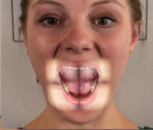
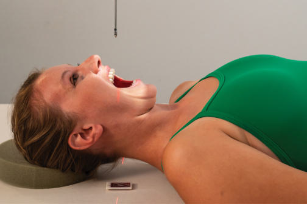
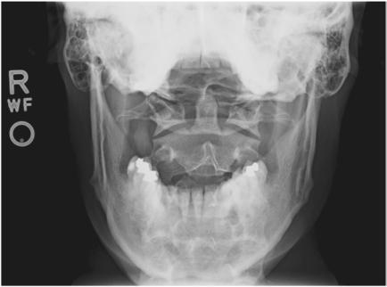
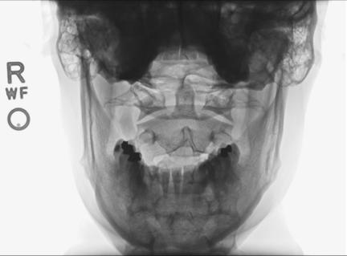

# Rx Coloană Cervicală AP Transorală (Gură Deschisă C1-C2) (C1 AND C2)

  📷 Radiografie Convențională (Rx)
  <strong>Actualizat:</strong> 2026-09-15
  <strong>Autor:</strong> Departamentul de Radiologie / Referință Bontrager

---

-   __1. Rezumat Clinic & Indicații__

    ---

    === "Indicații Clinice"

        - Pathology (particularly suspiciune de fractură) involving C1 și C2 și adjacent părți moi structures
        - evidențiază odontoid și Jefferson suspiciune de fractură

    === "Ghid Național IRIS"

        !!! info "Referință Primară: Ghidul Național IRIS (Ordinul MS 1342/2012)"
            - **Capitol Ghid IRIS:** *Ghidul Național IRIS*
            - **Grad de Recomandare:** **De verificat pe indicație; fără grad atribuit automat**
            - **Nivel de Iradiere Estimată:** `De verificat pentru examinarea și populația selectate`

            [:octicons-search-16: Deschide Ghidul IRIS](../../iris.md){ .md-button .md-button--primary } [:material-open-in-new: Aplicația Oficială PWA](https://radiologie-pediatrica.ro/iris/){ .md-button target="_blank" rel="noopener" }
-   __2. Poziționare & Centrare Fascicul__

    ---

    - **Poziție Pacient:** Pacient: Decubit dorsal sau Ortostatism poziție pacient în Decubit dorsal sau Ortostatism poziție cu brațele pe lângă corp. Place cap pe table surface, providing imobilizare if needed.; Regiune anatomică: Align plan mediosagital la raza centrală (raza centrală) și linia mediană mesei și/sau receptorul de imagine. Adjust cap so that, cu mouth open, line de la lower margin de upper incisors la base de Craniu (mastoid tips) este perpendicular la table și/sau receptorul de imagine, sau angle raza centrală accordingly. Se verifică absența rotației: claviculele sunt riguros echidistante față de linia proceselor spinoase capul (mandibular angles și mastoid tips equal distances de la receptorul de imagine) sau thorax exists. Ensure that mouth este wide open during expunere. Do this ca last step și work quickly because it este difficult la maintain this poziție (Fig. 8.46).
    - **Punct de Centrare Fascicul:** perpendicular pe receptorul de imagine Direct raza centrală through center de gură deschisă (transorală). Se centrează receptorul de imagine pe raza centrală.
    - **Distanță Focar-Film (DFF / SID):** 100 cm
    - **Comandă Respiratorie:** Apnee pe durata expunerii.

-   __3. Parametri Tehnici Expunere__

    ---

    | Parametru Tehnic | Valoare Configurare Generator / Tub |
    |:-----------------|:-------------------------------------|
    | **Tensiune Tub (kV)** | 70-85 kV |
    | **Sarcină / Produs Curent-Timp (mAs)** | DE CONFIGURAT PE APARAT |
    | **Distanță Focar-Film (DFF / SID)** | 100 cm |
    | **Grilă Antidifuzoare (Bucky)** | Cu grilă antidifuzoare Bucky |
    | **Dimensiune Focar** | Focar Mic (0.6 mm) |
    | **Camere de Ionizare AEC** | Camerele laterale (sau camera centrală funcție de regiune) |
    | **Colimare Fascicul** | Collimate pe four sides la anatomy de interest. |
    | **Filtrare Tub** | Totală ≥ 2.5 mm Al echivalent |

-   __4. Criterii de Calitate & Reușită Imagine__

    ---

    - Odontoid process (dens) și vertebral corp de C2, lateral masses și procese transverse de C1, și atlantoaxial articulații evidențiat through gură deschisă (transorală) (Figs. 8.47 și 8.48). poziție
    - optim flexion/extension de gâtul, indicated prin superimposition de lower margin de upper incisors pe base de Craniu. Neither teeth nor Craniu base trebuie să superimpose dens.
    - If teeth sunt superimposed pe upper dens, reposition prin slight hyperextension de gâtul sau angle raza centrală slightly cephalic.
    - If base de Craniu este superimposed pe upper dens, reposition prin slight hyperflexion de gâtul sau angle raza centrală slightly caudal (base de Craniu și/sau upper incisors will fie projected about 1 inch [2.5 cm] pentru every 5° de caudal angulation).
    - Absența rotației anatomice: clavicule echidistante față de linia apofizelor spinoase indicated prin equal distances de la lateral masses și/ sau procese transverse de C1 la condyles de Mandibulă și prin center alignment de spinous process de C2. rotație poate imitate pathology prin causing unequal spaces între lateral masses și dens.
    - Collimation la aria de interes diagnostic. expunere
    - optim receptorul de imagine expunere și contrast. Clear demonstration de părți moi margins și de bony margins și trabecular markings de coloană cervicală.
    - fără mișcare. Fig. 8.47 AP gură deschisă (transorală)—C1 la C2. Odontoid process lateral mass (C1) Upper incisor Atlantoaxial articulație (C1-C2) corp (C2) Fig. 8.48 AP gură deschisă (transorală)—C1 la C2.

-   __5. Protecție Radiologică (ALARA)__

    ---

    - Ecranare gonadică și a organelor radiosensibile conform procedurilor locale de radioprotecție ALARA.
    - Colimare strictă la aria de interes pentru limitarea radiației difuze.
    - Verificarea posibilității unei sarcini la pacientele de vârstă fertilă înainte de expunere.

!!! note "Observații Clinice & Tehnice"
    Make sure that when pacient este instructed la open mouth, only lower jaw moves. Se instruiește pacientul să keep tongue în lower jaw la prevent its shadow de la superimposing atlas și axis. If upper odontoid process cannot fie evidențiat cu correct positioning, perform Fuchs sau Judd method (p. 325). Coloană Cervicală ROUTINE AP gură deschisă (transorală) (C1 și C2) AP axial oblic lateral Fig. 8.46 AP gură deschisă (transorală)—C1 la C2.

### 🖼️ Imagini

<figure class="protocol-image-card" markdown>

<figcaption><strong>Fig. 8.46 AP gură deschisă (transorală)—C1 la C2.</strong> — Poziționare pacient conform Ghidului Bontrager (Fig. 8.46 AP gură deschisă (transorală)—C1 la C2.)</figcaption>

</figure>

<figure class="protocol-image-card" markdown>

<figcaption><strong>Fig. 8.47 AP gură deschisă (transorală)—C1 la C2.</strong> — Aspect radiografic de referință conform Ghidului Bontrager (Fig. 8.47 AP gură deschisă (transorală)—C1 la C2.)</figcaption>

</figure>

<figure class="protocol-image-card" markdown>

<figcaption><strong>Fig. 8.48 AP gură deschisă (transorală)—C1 la C2.</strong> — Aspect radiografic de referință conform Ghidului Bontrager (Fig. 8.48 AP gură deschisă (transorală)—C1 la C2.)</figcaption>

</figure>

<figure class="protocol-image-card" markdown>

<figcaption><strong>Figura 4</strong> — Aspect radiografic de referință conform Ghidului Bontrager (Figura 4)</figcaption>

</figure>

=== "Ghid Rapid de Execuție"

    1. **Identificarea și verificarea pacientului:** verificare identitate, zonă de examinat, consimțământ conform procedurii și evaluarea posibilității unei sarcini, când este relevantă.
    2. **Pregătire:** îndepărtarea oricăror obiecte radiopace (bijuterii, agrafe, fermoare, proteze, pansamente dense).
    3. **Poziționare precisă:** alinierea receptorului de imagine și a tubului la distanța prescrisă (100 cm).
    4. **Colimare strictă:** adaptarea fasciculului strict la regiunea de diagnostic pentru scăderea iradierii și reducerea radiației difuze.
    5. **Radioprotecție:** verificarea [politicii RX](../radioprotectie.md), cu măsuri distincte pentru pacient, personal și însoțitor.

## Surse de documentare

- [Bontrager's Textbook of Radiographic Positioning (Ed. 9/10), Pagina 332](https://www.elsevier.com/books/textbook-of-radiographic-positioning-and-related-anatomy/lampignano/978-0-323-65367-1)
