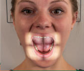
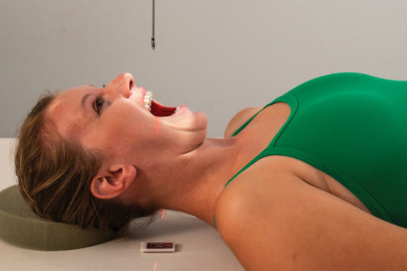
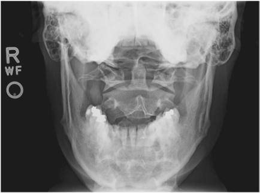
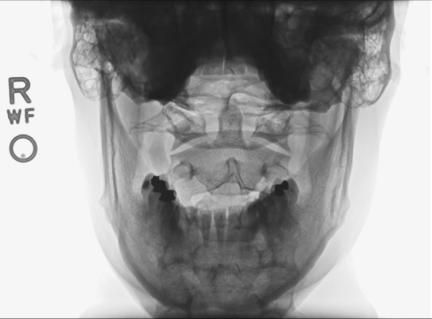

# Rx Coloană Cervicală AP Transorală (Gură Deschisă C1-C2) (C1 și C2)

  📷 Radiografie Convențională (Rx)
  <strong>Actualizat:</strong> 2026-09-15
  <strong>Autor:</strong> Departamentul de Radiologie / Referință Bontrager

---

-   __1. Rezumat Clinic & Indicații__

    ---

    === "Indicații Clinice"

        - Patologie (în special suspiciune de fractură) care implică C1 și C2 și structurile adiacente ale părților moi
        - evidențiază suspiciunea de fractură a odontoidei și suspiciunea de fractură Jefferson

    === "Ghid Național IRIS"

        !!! info "Referință Primară: Ghidul Național IRIS (Ordinul MS 1342/2012)"
            - **Capitol Ghid IRIS:** *Ghidul Național IRIS*
            - **Grad de Recomandare:** **De verificat pe indicație; fără grad atribuit automat**
            - **Nivel de Iradiere Estimată:** `De verificat pentru examinarea și populația selectate`

            [:octicons-search-16: Deschide Ghidul IRIS](../../iris.md){ .md-button .md-button--primary } [:material-open-in-new: Aplicația Oficială PWA](https://radiologie-pediatrica.ro/iris/){ .md-button target="_blank" rel="noopener" }
-   __2. Poziționare & Centrare Fascicul__

    ---

    - **Poziție Pacient:** Pacient: Decubit dorsal sau ortostatism, cu brațele pe lângă corp. Așezați capul pe suprafața mesei, asigurând imobilizarea dacă este necesar; Regiune anatomică: Aliniați planul mediosagital cu raza centrală și cu linia mediană a mesei și/sau a receptorului de imagine. Ajustați capul astfel încât, cu gura deschisă, linia de la marginea inferioară a incisivilor superiori la baza craniului (vârfurile mastoidelor) să fie perpendiculară pe masă și/sau pe receptorul de imagine sau înclinați raza centrală în mod corespunzător. Verificați absența rotației: claviculele sunt riguros echidistante față de linia proceselor spinoase; unghiurile mandibulare și vârfurile mastoidelor sunt la distanțe egale față de receptorul de imagine [fragment deteriorat în sursă referitor la cap sau torace]. Asigurați-vă că gura este larg deschisă în timpul expunerii. Faceți acest lucru ca ultim pas și lucrați rapid, deoarece este dificil să mențineți această poziție (Fig. 8.46).
    - **Punct de Centrare Fascicul:** perpendicular pe receptorul de imagine. Direcționați raza centrală prin centrul gurii deschise (transoral). Se centrează receptorul de imagine pe raza centrală.
    - **Distanță Focar-Film (DFF / SID):** 100 cm
    - **Comandă Respiratorie:** Apnee pe durata expunerii.

-   __3. Parametri Tehnici Expunere__

    ---

    | Parametru Tehnic | Valoare Configurare Generator / Tub |
    |:-----------------|:-------------------------------------|
    | **Tensiune Tub (kV)** | 70-85 kV |
    | **Sarcină / Produs Curent-Timp (mAs)** | DE CONFIGURAT PE APARAT |
    | **Distanță Focar-Film (DFF / SID)** | 100 cm |
    | **Grilă Antidifuzoare (Bucky)** | Cu grilă antidifuzoare Bucky |
    | **Dimensiune Focar** | Focar Mic (0.6 mm) |
    | **Camere de Ionizare AEC** | Camerele laterale (sau camera centrală, în funcție de regiune) |
    | **Colimare Fascicul** | Colimați pe cele patru laturi la anatomia de interes. |
    | **Filtrare Tub** | Totală ≥ 2.5 mm Al echivalent |

-   __4. Criterii de Calitate & Reușită Imagine__

    ---

    - Procesul odontoid (densul) și corpul vertebral al C2, masele laterale și procesele transverse ale C1, precum și articulațiile atlantoaxiale sunt evidențiate prin gura deschisă (transoral) (Fig. 8.47 și 8.48). poziție
    - flexia/extensia optimă a gâtului, indicată prin suprapunerea marginii inferioare a incisivilor superiori peste baza craniului. Nici dinții, nici baza craniului nu trebuie să se suprapună peste dens.
    - Dacă dinții se suprapun peste densul superior, repoziționați printr-o ușoară hiperextensie a gâtului sau înclinați ușor cefalic raza centrală.
    - Dacă baza craniului se suprapune peste densul superior, repoziționați printr-o ușoară hiperflexie a gâtului sau înclinați ușor caudal raza centrală (baza craniului și/sau incisivii superiori vor fi proiectați cu aproximativ 1 inch [2.5 cm] pentru fiecare 5° de angulație caudală).
    - Absența rotației anatomice: claviculele sunt echidistante față de linia proceselor spinoase, indicată prin distanțe egale față de masele laterale și/sau procesele transverse ale C1 și condilii mandibulei, precum și prin alinierea centrală a procesului spinos al C2. Rotația poate imita patologia prin producerea unor spații inegale între masele laterale și dens.
    - Colimare la aria de interes diagnostic. Expunere
    - Expunere optimă a receptorului de imagine și contrast optim. Evidențiere clară a contururilor părților moi, a contururilor osoase și a trabeculației osoase a coloanei cervicale.
    - fără mișcare. Fig. 8.47 AP gură deschisă (transorală)—C1 până la C2. Proces odontoid Masă laterală (C1) Incisiv superior Articulație atlantoaxială (C1-C2) Corp (C2) Fig. 8.48 AP gură deschisă (transorală)—C1 până la C2.

-   __5. Protecție Radiologică (ALARA)__

    ---

    - Ecranare gonadică și a organelor radiosensibile conform procedurilor locale de radioprotecție ALARA.
    - Colimare strictă la aria de interes pentru limitarea radiației difuze.
    - Verificarea posibilității unei sarcini la pacientele de vârstă fertilă înainte de expunere.

!!! note "Observații Clinice & Tehnice"
    Asigurați-vă că, atunci când pacientul este instruit să deschidă gura, se mișcă numai mandibula. Instruiți pacientul să mențină limba în mandibulă pentru a preveni suprapunerea umbrei acesteia peste atlas și axis. Dacă procesul odontoid superior nu poate fi evidențiat prin poziționarea corectă, efectuați metoda Fuchs sau Judd (p. 325). Coloană Cervicală RUTINĂ AP gură deschisă (transorală) (C1 și C2) AP axială oblică laterală Fig. 8.46 AP gură deschisă (transorală)—C1 până la C2.

### 🖼️ Imagini

<figure class="protocol-image-card" markdown>

<figcaption><strong>Fig. 8.46 AP gură deschisă (transorală)—C1 până la C2.</strong> — Poziționare pacient conform Ghidului Bontrager (Fig. 8.46 AP gură deschisă (transorală)—C1 până la C2.)</figcaption>

</figure>

<figure class="protocol-image-card" markdown>

<figcaption><strong>Fig. 8.47 AP gură deschisă (transorală)—C1 până la C2.</strong> — Aspect radiografic de referință conform Ghidului Bontrager (Fig. 8.47 AP gură deschisă (transorală)—C1 până la C2.)</figcaption>

</figure>

<figure class="protocol-image-card" markdown>

<figcaption><strong>Fig. 8.48 AP gură deschisă (transorală)—C1 până la C2.</strong> — Aspect radiografic de referință conform Ghidului Bontrager (Fig. 8.48 AP gură deschisă (transorală)—C1 până la C2.)</figcaption>

</figure>

<figure class="protocol-image-card" markdown>

<figcaption><strong>Figura 4</strong> — Aspect radiografic de referință conform Ghidului Bontrager (Figura 4)</figcaption>

</figure>

=== "Ghid Rapid de Execuție"

    1. **Identificarea și verificarea pacientului:** verificare identitate, zonă de examinat, consimțământ conform procedurii și evaluarea posibilității unei sarcini, când este relevantă.
    2. **Pregătire:** îndepărtarea oricăror obiecte radiopace (bijuterii, agrafe, fermoare, proteze, pansamente dense).
    3. **Poziționare precisă:** alinierea receptorului de imagine și a tubului la distanța prescrisă (100 cm).
    4. **Colimare strictă:** adaptarea fasciculului strict la regiunea de diagnostic pentru scăderea iradierii și reducerea radiației difuze.
    5. **Radioprotecție:** verificarea [politicii RX](../radioprotectie.md), cu măsuri distincte pentru pacient, personal și însoțitor.

## Surse de documentare

- [Bontrager's Textbook of Radiographic Positioning (Ed. 9/10), Pagina 332](https://www.elsevier.com/books/textbook-of-radiographic-positioning-and-related-anatomy/lampignano/978-0-323-65367-1)
