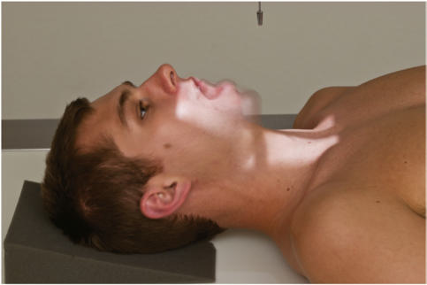
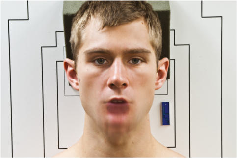
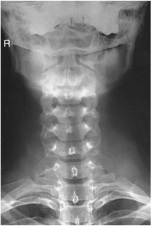
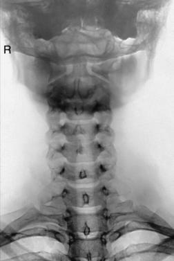

# Rx Coloană Cervicală AP “WAGGING JAW” PROJECTION (OTTONELLO METHOD)

  📷 Radiografie Convențională (Rx)
  <strong>Actualizat:</strong> 2026-09-15
  <strong>Autor:</strong> Departamentul de Radiologie / Referință Bontrager

---

-   __1. Rezumat Clinic & Indicații__

    ---

    === "Indicații Clinice"

        - Pathology involving the odontoid process and surrounding bony structures of the C1 ring, as well as the entire cervical column

    === "Ghid Național IRIS"

        !!! info "Referință Primară: Ghidul Național IRIS (Ordinul MS 1342/2012)"
            - **Capitol Ghid IRIS:** *Ghidul Național IRIS*
            - **Grad de Recomandare:** **De verificat pe indicație; fără grad atribuit automat**
            - **Nivel de Iradiere Estimată:** `De verificat pentru examinarea și populația selectate`

            [:octicons-search-16: Deschide Ghidul IRIS](../../iris.md){ .md-button .md-button--primary } [:material-open-in-new: Aplicația Oficială PWA](https://radiologie-pediatrica.ro/iris/){ .md-button target="_blank" rel="noopener" }
-   __2. Poziționare & Centrare Fascicul__

    ---

    - **Poziție Pacient:** Pacient: Decubit Dorsal Position Position patient in the Decubit Dorsal position with arms at side and head on table surface, providing immobilization if needed.; Regiune anatomică: Align midsagittal plane to CR and midline of table and/or IR. Adjust head so that a line drawn from lower margin of upper incisors to the base of the Craniu (mastoid tips) is perpendicular to table and/or IR (Figs. 8.73 and 8.74). Ensure Absența rotației anatomice: clavicule echidistante față de linia apofizelor spinoase of the head or thorax exists. Mandibulă must be in continuous motion during exposure. Ensure that only the Mandibulă moves. The head must not move, and the teeth must not make contact.
    - **Punct de Centrare Fascicul:** perpendicular to IR. Direct CR to C4 (upper margin of thyroid cartilage). Center IR to CR.
    - **Distanță Focar-Film (DFF / SID):** 100 cm
    - **Comandă Respiratorie:** Suspend respiration.

-   __3. Parametri Tehnici Expunere__

    ---

    | Parametru Tehnic | Valoare Configurare Generator / Tub |
    |:-----------------|:-------------------------------------|
    | **Tensiune Tub (kV)** | 70-85 kV |
    | **Sarcină / Produs Curent-Timp (mAs)** | DE CONFIGURAT PE APARAT |
    | **Distanță Focar-Film (DFF / SID)** | 100 cm |
    | **Grilă Antidifuzoare (Bucky)** | Cu grilă antidifuzoare Bucky |
    | **Dimensiune Focar** | Focar Mic (0.6 mm) |
    | **Camere de Ionizare AEC** | Camerele laterale (sau camera centrală funcție de regiune) |
    | **Colimare Fascicul** | Collimate on four sides to anatomy of interest |
    | **Filtrare Tub** | Totală ≥ 2.5 mm Al echivalent |

-   __4. Criterii de Calitate & Reușită Imagine__

    ---

    - C1 to C7 vertebral bodies with overlying blurred Mandibulă (Figs. 8.75 and 8.76) Position:
    - Accurate positioning indicated by demonstration of C1 and C2 without superimposition of maxillae or occipital bones. Optimal movement of Mandibulă indicated by visualization of underlying cervical vertebrae.
    - Collimation to area of interest. Exposure:
    - Optimal image receptor exposure and contrast. Clear demonstration of soft tissue margins and of bony margins and trabecular markings of cervical vertebrae.
    - Trabecular markings of upper vertebrae are somewhat masked by blurred Mandibulă. Fig. 8.75 AP radiograph of “wagging jaw” during exposure. (From Frank ED, Long BW, Smith BJ: Merrill’s atlas of radiographic positioning and procedures, ed 11, St. Louis, 2007, Mosby.) Odontoid process (dens) (C2) Mandibulă Fig. 8.76 AP “wagging jaw.” (Modified from Frank ED, Long BW, Smith BJ: Merrill’s atlas of radiographic positioning and procedures, ed 11, St. Louis, 2007, Mosby.)

-   __5. Protecție Radiologică (ALARA)__

    ---

    - Ecranare gonadică și a organelor radiosensibile conform procedurilor locale de radioprotecție ALARA.
    - Colimare strictă la aria de interes pentru limitarea radiației difuze.
    - Verificarea posibilității unei sarcini la pacientele de vârstă fertilă înainte de expunere.

!!! note "Observații Clinice & Tehnice"
    Practice with patient before exposure to ensure that only the Mandibulă is moving continuously and that teeth do not make contact. 24 R No AEC because of long exposure Coloană Cervicală SPECIAL Cervicothoracic lateral (Swimmer’s) Lateral—hyperflexion and hyperextension AP (Fuchs method), pA (Judd method) AP moving or “wagging jaw” (ottonello method) Fig. 8.73 Position for AP “wagging jaw.” Fig. 8.74 AP “wagging jaw.”

### 🖼️ Imagini

<figure class="protocol-image-card" markdown>

<figcaption><strong>Fig. 8.73 Position for AP “wagging jaw.”</strong> — Poziționare pacient conform Ghidului Bontrager (Fig. 8.73 Position for AP “wagging jaw.”)</figcaption>

</figure>

<figure class="protocol-image-card" markdown>

<figcaption><strong>Fig. 8.74 AP “wagging jaw.”</strong> — Aspect radiografic de referință conform Ghidului Bontrager (Fig. 8.74 AP “wagging jaw.”)</figcaption>

</figure>

<figure class="protocol-image-card" markdown>

<figcaption><strong>Fig. 8.75 AP radiograph of</strong> — Aspect radiografic de referință conform Ghidului Bontrager (Fig. 8.75 AP radiograph of)</figcaption>

</figure>

<figure class="protocol-image-card" markdown>

<figcaption><strong>Fig. 8.76 AP “wagging jaw.”</strong> — Aspect radiografic de referință conform Ghidului Bontrager (Fig. 8.76 AP “wagging jaw.”)</figcaption>

</figure>

=== "Ghid Rapid de Execuție"

    1. **Identificarea și verificarea pacientului:** verificare identitate, zonă de examinat, consimțământ conform procedurii și evaluarea posibilității unei sarcini, când este relevantă.
    2. **Pregătire:** îndepărtarea oricăror obiecte radiopace (bijuterii, agrafe, fermoare, proteze, pansamente dense).
    3. **Poziționare precisă:** alinierea receptorului de imagine și a tubului la distanța prescrisă (100 cm).
    4. **Colimare strictă:** adaptarea fasciculului strict la regiunea de diagnostic pentru scăderea iradierii și reducerea radiației difuze.
    5. **Radioprotecție:** verificarea [politicii RX](../radioprotectie.md), cu măsuri distincte pentru pacient, personal și însoțitor.

## Surse de documentare

- [Bontrager's Textbook of Radiographic Positioning (Ed. 9/10), Pagina 340](https://www.elsevier.com/books/textbook-of-radiographic-positioning-and-related-anatomy/lampignano/978-0-323-65367-1)
