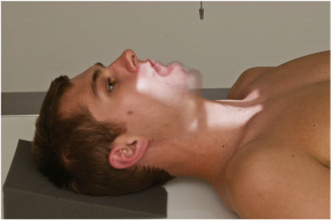
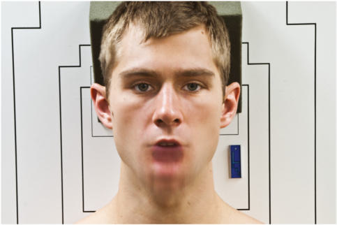
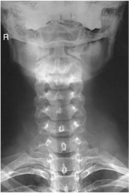
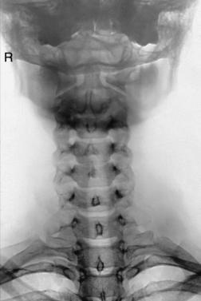

# Rx Coloană Cervicală AP „MANDIBULĂ OSCILANTĂ” (METODA OTTONELLO)

  📷 Radiografie Convențională (Rx)
  <strong>Actualizat:</strong> 2026-09-15
  <strong>Autor:</strong> Departamentul de Radiologie / Referință Bontrager

---

-   __1. Rezumat Clinic & Indicații__

    ---

    === "Indicații Clinice"

        - Patologie care implică procesul odontoid și structurile osoase înconjurătoare ale inelului C1, precum și întreaga coloană cervicală

    === "Ghid Național IRIS"

        !!! info "Referință Primară: Ghidul Național IRIS (Ordinul MS 1342/2012)"
            - **Capitol Ghid IRIS:** *Ghidul Național IRIS*
            - **Grad de Recomandare:** **De verificat pe indicație; fără grad atribuit automat**
            - **Nivel de Iradiere Estimată:** `De verificat pentru examinarea și populația selectate`

            [:octicons-search-16: Deschide Ghidul IRIS](../../iris.md){ .md-button .md-button--primary } [:material-open-in-new: Aplicația Oficială PWA](https://radiologie-pediatrica.ro/iris/){ .md-button target="_blank" rel="noopener" }
-   __2. Poziționare & Centrare Fascicul__

    ---

    - **Poziție Pacient:** Pacient: Decubit dorsal, cu brațele pe lângă corp și capul pe suprafața mesei, asigurând imobilizarea dacă este necesar; Regiune anatomică: Aliniați planul mediosagital cu raza centrală și cu linia mediană a mesei și/sau a receptorului de imagine. Ajustați capul astfel încât linia trasată de la marginea inferioară a incisivilor superiori la baza craniului (vârfurile mastoidelor) să fie perpendiculară pe masă și/sau pe receptorul de imagine (Fig. 8.73 și 8.74). Asigurați absența rotației anatomice: claviculele sunt echidistante față de linia proceselor spinoase [fragment deteriorat în sursă referitor la cap sau torace]. Mandibula trebuie să fie în mișcare continuă în timpul expunerii. Asigurați-vă că se mișcă numai mandibula. Capul nu trebuie să se miște, iar dinții nu trebuie să intre în contact.
    - **Punct de Centrare Fascicul:** perpendicular pe receptorul de imagine. Raza centrală se orientează spre C4 (marginea superioară a cartilajului tiroid (mărul lui Adam)). Se centrează receptorul de imagine pe raza centrală.
    - **Distanță Focar-Film (DFF / SID):** 100 cm
    - **Comandă Respiratorie:** Apnee pe durata expunerii.

-   __3. Parametri Tehnici Expunere__

    ---

    | Parametru Tehnic | Valoare Configurare Generator / Tub |
    |:-----------------|:-------------------------------------|
    | **Tensiune Tub (kV)** | 70-85 kV |
    | **Sarcină / Produs Curent-Timp (mAs)** | DE CONFIGURAT PE APARAT |
    | **Distanță Focar-Film (DFF / SID)** | 100 cm |
    | **Grilă Antidifuzoare (Bucky)** | Cu grilă antidifuzoare Bucky |
    | **Dimensiune Focar** | Focar Mic (0.6 mm) |
    | **Camere de Ionizare AEC** | Camerele laterale (sau camera centrală, în funcție de regiune) |
    | **Colimare Fascicul** | Colimați pe cele patru laturi la nivelul anatomiei de interes |
    | **Filtrare Tub** | Totală ≥ 2.5 mm Al echivalent |

-   __4. Criterii de Calitate & Reușită Imagine__

    ---

    - Corpurile vertebrale de la C1 la C7, cu mandibula suprapusă și neclară (Fig. 8.75 și 8.76) poziție:
    - Poziționarea precisă este indicată prin evidențierea C1 și C2 fără suprapunerea maxilarelor sau a oaselor occipitale. Mișcarea optimă a mandibulei este indicată prin vizualizarea coloanei cervicale subiacente.
    - Colimare la aria de interes diagnostic. Expunere:
    - Expunere optimă a receptorului de imagine și contrast optim. Evidențiere clară a contururilor părților moi, a contururilor osoase și a trabeculației osoase a coloanei cervicale.
    - Aspectul trabecular al vertebrelor superioare este parțial mascat de mandibula neclară. Fig. 8.75 Radiografie AP cu „mandibulă oscilantă” în timpul expunerii. (după Frank ED, Long BW, Smith BJ: Merrill’s atlas de poziționare și proceduri radiografice, ed. 11, St. Louis, 2007, Mosby.) Proces odontoid (dens) (C2) Mandibulă Fig. 8.76 AP „mandibulă oscilantă”. (Adaptat după Frank ED, Long BW, Smith BJ: Merrill’s atlas de poziționare și proceduri radiografice, ed. 11, St. Louis, 2007, Mosby.)

-   __5. Protecție Radiologică (ALARA)__

    ---

    - Ecranare gonadică și a organelor radiosensibile conform procedurilor locale de radioprotecție ALARA.
    - Colimare strictă la aria de interes pentru limitarea radiației difuze.
    - Verificarea posibilității unei sarcini la pacientele de vârstă fertilă înainte de expunere.

!!! note "Observații Clinice & Tehnice"
    Exersați cu pacientul înainte de expunere pentru a vă asigura că numai mandibula se mișcă continuu și că dinții nu intră în contact. 24 R fără AEC din cauza expunerii lungi Coloană Cervicală SPECIALĂ Laterală cervicotoracică (Swimmer) laterală—hiperflexie și hiperextensie AP (metoda Fuchs), PA (metoda Judd) AP în mișcare sau „mandibulă oscilantă” (metoda Ottonello) Fig. 8.73 Poziție pentru AP „mandibulă oscilantă”. Fig. 8.74 AP „mandibulă oscilantă”.

### 🖼️ Imagini

<figure class="protocol-image-card" markdown>

<figcaption><strong>Fig. 8.73 Poziție pentru AP „mandibulă oscilantă”.</strong> — Poziționare pacient conform Ghidului Bontrager (Fig. 8.73 Poziție pentru AP „mandibulă oscilantă”.)</figcaption>

</figure>

<figure class="protocol-image-card" markdown>

<figcaption><strong>Fig. 8.74 AP „mandibulă oscilantă”.</strong> — Aspect radiografic de referință conform Ghidului Bontrager (Fig. 8.74 AP „mandibulă oscilantă”.)</figcaption>

</figure>

<figure class="protocol-image-card" markdown>

<figcaption><strong>Fig. 8.75 Radiografie AP cu</strong> — Aspect radiografic de referință conform Ghidului Bontrager (Fig. 8.75 Radiografie AP cu)</figcaption>

</figure>

<figure class="protocol-image-card" markdown>

<figcaption><strong>Fig. 8.76 AP „mandibulă oscilantă”.</strong> — Aspect radiografic de referință conform Ghidului Bontrager (Fig. 8.76 AP „mandibulă oscilantă”.)</figcaption>

</figure>

=== "Ghid Rapid de Execuție"

    1. **Identificarea și verificarea pacientului:** verificare identitate, zonă de examinat, consimțământ conform procedurii și evaluarea posibilității unei sarcini, când este relevantă.
    2. **Pregătire:** îndepărtarea oricăror obiecte radiopace (bijuterii, agrafe, fermoare, proteze, pansamente dense).
    3. **Poziționare precisă:** alinierea receptorului de imagine și a tubului la distanța prescrisă (100 cm).
    4. **Colimare strictă:** adaptarea fasciculului strict la regiunea de diagnostic pentru scăderea iradierii și reducerea radiației difuze.
    5. **Radioprotecție:** verificarea [politicii RX](../radioprotectie.md), cu măsuri distincte pentru pacient, personal și însoțitor.

## Surse de documentare

- [Bontrager's Textbook of Radiographic Positioning (Ed. 9/10), Pagina 340](https://www.elsevier.com/books/textbook-of-radiographic-positioning-and-related-anatomy/lampignano/978-0-323-65367-1)
