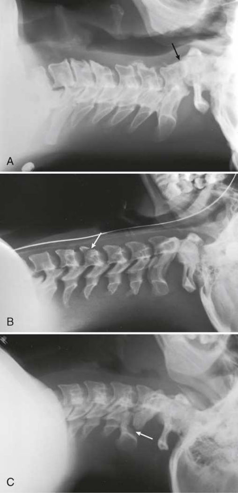

# Rx Coloană Cervicală — Incidență de Profil (Lateral) h — Right or left Incidență Decubit Dorsal (Merrill)

  📷 Radiografie Convențională (Rx)
  <strong>Actualizat:</strong> 2026-09-16
  <strong>Autor:</strong> Referință Merrill

---

-   __1. Rezumat Clinic & Indicații__

    ---

    === "Indicații Clinice"

        - Conform reperelor anatomice standard din tratat

    === "Ghid Național IRIS"

        !!! info "Referință Primară: Ghidul Național IRIS (Ordinul MS 1342/2012)"
            - **Capitol Ghid IRIS:** *Ghidul Național IRIS*
            - **Grad de Recomandare:** **De verificat pe indicație; fără grad atribuit automat**
            - **Nivel de Iradiere Estimată:** `De verificat pentru examinarea și populația selectate`

            [:octicons-search-16: Deschide Ghidul IRIS](../../iris.md){ .md-button .md-button--primary } [:material-open-in-new: Aplicația Oficială PWA](https://radiologie-pediatrica.ro/iris/){ .md-button target="_blank" rel="noopener" }
-   __2. Poziționare & Centrare Fascicul__

    ---

    - **Poziție Pacient:** se poziționează pacientul în Decubit dorsal poziție cu brațe extins down along sides de corp. Observe whether cervical collar sau another imobilizare device este being used. Do nu remove device fără consent de la physician sau authorized personnel.; Ensure that upper torso, Coloană Cervicală, și cap sunt nu rotit. Place grila longitudinal pe drept sau stâng side, paralel cu neck. Place top de grila approximately 1 inch (2.43 cm) above conduct auditiv extern (CAE) (conduct auditiv extern (CAE)) astfel încât grilă este centrat pe C4 (upper cartilaj tiroid (mărul lui Adam)). Raise bărbia slightly. If pacientul has new Traumatism / Regim Urgență, suspected suspiciune de fractură, sau known suspiciune de fractură de cervical region, check cu physician before elevating bărbia. Improper movement de pacient’s cap poate disrupt suspiciune de fracturăd Coloană Cervicală. se imobilizează grilă în vertical poziție. grila poate fie imobilizat în multiple ways if menținerea device este unavailable. Another method este la place pillows sau cushion între side rail de bed și receptorul de imagine, menținerea receptorul de imagine next la pacientul. Tape also works well în many instances (Fig. 20.25). Se instruiește pacientul să relax umerii și reach pentru picioarele if possible. se efectuează ecranarea gonadelor cu șorț plumbat.
    - **Punct de Centrare Fascicul:** orizontal și perpendicular pe center de grila. This trebuie să place raza centrală la nivelul C4 (upper cartilaj tiroid (mărul lui Adam)). Make sure that corect alignment de raza centrală și grilă este maintained în order la prevent grilă cutof. Because de great object-la-receptorul de imagine distance (OID), SID de 60 la 72 inches (158 la 183 cm) este recommended. This also helps show C7.
    - **Distanță Focar-Film (DFF / SID):** Nespecificat în fragmentul extras; de verificat în sursă
    - **Comandă Respiratorie:** Expir complet la obtain maximum depression de umerii.

-   __3. Parametri Tehnici Expunere__

    ---

    | Parametru Tehnic | Valoare Configurare Generator / Tub |
    |:-----------------|:-------------------------------------|
    | **Tensiune Tub (kV)** | DE CONFIGURAT PE APARAT |
    | **Sarcină / Produs Curent-Timp (mAs)** | DE CONFIGURAT PE APARAT |
    | **Distanță Focar-Film (DFF / SID)** | Nespecificat în fragmentul extras; de verificat în sursă |
    | **Grilă Antidifuzoare (Bucky)** | DE CONFIGURAT PE APARAT |
    | **Dimensiune Focar** | DE CONFIGURAT PE APARAT |
    | **Camere de Ionizare AEC** | DE CONFIGURAT PE APARAT |
    | **Colimare Fascicul** | se ajustează top de ear attachment (TEA), bottom la incizură jugulară (furculiță sternală), și 1 inch (2.5 cm) pe sides de gâtul. DIGITAL radiografie la ensure that lower coloană cervicală sunt fully penetrated, kVp trebuie să fie set la penetrate C7 area. |
    | **Filtrare Tub** | DE CONFIGURAT PE APARAT |

-   __4. Criterii de Calitate & Reușită Imagine__

    ---

    - following trebuie să fie clearly vizualizat:
    - Evidence de corect collimation
    - toate seven coloană cervicală, including interspaces și procese spinoase
    - Neck extins when possible so that rami de Mandibulă sunt nu overlapping C1 sau C2
    - C4 în center de grilă
    - Radiographic markeri (ca appropriate)
    - Superimposed posterior margins de fiecare vertebral corp

-   __5. Protecție Radiologică (ALARA)__

    ---

    - Nespecificat în fragmentul extras; de verificat în sursă

!!! note "Observații Clinice & Tehnice"
    It este essential that C6 și C7 fie included pe imagine. la accomplish this, radiographer trebuie să Se instruiește pacientul să relax umerii spre picioarele ca much ca possible. If examination involves pulling down pe pacientul’s brațe, radiographer trebuie să exercise extreme caution și evaluate pacientul’s condition carefully la determine whether pulling de brațele poate fie tolerated. suspiciune de fractură sau injuries de upper limbs, including clavicles, trebuie să fie considered. Applying strong pull la brațele de pacient în hurried sau jerking manner poate disrupt suspiciune de fracturăd Coloană Cervicală. If Incidență de Profil (lateral) does nu adequately visualize lower cervical region, Twining method (sometimes referred la ca “swimmer’s” poziție), which eliminates pulling de brațele, poate fie recommended pentru pacienți who have experienced Traumatism / Regim Urgență sau have known cervical suspiciune de fractură. One braț trebuie să fie plasat above pacientul’s cap (Twining method este described în Chapter 9).

### 🖼️ Imagini

<figure class="protocol-image-card" markdown>

<figcaption><strong>Merrill — pagina PDF 1501, imaginea 1</strong> — Imagine din fragmentul sursă; asocierea necesită revizie.</figcaption>

</figure>

=== "Ghid Rapid de Execuție"

    1. **Identificarea și verificarea pacientului:** verificare identitate, zonă de examinat, consimțământ conform procedurii și evaluarea posibilității unei sarcini, când este relevantă.
    2. **Pregătire:** îndepărtarea oricăror obiecte radiopace (bijuterii, agrafe, fermoare, proteze, pansamente dense).
    3. **Poziționare precisă:** alinierea receptorului de imagine și a tubului la distanța prescrisă (Nespecificat în fragmentul extras; de verificat în sursă).
    4. **Colimare strictă:** adaptarea fasciculului strict la regiunea de diagnostic pentru scăderea iradierii și reducerea radiației difuze.
    5. **Radioprotecție:** verificarea [politicii RX](../radioprotectie.md), cu măsuri distincte pentru pacient, personal și însoțitor.

## Surse de documentare

- [Merrill’s Atlas, 20. Mobile Radiography, pagini PDF 1499–1503](../../assets/protocols/sources/a56d45c16829_Merrills_Atlas_of_Radiographic_Positioning__Procedures_3Vol_Set.pdf#page=1499)

## Fragmente sursă traduse (referință tehnică)

### anatomy

This incidență shows seven coloană cervicală, including base de craniul și soft tissues surrounding gâtul (Fig. 20.26).

### collimation

• se ajustează top de ear attachment (TEA), bottom la incizură jugulară (furculiță sternală), și 1 inch (2.5 cm) pe sides de gâtul.
DIGITAL radiografie
la ensure that lower coloană cervicală sunt fully penetrated, kVp trebuie să fie set la penetrate C7 area.

### cr

• orizontal și perpendicular pe center de grila. This trebuie să place raza centrală la nivelul C4 (upper cartilaj tiroid (mărul lui Adam)).
• Make sure that corect alignment de raza centrală și grilă este maintained în order la prevent grilă cutof.
• Because de great object-la-receptorul de imagine distance (OID), SID de 60 la 72 inches (158 la 183 cm) este recommended. This also helps
show C7.

### criteria

following trebuie să fie clearly vizualizat:
• Evidence de corect collimation
• toate seven coloană cervicală, including interspaces și procese spinoase
• Neck extins when possible so that rami de mandible sunt nu overlapping C1 sau C2
• C4 în center de grilă
• Radiographic markeri (ca appropriate)
• Superimposed posterior margins de fiecare vertebral corp

### notes

It este essential that C6 și C7 fie included pe imagine. la accomplish this, radiographer trebuie să Se instruiește pacientul să relax umeri spre picioarele ca much ca possible. If examination involves pulling down pe pacientul’s brațe, radiographer trebuie să exercise
extreme caution și evaluate pacientul’s condition carefully la determine whether pulling de brațele poate fie tolerated. suspiciune de fractură sau injuries de
upper limbs, including clavicles, trebuie să fie considered. Applying strong pull la brațele de pacient în hurried sau jerking manner poate
disrupt suspiciune de fracturăd cervical coloană vertebrală. If lateral incidență does nu adequately visualize lower cervical region, Twining method (sometimes
referred la ca “swimmer’s” poziție), which eliminates pulling de brațele, poate fie recommended pentru pacienți who have experienced trauma sau
have known cervical suspiciune de fractură. One braț trebuie să fie plasat above pacientul’s cap (Twining method este described în Chapter 9).

### part_pos

• Ensure that upper torso, cervical coloană vertebrală, și cap sunt nu rotit.
• Place grila longitudinal pe drept sau stâng side, paralel cu neck.
• Place top de grila approximately 1 inch (2.43 cm) above conduct auditiv extern (CAE) (conduct auditiv extern (CAE)) astfel încât grilă este centrat pe C4
(upper cartilaj tiroid (mărul lui Adam)).
• Raise bărbia slightly. If pacientul has new trauma, suspected suspiciune de fractură, sau known suspiciune de fractură de cervical region, check cu physician before
elevating bărbia. Improper movement de pacient’s cap poate disrupt suspiciune de fracturăd cervical coloană vertebrală.
• se imobilizează grilă în vertical poziție. grila poate fie imobilizat în multiple ways if menținerea device este unavailable. Another
method este la place pillows sau cushion între side rail de bed și receptorul de imagine, menținerea receptorul de imagine next la pacientul. Tape also works
well în many instances (Fig. 20.25).
• Se instruiește pacientul să relax umerii și reach pentru picioarele if possible.
• se efectuează ecranarea gonadelor cu șorț plumbat.

### patient_pos

• se poziționează pacientul în decubit dorsal cu brațe extins down along sides de corp.
• Observe whether cervical collar sau another imobilizare device este being used. Do nu remove device fără consent de la physician sau authorized personnel.

### respiration

Expir complet la obtain maximum depression de umerii.

### tech

receptorul de imagine trebuie să fie 10 × 12 inches (24 × 30 cm) cu grilă longitudinal; imaging poate fie performed cu nongrid receptorul de imagine pe smaller
pacienți.

