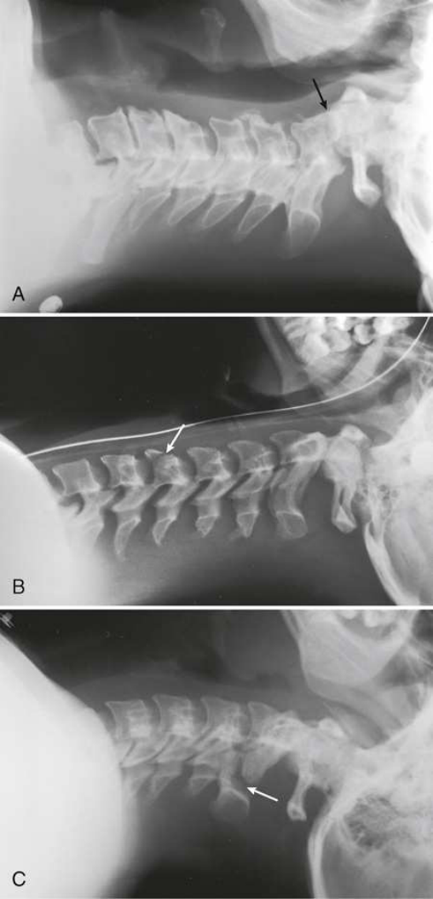

# Rx Coloană Cervicală — Incidență de Profil (Lateral) h — Dreapta sau stânga Incidență în Decubit Dorsal (Merrill)

  📷 Radiografie Convențională (Rx)
  <strong>Actualizat:</strong> 2026-09-16
  <strong>Autor:</strong> Referință Merrill

---

-   __1. Rezumat Clinic & Indicații__

    ---

    === "Indicații Clinice"

        - Conform reperelor anatomice standard din tratat

    === "Ghid Național IRIS"

        !!! info "Referință Primară: Ghidul Național IRIS (Ordinul MS 1342/2012)"
            - **Capitol Ghid IRIS:** *Ghidul Național IRIS*
            - **Grad de Recomandare:** **De verificat pe indicație; fără grad atribuit automat**
            - **Nivel de Iradiere Estimată:** `De verificat pentru examinarea și populația selectate`

            [:octicons-search-16: Deschide Ghidul IRIS](../../iris.md){ .md-button .md-button--primary } [:material-open-in-new: Aplicația Oficială PWA](https://radiologie-pediatrica.ro/iris/){ .md-button target="_blank" rel="noopener" }
-   __2. Poziționare & Centrare Fascicul__

    ---

    - **Poziție Pacient:** Se poziționează pacientul în decubit dorsal, cu brațele întinse în jos, de-a lungul laturilor corpului. Se observă dacă este utilizat un guler cervical sau un alt dispozitiv de imobilizare. Nu se îndepărtează dispozitivul fără acordul medicului sau al personalului autorizat. Se asigură că trunchiul superior, coloana cervicală și capul nu sunt rotite. Se plasează grila longitudinal, pe partea dreaptă sau stângă, paralel cu gâtul. Se plasează partea superioară a grilei la aproximativ 1 inch (2.43 cm) deasupra conductului auditiv extern (CAE) (conduct auditiv extern (CAE)), astfel încât grila să fie centrată pe C4 (cartilajul tiroid superior (mărul lui Adam)). Se ridică ușor bărbia. Dacă pacientul a suferit un traumatism / se află în regim de urgență, există suspiciune de fractură sau este cunoscută o fractură a regiunii cervicale, se verifică cu medicul înainte de ridicarea bărbiei. Mișcarea necorespunzătoare a capului pacientului poate agrava o suspiciune de fractură a coloanei cervicale. Se imobilizează grila în poziție verticală. Grila poate fi imobilizată în mai multe moduri dacă dispozitivul de menținere nu este disponibil. O altă metodă constă în plasarea unor perne sau a unei pernițe între bara laterală a patului și receptorul de imagine, menținând receptorul de imagine lângă pacient. Banda adezivă funcționează, de asemenea, bine în multe situații (Fig. 20.25). Se instruiește pacientul să-și relaxeze umerii și să întindă mâinile spre picioare, dacă este posibil. Se efectuează ecranarea gonadelor cu șorț plumbat.
    - **Punct de Centrare Fascicul:** orizontală și perpendiculară pe centrul grilei. Aceasta trebuie să plaseze raza centrală la nivelul C4 (cartilajul tiroid superior (mărul lui Adam)). Asigurați-vă că alinierea corectă a razei centrale și a grilei este menținută pentru a preveni tăierea grilei. Din cauza distanței mari obiect–receptor de imagine (OID), SID de 60 la 72 inches (158 la 183 cm) este recomandat. Acest lucru ajută, de asemenea, la evidențierea C7.
    - **Distanță Focar-Film (DFF / SID):** Nespecificat în fragmentul extras; de verificat în sursă
    - **Comandă Respiratorie:** Expir complet pentru a obține depresiunea maximă a umerilor.

-   __3. Parametri Tehnici Expunere__

    ---

    | Parametru Tehnic | Valoare Configurare Generator / Tub |
    |:-----------------|:-------------------------------------|
    | **Tensiune Tub (kV)** | DE CONFIGURAT PE APARAT |
    | **Sarcină / Produs Curent-Timp (mAs)** | DE CONFIGURAT PE APARAT |
    | **Distanță Focar-Film (DFF / SID)** | Nespecificat în fragmentul extras; de verificat în sursă |
    | **Grilă Antidifuzoare (Bucky)** | DE CONFIGURAT PE APARAT |
    | **Dimensiune Focar** | DE CONFIGURAT PE APARAT |
    | **Camere de Ionizare AEC** | DE CONFIGURAT PE APARAT |
    | **Colimare Fascicul** | Se ajustează partea superioară la nivelul atașamentului auricular (TEA), partea inferioară la nivelul incizurii jugulare (furculița sternală) și la 1 inch (2.5 cm) de fiecare parte a gâtului. RADIOGRAFIE DIGITALĂ Pentru a asigura penetrarea completă a coloanei cervicale inferioare, kVp trebuie setat astfel încât să penetreze regiunea C7. |
    | **Filtrare Tub** | DE CONFIGURAT PE APARAT |

-   __4. Criterii de Calitate & Reușită Imagine__

    ---

    - Următoarele trebuie să fie clar vizualizate:
    - Dovada unei colimări corecte
    - toate cele seven vertebre cervicale, inclusiv spațiile intervertebrale și procesele spinoase
    - Gâtul extins, când este posibil, astfel încât ramurile mandibulei să nu se suprapună peste C1 sau C2
    - C4 în centrul grilei
    - Markeri radiografici (după caz)
    - Marginile posterioare suprapuse ale fiecărui corp vertebral

-   __5. Protecție Radiologică (ALARA)__

    ---

    - Nespecificat în fragmentul extras; de verificat în sursă

!!! note "Observații Clinice & Tehnice"
    Este esențial ca C6 și C7 să fie incluse pe imagine. Pentru a realiza acest lucru, radiograful trebuie să instruiască pacientul să-și relaxeze umerii spre picioare cât mai mult posibil. Dacă examinarea implică tracționarea în jos a brațelor pacientului, radiograful trebuie să manifeste o precauție extremă și să evalueze cu atenție starea pacientului pentru a determina dacă tracționarea brațelor poate fi tolerată. Trebuie luată în considerare suspiciunea de fractură sau de leziuni ale membrelor superioare, inclusiv ale claviculelor. Aplicarea unei tracțiuni puternice asupra brațelor pacientului, într-un mod grăbit sau prin smucire, poate agrava o suspiciune de fractură a coloanei cervicale. Dacă incidența de profil nu vizualizează adecvat regiunea cervicală inferioară, metoda Twining (denumită uneori poziția „înotătorului”), care elimină tracționarea brațelor, poate fi recomandată pacienților care au suferit un traumatism / se află în regim de urgență sau au o suspiciune cunoscută de fractură cervicală. Un braț trebuie plasat deasupra capului pacientului (metoda Twining este descrisă în Capitolul 9).

### 🖼️ Imagini

<figure class="protocol-image-card" markdown>

<figcaption><strong>Merrill — pagina 1501, imaginea 1</strong> — Imagine din fragmentul sursă; asocierea necesită revizie.</figcaption>

</figure>

=== "Ghid Rapid de Execuție"

    1. **Identificarea și verificarea pacientului:** verificare identitate, zonă de examinat, consimțământ conform procedurii și evaluarea posibilității unei sarcini, când este relevantă.
    2. **Pregătire:** îndepărtarea oricăror obiecte radiopace (bijuterii, agrafe, fermoare, proteze, pansamente dense).
    3. **Poziționare precisă:** alinierea receptorului de imagine și a tubului la distanța prescrisă (Nespecificat în fragmentul extras; de verificat în sursă).
    4. **Colimare strictă:** adaptarea fasciculului strict la regiunea de diagnostic pentru scăderea iradierii și reducerea radiației difuze.
    5. **Radioprotecție:** verificarea [politicii RX](../radioprotectie.md), cu măsuri distincte pentru pacient, personal și însoțitor.

## Surse de documentare

- [Merrill’s Atlas, 20. Mobile Radiography, pagini 1499–1503](https://books.google.com/books/about/Merrill_s_Atlas_of_Radiographic_Position.html?id=BM0lEQAAQBAJ)

## Fragmente sursă traduse (referință tehnică)

### anatomie

Această incidență evidențiază cele seven vertebre cervicale, inclusiv baza craniului și țesuturile moi din jurul gâtului (Fig. 20.26).

### colimare

• Se ajustează partea superioară la nivelul atașamentului auricular (TEA), partea inferioară la nivelul incizurii jugulare (furculița sternală) și la 1 inch (2.5 cm) de fiecare parte a gâtului.
RADIOGRAFIE DIGITALĂ
Pentru a asigura penetrarea completă a coloanei cervicale inferioare, kVp trebuie setat astfel încât să penetreze regiunea C7.

### raza centrală

• orizontală și perpendiculară pe centrul grilei. Aceasta trebuie să plaseze raza centrală la nivelul C4 (cartilajul tiroid superior (mărul lui Adam)).
• Asigurați-vă că alinierea corectă a razei centrale și a grilei este menținută pentru a preveni tăierea grilei.
• Din cauza distanței mari obiect–receptor de imagine (OID), SID de 60 la 72 inches (158 la 183 cm) este recomandat. Acest lucru ajută, de asemenea,
la evidențierea C7.

### criterii

următoarele trebuie să fie vizualizate clar:
• Dovada unei colimări corecte
• toate cele seven vertebre cervicale, inclusiv spațiile intervertebrale și procesele spinoase
• Gâtul extins, când este posibil, astfel încât ramurile mandibulei să nu se suprapună peste C1 sau C2
• C4 în centrul grilei
• Markeri radiografici (după caz)
• Marginile posterioare suprapuse ale fiecărui corp vertebral

### note

Este esențial ca C6 și C7 să fie incluse pe imagine. Pentru a realiza acest lucru, radiograful trebuie să instruiască pacientul să-și relaxeze umerii spre picioare cât mai mult posibil. Dacă examinarea implică tracționarea în jos a brațelor pacientului, radiograful trebuie să manifeste o precauție extremă și să evalueze cu atenție starea pacientului pentru a determina dacă tracționarea brațelor poate fi tolerată. Trebuie luată în considerare suspiciunea de fractură sau de leziuni ale membrelor superioare, inclusiv ale claviculelor. Aplicarea unei tracțiuni puternice asupra brațelor pacientului, într-un mod grăbit sau prin smucire, poate agrava o suspiciune de fractură a coloanei cervicale. Dacă incidența laterală nu vizualizează adecvat regiunea cervicală inferioară, metoda Twining (denumită uneori poziția „înotătorului”), care elimină tracționarea brațelor, poate fi recomandată pacienților care au suferit un traumatism sau au o suspiciune cunoscută de fractură cervicală. Un braț trebuie plasat deasupra capului pacientului (metoda Twining este descrisă în Capitolul 9).

### part_pos

• Se asigură că trunchiul superior, coloana cervicală și capul nu sunt rotite.
• Se plasează grila longitudinal, pe partea dreaptă sau stângă, paralel cu gâtul.
• Se plasează partea superioară a grilei la aproximativ 1 inch (2.43 cm) deasupra conductului auditiv extern (CAE) (conduct auditiv extern (CAE)), astfel încât grila să fie centrată pe C4
(cartilajul tiroid superior (mărul lui Adam)).
• Se ridică ușor bărbia. Dacă pacientul a suferit un traumatism, există suspiciune de fractură sau este cunoscută o fractură a regiunii cervicale, se verifică cu medicul înainte de
ridicarea bărbiei. Mișcarea necorespunzătoare a capului pacientului poate agrava o suspiciune de fractură a coloanei cervicale.
• Se imobilizează grila în poziție verticală. Grila poate fi imobilizată în mai multe moduri dacă dispozitivul de menținere nu este disponibil. O altă
metodă constă în plasarea unor perne sau a unei pernițe între bara laterală a patului și receptorul de imagine, menținând receptorul de imagine lângă pacient. Banda adezivă funcționează, de asemenea,
bine în multe situații (Fig. 20.25).
• Se instruiește pacientul să-și relaxeze umerii și să întindă mâinile spre picioare, dacă este posibil.
• Se efectuează ecranarea gonadelor cu șorț plumbat.

### patient_pos

• Se poziționează pacientul în decubit dorsal, cu brațele întinse în jos, de-a lungul laturilor corpului.
• Se observă dacă este utilizat un guler cervical sau un alt dispozitiv de imobilizare. Nu se îndepărtează dispozitivul fără acordul medicului sau al personalului autorizat.

### respirație

Expir complet pentru a obține depresiunea maximă a umerilor.

### tehnică

Receptorul de imagine trebuie să fie de 10 × 12 inches (24 × 30 cm), cu grilă longitudinală; imagistica poate fi efectuată cu un receptor de imagine fără grilă la pacienții mai mici.

