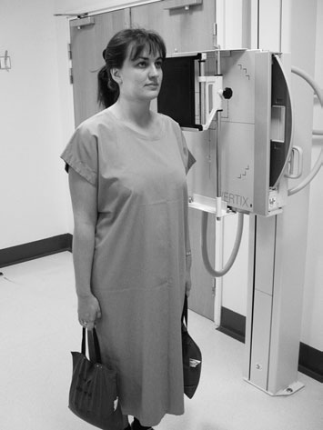
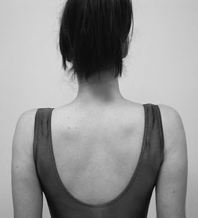
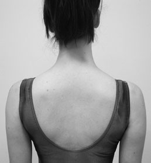
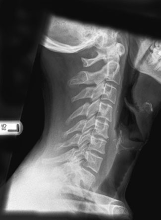
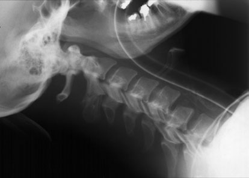
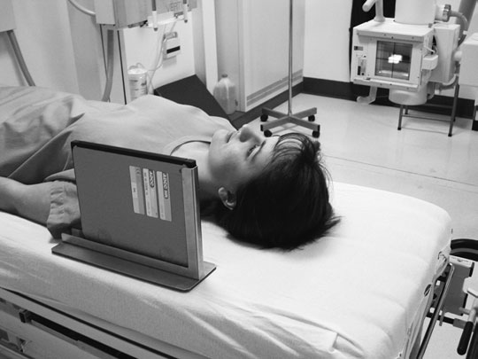
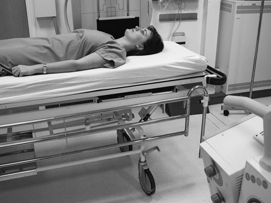

# Rx Coloană Cervicală Incidențe Standard de Bază

  📷 Radiografie Convențională (Rx)
  <strong>Actualizat:</strong> 2026-09-16
  <strong>Autor:</strong> Departamentul de Radiologie / Referință Clark (Ed. 12)

---

-   __1. Rezumat Clinic & Indicații__

    ---

    === "Indicații Clinice"

        - Atlanto-Axială subluxation este seen pe Profil (lateral) incidență, especially în flexion (where appropriate). Care este needed în making this diagnosis în children, în whom normal space este larger (adults 2 mm, children 3–5 mm).
        - Visualization de margins de gaură occipitală mare (foramen magnum) poate fie difficult but este necessary pentru diagnosis de various Craniu-base abnormalities, such ca basilar invagination. It will fie obscured prin incorrect expunere sau presence de earrings.
        - secondary sign de vertebral injury este tumefiere de soft tissues anterior la vertebral corp (normal thickness este less than depth de normal vertebral corp). This poate fie mimicked prin flexion de gâtul – always try la obtain filme radiologice în neutral poziție.

    === "Ghid Național IRIS"

        !!! info "Referință Primară: Ghidul Național IRIS (Ordinul MS 1342/2012)"
            - **Capitol Ghid IRIS:** *Ghidul Național IRIS*
            - **Grad de Recomandare:** **De verificat pe indicație; fără grad atribuit automat**
            - **Nivel de Iradiere Estimată:** `De verificat pentru examinarea și populația selectate`

            [:octicons-search-16: Deschide Ghidul IRIS](../../iris.md){ .md-button .md-button--primary } [:material-open-in-new: Aplicația Oficială PWA](https://radiologie-pediatrica.ro/iris/){ .md-button target="_blank" rel="noopener" }
-   __2. Poziționare & Centrare Fascicul__

    ---

    - **Poziție Pacient:** • pacientul stă în ortostatism sau sits cu either Umăr sprijinit pe casetă.
• planul mediosagital trebuie să fie ajustat such that it este paralel cu casetă.
• capul trebuie să fie flectat sau extins astfel încât angle de Mandibulă este nu superimposed over upper anterior cervical vertebra sau occipital bone does nu obscure posterior arch de atlas.
• la aid imobilizare, pacientul trebuie să stand cu picioarele slightly apart și cu Umăr resting sprijinit pe casetă stand.
• în order la evidențiază lower cervical vertebra, umerii trebuie să fie coborât, ca vizualizat în photograph.
This poate fie achieved prin asking pacientul la relax their umeri downwards. process poate fie aided prin asking pacientul la hold weight în fiecare Mână (if they sunt capable) și making expunere pe arrested expiration.

• pacientul will normally arrive în Decubit dorsal poziție.
• It este vitally important pentru pacientul la depress umerii (assuming fără other injuries la brațele).
• caseta poate fie either sprijinit vertically sau plasat în Ortostatism casetă holder, cu top de caseta la same level ca top de ear.
(contd) Profil (lateral) Decubit dorsal incidență evidențiind suspiciune de fractură luxație articulară de C5/C6 Positioning pentru Profil (lateral) Decubit dorsal incidență
    - **Punct de Centrare Fascicul:** • raza centrală orizontală centrală este centred la point vertically below proces mastoidian la nivelul prominence de cartilaj tiroid (mărul lui Adam).
    - **Distanță Focar-Film (DFF / SID):** 100 cm
    - **Comandă Respiratorie:** Apnee pe durata expunerii (apnee în inspir pentru torace; expir pentru Abdomen/bazin).

-   __3. Parametri Tehnici Expunere__

    ---

    | Parametru Tehnic | Valoare Configurare Generator / Tub |
    |:-----------------|:-------------------------------------|
    | **Tensiune Tub (kV)** | DE CONFIGURAT PE APARAT |
    | **Sarcină / Produs Curent-Timp (mAs)** | Conform AEC / grosime anatomică |
    | **Distanță Focar-Film (DFF / SID)** | 100 cm |
    | **Grilă Antidifuzoare (Bucky)** | Conform grosimii anatomice (> 10-12 cm cu grilă) |
    | **Dimensiune Focar** | Focar Mic (0.6 mm) |
    | **Camere de Ionizare AEC** | DE CONFIGURAT PE APARAT |
    | **Colimare Fascicul** | Colimare strictă adaptată pe receptor 18 x 24 cm |
    | **Filtrare Tub** | Totală ≥ 2.5 mm Al echivalent (conform Clark: 3.0 mm Al eq.) |

-   __4. Criterii de Calitate & Reușită Imagine__

    ---

    - whole de cervical coloană vertebrală trebuie să fie included, de la atlanto-occipital articulații la top de first thoracic vertebra.
    - Mandibulă sau occipital bone does nu obscure orice part de upper vertebra.
    - Angles de Mandibulă și Profil (lateral) portions de floor de posterior cranial fossa trebuie să fie superimposed.
    - Soft tissues de gâtul trebuie să fie included.
    - contrast trebuie să produce densities sufficient la evidențiază părți moi și bony detail. 168 Floor de posterior cranial fossa (occipital bone) Angle de Mandibulă C1 C2 C3 C4 C5 C6 C7 T1 Prevertebral părți moi umeri coborât
    - Erori de evitat / remedii: Failure la evidențiază C7/T1: if pacientul cannot depress umerii, even when menținerea weights, then swimmers’ incidență trebuie să fie considered.
    - Erori de evitat / remedii: Care trebuie să fie taken cu poziție de lead name blocker. Important anatomy poate easily fie obscured, especially when using small casetă.

-   __5. Protecție Radiologică (ALARA)__

    ---

    - Care should be taken when collimating to avoid including the eyes within the primary beam. Profil (Lateral) Decubit Dorsal For trauma cases, the patient’s condition usually requires the examination to be performed on a casualty trolley. The Profil (Lateral) cervical spine projection is taken first, without moving the patient. The resulting radiograph must be examined by a medical officer to establish whether the patient’s neck can be moved for other projections. See Section 16 for additional information.
    - Ecranare gonadică cu șorț plumbat dacă gonadele sunt în apropierea fasciculului util (regula ALARA).
    - Colimare precisă la dimensiunea anatomică strict necesară pentru reducerea dozei și a radiației difuze.
    - Verificarea posibilității unei sarcini la pacientele de vârstă fertilă înainte de expunere.

!!! note "Observații Clinice & Tehnice"
    • large object-la-film radiologic distance (OFD) will increase geometric unsharpness. This este overcome prin increasing focusto-film radiologic distance (FFD) la 150 cm.
• air gap între neck și film radiologic eliminates need la employ secondary radiation grilă la attenuate scatter.

### 🖼️ Imagini

<figure class="protocol-image-card" markdown>

<figcaption><strong>Figura 1: Aspect radiografic / Poziționare (Clark Ed. 12)</strong> — Poziționare pacient și centrare fascicul conform Clark (Ed. 12)</figcaption>

</figure>

<figure class="protocol-image-card" markdown>

<figcaption><strong>Figura 2: Aspect radiografic / Poziționare (Clark Ed. 12)</strong> — Aspect radiografic / ghid de poziționare conform tratatului Clark (Ed. 12)</figcaption>

</figure>

<figure class="protocol-image-card" markdown>

<figcaption><strong>Figura 3: Aspect radiografic / Poziționare (Clark Ed. 12)</strong> — Aspect radiografic / ghid de poziționare conform tratatului Clark (Ed. 12)</figcaption>

</figure>

<figure class="protocol-image-card" markdown>

<figcaption><strong>Figura 4: Aspect radiografic / Poziționare (Clark Ed. 12)</strong> — Aspect radiografic / ghid de poziționare conform tratatului Clark (Ed. 12)</figcaption>

</figure>

<figure class="protocol-image-card" markdown>

<figcaption><strong>making this diagnosis în children, în whom normal space</strong> — Aspect radiografic / ghid de poziționare conform tratatului Clark (Ed. 12)</figcaption>

</figure>

<figure class="protocol-image-card" markdown>

<figcaption><strong>abnormalities, such ca basilar invagination. It will fie obscured</strong> — Aspect radiografic / ghid de poziționare conform tratatului Clark (Ed. 12)</figcaption>

</figure>

<figure class="protocol-image-card" markdown>

<figcaption><strong>tissues anterior la vertebral corp (normal thickness este less</strong> — Aspect radiografic / ghid de poziționare conform tratatului Clark (Ed. 12)</figcaption>

</figure>

=== "Ghid Rapid de Execuție"

    1. **Identificarea și verificarea pacientului:** verificare identitate, zonă de examinat, consimțământ conform procedurii și evaluarea posibilității unei sarcini, când este relevantă.
    2. **Pregătire:** îndepărtarea oricăror obiecte radiopace (bijuterii, agrafe, fermoare, proteze, pansamente dense).
    3. **Poziționare precisă:** alinierea receptorului de imagine și a tubului la distanța prescrisă (100 cm).
    4. **Colimare strictă:** adaptarea fasciculului strict la regiunea de diagnostic pentru scăderea iradierii și reducerea radiației difuze.
    5. **Radioprotecție:** verificarea [politicii RX](../radioprotectie.md), cu măsuri distincte pentru pacient, personal și însoțitor.

## Surse de documentare

- [Clark's Positioning in Radiography (Ed. 12), Pagina 183](../../assets/protocols/sources/Clark___Positioning_in_Radiography__12th_edition.pdf#page=183)
