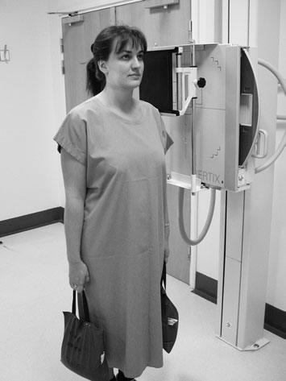
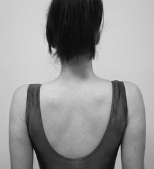
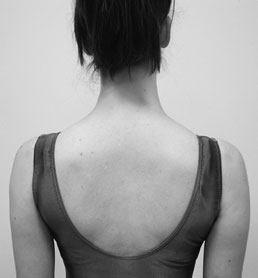
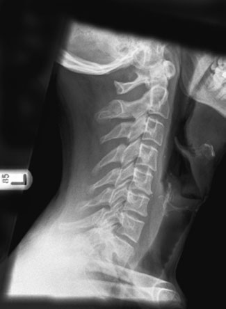
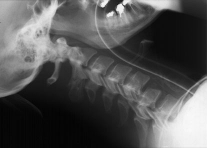
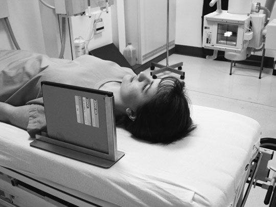
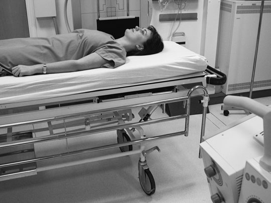

# Rx Coloană Cervicală Incidențe Standard de Bază

  📷 Radiografie Convențională (Rx)
  <strong>Actualizat:</strong> 2026-09-16
  <strong>Autor:</strong> Departamentul de Radiologie / Referință Clark (Ed. 12)

---

-   __1. Rezumat Clinic & Indicații__

    ---

    === "Indicații Clinice"

        - Subluxația atlanto-axială este vizibilă pe incidența de profil, în special în flexie, dacă este adecvat. Este necesară precauție la stabilirea acestui diagnostic la copii, la care spațiul normal este mai mare (adulți 2 mm, copii 3–5 mm).
        - Vizualizarea marginilor găurii occipitale mari (foramen magnum) poate fi dificilă, dar este necesară pentru diagnosticul diferitelor anomalii ale bazei craniului, cum ar fi invaginația bazilară. Aceasta va fi obscurată de expunerea incorectă sau de prezența cerceilor.
        - Un semn secundar al leziunii vertebrale este tumefierea țesuturilor moi anterioare corpului vertebral (grosimea normală este mai mică decât profunzimea corpului vertebral normal). Aceasta poate fi mimată de flexia gâtului – se încearcă întotdeauna obținerea radiografiilor în poziție neutră.

    === "Ghid Național IRIS"

        !!! info "Referință Primară: Ghidul Național IRIS (Ordinul MS 1342/2012)"
            - **Capitol Ghid IRIS:** *Coloană vertebrală & Traumatisme*
            - **Grad de Recomandare:** **Grad A**
            - **Nivel de Iradiere Estimată:** `Clasa 1 (Minimă < 0.2 mSv)`

            [:octicons-search-16: Deschide Ghidul IRIS](../../iris.md){ .md-button .md-button--primary } [:material-open-in-new: Aplicația Oficială PWA](https://radiologie-pediatrica.ro/iris/){ .md-button target="_blank" rel="noopener" }

-   __2. Poziționare & Centrare Fascicul__

    ---

    - **Poziție Pacient:**
        - Pacientul stă în ortostatism sau stă cu unul dintre umeri sprijinit pe casetă.
        - Planul mediosagital trebuie ajustat astfel încât să fie paralel cu caseta.
        - Capul trebuie flectat sau extins astfel încât unghiul mandibulei să nu se suprapună peste vertebra cervicală anterioară superioară sau osul occipital să nu obscurizeze arcul posterior al atlasului.
        - Pentru a ajuta la imobilizare, pacientul trebuie să stea cu picioarele ușor depărtate și cu umărul sprijinit pe suportul casetei.
        - Pentru evidențierea vertebrelor cervicale inferioare, umerii trebuie coborâți, după cum se vede în fotografie. Acest lucru poate fi realizat cerându-i pacientului să-și relaxeze umerii în jos. Procesul poate fi ajutat cerându-i pacientului să țină câte o greutate în fiecare mână (dacă este capabil) și efectuând expunerea în apnee după expir.
        - Pacientul va ajunge în mod normal în decubit dorsal.
        - Este extrem de important ca pacientul să-și coboare umerii (presupunând că nu există alte leziuni ale brațelor).
        - Caseta poate fi fie sprijinită vertical, fie plasată într-un suport de casetă pentru ortostatism, cu partea superioară a casetei la același nivel cu partea superioară a urechii. (continuare) Incidență de profil în decubit dorsal, evidențiind suspiciunea de fractură-luxație articulară C5/C6 Poziționare pentru incidența de profil în decubit dorsal
    - **Punct de Centrare Fascicul:** • Raza centrală orizontală este centrată în punctul situat vertical sub procesul mastoidian, la nivelul proeminenței cartilajului tiroid (mărul lui Adam).
    - **Distanță Focar-Film (DFF / SID):** 100 cm
    - **Comandă Respiratorie:** Apnee pe durata expunerii (apnee în inspir pentru torace; expir pentru Abdomen/bazin).

-   __3. Parametri Tehnici Expunere__

    ---

    | Parametru Tehnic | Valoare Configurare Generator / Tub |
    |:-----------------|:-------------------------------------|
    | **Tensiune Tub (kV)** | DE CONFIGURAT PE APARAT |
    | **Sarcină / Produs Curent-Timp (mAs)** | Conform AEC / grosimii anatomice |
    | **Distanță Focar-Film (DFF / SID)** | 100 cm |
    | **Grilă Antidifuzoare (Bucky)** | Conform grosimii anatomice (> 10-12 cm cu grilă) |
    | **Dimensiune Focar** | Focar Mic (0.6 mm) |
    | **Camere de Ionizare AEC** | DE CONFIGURAT PE APARAT |
    | **Colimare Fascicul** | Colimare strictă adaptată pe receptor 18 x 24 cm |
    | **Filtrare Tub** | Totală ≥ 2.5 mm Al echivalent (conform Clark: 3.0 mm Al echivalent) |

-   __4. Criterii de Calitate & Reușită Imagine__

    ---

    - Întreaga coloană cervicală trebuie inclusă, de la articulațiile atlanto-occipitale până la partea superioară a primei vertebre toracice.
    - Mandibula sau osul occipital nu trebuie să obscurizeze nicio parte a vertebrei superioare.
    - Unghiurile mandibulei și porțiunile de profil ale planșeului fosei craniene posterioare trebuie să fie suprapuse.
    - Țesuturile moi ale gâtului trebuie incluse.
    - Contrastul trebuie să producă densități suficiente pentru evidențierea țesuturilor moi și a detaliilor osoase. 168 Planșeul fosei craniene posterioare (os occipital) Unghiul mandibulei C1 C2 C3 C4 C5 C6 C7 T1 Țesuturi moi prevertebrale umeri coborâți
    - Erori de evitat / remedii: Nevizualizarea C7/T1: dacă pacientul nu își poate coborî umerii, chiar și atunci când ține greutăți, trebuie luată în considerare incidența înotătorului.
    - Erori de evitat / remedii: Trebuie acordată atenție poziției blocatorului de plumb. Anatomia importantă poate fi ușor obscurizată, în special la utilizarea unei casete mici.

-   __5. Protecție Radiologică (ALARA)__

    ---

    - Trebuie acordată atenție la colimare pentru a evita includerea ochilor în fasciculul primar. Profil (Lateral) Decubit Dorsal În cazurile de traumatism, starea pacientului impune de obicei efectuarea examinării pe un cărucior de urgență. Incidența de profil a coloanei cervicale se efectuează prima, fără a mișca pacientul. Radiografia obținută trebuie examinată de un medic pentru a stabili dacă gâtul pacientului poate fi mișcat pentru alte incidențe. A se vedea Secțiunea 16 pentru informații suplimentare.
    - Ecranare gonadică cu șorț plumbat dacă gonadele sunt în apropierea fasciculului util (regula ALARA).
    - Colimare precisă la dimensiunea anatomică strict necesară pentru reducerea dozei și a radiației difuze.
    - Verificarea posibilității unei sarcini la pacientele de vârstă fertilă înainte de expunere.

!!! note "Observații Clinice & Tehnice"
    - Distanța mare obiect–film radiologic (OFD) va crește neclaritatea geometrică. Aceasta este depășită prin creșterea distanței focar–film radiologic (FFD) la 150 cm.
    - Spațiul de aer dintre gât și filmul radiologic elimină necesitatea utilizării unei grile antidifuzante pentru atenuarea radiației secundare.

### 🖼️ Imagini

<figure class="protocol-image-card" markdown>

<figcaption><strong>Figura 1: Aspect radiografic / Poziționare (Clark Ed. 12)</strong> — Poziționarea pacientului și centrarea fasciculului conform Clark (Ed. 12)</figcaption>

</figure>

<figure class="protocol-image-card" markdown>

<figcaption><strong>Figura 2: Aspect radiografic / Poziționare (Clark Ed. 12)</strong> — Aspect radiografic / ghid de poziționare conform tratatului Clark (Ed. 12)</figcaption>

</figure>

<figure class="protocol-image-card" markdown>

<figcaption><strong>Figura 3: Aspect radiografic / Poziționare (Clark Ed. 12)</strong> — Aspect radiografic / ghid de poziționare conform tratatului Clark (Ed. 12)</figcaption>

</figure>

<figure class="protocol-image-card" markdown>

<figcaption><strong>Figura 4: Aspect radiografic / Poziționare (Clark Ed. 12)</strong> — Aspect radiografic / ghid de poziționare conform tratatului Clark (Ed. 12)</figcaption>

</figure>

<figure class="protocol-image-card" markdown>

<figcaption><strong>la stabilirea acestui diagnostic la copii, la care spațiul normal</strong> — Aspect radiografic / ghid de poziționare conform tratatului Clark (Ed. 12)</figcaption>

</figure>

<figure class="protocol-image-card" markdown>

<figcaption><strong>anomalii, cum ar fi invaginația bazilară. Aceasta va fi obscurată</strong> — Aspect radiografic / ghid de poziționare conform tratatului Clark (Ed. 12)</figcaption>

</figure>

<figure class="protocol-image-card" markdown>

<figcaption><strong>țesuturilor anterioare corpului vertebral (grosimea normală este mai mică</strong> — Aspect radiografic / ghid de poziționare conform tratatului Clark (Ed. 12)</figcaption>

</figure>

=== "Ghid Rapid de Execuție"

    1. **Identificarea și verificarea pacientului:** verificare identitate, zonă de examinat, consimțământ conform procedurii și evaluarea posibilității unei sarcini, când este relevantă.
    2. **Pregătire:** îndepărtarea oricăror obiecte radiopace (bijuterii, agrafe, fermoare, proteze, pansamente dense).
    3. **Poziționare precisă:** alinierea receptorului de imagine și a tubului la distanța prescrisă (100 cm).
    4. **Colimare strictă:** adaptarea fasciculului strict la regiunea de diagnostic pentru scăderea iradierii și reducerea radiației difuze.
    5. **Radioprotecție:** verificarea [politicii RX](../radioprotectie.md), cu măsuri distincte pentru pacient, personal și însoțitor.

## Surse de documentare

- [Clark's Positioning in Radiography (Ed. 12), Pagina 183](https://books.google.com/books/about/Clark_s_Positioning_in_Radiography.html?id=Xxu6MwEACAAJ)
