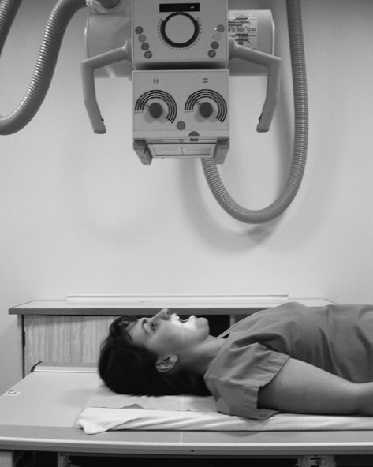
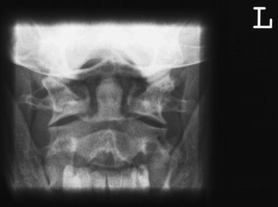
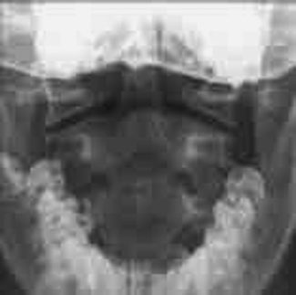
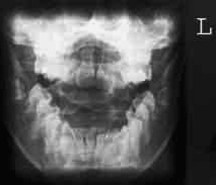
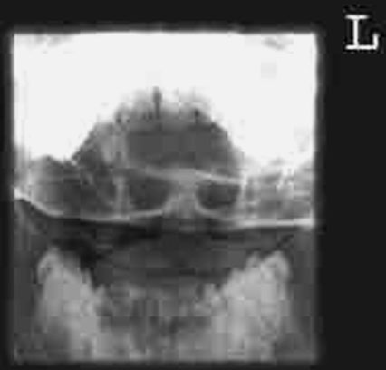
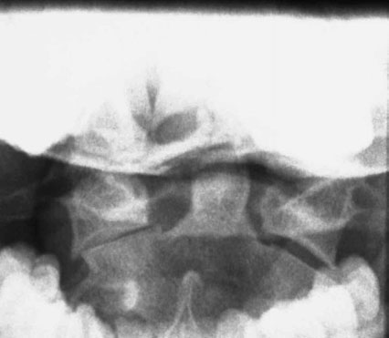

# Rx Coloană Cervicală Profil (Lateral) Decubit Dorsal (contd)

  📷 Radiografie Convențională (Rx)
  <strong>Actualizat:</strong> 2026-09-16
  <strong>Autor:</strong> Departamentul de Radiologie / Referință Clark (Ed. 12)

---

-   __1. Rezumat Clinic & Indicații__

    ---

    === "Indicații Clinice"

        - This incidență este part de Advanced Trauma și Life Support (ATLS) primary screen.
        - Clear demonstration de C7/T1 junction este essential, ca this este common site de injury și este associated cu major neurological morbidity. It este often nu covered fully pe initial trauma screen și trebuie să always fie evidențiat în setting de trauma, prin supplementary incidențe if necessary. Antero-posterior (AP) – first și second Coloană Cervicală (gură deschisă (transorală))
        - suspiciune de fractură de odontoid peg usually occurs across base, below suspensory ligament supporting atlas. Good initial plain imagini sunt therefore essential. base de peg trebuie să nu fie obscured prin orice overlying bone sau tooth. Failure la evidențiază peg will lead la need pentru more complex imaging. în pacient who este la have computed Tomografie Liniară Convențională (CT) de capul pentru associated trauma, scans de areas de coloană vertebrală nu already covered adequately sunt recommended în ATLS. în other pacienți, failure la show C1/2 either will result în need pentru CT scan pentru coloană vertebrală alone sau will lead la pacientul being fully imobilizat pentru long period de time, cu morbidity attendant upon that.
        - burst (Jefferson) suspiciune de fractură este seen pe Antero-posterior (AP) incidență ca loss de alignment de margins de Profil (lateral) masses. rotit imagini make this harder la appreciate (this suspiciune de fractură este seen very well pe CT).

    === "Ghid Național IRIS"

        !!! info "Referință Primară: Ghidul Național IRIS (Ordinul MS 1342/2012)"
            - **Capitol Ghid IRIS:** *Ghidul Național IRIS*
            - **Grad de Recomandare:** **De verificat pe indicație; fără grad atribuit automat**
            - **Nivel de Iradiere Estimată:** `De verificat pentru examinarea și populația selectate`

            [:octicons-search-16: Deschide Ghidul IRIS](../../iris.md){ .md-button .md-button--primary } [:material-open-in-new: Aplicația Oficială PWA](https://radiologie-pediatrica.ro/iris/){ .md-button target="_blank" rel="noopener" }
-   __2. Poziționare & Centrare Fascicul__

    ---

    - **Poziție Pacient:** • pacientul este culcat Decubit dorsal pe masa radiologică sau, if Ortostatism positioning este preferred, sits sau stands cu posterior aspect de capul și umeri pe / sprijinit de stativ vertical Bucky.
• medial plan sagital este ajustat la coincide cu linia mediană casetă, such that it este la drept-angles la caseta.
• gâtul este extins, if possible, such that line joining tip de proces mastoidian și inferior margine de upper incisors este la drept-angles la caseta. This will superimpose upper incisors și occipital bone, thus allowing clear visualization de aria de interes diagnostic.
• caseta este centred la nivelul proces mastoidian.
    - **Punct de Centrare Fascicul:** • Direct perpendicular raza centrală along linia mediană la centre de gură deschisă (transorală).
• If pacientul este unable la se flectează neck și attain poziție described above, then fascicul trebuie să fie înclinat, typically five la ten grade cranially sau caudally, la superimpose upper incisors pe occipital bone.
• caseta poziție will have la fie altered slightly la allow imagine la fie centred after fascicul angulation.
170 Example de correctly poziționat radiografie Occipital bone Upper incisor Odontoid process de C2 Profil (lateral) mass de C1 corp de C2
    - **Distanță Focar-Film (DFF / SID):** 100 cm
    - **Comandă Respiratorie:** Apnee pe durata expunerii (apnee în inspir pentru torace; expir pentru Abdomen/bazin).

-   __3. Parametri Tehnici Expunere__

    ---

    | Parametru Tehnic | Valoare Configurare Generator / Tub |
    |:-----------------|:-------------------------------------|
    | **Tensiune Tub (kV)** | DE CONFIGURAT PE APARAT |
    | **Sarcină / Produs Curent-Timp (mAs)** | Conform AEC / grosime anatomică |
    | **Distanță Focar-Film (DFF / SID)** | 100 cm |
    | **Grilă Antidifuzoare (Bucky)** | Cu grilă antidifuzoare Bucky |
    | **Dimensiune Focar** | Focar Mic (0.6 mm) |
    | **Camere de Ionizare AEC** | Camerele laterale (sau camera centrală funcție de regiune) |
    | **Colimare Fascicul** | Colimare strictă la aria anatomică de interes diagnostic |
    | **Filtrare Tub** | Totală ≥ 2.5 mm Al echivalent (conform Clark: 3.0 mm Al eq.) |

-   __4. Criterii de Calitate & Reușită Imagine__

    ---

    - inferior margine de upper central incisors trebuie să fie superimposed over occipital bone.
    - whole de articulation între atlas și axis trebuie să fie clar evidențiat(e).
    - Ideally, whole de dens, Profil (lateral) masses de atlas și ca much de axis ca possible trebuie să fie included within imagine.
    - Erori de evitat / remedii: Failure la evidențiază C7/T1: if pacientul’s umeri sunt coborât fully, then application de traction will normally show half la one extra vertebra inferiorly. trebuie să cervical thoracic junction still remain undemonstrated, then swimmers’ Profil (lateral) sau Oblică incidențe trebuie să fie considered.
    - Erori de evitat / remedii: Failure la open mouth wide enough: pacientul poate fie reminded la open their mouth ca wide ca possible just before expunere.
    - Erori de evitat / remedii: small grade de rotație poate result în superimposition de lower molar over Profil (lateral) section de spații articulare. Check pentru rotație during positioning.

-   __5. Protecție Radiologică (ALARA)__

    ---

    - Ecranare gonadică cu șorț plumbat dacă gonadele sunt în apropierea fasciculului util (regula ALARA).
    - Colimare precisă la dimensiunea anatomică strict necesară pentru reducerea dozei și a radiației difuze.
    - Verificarea posibilității unei sarcini la pacientele de vârstă fertilă înainte de expunere.

!!! note "Observații Clinice & Tehnice"
    Pregătirea pacientului prin îndepărtarea tuturor accesoriilor radio-opace.

### 🖼️ Imagini

<figure class="protocol-image-card" markdown>

<figcaption><strong>coborât fully, then application de traction will normally</strong> — Poziționare pacient și centrare fascicul conform Clark (Ed. 12)</figcaption>

</figure>

<figure class="protocol-image-card" markdown>

<figcaption><strong>Example de correctly poziționat radiografie</strong> — Aspect radiografic / ghid de poziționare conform tratatului Clark (Ed. 12)</figcaption>

</figure>

<figure class="protocol-image-card" markdown>

<figcaption><strong>Figura 3: Aspect radiografic / Poziționare (Clark Ed. 12)</strong> — Aspect radiografic / ghid de poziționare conform tratatului Clark (Ed. 12)</figcaption>

</figure>

<figure class="protocol-image-card" markdown>

<figcaption><strong>• suspiciune de fractură de odontoid peg usually occurs across base,</strong> — Aspect radiografic / ghid de poziționare conform tratatului Clark (Ed. 12)</figcaption>

</figure>

<figure class="protocol-image-card" markdown>

<figcaption><strong>• burst (Jefferson) suspiciune de fractură este seen pe Antero-posterior (AP)</strong> — Aspect radiografic / ghid de poziționare conform tratatului Clark (Ed. 12)</figcaption>

</figure>

<figure class="protocol-image-card" markdown>

<figcaption><strong>rotit imagini make this harder la appreciate (this suspiciune de fractură este</strong> — Aspect radiografic / ghid de poziționare conform tratatului Clark (Ed. 12)</figcaption>

</figure>

=== "Ghid Rapid de Execuție"

    1. **Identificarea și verificarea pacientului:** verificare identitate, zonă de examinat, consimțământ conform procedurii și evaluarea posibilității unei sarcini, când este relevantă.
    2. **Pregătire:** îndepărtarea oricăror obiecte radiopace (bijuterii, agrafe, fermoare, proteze, pansamente dense).
    3. **Poziționare precisă:** alinierea receptorului de imagine și a tubului la distanța prescrisă (100 cm).
    4. **Colimare strictă:** adaptarea fasciculului strict la regiunea de diagnostic pentru scăderea iradierii și reducerea radiației difuze.
    5. **Radioprotecție:** verificarea [politicii RX](../radioprotectie.md), cu măsuri distincte pentru pacient, personal și însoțitor.

## Surse de documentare

- [Clark's Positioning in Radiography (Ed. 12), Pagina 185](../../assets/protocols/sources/Clark___Positioning_in_Radiography__12th_edition.pdf#page=185)
