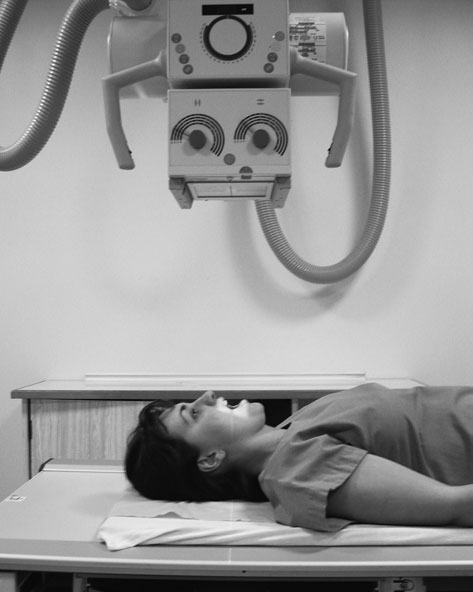
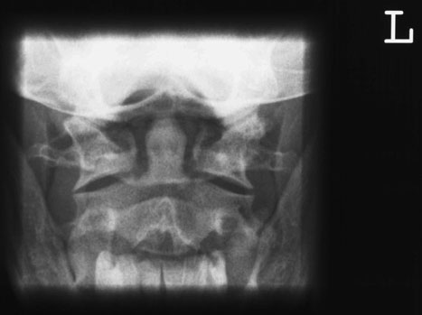
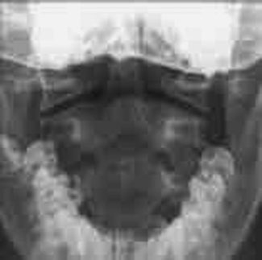
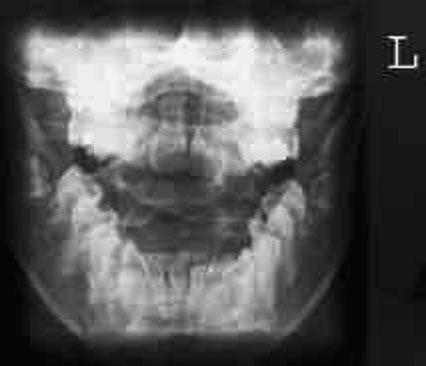
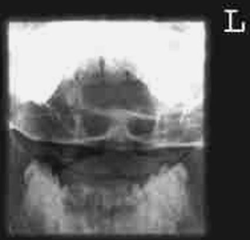
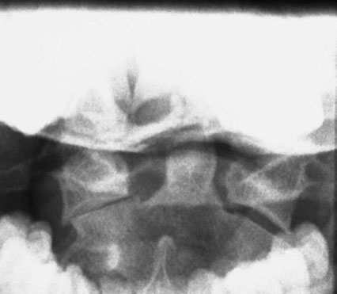

# Rx Coloană Cervicală Profil (Lateral) Decubit Dorsal (contd)

  📷 Radiografie Convențională (Rx)
  <strong>Actualizat:</strong> 2026-09-16
  <strong>Autor:</strong> Departamentul de Radiologie / Referință Clark (Ed. 12)

---

-   __1. Rezumat Clinic & Indicații__

    ---

    === "Indicații Clinice"

        - Această incidență face parte din evaluarea primară din cadrul Suportului Vital Avansat în Traumă (ATLS).
        - Evidențierea clară a joncțiunii C7/T1 este esențială, deoarece aceasta este o localizare frecventă a leziunilor și este asociată cu morbiditate neurologică majoră. Aceasta nu este adesea acoperită integral pe radiografia traumatică inițială și trebuie întotdeauna evidențiată în context traumatic, prin incidențe suplimentare, dacă este necesar. Antero-posterior (AP) – prima și a doua vertebră cervicală (gură deschisă (transorală))
        - Suspiciunea de fractură a procesului odontoid apare de obicei la nivelul bazei, sub ligamentul suspensor care susține atlasul. Prin urmare, imaginile radiografice inițiale de calitate sunt esențiale. Baza procesului odontoid nu trebuie să fie ascunsă de niciun os supraadăugat sau de dinți. Neconsemnarea procesului odontoid va duce la necesitatea unei investigații imagistice mai complexe. La pacientul care urmează să efectueze tomografie computerizată liniară convențională (CT) a capului pentru traumatism asociat, scanările regiunilor coloanei vertebrale care nu au fost deja acoperite adecvat sunt recomandate în ATLS. La ceilalți pacienți, imposibilitatea de a evidenția C1/2 va duce fie la necesitatea unei examinări CT numai a coloanei vertebrale, fie la imobilizarea completă a pacientului pentru o perioadă lungă de timp, cu morbiditatea asociată acesteia.
        - Suspiciunea de fractură cominutivă (Jefferson) se observă pe incidența antero-posterioară (AP) ca pierdere a alinierii marginilor maselor laterale. Imaginile rotite fac această apreciere mai dificilă (această suspiciune de fractură se evidențiază foarte bine la CT).

    === "Ghid Național IRIS"

        !!! info "Referință Primară: Ghidul Național IRIS (Ordinul MS 1342/2012)"
            - **Capitol Ghid IRIS:** *Ghidul Național IRIS*
            - **Grad de Recomandare:** **De verificat pe indicație; fără grad atribuit automat**
            - **Nivel de Iradiere Estimată:** `De verificat pentru examinarea și populația selectate`

            [:octicons-search-16: Deschide Ghidul IRIS](../../iris.md){ .md-button .md-button--primary } [:material-open-in-new: Aplicația Oficială PWA](https://radiologie-pediatrica.ro/iris/){ .md-button target="_blank" rel="noopener" }
-   __2. Poziționare & Centrare Fascicul__

    ---

    - **Poziție Pacient:** • pacientul este culcat în decubit dorsal pe masa radiologică sau, dacă se preferă poziționarea în ortostatism, stă așezat sau în picioare, cu partea posterioară a capului și umerii pe / sprijiniți de stativul vertical Bucky.
• planul mediosagital este ajustat astfel încât să coincidă cu linia mediană a casetei, astfel încât să fie perpendicular pe casetă.
• gâtul este extins, dacă este posibil, astfel încât linia care unește vârful procesului mastoidian și marginea inferioară a incisivilor superiori să fie perpendiculară pe casetă. Aceasta va suprapune incisivii superiori și osul occipital, permițând astfel vizualizarea clară a regiunii de interes diagnostic.
• caseta este centrată la nivelul procesului mastoidian.
    - **Punct de Centrare Fascicul:** • Raza centrală direct perpendiculară de-a lungul liniei mediane, centrată la nivelul gurii deschise (transoral).
• Dacă pacientul nu poate flecta gâtul și nu poate obține poziția descrisă mai sus, atunci fasciculul trebuie înclinat, de obicei cu five la ten grade cranial sau caudal, pentru a suprapune incisivii superiori peste osul occipital.
• Poziția casetei va trebui ușor modificată pentru a permite centrarea imaginii după angularea fasciculului.
170 Exemplu de radiografie poziționată corect Os occipital Incisiv superior Proces odontoid al C2 Masă laterală a C1 Corpul C2
    - **Distanță Focar-Film (DFF / SID):** 100 cm
    - **Comandă Respiratorie:** Apnee pe durata expunerii (apnee în inspir pentru torace; expir pentru Abdomen/bazin).

-   __3. Parametri Tehnici Expunere__

    ---

    | Parametru Tehnic | Valoare Configurare Generator / Tub |
    |:-----------------|:-------------------------------------|
    | **Tensiune Tub (kV)** | DE CONFIGURAT PE APARAT |
    | **Sarcină / Produs Curent-Timp (mAs)** | Conform AEC / grosimii anatomice |
    | **Distanță Focar-Film (DFF / SID)** | 100 cm |
    | **Grilă Antidifuzoare (Bucky)** | Cu grilă antidifuzoare Bucky |
    | **Dimensiune Focar** | Focar Mic (0.6 mm) |
    | **Camere de Ionizare AEC** | Camerele laterale (sau camera centrală, în funcție de regiune) |
    | **Colimare Fascicul** | Colimare strictă la aria anatomică de interes diagnostic |
    | **Filtrare Tub** | Totală ≥ 2.5 mm Al echivalent (conform Clark: 3.0 mm Al echivalent) |

-   __4. Criterii de Calitate & Reușită Imagine__

    ---

    - Marginea inferioară a incisivilor centrali superiori trebuie să fie suprapusă peste osul occipital.
    - Întreaga articulație dintre atlas și axis trebuie să fie clar evidențiată.
    - În mod ideal, întregul dens, masele laterale ale atlasului și cât mai mult din axis posibil trebuie să fie incluse în imagine.
    - Erori de evitat / remedii: Imposibilitatea de a evidenția C7/T1: dacă umerii pacientului sunt coborâți complet, aplicarea tracțiunii va evidenția în mod normal încă jumătate până la o vertebră suplimentară inferior. Dacă joncțiunea cervicotoracică rămâne totuși neevidențiată, trebuie avute în vedere incidențele de profil ale înotătorului sau incidențele oblice.
    - Erori de evitat / remedii: Imposibilitatea de a deschide gura suficient de larg: pacientului i se poate reaminti să deschidă gura cât mai larg posibil chiar înainte de expunere.
    - Erori de evitat / remedii: Un grad mic de rotație poate duce la suprapunerea molarului inferior peste porțiunea de profil a spațiilor articulare. Verificați rotația în timpul poziționării.

-   __5. Protecție Radiologică (ALARA)__

    ---

    - Ecranare gonadică cu șorț plumbat dacă gonadele sunt în apropierea fasciculului util (regula ALARA).
    - Colimare precisă la dimensiunea anatomică strict necesară pentru reducerea dozei și a radiației difuze.
    - Verificarea posibilității unei sarcini la pacientele de vârstă fertilă înainte de expunere.

!!! note "Observații Clinice & Tehnice"
    Pregătirea pacientului prin îndepărtarea tuturor accesoriilor radio-opace.

### 🖼️ Imagini

<figure class="protocol-image-card" markdown>

<figcaption><strong>coborâți complet, apoi aplicarea tracțiunii va evidenția în mod normal</strong> — Poziționarea pacientului și centrarea fasciculului conform Clark (Ed. 12)</figcaption>

</figure>

<figure class="protocol-image-card" markdown>

<figcaption><strong>Exemplu de radiografie poziționată corect</strong> — Aspect radiografic / ghid de poziționare conform tratatului Clark (Ed. 12)</figcaption>

</figure>

<figure class="protocol-image-card" markdown>

<figcaption><strong>Figura 3: Aspect radiografic / Poziționare (Clark Ed. 12)</strong> — Aspect radiografic / ghid de poziționare conform tratatului Clark (Ed. 12)</figcaption>

</figure>

<figure class="protocol-image-card" markdown>

<figcaption><strong>• suspiciunea de fractură a procesului odontoid apare de obicei la nivelul bazei,</strong> — Aspect radiografic / ghid de poziționare conform tratatului Clark (Ed. 12)</figcaption>

</figure>

<figure class="protocol-image-card" markdown>

<figcaption><strong>• suspiciunea de fractură cominutivă (Jefferson) se observă pe incidența antero-posterioară (AP)</strong> — Aspect radiografic / ghid de poziționare conform tratatului Clark (Ed. 12)</figcaption>

</figure>

<figure class="protocol-image-card" markdown>

<figcaption><strong>imaginile rotite fac această apreciere mai dificilă (această suspiciune de fractură este</strong> — Aspect radiografic / ghid de poziționare conform tratatului Clark (Ed. 12)</figcaption>

</figure>

=== "Ghid Rapid de Execuție"

    1. **Identificarea și verificarea pacientului:** verificare identitate, zonă de examinat, consimțământ conform procedurii și evaluarea posibilității unei sarcini, când este relevantă.
    2. **Pregătire:** îndepărtarea oricăror obiecte radiopace (bijuterii, agrafe, fermoare, proteze, pansamente dense).
    3. **Poziționare precisă:** alinierea receptorului de imagine și a tubului la distanța prescrisă (100 cm).
    4. **Colimare strictă:** adaptarea fasciculului strict la regiunea de diagnostic pentru scăderea iradierii și reducerea radiației difuze.
    5. **Radioprotecție:** verificarea [politicii RX](../radioprotectie.md), cu măsuri distincte pentru pacient, personal și însoțitor.

## Surse de documentare

- [Clark's Positioning in Radiography (Ed. 12), Pagina 185](https://books.google.com/books/about/Clark_s_Positioning_in_Radiography.html?id=Xxu6MwEACAAJ)
