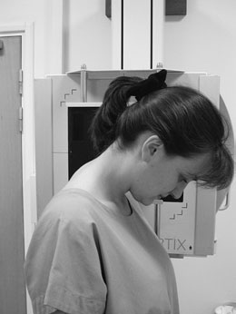
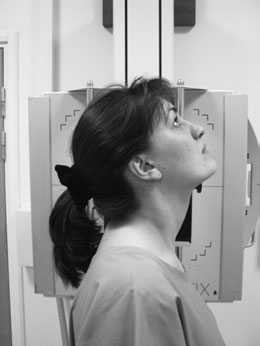
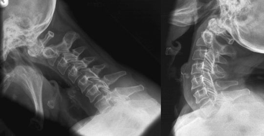
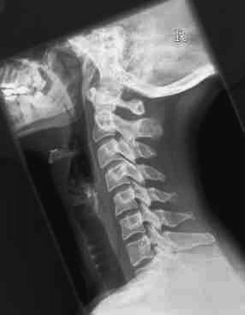
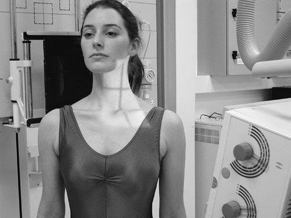
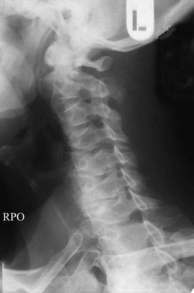
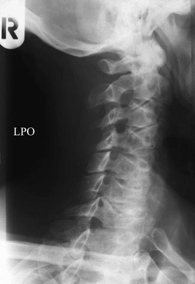

# Rx Coloană Cervicală Profil (Lateral) - flexion and extension

  📷 Radiografie Convențională (Rx)
  <strong>Actualizat:</strong> 2026-09-16
  <strong>Autor:</strong> Departamentul de Radiologie / Referință Clark (Ed. 12)

---

-   __1. Rezumat Clinic & Indicații__

    ---

    === "Indicații Clinice"

        - If this și swimmers’ incidențe sunt nu successful, pacientul poate require more complex imaging (e.g. CT).

    === "Ghid Național IRIS"

        !!! info "Referință Primară: Ghidul Național IRIS (Ordinul MS 1342/2012)"
            - **Capitol Ghid IRIS:** *Ghidul Național IRIS*
            - **Grad de Recomandare:** **De verificat pe indicație; fără grad atribuit automat**
            - **Nivel de Iradiere Estimată:** `De verificat pentru examinarea și populația selectate`

            [:octicons-search-16: Deschide Ghidul IRIS](../../iris.md){ .md-button .md-button--primary } [:material-open-in-new: Aplicația Oficială PWA](https://radiologie-pediatrica.ro/iris/){ .md-button target="_blank" rel="noopener" }
-   __2. Poziționare & Centrare Fascicul__

    ---

    - **Poziție Pacient:** • pacientul este poziționat ca pentru Profil (lateral) basic sau Profil (lateral) Decubit dorsal incidențe; however, Ortostatism positioning este more convenient. pacientul este asked la se flectează neck și la tuck bărbia în spre toracele ca far ca este possible.
• pentru second incidență, pacientul este asked la se extinde neck prin raising bărbia ca far ca possible.
• imobilizare poate fie facilitated prin asking pacientul la hold pe la solid object, such ca back de chair.
• caseta este centred la mid-cervical region și poate have la fie plasat transversely pentru Profil (lateral) în flexion, depending pe grade de movement și caseta size used.
• If imaged Decubit dorsal, gâtul poate fie flectat prin placing pads under gâtul. Extension de gâtul poate fie achieved prin placing pillows under pacientul’s umeri.

• pacientul stă în ortostatism sau sits cu posterior aspect de their cap și umeri pe / sprijinit de stativ vertical Bucky (sau casetă if fără grilă este preferred).
• planul mediosagital de trunk este rotit through 45 grade pentru drept și stâng sides în turn.
• capul poate fie rotit astfel încât plan mediosagital de capul este paralel cu casetă, thus avoiding superimposition de Mandibulă pe vertebra.
• caseta este centred la prominence de cartilaj tiroid (mărul lui Adam).
    - **Punct de Centrare Fascicul:** • se orientează raza centrală centrală horizontally spre mid-cervical region (C4).

• fascicul este înclinat 15 grade cranially de la orizontal și raza centrală este orientat la middle de gâtul pe side nearest tubul.
    - **Distanță Focar-Film (DFF / SID):** 100 cm
    - **Comandă Respiratorie:** Apnee pe durata expunerii (apnee în inspir pentru torace; expir pentru Abdomen/bazin).

-   __3. Parametri Tehnici Expunere__

    ---

    | Parametru Tehnic | Valoare Configurare Generator / Tub |
    |:-----------------|:-------------------------------------|
    | **Tensiune Tub (kV)** | DE CONFIGURAT PE APARAT |
    | **Sarcină / Produs Curent-Timp (mAs)** | Conform AEC / grosime anatomică |
    | **Distanță Focar-Film (DFF / SID)** | 100 cm |
    | **Grilă Antidifuzoare (Bucky)** | Cu grilă antidifuzoare Bucky |
    | **Dimensiune Focar** | Focar Mic (0.6 mm) |
    | **Camere de Ionizare AEC** | Camerele laterale (sau camera centrală funcție de regiune) |
    | **Colimare Fascicul** | Colimare strictă la aria anatomică de interes diagnostic |
    | **Filtrare Tub** | Totală ≥ 2.5 mm Al echivalent (conform Clark: 3.0 mm Al eq.) |

-   __4. Criterii de Calitate & Reușită Imagine__

    ---

    - final imagine trebuie să include toate cervical vertebra, including atlanto-occipital articulații, procese spinoase și soft tissues de gâtul.
    - intervertebral foramina trebuie să fie clar evidențiat(e).
    - C1 la T1 trebuie să fie included within imagine.
    - Mandibulă și occipital bone trebuie să fie clear de vertebre.

-   __5. Protecție Radiologică (ALARA)__

    ---

    - Ecranare gonadică cu șorț plumbat dacă gonadele sunt în apropierea fasciculului util (regula ALARA).
    - Colimare precisă la dimensiunea anatomică strict necesară pentru reducerea dozei și a radiației difuze.
    - Verificarea posibilității unei sarcini la pacientele de vârstă fertilă înainte de expunere.

!!! note "Observații Clinice & Tehnice"
    • large OFD will increase geometric unsharpness. This este overcome prin increasing focal film radiologic distance la 150 cm.
• air gap între neck și film radiologic eliminates need la employ secondary radiation grilă la attenuate scatter.
• Refer la local protocols pentru removal de imobilizare collars when undertaking these examinations.
Whiplash injury (coloană vertebrală în neutral poziție) Flexion Extension

• Oblică Anterioară incidențe sunt usually undertaken pe mobile pacienți. poziție used este exactly opposite la Oblică Posterioară incidență, i.e. pacientul faces caseta și a 15-grade caudal angulation este used. Use de this incidență will reduce radiation dose la thyroid.
• foraminae evidențiat pe Oblică Posterioară sunt those nearest X-ray tube.
176

### 🖼️ Imagini

<figure class="protocol-image-card" markdown>

<figcaption><strong>Figura 1: Aspect radiografic / Poziționare (Clark Ed. 12)</strong> — Poziționare pacient și centrare fascicul conform Clark (Ed. 12)</figcaption>

</figure>

<figure class="protocol-image-card" markdown>

<figcaption><strong>Figura 2: Aspect radiografic / Poziționare (Clark Ed. 12)</strong> — Aspect radiografic / ghid de poziționare conform tratatului Clark (Ed. 12)</figcaption>

</figure>

<figure class="protocol-image-card" markdown>

<figcaption><strong>Figura 3: Aspect radiografic / Poziționare (Clark Ed. 12)</strong> — Aspect radiografic / ghid de poziționare conform tratatului Clark (Ed. 12)</figcaption>

</figure>

<figure class="protocol-image-card" markdown>

<figcaption><strong>Figura 4: Aspect radiografic / Poziționare (Clark Ed. 12)</strong> — Aspect radiografic / ghid de poziționare conform tratatului Clark (Ed. 12)</figcaption>

</figure>

<figure class="protocol-image-card" markdown>

<figcaption><strong>Figura 5: Aspect radiografic / Poziționare (Clark Ed. 12)</strong> — Aspect radiografic / ghid de poziționare conform tratatului Clark (Ed. 12)</figcaption>

</figure>

<figure class="protocol-image-card" markdown>

<figcaption><strong>Figura 6: Aspect radiografic / Poziționare (Clark Ed. 12)</strong> — Aspect radiografic / ghid de poziționare conform tratatului Clark (Ed. 12)</figcaption>

</figure>

<figure class="protocol-image-card" markdown>

<figcaption><strong>Figura 7: Aspect radiografic / Poziționare (Clark Ed. 12)</strong> — Aspect radiografic / ghid de poziționare conform tratatului Clark (Ed. 12)</figcaption>

</figure>

=== "Ghid Rapid de Execuție"

    1. **Identificarea și verificarea pacientului:** verificare identitate, zonă de examinat, consimțământ conform procedurii și evaluarea posibilității unei sarcini, când este relevantă.
    2. **Pregătire:** îndepărtarea oricăror obiecte radiopace (bijuterii, agrafe, fermoare, proteze, pansamente dense).
    3. **Poziționare precisă:** alinierea receptorului de imagine și a tubului la distanța prescrisă (100 cm).
    4. **Colimare strictă:** adaptarea fasciculului strict la regiunea de diagnostic pentru scăderea iradierii și reducerea radiației difuze.
    5. **Radioprotecție:** verificarea [politicii RX](../radioprotectie.md), cu măsuri distincte pentru pacient, personal și însoțitor.

## Surse de documentare

- [Clark's Positioning in Radiography (Ed. 12), Pagina 190](../../assets/protocols/sources/Clark___Positioning_in_Radiography__12th_edition.pdf#page=190)
