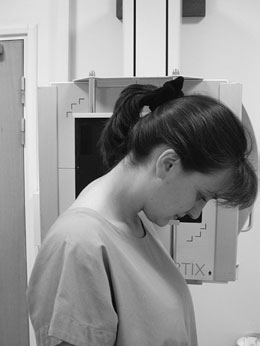
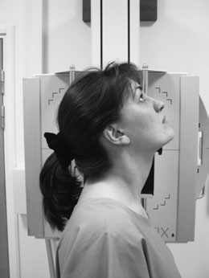
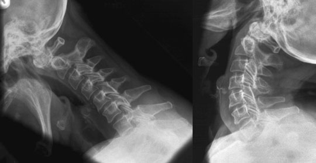
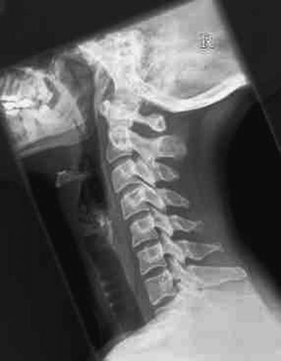
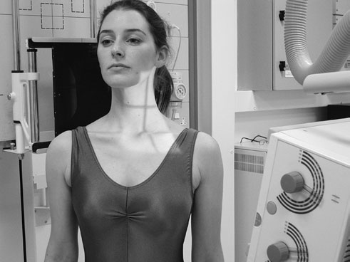
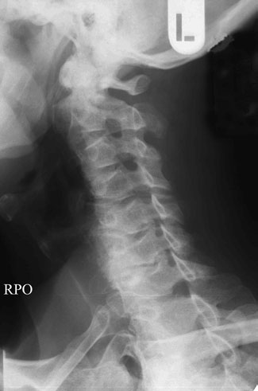
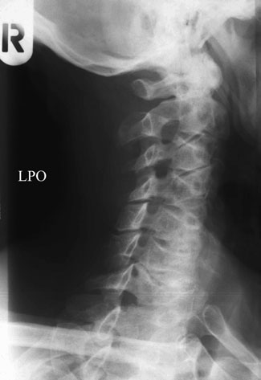

# Rx Coloană Cervicală Profil (Lateral) - flexie și extensie

  📷 Radiografie Convențională (Rx)
  <strong>Actualizat:</strong> 2026-09-16
  <strong>Autor:</strong> Departamentul de Radiologie / Referință Clark (Ed. 12)

---

-   __1. Rezumat Clinic & Indicații__

    ---

    === "Indicații Clinice"

        - Dacă aceasta și incidențele înotătorului nu sunt reușite, pacientul poate necesita o investigație imagistică mai complexă (de exemplu, CT).

    === "Ghid Național IRIS"

        !!! info "Referință Primară: Ghidul Național IRIS (Ordinul MS 1342/2012)"
            - **Capitol Ghid IRIS:** *Coloană vertebrală & Traumatisme*
            - **Grad de Recomandare:** **Grad A**
            - **Nivel de Iradiere Estimată:** `Clasa 1 (Minimă < 0.2 mSv)`

            [:octicons-search-16: Deschide Ghidul IRIS](../../iris.md){ .md-button .md-button--primary } [:material-open-in-new: Aplicația Oficială PWA](https://radiologie-pediatrica.ro/iris/){ .md-button target="_blank" rel="noopener" }

-   __2. Poziționare & Centrare Fascicul__

    ---

    - **Poziție Pacient:**
        - pacientul este poziționat ca pentru incidențele de profil de bază sau de profil în decubit dorsal; totuși, poziționarea în ortostatism este mai convenabilă. Pacientului i se cere să flecteze gâtul și să își ducă bărbia spre torace cât mai mult posibil.
        - pentru a doua incidență, pacientului i se cere să extindă gâtul, ridicând bărbia cât mai mult posibil.
        - imobilizarea poate fi facilitată cerându-i pacientului să se țină de un obiect solid, cum ar fi spătarul unui scaun.
        - caseta este centrată la nivelul regiunii cervicale mijlocii și poate fi plasată transversal pentru profilul în flexie, în funcție de gradul de mișcare și de dimensiunea casetei utilizate.
        - dacă imaginea este efectuată în decubit dorsal, gâtul poate fi flectat prin plasarea unor suporturi sub gât. Extensia gâtului poate fi obținută prin plasarea unor perne sub umerii pacientului.
        - pacientul stă în ortostatism sau așezat, cu partea posterioară a capului și umerii pe / sprijiniți de stativul vertical Bucky (sau pe casetă, dacă se preferă fără grilă).
        - planul mediosagital al trunchiului este rotit cu 45 grade pentru partea dreaptă și partea stângă, pe rând.
        - capul poate fi rotit astfel încât planul mediosagital al capului să fie paralel cu caseta, evitând astfel suprapunerea mandibulei peste vertebre.
        - caseta este centrată la proeminența cartilajului tiroid (mărul lui Adam).
    - **Punct de Centrare Fascicul:**
        - se orientează raza centrală orizontal spre regiunea cervicală mijlocie (C4).
        - fasciculul este înclinat cu 15 grade cranial față de orizontală, iar raza centrală este orientată spre mijlocul gâtului, pe partea cea mai apropiată de tub.
    - **Distanță Focar-Film (DFF / SID):** 100 cm
    - **Comandă Respiratorie:** Apnee pe durata expunerii (apnee în inspir pentru torace; expir pentru Abdomen/bazin).

-   __3. Parametri Tehnici Expunere__

    ---

    | Parametru Tehnic | Valoare Configurare Generator / Tub |
    |:-----------------|:-------------------------------------|
    | **Tensiune Tub (kV)** | DE CONFIGURAT PE APARAT |
    | **Sarcină / Produs Curent-Timp (mAs)** | Conform AEC / grosimii anatomice |
    | **Distanță Focar-Film (DFF / SID)** | 100 cm |
    | **Grilă Antidifuzoare (Bucky)** | Cu grilă antidifuzoare Bucky |
    | **Dimensiune Focar** | Focar Mic (0.6 mm) |
    | **Camere de Ionizare AEC** | Camerele laterale (sau camera centrală, în funcție de regiune) |
    | **Colimare Fascicul** | Colimare strictă la aria anatomică de interes diagnostic |
    | **Filtrare Tub** | Totală ≥ 2.5 mm Al echivalent (conform Clark: 3.0 mm Al echivalent) |

-   __4. Criterii de Calitate & Reușită Imagine__

    ---

    - Imaginea finală trebuie să includă toate vertebrele cervicale, inclusiv articulațiile atlanto-occipitale, procesele spinoase și părțile moi ale gâtului.
    - Foramenele intervertebrale trebuie să fie clar evidențiate.
    - C1 până la T1 trebuie să fie incluse în imagine.
    - Mandibula și osul occipital trebuie să fie libere de suprapunerea vertebrelor.

-   __5. Protecție Radiologică (ALARA)__

    ---

    - Ecranare gonadică cu șorț plumbat dacă gonadele sunt în apropierea fasciculului util (regula ALARA).
    - Colimare precisă la dimensiunea anatomică strict necesară pentru reducerea dozei și a radiației difuze.
    - Verificarea posibilității unei sarcini la pacientele de vârstă fertilă înainte de expunere.

!!! note "Observații Clinice & Tehnice"
    - un OFD mare va crește neclaritatea geometrică. Aceasta se poate compensa prin creșterea distanței focar–film radiologic la 150 cm.
    - spațiul de aer dintre gât și filmul radiologic elimină necesitatea utilizării unei grile de radiație secundară pentru atenuarea radiației împrăștiate.
    - Consultați protocoalele locale pentru îndepărtarea gulerelor de imobilizare la efectuarea acestor examinări. Leziune de tip whiplash (coloana vertebrală în poziție neutră) Flexie Extensie
    - incidențele oblice anterioare se efectuează de obicei la pacienți mobili. Poziția utilizată este exact opusă incidenței oblice posterioare, adică pacientul este orientat cu fața spre casetă și se utilizează o angulație caudală de 15 grade. Utilizarea acestei incidențe reduce doza de radiații la nivelul tiroidei.
    - foramenele evidențiate pe incidența oblică posterioară sunt cele mai apropiate de tubul cu raze X. 176

### 🖼️ Imagini

<figure class="protocol-image-card" markdown>

<figcaption><strong>Figura 1: Aspect radiografic / Poziționare (Clark Ed. 12)</strong> — Poziționarea pacientului și centrarea fasciculului conform Clark (Ed. 12)</figcaption>

</figure>

<figure class="protocol-image-card" markdown>

<figcaption><strong>Figura 2: Aspect radiografic / Poziționare (Clark Ed. 12)</strong> — Aspect radiografic / ghid de poziționare conform tratatului Clark (Ed. 12)</figcaption>

</figure>

<figure class="protocol-image-card" markdown>

<figcaption><strong>Figura 3: Aspect radiografic / Poziționare (Clark Ed. 12)</strong> — Aspect radiografic / ghid de poziționare conform tratatului Clark (Ed. 12)</figcaption>

</figure>

<figure class="protocol-image-card" markdown>

<figcaption><strong>Figura 4: Aspect radiografic / Poziționare (Clark Ed. 12)</strong> — Aspect radiografic / ghid de poziționare conform tratatului Clark (Ed. 12)</figcaption>

</figure>

<figure class="protocol-image-card" markdown>

<figcaption><strong>Figura 5: Aspect radiografic / Poziționare (Clark Ed. 12)</strong> — Aspect radiografic / ghid de poziționare conform tratatului Clark (Ed. 12)</figcaption>

</figure>

<figure class="protocol-image-card" markdown>

<figcaption><strong>Figura 6: Aspect radiografic / Poziționare (Clark Ed. 12)</strong> — Aspect radiografic / ghid de poziționare conform tratatului Clark (Ed. 12)</figcaption>

</figure>

<figure class="protocol-image-card" markdown>

<figcaption><strong>Figura 7: Aspect radiografic / Poziționare (Clark Ed. 12)</strong> — Aspect radiografic / ghid de poziționare conform tratatului Clark (Ed. 12)</figcaption>

</figure>

=== "Ghid Rapid de Execuție"

    1. **Identificarea și verificarea pacientului:** verificare identitate, zonă de examinat, consimțământ conform procedurii și evaluarea posibilității unei sarcini, când este relevantă.
    2. **Pregătire:** îndepărtarea oricăror obiecte radiopace (bijuterii, agrafe, fermoare, proteze, pansamente dense).
    3. **Poziționare precisă:** alinierea receptorului de imagine și a tubului la distanța prescrisă (100 cm).
    4. **Colimare strictă:** adaptarea fasciculului strict la regiunea de diagnostic pentru scăderea iradierii și reducerea radiației difuze.
    5. **Radioprotecție:** verificarea [politicii RX](../radioprotectie.md), cu măsuri distincte pentru pacient, personal și însoțitor.

## Surse de documentare

- [Clark's Positioning in Radiography (Ed. 12), Pagina 190](https://books.google.com/books/about/Clark_s_Positioning_in_Radiography.html?id=Xxu6MwEACAAJ)
