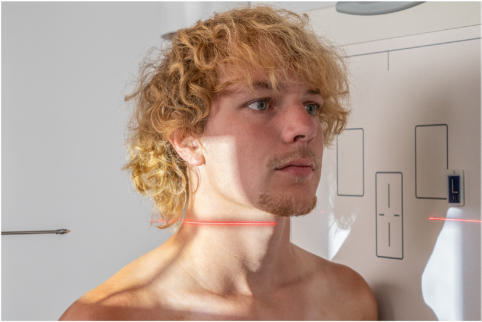
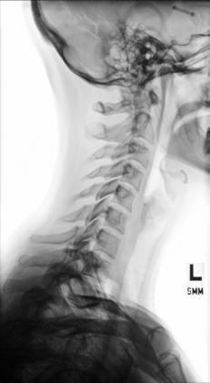
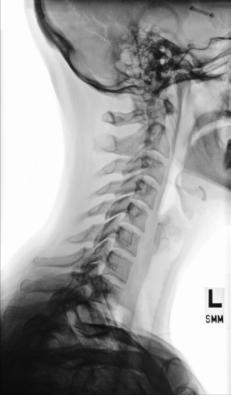

# Rx Coloană Cervicală Profil (Lateral) (Ortostatism)

  📷 Radiografie Convențională (Rx)
  <strong>Actualizat:</strong> 2026-09-15
  <strong>Autor:</strong> Departamentul de Radiologie / Referință Bontrager

---

-   __1. Rezumat Clinic & Indicații__

    ---

    === "Indicații Clinice"

        - Pathology involving Coloană Cervicală și adjacent părți moi structures, degenerative diseases including spondylosis și artroză / modificări degenerative articulare

    === "Ghid Național IRIS"

        !!! info "Referință Primară: Ghidul Național IRIS (Ordinul MS 1342/2012)"
            - **Capitol Ghid IRIS:** *Ghidul Național IRIS*
            - **Grad de Recomandare:** **De verificat pe indicație; fără grad atribuit automat**
            - **Nivel de Iradiere Estimată:** `De verificat pentru examinarea și populația selectate`

            [:octicons-search-16: Deschide Ghidul IRIS](../../iris.md){ .md-button .md-button--primary } [:material-open-in-new: Aplicația Oficială PWA](https://radiologie-pediatrica.ro/iris/){ .md-button target="_blank" rel="noopener" }
-   __2. Poziționare & Centrare Fascicul__

    ---

    - **Poziție Pacient:** Pacient: Incidență de Profil (lateral) poziție pacient în Ortostatism Incidență de Profil (lateral), either așezat sau în ortostatism, cu Umăr against vertical receptorul de imagine.; Regiune anatomică: Align plan mediocoronal la raza centrală și linia mediană mesei și/sau receptorul de imagine. Se centrează receptorul de imagine pe raza centrală, which trebuie să place top de receptorul de imagine about 1 la 2 inches (2.5 la 5 cm) above extern auditory meatus (conduct auditiv extern (CAE)) (Fig. 8.56). Depress umeri (pentru equal weights la ambele brațe [see NOTE 2]). Ask pacient la relax și drop umeri down și forward ca far ca possible. (Do this ca last step before expunere because this poziție este difficult la maintain.) Elevate chin la place linie acantiomeatală (LAM) paralel cu floor. Protract chin (la prevent superimposition de Mandibulă pe upper vertebre).
    - **Punct de Centrare Fascicul:** perpendicular pe receptorul de imagine. Direct raza centrală horizontally la C4 (level de upper margin de cartilaj tiroid (mărul lui Adam)). Se centrează receptorul de imagine pe raza centrală.
    - **Distanță Focar-Film (DFF / SID):** 180 cm
    - **Comandă Respiratorie:** Apnee pe durata expunerii pe Expir complet (pentru maximum Umăr depression).

-   __3. Parametri Tehnici Expunere__

    ---

    | Parametru Tehnic | Valoare Configurare Generator / Tub |
    |:-----------------|:-------------------------------------|
    | **Tensiune Tub (kV)** | DE CONFIGURAT PE APARAT |
    | **Sarcină / Produs Curent-Timp (mAs)** | DE CONFIGURAT PE APARAT |
    | **Distanță Focar-Film (DFF / SID)** | 180 cm |
    | **Grilă Antidifuzoare (Bucky)** | Conform grosimii anatomice (> 10 cm cu grilă) |
    | **Dimensiune Focar** | Focar Mare (1.0 - 1.2 mm) |
    | **Camere de Ionizare AEC** | DE CONFIGURAT PE APARAT |
    | **Colimare Fascicul** | Collimate pe four sides la anatomy de interest. |
    | **Filtrare Tub** | Totală ≥ 2.5 mm Al echivalent |

-   __4. Criterii de Calitate & Reușită Imagine__

    ---

    - Cervical vertebral corpuri, intervertebral spații articulare, articular pillars, procese spinoase, și zygapophyseal articulații (Figs. 8.57 și 8.58). poziție
    - C1 through C7–T1 intervertebral spații articulare sunt clar vizibil(e). If upper margin de T1 este nu evidențiat, additional imagini such ca cervicothoracic lateral trebuie să fie obtained.
    - rami de Mandibulă do nu superimpose C1 la C2.
    - drept și stâng articular pillars și zygapophyseal articulații trebuie să fie superimposed pentru fiecare vertebra.
    - corpuri trebuie să fie liber de superimposition de articular pillars și spinous process seen în profile.
    - Collimation la aria de interes diagnostic. expunere
    - optim receptorul de imagine expunere și contrast. Clear demonstration de părți moi margins, including margins de trachea, și de bony margins și trabecular markings de coloană cervicală.
    - fără mișcare.

-   __5. Protecție Radiologică (ALARA)__

    ---

    - Ecranare gonadică și a organelor radiosensibile conform procedurilor locale de radioprotecție ALARA.
    - Colimare strictă la aria de interes pentru limitarea radiației difuze.
    - Verificarea posibilității unei sarcini la pacientele de vârstă fertilă înainte de expunere.

!!! note "Observații Clinice & Tehnice"
    Adding weights (5–10 lb [2.3–4.5 kg]) cu straps suspended de la fiecare Pumn (Articulație Radiocarpiană) poate help în pulling down umeri. Coloană Cervicală ROUTINE AP gură deschisă (transorală) (C1 și C2) AP axial oblic lateral Fig. 8.57 stâng lateral. Odontoid process (C2) posterior arch (C1) Intervertebral articulație (C6-7) Articular pillar (C7) Zygapophyseal articulație (C4-5) Spinous process (C2) Fig. 8.58 stâng lateral. Fig. 8.56 Ortostatism stâng lateral.

### 🖼️ Imagini

<figure class="protocol-image-card" markdown>

<figcaption><strong>Fig. 8.57 stâng lateral.</strong> — Poziționare pacient conform Ghidului Bontrager (Fig. 8.57 stâng lateral.)</figcaption>

</figure>

<figure class="protocol-image-card" markdown>

<figcaption><strong>Fig. 8.58 stâng lateral.</strong> — Aspect radiografic de referință conform Ghidului Bontrager (Fig. 8.58 stâng lateral.)</figcaption>

</figure>

<figure class="protocol-image-card" markdown>

<figcaption><strong>Fig. 8.56 Ortostatism stâng lateral.</strong> — Aspect radiografic de referință conform Ghidului Bontrager (Fig. 8.56 în ortostatism stâng lateral.)</figcaption>

</figure>

=== "Ghid Rapid de Execuție"

    1. **Identificarea și verificarea pacientului:** verificare identitate, zonă de examinat, consimțământ conform procedurii și evaluarea posibilității unei sarcini, când este relevantă.
    2. **Pregătire:** îndepărtarea oricăror obiecte radiopace (bijuterii, agrafe, fermoare, proteze, pansamente dense).
    3. **Poziționare precisă:** alinierea receptorului de imagine și a tubului la distanța prescrisă (180 cm).
    4. **Colimare strictă:** adaptarea fasciculului strict la regiunea de diagnostic pentru scăderea iradierii și reducerea radiației difuze.
    5. **Radioprotecție:** verificarea [politicii RX](../radioprotectie.md), cu măsuri distincte pentru pacient, personal și însoțitor.

## Surse de documentare

- [Bontrager's Textbook of Radiographic Positioning (Ed. 9/10), Pagina 335](https://www.elsevier.com/books/textbook-of-radiographic-positioning-and-related-anatomy/lampignano/978-0-323-65367-1)
