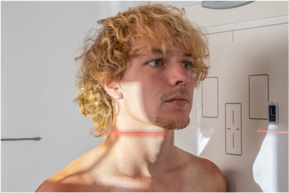
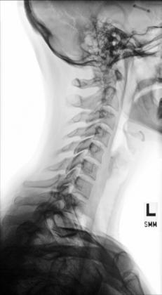
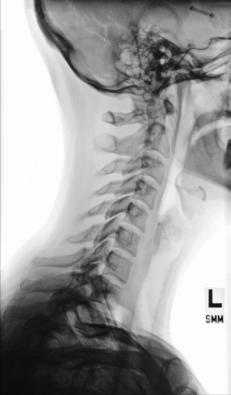

# Rx Coloană Cervicală Profil (Lateral) (Ortostatism)

  📷 Radiografie Convențională (Rx)
  <strong>Actualizat:</strong> 2026-09-15
  <strong>Autor:</strong> Departamentul de Radiologie / Referință Bontrager

---

-   __1. Rezumat Clinic & Indicații__

    ---

    === "Indicații Clinice"

        - Patologie care implică coloana cervicală și structurile adiacente ale părților moi, boli degenerative inclusiv spondiloză și artroză / modificări degenerative articulare

    === "Ghid Național IRIS"

        !!! info "Referință Primară: Ghidul Național IRIS (Ordinul MS 1342/2012)"
            - **Capitol Ghid IRIS:** *Coloană vertebrală & Traumatisme*
            - **Grad de Recomandare:** **Grad A**
            - **Nivel de Iradiere Estimată:** `Clasa 1 (Minimă < 0.2 mSv)`

            [:octicons-search-16: Deschide Ghidul IRIS](../../iris.md){ .md-button .md-button--primary } [:material-open-in-new: Aplicația Oficială PWA](https://radiologie-pediatrica.ro/iris/){ .md-button target="_blank" rel="noopener" }

-   __2. Poziționare & Centrare Fascicul__

    ---

    - **Poziție Pacient:** Pacient: Incidență de profil, poziția pacientului în ortostatism. Incidență de profil, fie așezat, fie în ortostatism, cu umărul sprijinit de receptorul de imagine vertical. Regiune anatomică: Aliniați planul mediocoronal cu raza centrală și cu linia mediană a mesei și/sau receptorul de imagine. Centrați receptorul de imagine pe raza centrală, care trebuie să plaseze partea superioară a receptorului de imagine la aproximativ 1 la 2 țoli (2.5 la 5 cm) deasupra meatului auditiv extern (conduct auditiv extern (CAE)) (Fig. 8.56). Coborâți umerii (pentru greutăți egale la ambele brațe [consultați NOTA 2]). Cereți pacientului să se relaxeze și să lase umerii în jos și înainte cât mai mult posibil. (Faceți aceasta ca ultim pas înainte de expunere, deoarece această poziție este dificil de menținut.) Ridicați bărbia pentru a plasa linia acantiomeatală (LAM) paralelă cu podeaua. Proiectați bărbia anterior (pentru a preveni suprapunerea mandibulei peste vertebrele superioare).
    - **Punct de Centrare Fascicul:** perpendicular pe receptorul de imagine. Orientați raza centrală orizontal spre C4 (la nivelul marginii superioare a cartilajului tiroid (mărul lui Adam)). Centrați receptorul de imagine pe raza centrală.
    - **Distanță Focar-Film (DFF / SID):** 180 cm
    - **Comandă Respiratorie:** Apnee pe durata expunerii în expir complet (pentru depresia maximă a umărului).

-   __3. Parametri Tehnici Expunere__

    ---

    | Parametru Tehnic | Valoare Configurare Generator / Tub |
    |:-----------------|:-------------------------------------|
    | **Tensiune Tub (kV)** | DE CONFIGURAT PE APARAT |
    | **Sarcină / Produs Curent-Timp (mAs)** | DE CONFIGURAT PE APARAT |
    | **Distanță Focar-Film (DFF / SID)** | 180 cm |
    | **Grilă Antidifuzoare (Bucky)** | Conform grosimii anatomice (> 10 cm cu grilă) |
    | **Dimensiune Focar** | Focar Mare (1.0 - 1.2 mm) |
    | **Camere de Ionizare AEC** | DE CONFIGURAT PE APARAT |
    | **Colimare Fascicul** | Colimați pe cele patru laturi la anatomia de interes. |
    | **Filtrare Tub** | Totală ≥ 2.5 mm Al echivalent |

-   __4. Criterii de Calitate & Reușită Imagine__

    ---

    - Corpurile vertebrale cervicale, spațiile articulare intervertebrale, pilierii articulari, procesele spinoase și articulațiile zigapofizare (Fig. 8.57 și 8.58). Poziție
    - Spațiile articulare intervertebrale C1 până la C7–T1 sunt clar vizibile. Dacă marginea superioară a T1 nu este evidențiată, trebuie obținute imagini suplimentare, cum ar fi incidența laterală cervicotoracică.
    - Ramurile mandibulei nu se suprapun peste C1 până la C2.
    - Pilierii articulari drept și stâng și articulațiile zigapofizare trebuie să fie suprapuși pentru fiecare vertebră.
    - Corpurile trebuie să fie libere de suprapunerea pilierilor articulari, iar procesul spinos trebuie să fie evidențiat de profil.
    - Colimare la aria de interes diagnostic. Expunere
    - Expunere și contrast optime ale receptorului de imagine. Evidențiere clară a marginilor părților moi, inclusiv marginile traheei, precum și a marginilor osoase și a desenului trabecular al coloanei cervicale.
    - fără mișcare.

-   __5. Protecție Radiologică (ALARA)__

    ---

    - Ecranare gonadică și a organelor radiosensibile conform procedurilor locale de radioprotecție ALARA.
    - Colimare strictă la aria de interes pentru limitarea radiației difuze.
    - Verificarea posibilității unei sarcini la pacientele de vârstă fertilă înainte de expunere.

!!! note "Observații Clinice & Tehnice"
    Adăugarea unor greutăți (5–10 lb [2.3–4.5 kg]) cu benzi suspendate de la fiecare pumn (articulație radiocarpiană) poate ajuta la coborârea umerilor. Coloană cervicală DE RUTINĂ AP gură deschisă (transorală) (C1 și C2) AP axial oblic lateral Fig. 8.57 stâng lateral. Proces odontoid (C2) arc posterior (C1) articulație intervertebrală (C6-7) pilier articular (C7) articulație zigapofizară (C4-5) proces spinos (C2) Fig. 8.58 stâng lateral. Fig. 8.56 ortostatism stâng lateral.

### 🖼️ Imagini

<figure class="protocol-image-card" markdown>

<figcaption><strong>Fig. 8.57 stâng lateral.</strong> — Poziționarea pacientului conform Ghidului Bontrager (Fig. 8.57 stâng lateral.)</figcaption>

</figure>

<figure class="protocol-image-card" markdown>

<figcaption><strong>Fig. 8.58 stâng lateral.</strong> — Aspect radiografic de referință conform Ghidului Bontrager (Fig. 8.58 stâng lateral.)</figcaption>

</figure>

<figure class="protocol-image-card" markdown>

<figcaption><strong>Fig. 8.56 ortostatism stâng lateral.</strong> — Aspect radiografic de referință conform Ghidului Bontrager (Fig. 8.56 în ortostatism stâng lateral.)</figcaption>

</figure>

=== "Ghid Rapid de Execuție"

    1. **Identificarea și verificarea pacientului:** verificare identitate, zonă de examinat, consimțământ conform procedurii și evaluarea posibilității unei sarcini, când este relevantă.
    2. **Pregătire:** îndepărtarea oricăror obiecte radiopace (bijuterii, agrafe, fermoare, proteze, pansamente dense).
    3. **Poziționare precisă:** alinierea receptorului de imagine și a tubului la distanța prescrisă (180 cm).
    4. **Colimare strictă:** adaptarea fasciculului strict la regiunea de diagnostic pentru scăderea iradierii și reducerea radiației difuze.
    5. **Radioprotecție:** verificarea [politicii RX](../radioprotectie.md), cu măsuri distincte pentru pacient, personal și însoțitor.

## Surse de documentare

- [Bontrager's Textbook of Radiographic Positioning (Ed. 9/10), Pagina 335](https://www.elsevier.com/books/textbook-of-radiographic-positioning-and-related-anatomy/lampignano/978-0-323-65367-1)
