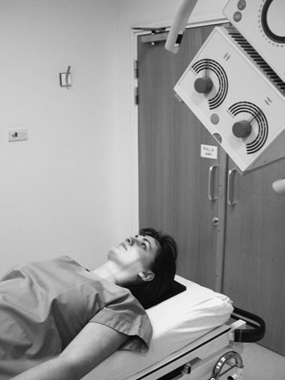
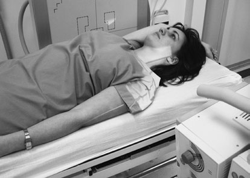
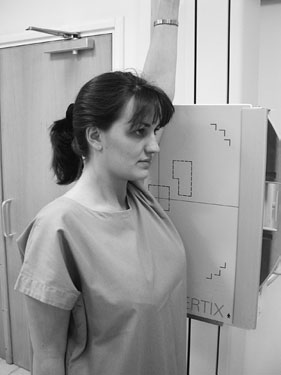
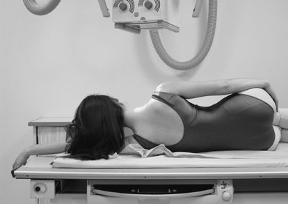
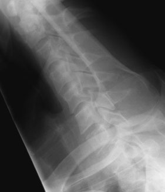

# Rx Coloană Cervicală Right and left posterior

  📷 Radiografie Convențională (Rx)
  <strong>Actualizat:</strong> 2026-09-16
  <strong>Autor:</strong> Departamentul de Radiologie / Referință Clark (Ed. 12)

---

-   __1. Rezumat Clinic & Indicații__

    ---

    === "Indicații Clinice"

        - If this și swimmers’ incidențe sunt nu successful, pacientul poate require more complex imaging (e.g. CT).
        - See drept și stâng Oblică Posterioară – Decubit dorsal (previous page).

    === "Ghid Național IRIS"

        !!! info "Referință Primară: Ghidul Național IRIS (Ordinul MS 1342/2012)"
            - **Capitol Ghid IRIS:** *Ghidul Național IRIS*
            - **Grad de Recomandare:** **De verificat pe indicație; fără grad atribuit automat**
            - **Nivel de Iradiere Estimată:** `De verificat pentru examinarea și populația selectate`

            [:octicons-search-16: Deschide Ghidul IRIS](../../iris.md){ .md-button .md-button--primary } [:material-open-in-new: Aplicația Oficială PWA](https://radiologie-pediatrica.ro/iris/){ .md-button target="_blank" rel="noopener" }
-   __2. Poziționare & Centrare Fascicul__

    ---

    - **Poziție Pacient:** • pacientul remains în Decubit dorsal poziție pe casualty trolley.
• la avoid moving gâtul, caseta trebuie să ideally fie plasat în caseta tray underneath trolley.
• If fără casetă tray este available, then caseta poate fie slid carefully into poziție fără moving pacientul’s neck.

• This incidență este usually carried out cu pacientul Decubit dorsal pe trauma trolley. trolley este poziționat adjacent la stativ vertical Bucky, cu pacientul’s plan mediosagital paralel cu casetă.
• braț nearest caseta este folded over capul, cu Humerus ca close la trolley top ca pacientul poate manage.
braț și Umăr nearest X-ray tube sunt coborât ca far ca possible.
• umerii sunt now separated vertically.
• Bucky trebuie să fie raised sau lowered, astfel încât line de vertebre trebuie să coincide cu middle de caseta.
• This incidență poate also fie undertaken cu pacientul Ortostatism, either în ortostatism sau Poziție Șezândă sau Decubit dorsal.
    - **Punct de Centrare Fascicul:** • fascicul este înclinat 30–45 grade la planul mediosagital (grade de angulation will depend pe local protocols).
• raza centrală este orientat spre middle de gâtul pe side nearest tubul la nivelul cartilaj tiroid (mărul lui Adam).

• raza centrală orizontală centrală este orientat la linia mediană Bucky la level just above Umăr remote de la caseta.
    - **Distanță Focar-Film (DFF / SID):** 100 cm
    - **Comandă Respiratorie:** Apnee pe durata expunerii (apnee în inspir pentru torace; expir pentru Abdomen/bazin).

-   __3. Parametri Tehnici Expunere__

    ---

    | Parametru Tehnic | Valoare Configurare Generator / Tub |
    |:-----------------|:-------------------------------------|
    | **Tensiune Tub (kV)** | DE CONFIGURAT PE APARAT |
    | **Sarcină / Produs Curent-Timp (mAs)** | Conform AEC / grosime anatomică |
    | **Distanță Focar-Film (DFF / SID)** | 100 cm |
    | **Grilă Antidifuzoare (Bucky)** | Cu grilă antidifuzoare Bucky |
    | **Dimensiune Focar** | Focar Mic (0.6 mm) |
    | **Camere de Ionizare AEC** | Camerele laterale (sau camera centrală funcție de regiune) |
    | **Colimare Fascicul** | Colimare strictă la aria anatomică de interes diagnostic |
    | **Filtrare Tub** | Totală ≥ 2.5 mm Al echivalent (conform Clark: 3.0 mm Al eq.) |

-   __4. Criterii de Calitate & Reușită Imagine__

    ---

    - It este imperative la ensure that C7/T1 junction has been included pe imagine. It este therefore useful la include anatomical landmark within imagine, e.g. atypical CV2. This will make it possible la count down vertebre și ensure that junction has been imaged.
    - Erori de evitat / remedii: Unless equipment used allows alignment de grila slats cu tubul angle, then grilă cut-off will result.
    - Erori de evitat / remedii: grilă cut-off poate fie prevented prin nu using grilă. Alternatively, gridlines poate fie poziționat la run transversely. This will result în suboptimal demonstration de intervertebral foramina, but imagine will fie de diagnostic quality. 45° 45° 30° 30°
    - Erori de evitat / remedii: Failure la ensure that raised braț este ca flat ca possible pe / sprijinit de stretcher poate result în capul de Humerus obscuring region de interest.

-   __5. Protecție Radiologică (ALARA)__

    ---

    - Ecranare gonadică cu șorț plumbat dacă gonadele sunt în apropierea fasciculului util (regula ALARA).
    - Colimare precisă la dimensiunea anatomică strict necesară pentru reducerea dozei și a radiației difuze.
    - Verificarea posibilității unei sarcini la pacientele de vârstă fertilă înainte de expunere.

!!! note "Observații Clinice & Tehnice"
    • pentru some pacienți, it poate fie useful la se rotește side further de la caseta sufficiently forward la separate umerii transversely. This positioning will produce Profil (lateral) Oblică incidență de vertebre.
178
• imagine quality will fie increased if Ortostatism Bucky este used în preference la stationary grilă. This este due la better scatter attenuation properties de grila within Bucky.

### 🖼️ Imagini

<figure class="protocol-image-card" markdown>

<figcaption><strong>Figura 1: Aspect radiografic / Poziționare (Clark Ed. 12)</strong> — Poziționare pacient și centrare fascicul conform Clark (Ed. 12)</figcaption>

</figure>

<figure class="protocol-image-card" markdown>

<figcaption><strong>în toate trauma radiografie, it este imperative that toate de cervical</strong> — Aspect radiografic / ghid de poziționare conform tratatului Clark (Ed. 12)</figcaption>

</figure>

<figure class="protocol-image-card" markdown>

<figcaption><strong>acceptable imagine este familiar problem la toate radiographers. în</strong> — Aspect radiografic / ghid de poziționare conform tratatului Clark (Ed. 12)</figcaption>

</figure>

<figure class="protocol-image-card" markdown>

<figcaption><strong>Figura 4: Aspect radiografic / Poziționare (Clark Ed. 12)</strong> — Aspect radiografic / ghid de poziționare conform tratatului Clark (Ed. 12)</figcaption>

</figure>

<figure class="protocol-image-card" markdown>

<figcaption><strong>Figura 5: Aspect radiografic / Poziționare (Clark Ed. 12)</strong> — Aspect radiografic / ghid de poziționare conform tratatului Clark (Ed. 12)</figcaption>

</figure>

=== "Ghid Rapid de Execuție"

    1. **Identificarea și verificarea pacientului:** verificare identitate, zonă de examinat, consimțământ conform procedurii și evaluarea posibilității unei sarcini, când este relevantă.
    2. **Pregătire:** îndepărtarea oricăror obiecte radiopace (bijuterii, agrafe, fermoare, proteze, pansamente dense).
    3. **Poziționare precisă:** alinierea receptorului de imagine și a tubului la distanța prescrisă (100 cm).
    4. **Colimare strictă:** adaptarea fasciculului strict la regiunea de diagnostic pentru scăderea iradierii și reducerea radiației difuze.
    5. **Radioprotecție:** verificarea [politicii RX](../radioprotectie.md), cu măsuri distincte pentru pacient, personal și însoțitor.

## Surse de documentare

- [Clark's Positioning in Radiography (Ed. 12), Pagina 192](../../assets/protocols/sources/Clark___Positioning_in_Radiography__12th_edition.pdf#page=192)
