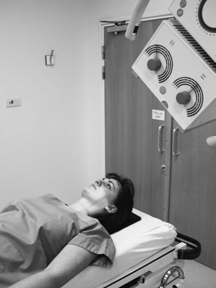
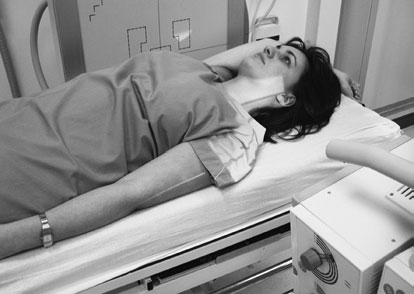
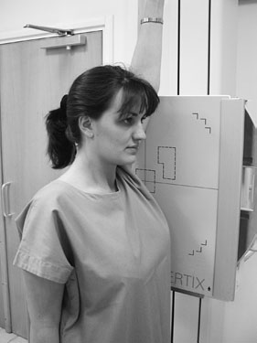
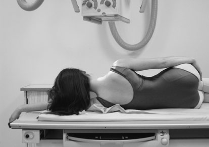
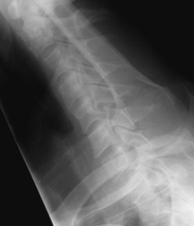

# Rx Coloană Cervicală oblică posterioară dreaptă și stângă

  📷 Radiografie Convențională (Rx)
  <strong>Actualizat:</strong> 2026-09-16
  <strong>Autor:</strong> Departamentul de Radiologie / Referință Clark (Ed. 12)

---

-   __1. Rezumat Clinic & Indicații__

    ---

    === "Indicații Clinice"

        - Dacă aceasta și incidențele înotătorului nu sunt reușite, pacientul poate necesita o investigație imagistică mai complexă (de exemplu, CT).
        - Consultați incidențele oblice posterioare dreaptă și stângă – decubit dorsal (pagina anterioară).

    === "Ghid Național IRIS"

        !!! info "Referință Primară: Ghidul Național IRIS (Ordinul MS 1342/2012)"
            - **Capitol Ghid IRIS:** *Coloană vertebrală & Traumatisme*
            - **Grad de Recomandare:** **Grad A**
            - **Nivel de Iradiere Estimată:** `Clasa 1 (Minimă < 0.2 mSv)`

            [:octicons-search-16: Deschide Ghidul IRIS](../../iris.md){ .md-button .md-button--primary } [:material-open-in-new: Aplicația Oficială PWA](https://radiologie-pediatrica.ro/iris/){ .md-button target="_blank" rel="noopener" }

-   __2. Poziționare & Centrare Fascicul__

    ---

    - **Poziție Pacient:**
        - pacientul rămâne în decubit dorsal pe targa pentru victime.
        - pentru a evita mișcarea gâtului, caseta trebuie, în mod ideal, să fie plasată în sertarul pentru casetă de sub targă.
        - dacă nu este disponibil un sertar pentru casetă, aceasta poate fi introdusă cu grijă în poziție fără mișcarea gâtului pacientului.
        - această incidență se efectuează de obicei cu pacientul în decubit dorsal pe targa pentru traumă. Targa este poziționată adiacent stativului vertical Bucky, cu planul mediosagital al pacientului paralel cu caseta.
        - brațul cel mai apropiat de casetă este pliat peste cap, cu humerusul cât mai aproape de partea superioară a tărgii, atât cât poate tolera pacientul. Brațul și umărul cele mai apropiate de tubul cu raze X sunt coborâte cât mai mult posibil.
        - umerii sunt acum separați vertical.
        - Bucky-ul trebuie ridicat sau coborât astfel încât linia vertebrelor să coincidă cu mijlocul casetei.
        - această incidență poate fi efectuată și cu pacientul în ortostatism, fie în picioare, fie în poziție șezândă, fie în decubit dorsal.
    - **Punct de Centrare Fascicul:**
        - fasciculul este înclinat cu 30–45 grade față de planul mediosagital (gradul de angulație va depinde de protocoalele locale).
        - raza centrală este orientată spre mijlocul gâtului, pe partea cea mai apropiată de tub, la nivelul cartilajului tiroid (mărul lui Adam).
        - raza centrală orizontală este orientată spre linia mediană a Bucky, la nivelul situat chiar deasupra umărului îndepărtat de casetă.
    - **Distanță Focar-Film (DFF / SID):** 100 cm
    - **Comandă Respiratorie:** Apnee pe durata expunerii (apnee în inspir pentru torace; expir pentru Abdomen/bazin).

-   __3. Parametri Tehnici Expunere__

    ---

    | Parametru Tehnic | Valoare Configurare Generator / Tub |
    |:-----------------|:-------------------------------------|
    | **Tensiune Tub (kV)** | DE CONFIGURAT PE APARAT |
    | **Sarcină / Produs Curent-Timp (mAs)** | Conform AEC / grosimii anatomice |
    | **Distanță Focar-Film (DFF / SID)** | 100 cm |
    | **Grilă Antidifuzoare (Bucky)** | Cu grilă antidifuzoare Bucky |
    | **Dimensiune Focar** | Focar Mic (0.6 mm) |
    | **Camere de Ionizare AEC** | Camerele laterale (sau camera centrală, în funcție de regiune) |
    | **Colimare Fascicul** | Colimare strictă la aria anatomică de interes diagnostic |
    | **Filtrare Tub** | Totală ≥ 2.5 mm Al echivalent (conform Clark: 3.0 mm Al echivalent) |

-   __4. Criterii de Calitate & Reușită Imagine__

    ---

    - Este imperativ să se asigure includerea joncțiunii C7/T1 în imagine. Prin urmare, este utilă includerea în imagine a unui reper anatomic, de exemplu CV2 atipică. Aceasta va permite numărarea vertebrelor în sens inferior și asigurarea faptului că joncțiunea a fost examinată.
    - Erori de evitat / remedii: Dacă echipamentul utilizat nu permite alinierea lamelelor grilei cu unghiul tubului, va apărea tăierea grilei.
    - Erori de evitat / remedii: Tăierea grilei poate fi prevenită prin neutilizarea grilei. Alternativ, liniile grilei pot fi poziționate transversal. Aceasta va duce la evidențiere suboptimală a foramenelor intervertebrale, dar imaginea va avea calitate diagnostică. 45° 45° 30° 30°
    - Erori de evitat / remedii: Imposibilitatea de a asigura menținerea brațului ridicat cât mai plat pe / sprijinit de targă poate duce la obscurarea regiunii de interes de către capul humerusului.

-   __5. Protecție Radiologică (ALARA)__

    ---

    - Ecranare gonadică cu șorț plumbat dacă gonadele sunt în apropierea fasciculului util (regula ALARA).
    - Colimare precisă la dimensiunea anatomică strict necesară pentru reducerea dozei și a radiației difuze.
    - Verificarea posibilității unei sarcini la pacientele de vârstă fertilă înainte de expunere.

!!! note "Observații Clinice & Tehnice"
    - pentru unii pacienți, poate fi utilă rotirea suplimentară a părții îndepărtate de casetă suficient de anterior pentru a separa umerii transversal. Această poziționare va produce o incidență oblică de profil a vertebrelor. 178
    - calitatea imaginii va fi crescută dacă se utilizează Bucky-ul pentru ortostatism, în locul grilei staționare. Aceasta se datorează proprietăților mai bune de atenuare a radiației împrăștiate ale grilei din Bucky.

### 🖼️ Imagini

<figure class="protocol-image-card" markdown>

<figcaption><strong>Figura 1: Aspect radiografic / Poziționare (Clark Ed. 12)</strong> — Poziționarea pacientului și centrarea fasciculului conform Clark (Ed. 12)</figcaption>

</figure>

<figure class="protocol-image-card" markdown>

<figcaption><strong>în toate radiografiile traumatice, este imperativ ca toate vertebrele cervicale</strong> — Aspect radiografic / ghid de poziționare conform tratatului Clark (Ed. 12)</figcaption>

</figure>

<figure class="protocol-image-card" markdown>

<figcaption><strong>imagine acceptabilă este o problemă frecventă pentru toți tehnicienii radiologi. în</strong> — Aspect radiografic / ghid de poziționare conform tratatului Clark (Ed. 12)</figcaption>

</figure>

<figure class="protocol-image-card" markdown>

<figcaption><strong>Figura 4: Aspect radiografic / Poziționare (Clark Ed. 12)</strong> — Aspect radiografic / ghid de poziționare conform tratatului Clark (Ed. 12)</figcaption>

</figure>

<figure class="protocol-image-card" markdown>

<figcaption><strong>Figura 5: Aspect radiografic / Poziționare (Clark Ed. 12)</strong> — Aspect radiografic / ghid de poziționare conform tratatului Clark (Ed. 12)</figcaption>

</figure>

=== "Ghid Rapid de Execuție"

    1. **Identificarea și verificarea pacientului:** verificare identitate, zonă de examinat, consimțământ conform procedurii și evaluarea posibilității unei sarcini, când este relevantă.
    2. **Pregătire:** îndepărtarea oricăror obiecte radiopace (bijuterii, agrafe, fermoare, proteze, pansamente dense).
    3. **Poziționare precisă:** alinierea receptorului de imagine și a tubului la distanța prescrisă (100 cm).
    4. **Colimare strictă:** adaptarea fasciculului strict la regiunea de diagnostic pentru scăderea iradierii și reducerea radiației difuze.
    5. **Radioprotecție:** verificarea [politicii RX](../radioprotectie.md), cu măsuri distincte pentru pacient, personal și însoțitor.

## Surse de documentare

- [Clark's Positioning in Radiography (Ed. 12), Pagina 192](https://books.google.com/books/about/Clark_s_Positioning_in_Radiography.html?id=Xxu6MwEACAAJ)
