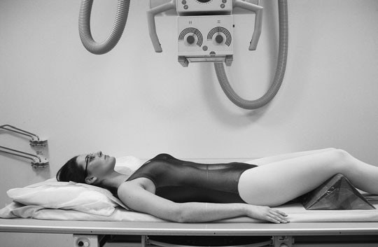
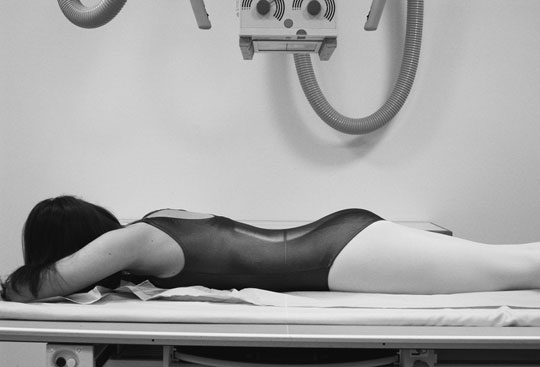
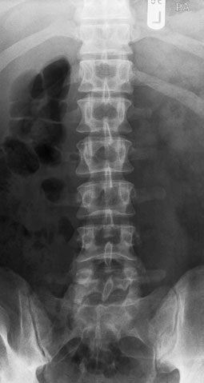
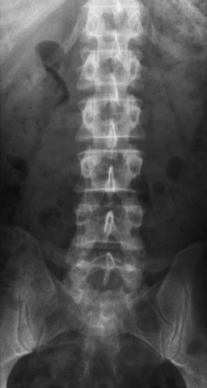

# Rx Coloană Lombară Antero-Posterior (AP) - basic

  📷 Radiografie Convențională (Rx)
  <strong>Actualizat:</strong> 2026-09-16
  <strong>Autor:</strong> Departamentul de Radiologie / Referință Clark (Ed. 12)

---

-   __1. Rezumat Clinic & Indicații__

    ---

    === "Indicații Clinice"

        - same considerations apply ca la thoracic coloană vertebrală.
        - See p. 184.

    === "Ghid Național IRIS"

        !!! info "Referință Primară: Ghidul Național IRIS (Ordinul MS 1342/2012)"
            - **Capitol Ghid IRIS:** *Ghidul Național IRIS*
            - **Grad de Recomandare:** **De verificat pe indicație; fără grad atribuit automat**
            - **Nivel de Iradiere Estimată:** `De verificat pentru examinarea și populația selectate`

            [:octicons-search-16: Deschide Ghidul IRIS](../../iris.md){ .md-button .md-button--primary } [:material-open-in-new: Aplicația Oficială PWA](https://radiologie-pediatrica.ro/iris/){ .md-button target="_blank" rel="noopener" }
-   __2. Poziționare & Centrare Fascicul__

    ---

    - **Poziție Pacient:** • pacientul este culcat Decubit dorsal pe masa radiologică, cu planul mediosagital coincident cu, și la drept-angles la, linia mediană mesei și Bucky.
• anterior superior iliac spines trebuie să fie echidistant față de tabletop.
• șoldurile și genunchi sunt flectat și picioarele sunt plasat cu their plantar aspect pe tabletop la reduce lumbar arch și bring lumbar region de Coloană Vertebrală paralel cu casetă.
• caseta trebuie să fie large enough pentru include lower Coloană Toracală și Articulații Sacroiliace și este centred la nivelul lower costal margin.
• expunere trebuie să fie made pe arrested expiration, ca cupole diafragmatice will cause cupole diafragmatice la move superiorly. air within Torace (Câmpuri Pulmonare) would otherwise cause large difference în densitate optică și poor contrast între upper și lower Coloană Lombară.
    - **Punct de Centrare Fascicul:** • se orientează raza centrală centrală spre linia mediană la nivelul lower costal margin (L3).
    - **Distanță Focar-Film (DFF / SID):** 100 cm
    - **Comandă Respiratorie:** Apnee pe durata expunerii (apnee în inspir pentru torace; expir pentru Abdomen/bazin).

-   __3. Parametri Tehnici Expunere__

    ---

    | Parametru Tehnic | Valoare Configurare Generator / Tub |
    |:-----------------|:-------------------------------------|
    | **Tensiune Tub (kV)** | DE CONFIGURAT PE APARAT |
    | **Sarcină / Produs Curent-Timp (mAs)** | Conform AEC / grosime anatomică |
    | **Distanță Focar-Film (DFF / SID)** | 100 cm |
    | **Grilă Antidifuzoare (Bucky)** | Cu grilă antidifuzoare Bucky |
    | **Dimensiune Focar** | Focar Mic (0.6 mm) |
    | **Camere de Ionizare AEC** | Camerele laterale (sau camera centrală funcție de regiune) |
    | **Colimare Fascicul** | Colimare strictă la aria anatomică de interes diagnostic |
    | **Filtrare Tub** | Totală ≥ 2.5 mm Al echivalent (conform Clark: 3.0 mm Al eq.) |

-   __4. Criterii de Calitate & Reușită Imagine__

    ---

    - imagine trebuie să include de la T12 down, la include toate de Articulații Sacroiliace.
    - rotație poate fie assessed prin ensuring that Articulații Sacroiliace sunt echidistant față de coloană vertebrală.
    - expunere used trebuie să produce densitate optică such that bony detail poate fie discerned throughout region de interest.
    - Erori de evitat / remedii: most common fault este la miss some sau toate de sacroiliac articulație. additional incidență de Articulații Sacroiliace trebuie să fie performed.

-   __5. Protecție Radiologică (ALARA)__

    ---

    - Ecranare gonadică cu șorț plumbat dacă gonadele sunt în apropierea fasciculului util (regula ALARA).
    - Colimare precisă la dimensiunea anatomică strict necesară pentru reducerea dozei și a radiației difuze.
    - Verificarea posibilității unei sarcini la pacientele de vârstă fertilă înainte de expunere.

!!! note "Observații Clinice & Tehnice"
    pentru relatively fit pacienți, this incidență poate fie performed cu pacientul în Postero-anterior (PA) poziție. This allows better visualization de disc spaces și Articulații Sacroiliace, ca concavity de lumbar lordosis faces tubul so diverging fascicul passes directly through these structures. Although magnification este increased, this does nu seriously affect imagine quality.
182 Antero-posterior (AP) incidență Postero-anterior (PA) incidență: better visualization de disc spaces și SI articulații

### 🖼️ Imagini

<figure class="protocol-image-card" markdown>

<figcaption><strong>Figura 1: Aspect radiografic / Poziționare (Clark Ed. 12)</strong> — Poziționare pacient și centrare fascicul conform Clark (Ed. 12)</figcaption>

</figure>

<figure class="protocol-image-card" markdown>

<figcaption><strong>Figura 2: Aspect radiografic / Poziționare (Clark Ed. 12)</strong> — Aspect radiografic / ghid de poziționare conform tratatului Clark (Ed. 12)</figcaption>

</figure>

<figure class="protocol-image-card" markdown>

<figcaption><strong>Figura 3: Aspect radiografic / Poziționare (Clark Ed. 12)</strong> — Aspect radiografic / ghid de poziționare conform tratatului Clark (Ed. 12)</figcaption>

</figure>

<figure class="protocol-image-card" markdown>

<figcaption><strong>Figura 4: Aspect radiografic / Poziționare (Clark Ed. 12)</strong> — Aspect radiografic / ghid de poziționare conform tratatului Clark (Ed. 12)</figcaption>

</figure>

=== "Ghid Rapid de Execuție"

    1. **Identificarea și verificarea pacientului:** verificare identitate, zonă de examinat, consimțământ conform procedurii și evaluarea posibilității unei sarcini, când este relevantă.
    2. **Pregătire:** îndepărtarea oricăror obiecte radiopace (bijuterii, agrafe, fermoare, proteze, pansamente dense).
    3. **Poziționare precisă:** alinierea receptorului de imagine și a tubului la distanța prescrisă (100 cm).
    4. **Colimare strictă:** adaptarea fasciculului strict la regiunea de diagnostic pentru scăderea iradierii și reducerea radiației difuze.
    5. **Radioprotecție:** verificarea [politicii RX](../radioprotectie.md), cu măsuri distincte pentru pacient, personal și însoțitor.

## Surse de documentare

- [Clark's Positioning in Radiography (Ed. 12), Pagina 197](../../assets/protocols/sources/Clark___Positioning_in_Radiography__12th_edition.pdf#page=197)
