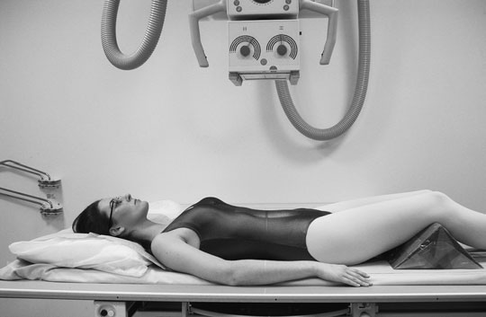
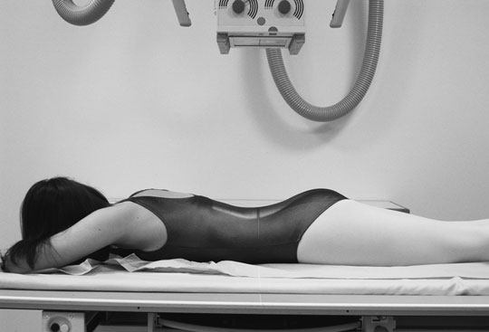
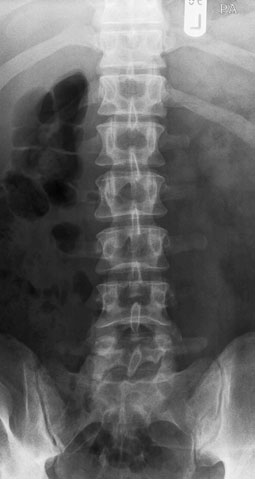
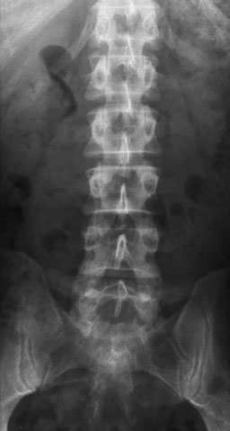

# Rx Coloană Lombară Antero-Posterior (AP) - de bază

  📷 Radiografie Convențională (Rx)
  <strong>Actualizat:</strong> 2026-09-16
  <strong>Autor:</strong> Departamentul de Radiologie / Referință Clark (Ed. 12)

---

-   __1. Rezumat Clinic & Indicații__

    ---

    === "Indicații Clinice"

        - se aplică aceleași considerații ca la coloana vertebrală toracică.
        - Vezi p. 184.

    === "Ghid Național IRIS"

        !!! info "Referință Primară: Ghidul Național IRIS (Ordinul MS 1342/2012)"
            - **Capitol Ghid IRIS:** *Ghidul Național IRIS*
            - **Grad de Recomandare:** **De verificat pe indicație; fără grad atribuit automat**
            - **Nivel de Iradiere Estimată:** `De verificat pentru examinarea și populația selectate`

            [:octicons-search-16: Deschide Ghidul IRIS](../../iris.md){ .md-button .md-button--primary } [:material-open-in-new: Aplicația Oficială PWA](https://radiologie-pediatrica.ro/iris/){ .md-button target="_blank" rel="noopener" }
-   __2. Poziționare & Centrare Fascicul__

    ---

    - **Poziție Pacient:** • pacientul este culcat în decubit dorsal pe masa radiologică, cu planul mediosagital coincident cu linia mediană a mesei și perpendicular pe aceasta și pe Bucky.
• spinele iliace anterosuperioare trebuie să fie echidistante față de suprafața mesei.
• șoldurile și genunchii sunt flectați, iar picioarele sunt așezate cu suprafața plantară pe suprafața mesei pentru a reduce arcul lombar și a aduce regiunea lombară a coloanei vertebrale paralelă cu caseta.
• caseta trebuie să fie suficient de mare pentru a include coloana toracală inferioară și articulațiile sacroiliace și este centrată la nivelul marginii costale inferioare.
• expunerea trebuie efectuată în apnee, la sfârșitul expirului, deoarece cupolele diafragmatice se vor deplasa superior. Aerul din torace (câmpurile pulmonare) ar produce altfel o diferență mare de densitate optică și un contrast redus între coloana lombară superioară și inferioară.
    - **Punct de Centrare Fascicul:** • se orientează raza centrală spre linia mediană la nivelul marginii costale inferioare (L3).
    - **Distanță Focar-Film (DFF / SID):** 100 cm
    - **Comandă Respiratorie:** Apnee pe durata expunerii (apnee în inspir pentru torace; expir pentru Abdomen/bazin).

-   __3. Parametri Tehnici Expunere__

    ---

    | Parametru Tehnic | Valoare Configurare Generator / Tub |
    |:-----------------|:-------------------------------------|
    | **Tensiune Tub (kV)** | DE CONFIGURAT PE APARAT |
    | **Sarcină / Produs Curent-Timp (mAs)** | Conform AEC / grosimii anatomice |
    | **Distanță Focar-Film (DFF / SID)** | 100 cm |
    | **Grilă Antidifuzoare (Bucky)** | Cu grilă antidifuzoare Bucky |
    | **Dimensiune Focar** | Focar Mic (0.6 mm) |
    | **Camere de Ionizare AEC** | Camerele laterale (sau camera centrală, în funcție de regiune) |
    | **Colimare Fascicul** | Colimare strictă la aria anatomică de interes diagnostic |
    | **Filtrare Tub** | Totală ≥ 2.5 mm Al echivalent (conform Clark: 3.0 mm Al echivalent) |

-   __4. Criterii de Calitate & Reușită Imagine__

    ---

    - imaginea trebuie să includă de la T12 în jos, pentru a include toate articulațiile sacroiliace.
    - rotația poate fi evaluată asigurându-se că articulațiile sacroiliace sunt echidistante față de coloana vertebrală.
    - expunerea utilizată trebuie să producă o densitate optică astfel încât detaliile osoase să poată fi distinse pe întreaga regiune de interes.
    - Erori de evitat / remedii: cea mai frecventă eroare este omiterea unei articulații sacroiliace sau a ambelor. Trebuie efectuată o incidență suplimentară a articulațiilor sacroiliace.

-   __5. Protecție Radiologică (ALARA)__

    ---

    - Ecranare gonadică cu șorț plumbat dacă gonadele sunt în apropierea fasciculului util (regula ALARA).
    - Colimare precisă la dimensiunea anatomică strict necesară pentru reducerea dozei și a radiației difuze.
    - Verificarea posibilității unei sarcini la pacientele de vârstă fertilă înainte de expunere.

!!! note "Observații Clinice & Tehnice"
    pentru pacienții relativ apți, această incidență poate fi efectuată cu pacientul în poziție postero-anterioară (PA). Aceasta permite o vizualizare mai bună a spațiilor discale și a articulațiilor sacroiliace, deoarece concavitatea lordozei lombare este orientată spre tub, astfel încât fasciculul divergent trece direct prin aceste structuri. Deși mărirea este crescută, aceasta nu afectează semnificativ calitatea imaginii.
182 Incidență antero-posterioară (AP) Incidență postero-anterioară (PA): vizualizare mai bună a spațiilor discale și a articulațiilor SI

### 🖼️ Imagini

<figure class="protocol-image-card" markdown>

<figcaption><strong>Figura 1: Aspect radiografic / Poziționare (Clark Ed. 12)</strong> — Poziționarea pacientului și centrarea fasciculului conform Clark (Ed. 12)</figcaption>

</figure>

<figure class="protocol-image-card" markdown>

<figcaption><strong>Figura 2: Aspect radiografic / Poziționare (Clark Ed. 12)</strong> — Aspect radiografic / ghid de poziționare conform tratatului Clark (Ed. 12)</figcaption>

</figure>

<figure class="protocol-image-card" markdown>

<figcaption><strong>Figura 3: Aspect radiografic / Poziționare (Clark Ed. 12)</strong> — Aspect radiografic / ghid de poziționare conform tratatului Clark (Ed. 12)</figcaption>

</figure>

<figure class="protocol-image-card" markdown>

<figcaption><strong>Figura 4: Aspect radiografic / Poziționare (Clark Ed. 12)</strong> — Aspect radiografic / ghid de poziționare conform tratatului Clark (Ed. 12)</figcaption>

</figure>

=== "Ghid Rapid de Execuție"

    1. **Identificarea și verificarea pacientului:** verificare identitate, zonă de examinat, consimțământ conform procedurii și evaluarea posibilității unei sarcini, când este relevantă.
    2. **Pregătire:** îndepărtarea oricăror obiecte radiopace (bijuterii, agrafe, fermoare, proteze, pansamente dense).
    3. **Poziționare precisă:** alinierea receptorului de imagine și a tubului la distanța prescrisă (100 cm).
    4. **Colimare strictă:** adaptarea fasciculului strict la regiunea de diagnostic pentru scăderea iradierii și reducerea radiației difuze.
    5. **Radioprotecție:** verificarea [politicii RX](../radioprotectie.md), cu măsuri distincte pentru pacient, personal și însoțitor.

## Surse de documentare

- [Clark's Positioning in Radiography (Ed. 12), Pagina 197](https://books.google.com/books/about/Clark_s_Positioning_in_Radiography.html?id=Xxu6MwEACAAJ)
