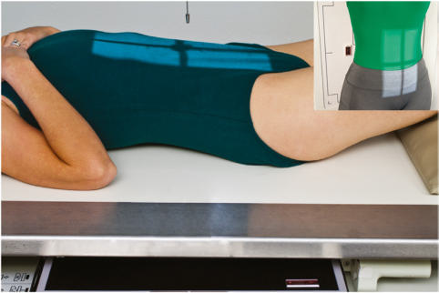
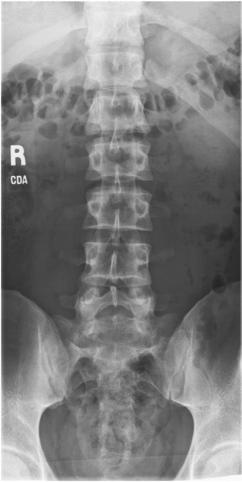
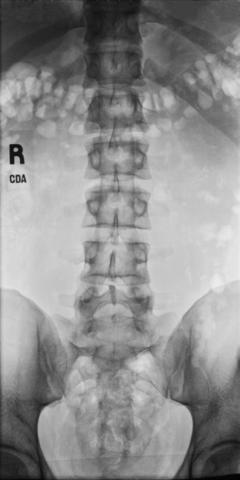

# Rx Coloană Lombară AP (OR PA) Incidență

  📷 Radiografie Convențională (Rx)
  <strong>Actualizat:</strong> 2026-09-15
  <strong>Autor:</strong> Departamentul de Radiologie / Referință Bontrager

---

-   __1. Rezumat Clinic & Indicații__

    ---

    === "Indicații Clinice"

        - Pathology de coloană lombară, including suspiciune de fractură, scolioză / vicii de postură ale coloanei, și neoplastic processes

    === "Ghid Național IRIS"

        !!! info "Referință Primară: Ghidul Național IRIS (Ordinul MS 1342/2012)"
            - **Capitol Ghid IRIS:** *Ghidul Național IRIS*
            - **Grad de Recomandare:** **De verificat pe indicație; fără grad atribuit automat**
            - **Nivel de Iradiere Estimată:** `De verificat pentru examinarea și populația selectate`

            [:octicons-search-16: Deschide Ghidul IRIS](../../iris.md){ .md-button .md-button--primary } [:material-open-in-new: Aplicația Oficială PWA](https://radiologie-pediatrica.ro/iris/){ .md-button target="_blank" rel="noopener" }
-   __2. Poziționare & Centrare Fascicul__

    ---

    - **Poziție Pacient:** Pacient: Decubit dorsal poziție pacient Decubit dorsal cu brațe la side și cap pe pillow (also poate fie done în Decubit ventral sau Ortostatism poziție; see NOTES).; Regiune anatomică: Align plan mediosagital la raza centrală și linia mediană mesei și/sau grilă (Fig. 9.28). Flex genunchi și hips la reduce lordotic curvature. Se verifică absența rotației: claviculele sunt riguros echidistante față de linia proceselor spinoase thorax sau Bazin (bazin (pelvis)) exists.
    - **Punct de Centrare Fascicul:** la level de creasta iliacă (corespunzător L4-L5) (L4–L5). This larger receptorul de imagine will include coloană lombară, Sacru, și possibly Coccis. Tighter collimation 11 × 14 inches (30 × 35 cm): Raza centrală se orientează spre level de L3, which poate fie localized prin palpation de lower costal margin (1.5 inches [4 cm] above creasta iliacă (corespunzător L4-L5)). This tighter collimation field size will include primarily five coloană lombară și SI articulații. Se centrează receptorul de imagine pe raza centrală.
    - **Distanță Focar-Film (DFF / SID):** 100 cm
    - **Comandă Respiratorie:** Apnee pe durata expunerii pe expiration.

-   __3. Parametri Tehnici Expunere__

    ---

    | Parametru Tehnic | Valoare Configurare Generator / Tub |
    |:-----------------|:-------------------------------------|
    | **Tensiune Tub (kV)** | 75-90 kV |
    | **Sarcină / Produs Curent-Timp (mAs)** | DE CONFIGURAT PE APARAT |
    | **Distanță Focar-Film (DFF / SID)** | 100 cm |
    | **Grilă Antidifuzoare (Bucky)** | Cu grilă antidifuzoare Bucky |
    | **Dimensiune Focar** | Focar Mare (1.0 - 1.2 mm) |
    | **Camere de Ionizare AEC** | Camerele laterale (sau camera centrală funcție de regiune) |
    | **Colimare Fascicul** | field size—approximately T11 la distal Sacru included. 11 × 14inch (35 × 43 cm) collimation field size—T12 la S1 included (Figs. 9.29 și 9.30). poziție fără pacient rotație indicated prin SI articulații echidistant față de procese spinoase, procese spinoase în midline de coloană vertebrală, și procese transverse de equal length. Open intervertebral spații articulare. Collimation field size la aria de interes diagnostic. expunere optim receptorul de imagine expunere și contrast. Clear demonstration de bony margins și trabecular markings de coloană lombară. fără mișcare. Fig. 9.29 AP lumbar incidență (centrat pentru 14 × 17inch [35 × 43cm] receptorul de imagine). Ala (wing) de Sacru Intervertebral articulație (L3-4) Spinous process (L2) Transverse process (L1) R. sacroiliac articulație Fig. 9.30 AP lumbar incidență. |
    | **Filtrare Tub** | Totală ≥ 2.5 mm Al echivalent |

-   __4. Criterii de Calitate & Reușită Imagine__

    ---

    - Lumbar vertebral corpuri, intervertebral articulații, spinous și procese transverse, SI articulații, și Sacru sunt vizualizat.
    - 14 × 17inch (35 × 43 cm)

-   __5. Protecție Radiologică (ALARA)__

    ---

    - Ecranare gonadică și a organelor radiosensibile conform procedurilor locale de radioprotecție ALARA.
    - Colimare strictă la aria de interes pentru limitarea radiației difuze.
    - Verificarea posibilității unei sarcini la pacientele de vârstă fertilă înainte de expunere.

!!! note "Observații Clinice & Tehnice"
    S: Partial flexion de genunchi ca vizualizat straightens coloană vertebrală, which helps open intervertebral disk spaces. radiografie poate fie done Decubit ventral ca Incidență Postero-Anterioară (PA), which places intervertebral spaces more closely paralel cu diverging rays. Ortostatism poziție poate fie useful pentru evidențiind natural weightbearing stance de coloană vertebrală. 35 (30) (35) Coloană Lombară ROUTINE AP (sau PA) oblic—anterior sau posterior lateral lateral L5–S1 Fig. 9.28 Incidență Antero-Posterioară (AP) (centrat pentru 14 × 17inch [35 × 43cm] receptorul de imagine). Inset, Alternative Incidență Postero-Anterioară (PA).

### 🖼️ Imagini

<figure class="protocol-image-card" markdown>

<figcaption><strong>Fig. 9.28 Incidență Antero-Posterioară (AP) (centrat pentru 14 × 17-</strong> — Poziționare pacient conform Ghidului Bontrager (Fig. 9.28 AP incidență (centrat pentru 14 × 17-)</figcaption>

</figure>

<figure class="protocol-image-card" markdown>

<figcaption><strong>Fig. 9.29 AP lumbar incidență (centrat pentru 14 × 17-</strong> — Aspect radiografic de referință conform Ghidului Bontrager (Fig. 9.29 AP lumbar incidență (centrat pentru 14 × 17-)</figcaption>

</figure>

<figure class="protocol-image-card" markdown>

<figcaption><strong>Fig. 9.30 AP lumbar incidență.</strong> — Aspect radiografic de referință conform Ghidului Bontrager (Fig. 9.30 AP lumbar incidență.)</figcaption>

</figure>

<figure class="protocol-image-card" markdown>

<figcaption><strong>Figura 4</strong> — Aspect radiografic de referință conform Ghidului Bontrager (Figura 4)</figcaption>

</figure>

=== "Ghid Rapid de Execuție"

    1. **Identificarea și verificarea pacientului:** verificare identitate, zonă de examinat, consimțământ conform procedurii și evaluarea posibilității unei sarcini, când este relevantă.
    2. **Pregătire:** îndepărtarea oricăror obiecte radiopace (bijuterii, agrafe, fermoare, proteze, pansamente dense).
    3. **Poziționare precisă:** alinierea receptorului de imagine și a tubului la distanța prescrisă (100 cm).
    4. **Colimare strictă:** adaptarea fasciculului strict la regiunea de diagnostic pentru scăderea iradierii și reducerea radiației difuze.
    5. **Radioprotecție:** verificarea [politicii RX](../radioprotectie.md), cu măsuri distincte pentru pacient, personal și însoțitor.

## Surse de documentare

- [Bontrager's Textbook of Radiographic Positioning (Ed. 9/10), Pagina 359](https://www.elsevier.com/books/textbook-of-radiographic-positioning-and-related-anatomy/lampignano/978-0-323-65367-1)
