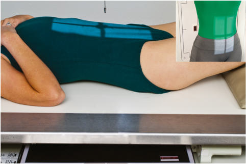
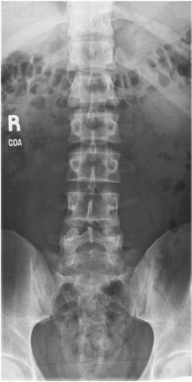
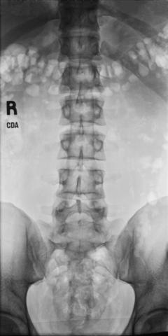

# Rx Coloană Lombară AP (OR PA) Incidență

  📷 Radiografie Convențională (Rx)
  <strong>Actualizat:</strong> 2026-09-15
  <strong>Autor:</strong> Departamentul de Radiologie / Referință Bontrager

---

-   __1. Rezumat Clinic & Indicații__

    ---

    === "Indicații Clinice"

        - Patologia coloanei lombare, inclusiv suspiciunea de fractură, scolioza / viciile de postură ale coloanei și procesele neoplazice

    === "Ghid Național IRIS"

        !!! info "Referință Primară: Ghidul Național IRIS (Ordinul MS 1342/2012)"
            - **Capitol Ghid IRIS:** *Ghidul Național IRIS*
            - **Grad de Recomandare:** **De verificat pe indicație; fără grad atribuit automat**
            - **Nivel de Iradiere Estimată:** `De verificat pentru examinarea și populația selectate`

            [:octicons-search-16: Deschide Ghidul IRIS](../../iris.md){ .md-button .md-button--primary } [:material-open-in-new: Aplicația Oficială PWA](https://radiologie-pediatrica.ro/iris/){ .md-button target="_blank" rel="noopener" }
-   __2. Poziționare & Centrare Fascicul__

    ---

    - **Poziție Pacient:** Pacient: decubit dorsal; pacientul în decubit dorsal, cu brațele pe lângă corp și capul pe pernă (se poate efectua și în decubit ventral sau în ortostatism; vezi NOTE).; Regiune anatomică: se aliniază planul mediosagital cu raza centrală și cu linia mediană a mesei și/sau a grilei (Fig. 9.28). Se flectează genunchii și șoldurile pentru a reduce curbura lordotică. Se verifică absența rotației: claviculele sunt riguros echidistante față de linia proceselor spinoase ale toracelui sau ale bazinului (pelvisului), dacă acesta este inclus.
    - **Punct de Centrare Fascicul:** la nivelul crestei iliace (corespunzător L4-L5) (L4–L5). Acest receptor de imagine mai mare va include coloana lombară, sacrul și posibil coccisul. Colimare mai strânsă 11 × 14 inches (30 × 35 cm): raza centrală se orientează spre nivelul L3, care poate fi localizat prin palparea marginii costale inferioare (1.5 inches [4 cm] deasupra crestei iliace (corespunzător L4-L5)). Acest câmp de colimare mai restrâns va include în principal cele cinci vertebre lombare și articulațiile SI. Se centrează receptorul de imagine pe raza centrală.
    - **Distanță Focar-Film (DFF / SID):** 100 cm
    - **Comandă Respiratorie:** Apnee pe durata expunerii, la sfârșitul expirului.

-   __3. Parametri Tehnici Expunere__

    ---

    | Parametru Tehnic | Valoare Configurare Generator / Tub |
    |:-----------------|:-------------------------------------|
    | **Tensiune Tub (kV)** | 75-90 kV |
    | **Sarcină / Produs Curent-Timp (mAs)** | DE CONFIGURAT PE APARAT |
    | **Distanță Focar-Film (DFF / SID)** | 100 cm |
    | **Grilă Antidifuzoare (Bucky)** | Cu grilă antidifuzoare Bucky |
    | **Dimensiune Focar** | Focar Mare (1.0 - 1.2 mm) |
    | **Camere de Ionizare AEC** | Camerele laterale (sau camera centrală, în funcție de regiune) |
    | **Colimare Fascicul** | dimensiunea câmpului—aproximativ de la T11 la sacrul distal inclus. Dimensiunea câmpului de colimare 11 × 14 inch (35 × 43 cm)—de la T12 la S1 inclus (Fig. 9.29 și 9.30). Poziția fără rotația pacientului este indicată prin articulațiile SI echidistante față de procesele spinoase, procesele spinoase pe linia mediană a coloanei vertebrale și procesele transverse de lungime egală. Spații articulare intervertebrale deschise. Dimensiunea câmpului de colimare la aria de interes diagnostic. Expunere optimă pentru receptorul de imagine, expunere și contrast. Evidențiere clară a marginilor osoase și a desenului trabecular al coloanei lombare. Fără mișcare. Fig. 9.29 Incidență lombară AP (centrată pentru receptorul de imagine de 14 × 17 inch [35 × 43 cm]). Aripa sacrului; articulație intervertebrală (L3-4); proces spinos (L2); proces transvers (L1); articulație sacroiliacă dreaptă. Fig. 9.30 Incidență lombară AP. |
    | **Filtrare Tub** | Totală ≥ 2.5 mm Al echivalent |

-   __4. Criterii de Calitate & Reușită Imagine__

    ---

    - Corpii vertebrali lombari, articulațiile intervertebrale, procesele spinoase și transverse, articulațiile SI și sacrul sunt vizualizate.
    - 14 × 17 inch (35 × 43 cm)

-   __5. Protecție Radiologică (ALARA)__

    ---

    - Ecranare gonadică și a organelor radiosensibile conform procedurilor locale de radioprotecție ALARA.
    - Colimare strictă la aria de interes pentru limitarea radiației difuze.
    - Verificarea posibilității unei sarcini la pacientele de vârstă fertilă înainte de expunere.

!!! note "Observații Clinice & Tehnice"
    S: Flexia parțială a genunchilor, astfel cum este ilustrat, îndreaptă coloana vertebrală, ceea ce ajută la deschiderea spațiilor discale intervertebrale. Radiografia poate fi efectuată în decubit ventral ca incidență postero-anterioară (PA), ceea ce așază spațiile intervertebrale mai aproape de paralel cu razele divergente. Poziția în ortostatism poate fi utilă pentru evidențierea poziției naturale în încărcare a coloanei vertebrale. 35 (30) (35) COLOANĂ LOMBARĂ DE RUTINĂ AP (sau PA) oblică—laterală posterioară sau anterioară L5–S1 Fig. 9.28 Incidență antero-posterioară (AP) (centrată pentru receptorul de imagine de 14 × 17 inch [35 × 43 cm]). Casetă: incidență postero-anterioară (PA) alternativă.

### 🖼️ Imagini

<figure class="protocol-image-card" markdown>

<figcaption><strong>Fig. 9.28 Incidență antero-posterioară (AP) (centrată pentru 14 × 17-</strong> — Poziționarea pacientului conform Ghidului Bontrager (Fig. 9.28 incidență AP (centrată pentru 14 × 17-)</figcaption>

</figure>

<figure class="protocol-image-card" markdown>

<figcaption><strong>Fig. 9.29 Incidență lombară AP (centrată pentru 14 × 17-</strong> — Aspect radiografic de referință conform Ghidului Bontrager (Fig. 9.29 incidență lombară AP (centrată pentru 14 × 17-)</figcaption>

</figure>

<figure class="protocol-image-card" markdown>

<figcaption><strong>Fig. 9.30 Incidență lombară AP.</strong> — Aspect radiografic de referință conform Ghidului Bontrager (Fig. 9.30 incidență lombară AP.)</figcaption>

</figure>

<figure class="protocol-image-card" markdown>

<figcaption><strong>Figura 4</strong> — Aspect radiografic de referință conform Ghidului Bontrager (Figura 4)</figcaption>

</figure>

=== "Ghid Rapid de Execuție"

    1. **Identificarea și verificarea pacientului:** verificare identitate, zonă de examinat, consimțământ conform procedurii și evaluarea posibilității unei sarcini, când este relevantă.
    2. **Pregătire:** îndepărtarea oricăror obiecte radiopace (bijuterii, agrafe, fermoare, proteze, pansamente dense).
    3. **Poziționare precisă:** alinierea receptorului de imagine și a tubului la distanța prescrisă (100 cm).
    4. **Colimare strictă:** adaptarea fasciculului strict la regiunea de diagnostic pentru scăderea iradierii și reducerea radiației difuze.
    5. **Radioprotecție:** verificarea [politicii RX](../radioprotectie.md), cu măsuri distincte pentru pacient, personal și însoțitor.

## Surse de documentare

- [Bontrager's Textbook of Radiographic Positioning (Ed. 9/10), Pagina 359](https://www.elsevier.com/books/textbook-of-radiographic-positioning-and-related-anatomy/lampignano/978-0-323-65367-1)
