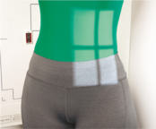
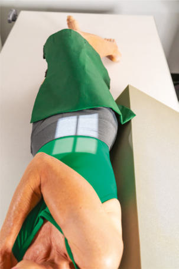
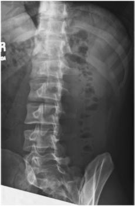
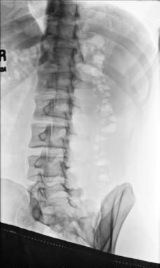

# Rx Coloană Lombară POSTERIOR (OR ANTERIOR) OBLIQUE Poziționare

  📷 Radiografie Convențională (Rx)
  <strong>Actualizat:</strong> 2026-09-15
  <strong>Autor:</strong> Departamentul de Radiologie / Referință Bontrager

---

-   __1. Rezumat Clinic & Indicații__

    ---

    === "Indicații Clinice"

        - Defects de pars interarticularis (e.g., spondylolysis) ambele drept și stâng oblic incidențe sunt obtained.

    === "Ghid Național IRIS"

        !!! info "Referință Primară: Ghidul Național IRIS (Ordinul MS 1342/2012)"
            - **Capitol Ghid IRIS:** *Ghidul Național IRIS*
            - **Grad de Recomandare:** **De verificat pe indicație; fără grad atribuit automat**
            - **Nivel de Iradiere Estimată:** `De verificat pentru examinarea și populația selectate`

            [:octicons-search-16: Deschide Ghidul IRIS](../../iris.md){ .md-button .md-button--primary } [:material-open-in-new: Aplicația Oficială PWA](https://radiologie-pediatrica.ro/iris/){ .md-button target="_blank" rel="noopener" }
-   __2. Poziționare & Centrare Fascicul__

    ---

    - **Poziție Pacient:** Pacient: posterior sau anterior oblic poziții poziție pacient semisupine (drept posterior oblic [RPO] și stâng posterior oblic [LPO]) sau semiprone ((drept anterior oblic [RAO] și stâng anterior oblic [LAO]), cu brațe extins și cap pe pillow.; Regiune anatomică: Rotate corp 45° și align spinal column la linia mediană mesei și/sau receptorul de imagine; 50° oblic este best pentru L1–L2 zygapophyseal articulații. Ensure equal rotație de umeri și Bazin (bazin (pelvis)). Flex Genunchi pentru stability și bring braț farthest de la receptorul de imagine across Torace (Fig. 9.31). Support umeri și Bazin (bazin (pelvis)) cu radiolucent sponges la maintain poziție. This support este strongly recommended la prevent pacienți de la grasping edge de masa de examinare, which poate result în their Degete Mână being pinched.
    - **Punct de Centrare Fascicul:** perpendicular pe receptorul de imagine. Raza centrală se orientează spre L3 la nivelul lower costal margin (1 la 2 inches [2.5 la 5 cm]) above creasta iliacă (corespunzător L4-L5) și 2 inches (5 cm) medial la upside spină iliacă antero-superioară (SIAS). Se centrează receptorul de imagine pe raza centrală.
    - **Distanță Focar-Film (DFF / SID):** 100 cm
    - **Comandă Respiratorie:** Apnee pe durata expunerii pe expiration. Coloană Lombară ROUTINE AP (sau PA) oblic—posterior sau anterior lateral lateral L5–S1

-   __3. Parametri Tehnici Expunere__

    ---

    | Parametru Tehnic | Valoare Configurare Generator / Tub |
    |:-----------------|:-------------------------------------|
    | **Tensiune Tub (kV)** | 75-90 kV |
    | **Sarcină / Produs Curent-Timp (mAs)** | DE CONFIGURAT PE APARAT |
    | **Distanță Focar-Film (DFF / SID)** | 100 cm |
    | **Grilă Antidifuzoare (Bucky)** | Cu grilă antidifuzoare Bucky |
    | **Dimensiune Focar** | Focar Mare (1.0 - 1.2 mm) |
    | **Camere de Ionizare AEC** | Camerele laterale (sau camera centrală funcție de regiune) |
    | **Colimare Fascicul** | field size la aria de interes diagnostic. expunere optim receptorul de imagine expunere și contrast. Clear demonstration de bony margins și trabecular markings de coloană lombară. fără mișcare. Fig. 9.32 45° RPO de Coloană Lombară. Pedicle (L2) Pars interarticularis (L3) Zygapophyseal articulație (L3-4) superior articular process (L5) inferior articular process (L4) corp (L2) Transverse process (L3) Fig. 9.33 45° RPO de Coloană Lombară. Fig. 9.31 Ortostatism 45° RPO de Coloană Lombară, visualizing drept (inset) zygapophyseal articulații. LPO evidențiază stâng zygapophyseal articulații. 30 (24) (30) |
    | **Filtrare Tub** | Totală ≥ 2.5 mm Al echivalent |

-   __4. Criterii de Calitate & Reușită Imagine__

    ---

    - Visualization de zygapophyseal articulații (RPO și LPO show downside; RAO și LAO show upside) (Figs. 9.32 și 9.33). poziție
    - precis 45° pacient rotație ca indicated prin open zygapophyseal articulații și pedicle (eye de Scottie dog) între midline și lateral aspect de vertebral margine.
    - If pedicle este evidențiat closer la linia mediană vertebral margine și less de pedicle este seen, this indicates overrotation. If pedicle este evidențiat laterally pe vertebral corp margine cu more de lamina (corp de Scottie dog) evidențiat, this indicates underrotation.2

-   __5. Protecție Radiologică (ALARA)__

    ---

    - Ecranare gonadică și a organelor radiosensibile conform procedurilor locale de radioprotecție ALARA.
    - Colimare strictă la aria de interes pentru limitarea radiației difuze.
    - Verificarea posibilității unei sarcini la pacientele de vârstă fertilă înainte de expunere.

### 🖼️ Imagini

<figure class="protocol-image-card" markdown>

<figcaption><strong>Fig. 9.32 45° RPO de Coloană Lombară.</strong> — Poziționare pacient conform Ghidului Bontrager (Fig. 9.32 45° RPO de lumbar coloană vertebrală.)</figcaption>

</figure>

<figure class="protocol-image-card" markdown>

<figcaption><strong>Fig. 9.33 45° RPO de Coloană Lombară.</strong> — Aspect radiografic de referință conform Ghidului Bontrager (Fig. 9.33 45° RPO de lumbar coloană vertebrală.)</figcaption>

</figure>

<figure class="protocol-image-card" markdown>

<figcaption><strong>Fig. 9.31 Ortostatism 45° RPO de Coloană Lombară, visualizing drept (inset)</strong> — Aspect radiografic de referință conform Ghidului Bontrager (Fig. 9.31 în ortostatism 45° RPO de lumbar coloană vertebrală, visualizing drept (inset))</figcaption>

</figure>

<figure class="protocol-image-card" markdown>

<figcaption><strong>Figura 4</strong> — Aspect radiografic de referință conform Ghidului Bontrager (Figura 4)</figcaption>

</figure>

=== "Ghid Rapid de Execuție"

    1. **Identificarea și verificarea pacientului:** verificare identitate, zonă de examinat, consimțământ conform procedurii și evaluarea posibilității unei sarcini, când este relevantă.
    2. **Pregătire:** îndepărtarea oricăror obiecte radiopace (bijuterii, agrafe, fermoare, proteze, pansamente dense).
    3. **Poziționare precisă:** alinierea receptorului de imagine și a tubului la distanța prescrisă (100 cm).
    4. **Colimare strictă:** adaptarea fasciculului strict la regiunea de diagnostic pentru scăderea iradierii și reducerea radiației difuze.
    5. **Radioprotecție:** verificarea [politicii RX](../radioprotectie.md), cu măsuri distincte pentru pacient, personal și însoțitor.

## Surse de documentare

- [Bontrager's Textbook of Radiographic Positioning (Ed. 9/10), Pagina 360](https://www.elsevier.com/books/textbook-of-radiographic-positioning-and-related-anatomy/lampignano/978-0-323-65367-1)
